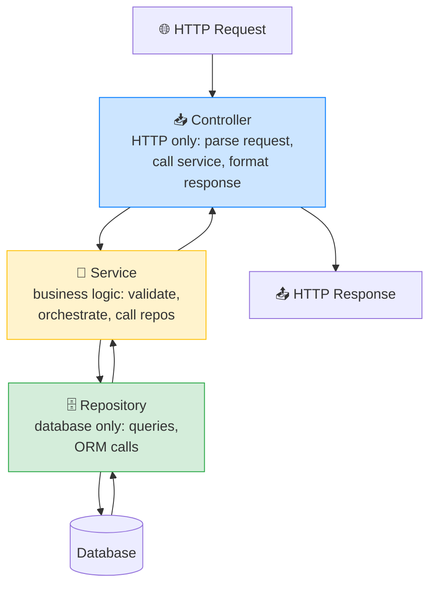
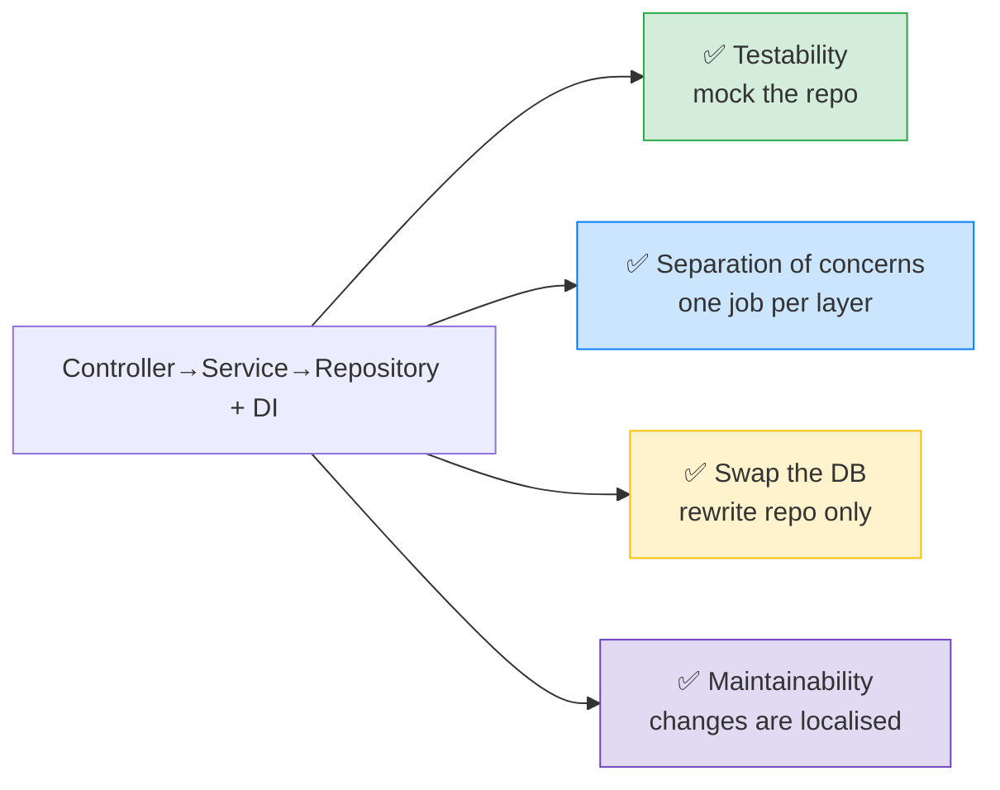

# 🏛️ Architecture Patterns — Controller → Service → Repository — Complete Study Notes

> Notes for becoming a strong software engineer. Easy language, real code, and interview-ready explanations.
> How to structure a backend into clean layers — so code is testable, maintainable, and easy to change.

---

## 📌 1. The Big Idea — Separate the Concerns

As an app grows, cramming everything into one big route handler — HTTP parsing, business rules, *and* database queries — becomes a tangled mess. The **Controller → Service → Repository** pattern splits a request into **three layers**, each with **one job.**

> Analogy 🏢: think of a company. The **receptionist (Controller)** greets visitors and routes them — they don't make business decisions. The **manager (Service)** makes the actual decisions and coordinates the work. The **archivist (Repository)** fetches and stores records — they don't decide anything, just retrieve. Each role is specialised, and you can replace the archivist's filing system without retraining the manager.

> 🎯 Interview line: *"I structure backends in three layers — controllers handle HTTP, services hold business logic, repositories handle data access. Each has a single responsibility, which makes the code testable, maintainable, and lets me swap the database without touching business logic."*

---

## 🪜 2. The Three Layers



| Layer | Responsibility | Does | Does NOT |
|---|---|---|---|
| **Controller** | HTTP only | Parse request, call service, format response & status code | Business logic, DB queries |
| **Service** | Business logic | Validate, orchestrate, apply rules, call repositories | Touch HTTP (req/res), write SQL |
| **Repository** | Data access only | Run queries / ORM calls, return data | Business rules, HTTP |

> 💡 The golden rule: **each layer only talks to the one below it.** Controller → Service → Repository → Database. A controller never queries the DB directly; a repository never knows about HTTP. This one-directional flow keeps things clean.

---

## 📥 3. Controller — HTTP Only

The controller is the **thin** entry point. It deals **only** with HTTP: read the request, call a service, turn the result into a response. **No business logic, no database.**

```typescript
// src/controllers/auth.controller.ts
export class AuthController {
  constructor(private authService: AuthService) {}   // service injected

  register = async (req: Request, res: Response) => {
    try {
      const { email, password } = req.body;          // 1. parse HTTP input
      const user = await this.authService.register(email, password);  // 2. delegate
      res.status(201).json({ data: { id: user.id } });   // 3. format response
    } catch (err) {
      if (err instanceof EmailTakenError) return res.status(409).json({ error: err.message });
      res.status(500).json({ error: "Something went wrong" });
    }
  };
}
```

> 💡 Notice: the controller knows about **status codes** (201, 409) and request/response shape — that's HTTP. It does **not** hash passwords or query the DB. It just **delegates** to the service. (Status codes from your REST API notes.)

---

## 🧠 4. Service — Business Logic

The service is the **brain.** It holds the **business rules** — validation, orchestration, deciding *what* should happen. It calls repositories for data but knows **nothing about HTTP** (no `req`/`res`).

```typescript
// src/services/auth.service.ts
export class AuthService {
  constructor(private userRepo: UserRepository) {}   // repository injected

  async register(email: string, password: string): Promise<User> {
    // business rule: no duplicate emails
    const existing = await this.userRepo.findByEmail(email);
    if (existing) throw new EmailTakenError("Email already in use");

    // business rule: hash the password (from your password security notes)
    const passwordHash = await bcrypt.hash(password, 12);

    // orchestrate: create the user via the repository
    return this.userRepo.create({ email, passwordHash });
  }
}
```

> 💡 The service is **pure business logic** — it could be called from an HTTP controller, a CLI command, or a background job, because it doesn't care *how* it was triggered. That reusability is a big benefit. It throws **domain errors** (`EmailTakenError`); the controller decides which HTTP code that maps to.

---

## 🗄️ 5. Repository — Database Only

The repository is the **only layer that talks to the database.** It hides *how* data is stored — raw SQL, an ORM, even MongoDB. The service just calls `findByEmail()` and doesn't care what's underneath.

```typescript
// src/repositories/user.repository.ts
export class UserRepository {
  async findByEmail(email: string): Promise<User | null> {
    return db.users.findOne({ where: { email } });   // DB-specific code lives ONLY here
  }

  async create(data: { email: string; passwordHash: string }): Promise<User> {
    return db.users.insert(data);
  }
}
```

> ⭐ The big win: **swap the database without touching business logic.** Move from Postgres to MongoDB? You rewrite the **repository** only — the service and controller don't change at all, because they only know the repository's *interface* (`findByEmail`, `create`), not its implementation.

> 🎯 Interview line: *"The repository isolates all data access behind a clean interface. The service calls findByEmail without knowing if it's SQL or Mongo underneath — so I can switch databases or ORMs by rewriting only the repository, leaving business logic untouched."*

---

## 💉 6. Dependency Injection (the glue that makes it testable)

**Dependency Injection (DI)** = instead of a class **importing** its dependencies directly, you **pass them in** (via the constructor). The class receives what it needs rather than creating it.

```typescript
// ❌ WITHOUT DI — hard-coded dependency, hard to test
class AuthService {
  async register(email) {
    const user = await userRepository.findByEmail(email);  // directly imported — stuck with the real DB
  }
}

// ✅ WITH DI — dependency passed in, easy to swap
class AuthService {
  constructor(private userRepo: UserRepository) {}          // injected
  async register(email) {
    const user = await this.userRepo.findByEmail(email);    // uses whatever was passed in
  }
}

// Wiring it up (often in a factory or container):
const userRepo = new UserRepository();
const authService = new AuthService(userRepo);              // inject the real repo
const authController = new AuthController(authService);
```

**Why DI makes testing trivial:** to test the service, you **inject a fake repository** instead of the real database. No DB needed — fast, isolated unit tests.

```typescript
// Testing the service with a MOCK repo — no real database!
const fakeRepo = { findByEmail: async () => null, create: async () => ({ id: "1" }) };
const service = new AuthService(fakeRepo as any);
const result = await service.register("a@b.com", "pass");   // tests pure logic, instantly
```

> 🎯 Interview line: *"With dependency injection I pass dependencies into constructors instead of importing them. To test a service I inject a mock repository, so I test business logic in isolation without a real database — fast, reliable unit tests."*

---

## 🎯 7. Why This Matters (the four payoffs)



1. **Testability** — mock the repository to unit-test the service without a database.
2. **Separation of concerns** — each layer has one job, so code is easier to understand.
3. **Swap the DB** — change databases or ORMs by rewriting only the repository.
4. **Maintainability** — a change is localised to one layer (HTTP change? only the controller).

> 🎯 Interview line: *"The pattern buys me four things: testability through mockable layers, clean separation of concerns, the freedom to swap databases by touching only the repository, and maintainability because changes stay localised to one layer."*

---

## 💻 8. Practical Exercise — Refactor Auth into Layers

**Before (everything in one route — a "fat controller"):**
```typescript
app.post("/register", async (req, res) => {
  const { email, password } = req.body;
  const existing = await db.query("SELECT * FROM users WHERE email = $1", [email]); // DB
  if (existing.rows.length) return res.status(409).json({ error: "taken" });        // logic
  const hash = await bcrypt.hash(password, 12);                                      // logic
  const user = await db.query("INSERT INTO users ...", [email, hash]);               // DB
  res.status(201).json({ id: user.rows[0].id });                                     // HTTP
});
```
HTTP + business logic + DB all tangled in one place — hard to test, hard to change.

**After (clean three layers):**
```
src/
├── controllers/auth.controller.ts   ← HTTP: parse, delegate, respond
├── services/auth.service.ts         ← logic: validate, hash, orchestrate
└── repositories/user.repository.ts  ← data: queries only
```
Each file does one thing. You can test the service with a mock repo, change the DB by editing only the repository, and read each layer in isolation. **Notice how much cleaner it becomes.**

---

## 🎤 9. How to Explain in an Interview

**Step 1 — The layers:**
> "I split backends into controllers, services, and repositories. Controllers handle HTTP only, services hold business logic, repositories handle data access. Each layer has one responsibility and only talks to the layer below."

**Step 2 — Why:**
> "It gives testability, separation of concerns, the ability to swap databases by rewriting only the repository, and localised changes."

**Step 3 — Dependency injection:**
> "I wire it with dependency injection — passing dependencies into constructors. That lets me inject a mock repository to unit-test services without a real database."

**Step 4 — Domain errors:**
> "Services throw domain errors like EmailTakenError, and the controller maps them to HTTP codes like 409 — keeping HTTP concerns in the controller and rules in the service."

> 🟢 Trap question: *"Isn't this over-engineering for a small app?"* → *"For a tiny script, yes. But the moment there's real business logic, tests, or a team, the separation pays for itself — testable logic, swappable storage, and changes that don't ripple. I'd scale the structure to the project, but the layering habit prevents the 'fat controller' mess as it grows."*

> 🟢 Trap question: *"Where does validation go?"* → *"Two kinds: HTTP-shape validation (is the body well-formed?) can sit at the controller/middleware edge; business validation (is this email already taken? is the amount within limits?) belongs in the service, because it's a domain rule, not an HTTP concern."*

---

## 💎 10. Impressive Words & Phrases

| Instead of saying... | Say this 💪 |
|---|---|
| "Split the code up" | "**Separation of concerns** into layers" |
| "Each part has a job" | "**Single Responsibility Principle** (SRP)" |
| "Pass in dependencies" | "**Dependency injection**" |
| "Fake the database" | "**Mock the repository** for unit tests" |
| "Hide the DB code" | "Abstract data access behind a **repository interface**" |
| "Swap the database" | "Storage is a **swappable implementation detail**" |
| "Business rules" | "**Domain logic**" |
| "Custom error" | "A **domain error** mapped to an HTTP code" |
| "Loosely connected" | "**Loosely coupled** layers" |
| "Wire it together" | "An **IoC container / composition root**" |

**Power vocabulary:** *separation of concerns, single responsibility, layered architecture, dependency injection, inversion of control, repository pattern, domain logic, loose coupling, testability, mockable, composition root, swappable implementation, fat controller (anti-pattern).*

> 🌶️ Bonus flex — **inversion of control:** *"Dependency injection is one form of Inversion of Control — instead of a class controlling its own dependencies by importing them, control is inverted so they're supplied from outside. That's what makes the high-level service depend on an abstraction (the repository interface), not a concrete database — the Dependency Inversion Principle from SOLID."* Tying it to SOLID signals real design depth.

---

## ⏱️ 11. Quick Revision (read 5 min before interview)

> **Three layers, one job each, each talks only to the one below:**
> - **Controller** → HTTP only: parse request, call service, format response + status code. *No logic, no DB.*
> - **Service** → business logic: validate, orchestrate, apply rules, call repos. *No HTTP, no SQL.* Throws **domain errors**.
> - **Repository** → data access only: queries / ORM. *No logic, no HTTP.* Hides the DB behind an interface.
>
> **Dependency Injection:** pass dependencies into constructors (don't import directly) → inject a **mock repo** to unit-test services **without a database**.
>
> **Why (4 payoffs):** testability · separation of concerns · **swap the DB by rewriting only the repository** · maintainability (localised changes).
>
> **Avoid:** the **fat controller** — HTTP + logic + DB all tangled in one route.
>
> **Golden line:** *"Controllers do HTTP, services do business logic, repositories do data — wired with dependency injection so I can mock the repo to test logic without a DB and swap the database by changing only the repository."*

---

## ✅ Practice checklist
- [ ] Refactor a fat route into Controller / Service / Repository files
- [ ] Controller: only parse, delegate, and format response + status code
- [ ] Service: business rules (dup check, hashing), throws a domain error
- [ ] Repository: only DB queries, behind a clean interface
- [ ] Wire them with **dependency injection** (constructor injection)
- [ ] Unit-test the service with a **mock repository** (no real DB)
- [ ] Explain how you'd swap Postgres → MongoDB (rewrite repo only)
- [ ] Explain where HTTP-shape vs business validation each belong

This pattern is what separates a tangled prototype from a maintainable codebase. Layer it, inject dependencies, and your backend stays clean as it grows. 🚀
