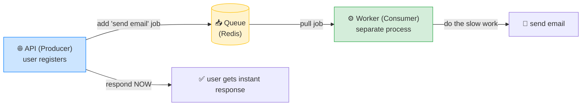

# ⚙️ BullMQ Background Jobs — Complete Study Notes

> Notes for becoming a strong software engineer. Easy language, real code, and interview-ready explanations.
> How to move slow work off the request path — queues, workers, retries, and scheduling with BullMQ on Redis.

---

## 📌 1. Why Background Jobs Exist

When a user hits your API, they're **waiting** for the response. If you do slow work *during* that request — sending an email, processing an image, generating a report, calling a third-party API — the user **waits for all of it.** Slow, fragile, and if the slow part fails, the whole request fails.

**The fix:** do the slow work **in the background.** Respond to the user *immediately*, and handle the slow task separately, out of the request path.

> Analogy 🍔: think of a restaurant. The **waiter takes your order and immediately confirms it** ("got it, coming up!") — they don't make you stand at the counter while the kitchen cooks. The **kitchen (background worker)** prepares the food separately. The waiter (your API) stays free to serve other customers. Background jobs are the kitchen.

> 🎯 Interview line: *"Background jobs move slow or unreliable work — emails, image processing, third-party calls — off the request path. The API responds immediately and a separate worker handles the task later, so the user isn't blocked and a slow task can't fail or delay the response."*

---

## 🏭 2. The Queue + Worker Model

Two pieces work together:

- **Queue** — a list of jobs *waiting* to be done. Your API **adds** jobs to it (the "producer").
- **Worker** — a separate process that **pulls jobs** off the queue and **runs** them (the "consumer").



**The flow:** user registers → API **adds** a "send welcome email" job to the queue and **responds immediately** → a separate **worker** picks up the job and sends the email. The user never waited for the email.

> 💡 The key insight: the **API and the worker are separate processes** (often separate servers). The API just drops jobs in the queue and moves on; the worker(s) chew through them independently. You can scale workers separately from your API.

> 🎯 Interview line: *"It's a producer-consumer model: the API produces jobs onto a queue, and separate worker processes consume and run them. They scale independently — I can add more workers without touching the API."*

---

## 🟥 3. BullMQ on Redis

**BullMQ** is a popular Node.js job queue library built on **Redis** (which you already know from your token/cache notes). Redis is the **storage** that holds the queue — fast, reliable, and shared between your API and workers.

```javascript
const { Queue, Worker } = require("bullmq");
const connection = { host: "localhost", port: 6379 };   // Redis

// PRODUCER (in your API) — add a job
const emailQueue = new Queue("emails", { connection });
await emailQueue.add("welcome", { userId: 123, email: "nayan@x.com" });

// CONSUMER (separate worker process) — process jobs
const worker = new Worker("emails", async (job) => {
  if (job.name === "welcome") {
    await sendWelcomeEmail(job.data.email);   // the slow work
  }
}, { connection });
```

> 💡 Redis is the right tool because it's **fast** (in-memory) and **persistent enough** (jobs survive a worker restart), and both the API and all workers can connect to the same Redis to share the queue.

---

## 🔄 4. The Job Lifecycle

Every job moves through states:

```mermaid
flowchart LR
    A["added"] --> W["waiting"]
    W --> AC["active<br/>(worker running it)"]
    AC --> C["✅ completed"]
    AC --> F["❌ failed"]
    F -->|retry (attempts left)| W
    F -->|all retries used| D["💀 dead letter<br/>(failed queue)"]

    style C fill:#d4edda,stroke:#28a745
    style F fill:#f8d7da,stroke:#dc3545
    style D fill:#e2d9f3,stroke:#6f42c1
```

| State | Meaning |
|---|---|
| **added** | Job pushed onto the queue |
| **waiting** | Queued, waiting for a free worker |
| **active** | A worker is currently running it |
| **completed** | Finished successfully ✅ |
| **failed** | Threw an error ❌ |
| **retried** | Failed but attempts remain → back to waiting |
| **dead letter** | Failed *all* retries → moved aside for inspection 💀 |

> 💡 The **failed → retried → dead letter** path is the resilience story: a transient failure (e.g. the email service blips) gets **automatically retried**, and only jobs that fail *every* attempt land in the **dead letter queue** for a human to look at.

---

## ⚙️ 5. Configuration (the knobs that matter)

```javascript
await emailQueue.add("welcome", { email }, {
  attempts: 3,                                  // retry up to 3 times on failure
  backoff: { type: "exponential", delay: 1000 }, // wait 1s, 2s, 4s between retries
  priority: 1,                                   // lower number = higher priority
});

const worker = new Worker("emails", handler, {
  connection,
  concurrency: 5,    // this worker runs up to 5 jobs in parallel
});
```

| Setting | What it controls |
|---|---|
| **concurrency** | How many jobs **one worker** runs **in parallel** |
| **attempts** | How many times to **retry** a failing job |
| **backoff** | The **delay between retries** — exponential is best (1s, 2s, 4s...) |
| **priority** | Which jobs jump the queue (urgent ones first) |

> 💡 **Exponential backoff** is the key one: instead of hammering a failing service every second, you **wait longer each retry** (1s → 2s → 4s). This gives a struggling third-party API time to recover and avoids making the problem worse. (Same retry wisdom as the correlated-subquery and rate-limit thinking elsewhere.)

> 🎯 Interview line: *"I tune concurrency for parallelism per worker, attempts and exponential backoff for resilient retries — backing off longer each time so I don't hammer a failing dependency — and priority so urgent jobs run first."*

---

## ⏰ 6. Repeatable Jobs & Dead Letter Queues

### Repeatable jobs (cron-like scheduling)
BullMQ can schedule jobs to run **on a recurring schedule** — like a cron job. Great for nightly reports, cleanup tasks, periodic syncs.
```javascript
await emailQueue.add("daily-digest", {}, {
  repeat: { pattern: "0 9 * * *" }   // every day at 9 AM (cron syntax)
});
```

### Dead letter queue (DLQ)
Jobs that **fail all their retry attempts** are moved to a separate **failed/dead-letter queue** instead of vanishing. This lets you **inspect** what went wrong, fix the issue, and optionally **re-run** them — nothing is silently lost.

> 🎯 Interview line: *"BullMQ supports repeatable jobs with cron patterns for scheduled work, and a dead-letter queue where jobs that exhaust all retries land — so failures are inspectable and recoverable, not silently dropped."*

---

## 💻 7. Practical Exercise — Welcome Email Job

When a user registers, queue a welcome email; a worker sends it via Nodemailer with retries.

```javascript
// ===== queue.js (shared) =====
const { Queue } = require("bullmq");
const connection = { host: "localhost", port: 6379 };
const emailQueue = new Queue("emails", { connection });
module.exports = { emailQueue, connection };

// ===== api.js (producer — your Express app) =====
const { emailQueue } = require("./queue");
app.post("/v1/auth/register", async (req, res) => {
  const user = await db.users.create(req.body);

  // Queue the email — DON'T send it here (don't block the response)
  await emailQueue.add("welcome",
    { email: user.email, name: user.name },
    { attempts: 3, backoff: { type: "exponential", delay: 2000 } }
  );

  res.status(201).json({ data: { id: user.id } });   // respond immediately ⚡
});

// ===== worker.js (consumer — a SEPARATE process) =====
const { Worker } = require("bullmq");
const nodemailer = require("nodemailer");
const { connection } = require("./queue");

const transporter = nodemailer.createTransport({ /* SMTP config */ });

const worker = new Worker("emails", async (job) => {
  if (job.name === "welcome") {
    await transporter.sendMail({
      to: job.data.email,
      subject: "Welcome!",
      text: `Hi ${job.data.name}, welcome aboard!`,
    });
  }
}, { connection, concurrency: 5 });

worker.on("completed", (job) => console.log(`✅ sent: ${job.id}`));
worker.on("failed", (job, err) => console.log(`❌ failed: ${job.id} — ${err.message}`));
```

Run them as **two processes**: `node api.js` (the API) and `node worker.js` (the worker). The worker can even run on a different machine.

### Bull Board (a dashboard to inspect jobs)
**Bull Board** is a small Express app that gives you a **UI** to see your queues — waiting, active, completed, failed jobs — and retry failed ones.
```javascript
const { createBullBoard } = require("@bull-board/api");
const { ExpressAdapter } = require("@bull-board/express");
// mount it at /admin/queues → visual dashboard of your jobs
```
> 💡 A job dashboard is genuinely useful in production (and a nice portfolio touch) — you can *see* what's failing and retry it with a click.

---

## 🎤 8. How to Explain in an Interview

**Step 1 — Why:**
> "Background jobs move slow work — emails, image processing, third-party calls — off the request path, so the API responds immediately instead of blocking the user on slow tasks."

**Step 2 — The model:**
> "It's producer-consumer: the API adds jobs to a queue, and separate worker processes consume them. They scale independently. I use BullMQ on Redis."

**Step 3 — Lifecycle & resilience:**
> "Jobs go added → waiting → active → completed, or failed → retried → dead-letter. Transient failures retry automatically with exponential backoff; jobs that fail all attempts land in a dead-letter queue for inspection."

**Step 4 — Config & scheduling:**
> "I tune concurrency, attempts, backoff, and priority, and use repeatable cron-pattern jobs for scheduled work like nightly reports."

> 🟢 Trap question: *"Why not just send the email inside the register endpoint?"* → *"Because it blocks the response on a slow, failure-prone operation. If the email service is slow, the user waits; if it's down, registration fails even though the account was created. Queuing it means registration succeeds instantly and the email is sent reliably with retries in the background."*

> 🟢 Trap question: *"Why exponential backoff instead of retrying immediately?"* → *"Immediate retries hammer an already-failing service and often fail again instantly. Exponential backoff waits longer each time — 1s, 2s, 4s — giving the dependency time to recover and reducing load on it. It's the polite, effective retry strategy."*

---

## 💎 9. Impressive Words & Phrases

| Instead of saying... | Say this 💪 |
|---|---|
| "Do it in the background" | "**Offload to a background job / queue**" |
| "Don't block the response" | "Keep it **off the request path**" |
| "Adds jobs / runs jobs" | "**Producer** / **consumer**" |
| "Try again on failure" | "**Retry with exponential backoff**" |
| "Failed jobs bucket" | "A **dead-letter queue (DLQ)**" |
| "Run many at once" | "Worker **concurrency**" |
| "Scheduled job" | "A **repeatable / cron** job" |
| "Urgent jobs first" | "Job **priority**" |
| "Separate worker server" | "**Horizontally scalable** workers" |

**Power vocabulary:** *background job, message queue, producer-consumer, worker, concurrency, retry, exponential backoff, dead-letter queue, idempotent jobs, repeatable/cron jobs, priority, job lifecycle, horizontal scaling, off the request path.*

> 🌶️ Bonus flex — **idempotent jobs:** *"I design jobs to be idempotent — safe to run more than once — because retries (and at-least-once delivery) mean a job can occasionally run twice. For a 'send email' job I'd guard against double-sending with a dedupe key, so a retry doesn't email the user twice."* This shows you understand the failure modes of queues, not just the happy path.

---

## ⏱️ 10. Quick Revision (read 5 min before interview)

> **Why:** never block the HTTP response on slow work (emails, images, reports, 3rd-party calls). Respond now, do the work in the background.
>
> **Model:** **producer-consumer.** API **adds** jobs to a **queue** (Redis); separate **workers** pull and run them. They **scale independently**.
>
> **BullMQ** = Node job queue on **Redis**. `Queue` (add) + `Worker` (process).
>
> **Lifecycle:** added → waiting → active → completed | failed → **retried** → **dead-letter** (failed all attempts, kept for inspection).
>
> **Config:** **concurrency** (parallel jobs/worker), **attempts** (retries), **backoff** (exponential: 1s/2s/4s), **priority**.
>
> **Extras:** **repeatable jobs** (cron scheduling), **dead-letter queue** (failures recoverable, not lost), **Bull Board** (UI dashboard).
>
> **Golden line:** *"Background jobs keep slow work off the request path — the API queues a job and responds instantly, separate workers process it with exponential-backoff retries, and anything that fails all attempts lands in a dead-letter queue instead of vanishing."*

---

### ✅ Practice checklist
- [ ] Add Redis to your stack
- [ ] Create an `emails` queue with BullMQ
- [ ] In register: **add** a "welcome email" job, respond 201 immediately
- [ ] Build a **separate worker process** that sends via Nodemailer
- [ ] Add `attempts` + exponential `backoff` for retries
- [ ] Force a failure → watch it retry → then hit the dead-letter queue
- [ ] Add a **repeatable** cron job (e.g. daily digest)
- [ ] Mount **Bull Board** for a job dashboard
- [ ] Make a job **idempotent** (dedupe key to avoid double-sends)
- [ ] Explain "off the request path" and exponential backoff out loud

Background jobs are how real systems stay fast and reliable under slow, flaky, or heavy work. Queue it, respond instantly, process resiliently. 🚀
