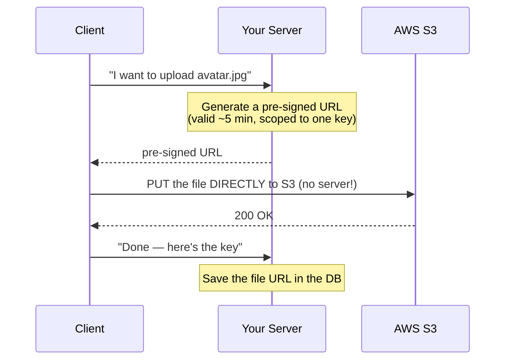

# 📤 File Uploads + AWS S3 — Complete Study Notes

> Notes for becoming a strong software engineer. Easy language, real code, and interview-ready explanations.
> How to handle file uploads properly — multipart, storage strategies, the pre-signed URL pattern, and validation.

---

## 📌 1. Why File Uploads Are Different

A normal API request sends **JSON** — text. But a file (image, PDF, video) is **binary data**, and **binary can't go inside JSON.** So uploads need a different format: **`multipart/form-data`**.

> Analogy 📮: JSON is like sending a **letter** (plain text in an envelope). A file upload is like sending a **parcel** — you need a different packaging system (`multipart/form-data`) that can carry the bulky binary contents alongside the text fields.

`multipart/form-data` splits the request body into **parts** — each part can be a text field *or* a file (with its own content-type), separated by boundaries. That's how a form sends "name + email + profile_picture" all at once.

> 🎯 Interview line: *"File uploads use multipart/form-data because binary file data can't be embedded in JSON. Multipart splits the body into parts — text fields and file parts — each with its own content type, so you can send files alongside regular form data."*

---

## 🔧 2. Multer — Disk vs Memory Storage

**Multer** is the standard Node/Express middleware for parsing `multipart/form-data`. It has two built-in storage modes:

| Mode | Where the file goes | Problem |
|---|---|---|
| **Disk storage** | Saved to the server's filesystem | 🐢 **Disk fills up**; files stranded on one server (bad for multiple instances) |
| **Memory storage** | Held in RAM as a Buffer | 💥 **Memory dies on big files** — a few large uploads can OOM the server |

```javascript
const multer = require("multer");

// Disk storage — file written to ./uploads
const diskUpload = multer({ dest: "uploads/" });

// Memory storage — file kept in RAM (req.file.buffer)
const memUpload = multer({ storage: multer.memoryStorage() });
```

> ⚠️ **Neither is great for production on its own.** Disk fills up and doesn't work across multiple servers; memory crashes on large files. The real answer is to **not store files on your app server at all** — stream them to **object storage like S3.**

> 🎯 Interview line: *"Multer parses multipart uploads with disk or memory storage. Neither suits production alone — disk fills up and isn't shared across instances, memory OOMs on big files. So I stream uploads to S3 instead of keeping them on the app server."*

---

## ☁️ 3. The Solution — Stream to S3

**Amazon S3** (Simple Storage Service) is **object storage** — built to hold unlimited files cheaply and durably, separate from your app servers. Two common approaches:

### Approach A — through your server (memory storage + AWS SDK)
The file comes into your server (in memory), then you upload it to S3.
```javascript
const memUpload = multer({ storage: multer.memoryStorage() });
const { S3Client, PutObjectCommand } = require("@aws-sdk/client-s3");
const s3 = new S3Client({ region: "ap-south-1" });

app.post("/upload", memUpload.single("file"), async (req, res) => {
  const key = `uploads/${crypto.randomUUID()}-${req.file.originalname}`;
  await s3.send(new PutObjectCommand({
    Bucket: "my-bucket",
    Key: key,
    Body: req.file.buffer,
    ContentType: req.file.mimetype,
  }));
  res.json({ url: `https://my-bucket.s3.amazonaws.com/${key}` });
});
```
> Works, but the file passes **through your server** (uses its bandwidth + memory). Fine for small files like avatars. (`multer-s3` can stream it through automatically.)

### Approach B — Pre-signed URLs (best for large files) ⭐
The **client uploads directly to S3**, bypassing your server entirely.

---

## 🔑 4. Pre-Signed URLs (the impressive pattern)

A **pre-signed URL** is a temporary, credential-embedded URL your **server generates** that lets the **client upload directly to S3** — your server never touches the file bytes.



```javascript
const { getSignedUrl } = require("@aws-sdk/s3-request-presigner");

app.post("/avatar/presign", async (req, res) => {
  const key = `avatars/${crypto.randomUUID()}.jpg`;
  const url = await getSignedUrl(
    s3,
    new PutObjectCommand({ Bucket: "my-bucket", Key: key, ContentType: "image/jpeg" }),
    { expiresIn: 300 }   // URL valid for 5 minutes
  );
  res.json({ uploadUrl: url, key });   // client PUTs the file to uploadUrl
});
```

**Why it's the best pattern for large files:**
- 🚀 **Server bypassed** — the file goes **client → S3 directly**, so your server doesn't spend bandwidth, memory, or time on the bytes.
- 📈 **Scales effortlessly** — a 2GB video upload doesn't touch your app at all.
- 🔒 **Still secure** — the URL is **short-lived** and **scoped to one specific key + operation**; it can't be reused for anything else.

> 🎯 Interview line: *"For large files I use pre-signed URLs — my server generates a short-lived, scoped URL and the client uploads directly to S3, bypassing my server entirely. It saves bandwidth and memory, scales to huge files, and stays secure because the URL expires and is limited to one key."*

---

## 🛡️ 5. Validation (never trust the client)

Files are a **security risk** — a "profile.jpg" could be a malicious script. Validate properly:

| Check | How | Why |
|---|---|---|
| **File type** | **Magic bytes**, not the extension | The extension lies; magic bytes (the file's real header) don't |
| **Max size** | Reject over a limit (e.g. 5MB) | Prevent abuse / DoS / huge bills |
| **Image dimensions** | Check width/height (for avatars) | Reject absurd sizes; enforce limits |
| **Filename** | **Generate a UUID** — never trust the user's name | Avoid path traversal (`../../etc/passwd`) and collisions |

### Magic bytes — type from content, not name
```javascript
// ❌ BAD: trusting the extension — "virus.exe" renamed to "cat.jpg" passes
if (filename.endsWith(".jpg")) { /* ... */ }

// ✅ GOOD: check the actual file header (magic bytes)
// JPEGs start with FF D8 FF; PNGs with 89 50 4E 47
const isJpeg = buffer[0] === 0xFF && buffer[1] === 0xD8 && buffer[2] === 0xFF;
// (libraries like file-type do this robustly)
```

### Never trust user filenames — generate a UUID
```javascript
// ❌ BAD: user filename → path traversal & collisions
const key = `uploads/${req.file.originalname}`;   // could be "../../config"

// ✅ GOOD: your own UUID, keep only a safe extension
const key = `uploads/${crypto.randomUUID()}.jpg`;
```

> 🎯 Interview line: *"I validate file type by magic bytes — the real file header — not the extension, which is trivially spoofed. I enforce a max size and, for images, dimension limits. And I always generate a UUID filename instead of trusting the user's, to prevent path traversal and collisions."*

---

## 💻 6. Practical Exercise — Profile Picture Upload

Accept an image → validate → resize → upload to S3 → save the URL.

```javascript
const sharp = require("sharp");          // image processing
const { fileTypeFromBuffer } = require("file-type");

app.post("/v1/users/:id/avatar",
  requireAuth,
  multer({ storage: multer.memoryStorage(), limits: { fileSize: 5 * 1024 * 1024 } }).single("avatar"),
  async (req, res) => {
    const buf = req.file.buffer;

    // 1. Validate type by MAGIC BYTES
    const type = await fileTypeFromBuffer(buf);
    if (!type || !["image/jpeg", "image/png"].includes(type.mime)) {
      return res.status(422).json({ error: "Only JPEG/PNG allowed" });
    }

    // 2. Resize + normalise with sharp (also strips malicious metadata)
    const resized = await sharp(buf)
      .resize(256, 256, { fit: "cover" })
      .jpeg({ quality: 80 })
      .toBuffer();

    // 3. Upload to S3 with a UUID key
    const key = `avatars/${crypto.randomUUID()}.jpg`;
    await s3.send(new PutObjectCommand({
      Bucket: "my-bucket", Key: key, Body: resized, ContentType: "image/jpeg",
    }));

    // 4. Save the URL in the user record
    const url = `https://my-bucket.s3.amazonaws.com/${key}`;
    await db.users.updateOne({ _id: req.params.id }, { $set: { avatar_url: url } });

    res.status(200).json({ data: { avatar_url: url } });   // consistent envelope
  }
);
```

> 💡 `sharp` resizing also **strips metadata** and **re-encodes** the image — which neutralises many image-based exploits (a hidden payload won't survive re-encoding). Resizing isn't just for looks; it's a security step too.

### AWS setup (free tier)
- Create a **free-tier AWS account** + an **S3 bucket**.
- Configure **IAM with minimal permissions** — give the app key *only* `s3:PutObject`/`s3:GetObject` on *that one bucket*, nothing more. (**Principle of least privilege**, from your RBAC notes.)
- Never hard-code AWS keys — use **environment variables** or IAM roles.

---

## 🎤 7. How to Explain in an Interview

**Step 1 — Multipart:**
> "Uploads use multipart/form-data because binary can't go in JSON. Multer parses it, but disk and memory storage both fail at scale, so I stream to S3."

**Step 2 — Pre-signed URLs:**
> "For large files I use pre-signed URLs — my server issues a short-lived, scoped URL and the client uploads directly to S3, bypassing my server. It saves bandwidth and memory and scales to huge files."

**Step 3 — Validation:**
> "I validate type by magic bytes not extension, enforce max size and image dimensions, and generate UUID filenames to prevent path traversal and collisions."

**Step 4 — Processing & security:**
> "For avatars I resize with sharp, which also re-encodes and strips metadata — neutralising image-based exploits — then store in S3 with least-privilege IAM and save the URL in the DB."

> 🟢 Trap question: *"Why validate file type with magic bytes instead of the extension?"* → *"The extension is just part of the filename — anyone can rename malware.exe to cat.jpg. Magic bytes are the file's actual binary header, which reflects its true type. So I check the content, not the name."*

> 🟢 Trap question: *"Why pre-signed URLs over uploading through your server?"* → *"Routing big files through the server wastes its bandwidth and memory and limits scale. A pre-signed URL lets the client upload straight to S3 — the server only issues a short-lived, key-scoped token, never handling the bytes. It scales to gigabytes effortlessly while staying secure."*

---

## 💎 8. Impressive Words & Phrases

| Instead of saying... | Say this 💪 |
|---|---|
| "Upload format" | "**`multipart/form-data`** encoding" |
| "Cloud file storage" | "**Object storage** (S3)" |
| "Direct-to-S3 URL" | "A **pre-signed URL** (short-lived, scoped)" |
| "Check the real type" | "Validate by **magic bytes** (file signature)" |
| "Random filename" | "A **UUID key** (prevents **path traversal**)" |
| "Resize the image" | "**Transcode / re-encode** with sharp" |
| "Minimal AWS access" | "**Least-privilege IAM** policy" |
| "Server doesn't touch the file" | "**Offload** the transfer to S3" |
| "Server holds the file in RAM" | "Risk of **OOM** on large uploads" |

**Power vocabulary:** *multipart/form-data, object storage, pre-signed URL, magic bytes / file signature, path traversal, UUID key, least-privilege IAM, transcode, offload, OOM, content-type validation, direct upload, ephemeral URL.*

> 🌶️ Bonus flex — **defence in depth on uploads:** *"I layer upload security: magic-byte type checks, size and dimension limits, UUID filenames, re-encoding with sharp to strip payloads, and least-privilege IAM scoped to one bucket. No single check is trusted alone — even if one is bypassed, the others contain the damage."* The defence-in-depth framing (from your constraints/security notes) shows mature security thinking.

---

## ⏱️ 9. Quick Revision (read 5 min before interview)

> **Why multipart:** binary files can't go in JSON → **`multipart/form-data`** (text fields + file parts).
>
> **Multer storage:** **disk** (fills up, not shared across servers) or **memory** (OOMs on big files). Neither for production alone → **stream to S3**.
>
> **S3 = object storage** (cheap, durable, separate from app servers). Upload **through server** (memory + AWS SDK, ok for small files) OR **pre-signed URL**.
>
> **Pre-signed URL (best for large):** server issues a **short-lived, key-scoped** URL → **client uploads DIRECTLY to S3**, bypassing the server. Saves bandwidth/memory, scales, stays secure.
>
> **Validation:** type via **magic bytes** (not extension!), **max size**, **image dimensions**, **UUID filename** (never trust user name → path traversal). Resize with **sharp** (also strips exploits).
>
> **AWS:** **least-privilege IAM** scoped to one bucket; keys in env vars, never hard-coded.
>
> **Golden line:** *"Uploads go via multipart; I stream to S3 — pre-signed URLs for large files so the client uploads directly and bypasses my server — and I validate by magic bytes, cap size, generate UUID filenames, and lock down IAM to least privilege."*

---

### ✅ Practice checklist
- [ ] Set up a free-tier AWS account + an S3 bucket
- [ ] Configure IAM with minimal permissions (one bucket, PutObject/GetObject only)
- [ ] Parse an upload with Multer memory storage + a size limit
- [ ] Validate the file type by **magic bytes** (file-type library), not extension
- [ ] Resize an image with **sharp**; generate a **UUID** filename
- [ ] Upload to S3 with the AWS SDK; save the URL in the user record
- [ ] Implement a **pre-signed URL** endpoint; upload directly from the client
- [ ] Explain magic bytes vs extension, and pre-signed vs through-server, out loud

Handling uploads right — multipart, S3, pre-signed URLs, and real validation — is a very common, very practical backend skill that shows up in most production systems. 🚀
