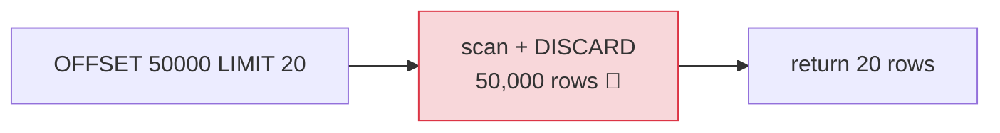

# 📄 Pagination Patterns — Offset vs Cursor — Complete Study Notes

> Notes for becoming a strong software engineer. Easy language, real code, and interview-ready explanations.
> The full deep-dive on the two pagination strategies — why offset slows down at scale and why cursor stays fast.

---

## 📌 1. Why Pagination Matters

You never return a million rows in one response — it's slow, wastes bandwidth, and crashes the client. So you serve data in **pages**. There are two main strategies, and the choice has real performance consequences at scale. This note sits at the intersection of your **database** and **API design** tracks.

> Analogy 📖: imagine reading a huge book. **Offset pagination** is "go to page 300" — you flip from the start, counting every page until you reach 300 (slow for deep pages). **Cursor pagination** is using a **bookmark** — you say "continue from where I left off" and jump straight there (instant, no matter how deep).

> 🎯 Interview line: *"There are two pagination strategies: offset-based, which is simple but slows down on deep pages, and cursor-based, which stays fast at any depth by remembering the last item seen. The trade-off is simplicity and arbitrary page jumps versus constant performance and consistency."*

---

## 📄 2. Offset-Based Pagination

```sql
SELECT * FROM posts ORDER BY created_at DESC LIMIT 20 OFFSET 40;
```
URL: `?page=3&limit=20` → `OFFSET = (page - 1) × limit = (3-1) × 20 = 40`.

**The pros:**
- ✅ **Easy to implement** — `LIMIT` + `OFFSET`.
- ✅ **Simple URL** — `?page=3&limit=20`, human-readable.
- ✅ **Can jump to any page** — page 1, page 50, page 999 directly.

**The cons (these are the interview points):**
- 🐢 **Slow at scale.** To serve `OFFSET 50000`, the database must **scan and discard the first 50,000 rows** before returning your 20. Deeper pages = more wasted work. It degrades **linearly.**
- 🔀 **Inconsistent when data changes.** If a new row is inserted at the top while a user pages, **everything shifts down** — they may see a **duplicate** or **skip** a row between pages (because offsets are positional, not anchored to data).



> 🎯 Offset in one line: *"Simple and supports jumping to any page, but it scans and discards all skipped rows (slow on deep pages) and can skip/duplicate rows when data changes mid-paging."*

---

## 🔖 3. Cursor-Based Pagination (keyset)

Instead of *skipping* rows by position, you **remember the last item seen** and fetch rows *after* it.

```sql
-- First page: just the newest 20
SELECT * FROM posts ORDER BY id DESC LIMIT 20;

-- Next page: client sends the last id it saw (e.g. 49981)
SELECT * FROM posts WHERE id < 49981 ORDER BY id DESC LIMIT 20;
```

Because `id` is **indexed**, the database **jumps straight** to that point — no scanning-and-discarding. It stays fast on page 1 *and* page 50,000.


**The pros:**
- ⚡ **O(1) at any depth** — page 1 and page 50,000 cost the same (an index range scan).
- ✅ **Consistent during changes** — anchored to data (the last id), not a shifting position, so no skips/duplicates when rows are inserted.

**The cons:**
- ❌ **Can't jump to an arbitrary page** — only next/previous. (Infinite scroll, not numbered pages.)
- ⚠️ **Requires a sorting key** — needs a stable, ordered, ideally unique column (like `id` or `created_at` + a tiebreaker).

> 💡 This is how **infinite-scroll feeds** (Twitter/X, Instagram, Reddit) work — they never show "page 47," just "load more from where you stopped." (Connects to your sorting/limiting notes.)

> 🎯 Cursor in one line: *"It filters on the last seen indexed value instead of skipping by offset, so it's constant-time at any depth and consistent during inserts — at the cost of no arbitrary page jumps."*

---

## 🔐 4. The Cursor Format (how the "bookmark" travels)

The client needs to send back "where I left off." You **don't** expose raw internal ids in the URL — instead you **encode the cursor**, typically as **base64-encoded JSON**:

```javascript
// The cursor data (what uniquely points to the last row)
const cursorData = { id: 12345, createdAt: "2026-05-11" };

// Encode → base64 (opaque, URL-safe, hides internals)
const cursor = Buffer.from(JSON.stringify(cursorData)).toString("base64");
// → "eyJpZCI6MTIzNDUsImNyZWF0ZWRBdCI6IjIwMjYtMDUtMTEifQ=="

// Client sends it back: ?cursor=eyJpZCI6...
// Server decodes it:
const decoded = JSON.parse(Buffer.from(cursor, "base64").toString("utf8"));
// → { id: 12345, createdAt: "2026-05-11" }
```

**Why base64-encode it?**
- It's **opaque** — clients treat it as a meaningless token, not something to construct or tamper with.
- It can carry **multiple fields** (id + createdAt) for stable sorting with tiebreakers.
- It keeps the API **flexible** — you can change what's inside the cursor without breaking clients.

> 💡 The opaque cursor is a clean **API contract**: the client just echoes the token back. (Ties to your REST API design notes — a good API hides internals.)

> 🎯 Interview line: *"The cursor is usually a base64-encoded JSON token holding the last row's sort key — like { id, createdAt }. It's opaque, so clients just pass it back, and I can carry a tiebreaker for stable ordering without exposing internal ids."*

---

## 💻 5. Practical Exercise — Prove It on 100k Rows

Implement both on the same list endpoint, seed 100k rows, and compare:

```sql
-- Seed 100k posts (generate_series, from your indexes notes)
INSERT INTO posts (title, created_at)
SELECT 'post ' || g, NOW() - (g || ' minutes')::interval
FROM generate_series(1, 100000) AS g;

-- OFFSET 0 (page 1) — fast
EXPLAIN ANALYZE SELECT * FROM posts ORDER BY id LIMIT 20 OFFSET 0;
--   → ~0.1 ms ⚡

-- OFFSET 50000 (deep page) — SLOW (scans + discards 50k rows)
EXPLAIN ANALYZE SELECT * FROM posts ORDER BY id LIMIT 20 OFFSET 50000;
--   → ~25 ms 🐢  (and worse as offset grows — LINEAR slowdown)

-- CURSOR equivalent (deep) — STILL fast (index jump)
EXPLAIN ANALYZE SELECT * FROM posts WHERE id > 50000 ORDER BY id LIMIT 20;
--   → ~0.1 ms ⚡  (CONSTANT, no matter how deep)
```

**What you'll observe:** the **offset version slows down linearly** as the offset grows (page 1 fast, page 2500 crawling), while the **cursor version stays constant** at every depth. Watching that with your own eyes makes the concept permanent — and gives you a concrete story for interviews.

| | OFFSET 0 | OFFSET 50000 | Cursor (deep) |
|---|---|---|---|
| Time | ~0.1 ms | ~25 ms 🐢 | ~0.1 ms ⚡ |
| Scales? | — | linear slowdown | constant |

---

## ⚖️ 6. Which to Use

| Use **offset** when... | Use **cursor** when... |
|---|---|
| Small datasets | Large/growing datasets |
| Users need to **jump to a page** | **Infinite scroll** / next-prev only |
| Admin tables, reports | High-traffic feeds, public APIs |
| Page numbers matter to the UX | Consistency during inserts matters |

> 💡 Many systems use **both**: offset for an admin dashboard (jump to page 5), cursor for the public infinite-scroll feed. Pick per use case.

> 🎯 Interview line: *"Offset for small datasets and admin UIs needing page jumps; cursor for large, fast-changing feeds and public APIs. I'll use both in one product where the use cases differ."*

---

## 🎤 7. How to Explain in an Interview

**Step 1 — The two strategies:**
> "Offset pagination uses LIMIT/OFFSET — simple and supports page jumps. Cursor pagination filters on the last seen indexed value — constant-time at any depth."

**Step 2 — Offset's problems:**
> "Offset degrades linearly because the database scans and discards all skipped rows, and it can skip or duplicate rows when data changes mid-paging, since offsets are positional."

**Step 3 — Cursor's wins:**
> "Cursor stays O(1) at any depth via an index range scan, and it's consistent during inserts because it's anchored to data. The cost is no arbitrary page jumps and needing a stable sort key."

**Step 4 — The cursor format:**
> "I encode the cursor as opaque base64 JSON holding the last row's sort key, optionally with a tiebreaker, so clients just echo it back without seeing internals."

> 🟢 Trap question: *"Your feed sometimes shows the same post twice across pages — why?"* → *"Classic offset pagination problem — a new row inserted at the top shifts everything down, so a post slides from one page onto the next. Cursor pagination anchored to an indexed column fixes it, since it's positioned by data, not by offset."*

> 🟢 Trap question: *"Why is OFFSET 50000 slow if there's an index?"* → *"Even with an index, OFFSET still has to walk and count past the 50,000 skipped rows before returning results — it can't jump directly to the 50,001st row by position. Cursor pagination *can* jump, because it filters on an indexed value with a range scan."*

---

## 💎 8. Impressive Words & Phrases

| Instead of saying... | Say this 💪 |
|---|---|
| "Skip rows" | "**Offset-based** pagination" |
| "Remember the last one" | "**Cursor / keyset** pagination" |
| "Fast at any page" | "**O(1)** / constant-time at any depth" |
| "Gets slow deep in" | "**Linear degradation** on deep offsets" |
| "Rows move between pages" | "**Pagination drift** (skip/duplicate)" |
| "Jump to the position" | "An **index range scan** (no scan-and-discard)" |
| "The bookmark token" | "An **opaque cursor** (base64-encoded)" |
| "Extra sort column" | "A **tiebreaker** for **stable, deterministic ordering**" |
| "Anchored to the data" | "**Data-anchored**, not positional" |

**Power vocabulary:** *offset pagination, cursor/keyset pagination, index range scan, scan-and-discard, linear degradation, pagination drift, opaque cursor, base64 encoding, stable/deterministic ordering, tiebreaker, O(1) at depth, data-anchored.*

> 🌶️ Bonus flex — **stable sort needs a unique tiebreaker:** *"For reliable cursor pagination the sort must be deterministic — if I page by created_at and two rows share a timestamp, I add the primary key as a tiebreaker (ORDER BY created_at, id) and put both in the cursor. Otherwise rows with equal sort values can shuffle across pages."* This is the subtle bug that bites real cursor implementations.

---

## ⏱️ 9. Quick Revision (read 5 min before interview)

> **Two strategies:**
>
> **Offset** (`LIMIT 20 OFFSET 40`, `?page=3`): ✅ simple, page-jumps. ❌ **scans + discards skipped rows → linear slowdown** on deep pages; **drift** (skip/duplicate) when data changes.
>
> **Cursor/keyset** (`WHERE id < :lastSeen ORDER BY id LIMIT 20`): ✅ **O(1) at any depth** (index range scan), **consistent** during inserts. ❌ no arbitrary page jumps; needs a **stable sort key**.
>
> **Cursor format:** **base64-encoded JSON** of the last row's sort key, e.g. `{ id, createdAt }` — **opaque**, can hold a **tiebreaker**.
>
> **Proof:** at 100k rows, `OFFSET 50000` ≈ 25ms+ and rising; cursor ≈ 0.1ms constant.
>
> **Pick:** offset for small data / admin page-jumps; cursor for big feeds / infinite scroll / public APIs.
>
> **Golden line:** *"Offset is simple but scans and discards skipped rows, so deep pages get slow and drift on inserts; cursor pagination filters on the last seen indexed value for constant-time, consistent paging — at the cost of no arbitrary page jumps."*

---

### ✅ Practice checklist
- [ ] Implement offset pagination (`LIMIT`/`OFFSET`, `?page&limit`)
- [ ] Implement cursor pagination (`WHERE id < :lastSeen ... LIMIT`)
- [ ] Seed 100k rows; `EXPLAIN ANALYZE` `OFFSET 0` vs `OFFSET 50000` → watch it slow down
- [ ] Run the cursor version deep → confirm it stays constant
- [ ] Encode/decode an opaque base64 cursor (`{ id, createdAt }`)
- [ ] Add a tiebreaker (`ORDER BY created_at, id`) for stable ordering
- [ ] Reproduce pagination drift with offset (insert a row mid-paging)
- [ ] Explain why OFFSET is slow even with an index (walks past skipped rows)

Get pagination right and your list endpoints stay fast and correct as data grows from 100 rows to 100 million. 🚀
