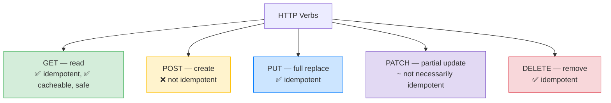

# 🌐 REST API Design Done Right — Complete Study Notes

> Notes for becoming a strong software engineer. Easy language, real code, and interview-ready explanations.
> How to design clean, predictable APIs — resource URLs, the right verbs, correct status codes, versioning, and consistent responses.

---

## 📌 1. The Big Idea — Resources, Not Actions

A good REST API is built around **resources** (the *things* — users, posts, orders), addressed by **URLs**, and acted on with **HTTP verbs** (the *actions*). The verb says what you're doing; the URL says what you're doing it *to*.

> Analogy 🏠: think of a building with rooms. The **URL is the room number** (`/users/42` = "user 42's room"). The **HTTP verb is what you do there** — GET (look inside), POST (add something), DELETE (remove it). You don't have a separate room called "go-look-in-room-42" — that's what action-based URLs mistakenly do.

> 🎯 Interview line: *"REST is resource-oriented — URLs identify resources as nouns, and HTTP verbs express the action. So it's GET /users, not /getUsers. The verb carries the action, the URL carries the thing."*

---

## 🔗 2. Resource-Based URLs (nouns, not verbs)

```
✅ GOOD (resource-based)          ❌ BAD (action-based)
GET    /users                     GET  /getAllUsers
GET    /users/:id                 GET  /getUserById
POST   /users                     POST /createUser
PUT    /users/:id                 POST /updateUser
DELETE /users/:id                 POST /deleteUser
GET    /users/:id/posts           GET  /getPostsForUser
```

**Rules of thumb:**
- Use **plural nouns** for collections: `/users`, `/posts` (not `/user`).
- **Nest** to show relationships: `/users/:id/posts` = "this user's posts."
- The **verb lives in the HTTP method**, never in the URL. If a URL has a verb like `get`/`create`/`update`, it's wrong.
- Keep nesting **shallow** (max ~2 levels) — `/users/:id/posts/:postId/comments` gets unwieldy; prefer `/posts/:postId/comments`.

> 🎯 Interview line: *"I use plural nouns for resources, nest to express relationships like /users/:id/posts, and keep the action in the HTTP verb — never `/getUsers` or `/createUser`."*

---

## 🔧 3. HTTP Verbs (and their properties)



| Verb | Use | Idempotent? | Notes |
|---|---|---|---|
| **GET** | Read | ✅ Yes | Safe (no changes), **cacheable** |
| **POST** | Create | ❌ No | Two POSTs = two resources |
| **PUT** | **Full** replace | ✅ Yes | Send the whole object; same result if repeated |
| **PATCH** | **Partial** update | ~ Maybe | Send only changed fields |
| **DELETE** | Remove | ✅ Yes | Deleting twice = same end state (gone) |

> 💡 **Idempotent** = doing it **once or many times gives the same result.** GET, PUT, DELETE are idempotent (repeat them safely). **POST is not** — calling it twice creates two resources. This matters for **retries**: a network retry of an idempotent request is safe; retrying a POST may double-create.

> 💡 **PUT vs PATCH:** PUT **replaces the whole resource** (you send every field; missing fields get cleared). PATCH **updates only the fields you send.** Use PATCH for "change just the email"; PUT for "replace the entire record."

> 🎯 Interview line: *"GET reads and is cacheable and idempotent; POST creates and isn't idempotent; PUT fully replaces and is idempotent; PATCH partially updates; DELETE removes and is idempotent. Idempotency matters for safe retries — retrying a POST risks a duplicate, which is why create endpoints sometimes need an idempotency key."*

---

## 🔢 4. Proper Status Codes (speak HTTP fluently)

Returning the **right** status code makes your API predictable and self-documenting. Group them by the first digit: **2xx success, 4xx client error, 5xx server error.**

| Code | Meaning | When to use |
|---|---|---|
| **200** OK | Success | Successful GET/PUT/PATCH |
| **201** Created | Resource created | After POST — include a **`Location`** header pointing to the new resource |
| **204** No Content | Success, nothing to return | After a DELETE |
| **400** Bad Request | Malformed request | Bad JSON, missing required field (syntax-level) |
| **401** Unauthorized | Not authenticated | Missing/invalid token (really "unauthenticated") |
| **403** Forbidden | Authenticated but not allowed | Valid login, wrong role/ownership |
| **404** Not Found | Resource doesn't exist | Unknown id |
| **409** Conflict | State conflict | Duplicate email, version conflict |
| **422** Unprocessable Entity | Semantic validation failed | Well-formed but invalid (e.g. age = -5) |
| **429** Too Many Requests | Rate limited | Too many login attempts |
| **500** Internal Server Error | Server bug | Unhandled exception |
| **503** Service Unavailable | Temporarily down | Overload, maintenance |

> 💡 Two distinctions interviewers love:
> - **401 vs 403:** 401 = "I don't know who you are" (unauthenticated). 403 = "I know you, but you can't do this" (unauthorized). (From your RBAC notes — and note 401 is confusingly *named* "Unauthorized" but means *unauthenticated*.)
> - **400 vs 422:** 400 = the request is **malformed** (bad syntax/JSON). 422 = the request is **well-formed but semantically invalid** (age can't be negative). Syntax vs meaning.

> 🎯 Interview line: *"I'm precise with status codes — 201 with a Location header on create, 204 on delete, 401 for unauthenticated vs 403 for forbidden, 400 for malformed vs 422 for semantically invalid, 409 for duplicates, 429 for rate limits. Correct codes make the API self-documenting."*

---

## 🔖 5. API Versioning (don't break existing clients)

When you change an API in a breaking way, **old clients must keep working.** So you **version** it. Three strategies:

| Strategy | Example | Verdict |
|---|---|---|
| **URL path** | `/v1/users`, `/v2/users` | ✅ **Most common** — simple, visible, easy to route |
| **Header** | `Accept: application/vnd.myapi.v1+json` | 👍 "Cleaner" URLs, but harder to test/see |
| **Query param** | `/users?version=1` | ❌ **Worst** — easy to forget, messes with caching |

> 💡 **URL versioning wins** in practice — it's explicit, easy to see in logs, trivial to route, and obvious to anyone reading the URL. Most big APIs (Stripe, GitHub, Twitter) use a version prefix.

> 🎯 Interview line: *"I version with a URL prefix like /v1/ — it's the most common and the most visible. Header-based versioning keeps URLs clean but is harder to debug, and query-param versioning is the worst because it's easy to forget and interferes with caching."*

---

## 📦 6. Consistent Response Envelope (always the same shape)

Every response should have the **same predictable structure**, so clients can parse it uniformly. A common envelope:

```json
// Success
{
  "data": { "id": "123", "name": "Nayan" },
  "error": null,
  "meta": { "page": 1, "total": 50 }
}

// Error
{
  "data": null,
  "error": { "code": "VALIDATION_ERROR", "message": "Email is required" },
  "meta": null
}
```

| Field | Holds |
|---|---|
| **`data`** | The actual payload (or `null` on error) |
| **`error`** | Error details (or `null` on success) — a **code** + human **message** |
| **`meta`** | Extras: pagination, counts, timestamps |

> 💡 Why a consistent envelope: the frontend writes **one** response handler instead of guessing each endpoint's shape. Pagination always lives in `meta`; errors always in `error`. Predictability = fewer bugs.

> 🎯 Interview line: *"I return a consistent envelope — data, error, meta — on every endpoint, so the client parses responses uniformly. Pagination goes in meta, errors carry a stable code plus a human message. Predictable shape means simpler, more reliable clients."*

---

## 💻 7. Practical Exercise — Audit & Document Your Auth API

Take your auth endpoints and audit them against everything above.

### Before vs after (example fixes)
```
❌ BEFORE                          ✅ AFTER
POST /createUser    → 200          POST /v1/users         → 201 + Location header
POST /login         → 200 always   POST /v1/auth/login    → 200 / 401 on bad creds
GET  /getUser/:id   → 200          GET  /v1/users/:id     → 200 / 404 if missing
POST /deleteUser    → 200          DELETE /v1/users/:id   → 204
(inconsistent JSON shapes)         (always { data, error, meta })
```

### Document every endpoint in a markdown table
```markdown
| Method | Endpoint            | Auth | Success | Errors            | Description        |
|--------|---------------------|------|---------|-------------------|--------------------|
| POST   | /v1/auth/register   | No   | 201     | 400, 409          | Register a user    |
| POST   | /v1/auth/login      | No   | 200     | 401, 429          | Log in, get tokens |
| GET    | /v1/users/:id       | Yes  | 200     | 401, 403, 404     | Get a user         |
| PATCH  | /v1/users/:id       | Yes  | 200     | 400, 401, 403, 422| Update a user      |
| DELETE | /v1/users/:id       | Yes  | 204     | 401, 403, 404     | Delete a user      |
```

> 💡 This audit table is genuinely useful as living API docs **and** as a portfolio artifact — it shows you think about API contracts, not just code.

---

## 🎤 8. How to Explain in an Interview

**Step 1 — Resource-oriented:**
> "I design around resources — plural-noun URLs like /users and /users/:id/posts — with the action in the HTTP verb, not the URL. So GET /users, never /getUsers."

**Step 2 — Verbs & idempotency:**
> "GET reads (cacheable, idempotent), POST creates (not idempotent), PUT fully replaces, PATCH partially updates, DELETE removes. Idempotency matters for safe retries."

**Step 3 — Status codes:**
> "I use precise codes — 201 with Location on create, 204 on delete, 401 vs 403 for auth, 400 vs 422 for malformed vs semantically invalid, 409 for duplicates, 429 for rate limits."

**Step 4 — Versioning & envelope:**
> "I version with a /v1/ URL prefix and return a consistent envelope — data, error, meta — so clients parse uniformly and old clients keep working across versions."

> 🟢 Trap question: *"PUT vs PATCH — what's the real difference?"* → *"PUT replaces the entire resource — you send all fields, and omitted ones get cleared. PATCH updates only the fields you send. PUT is idempotent; PATCH usually is but not always. For 'just change the email' I use PATCH."*

> 🟢 Trap question: *"User sends age = -5 — what status code?"* → *"422 Unprocessable Entity — the request is well-formed JSON, so it's not a 400, but it's semantically invalid. 400 is for malformed syntax; 422 is for valid syntax that fails business rules."*

---

## 💎 9. Impressive Words & Phrases

| Instead of saying... | Say this 💪 |
|---|---|
| "Noun URLs" | "**Resource-oriented** design" |
| "Same result if repeated" | "**Idempotent** operations" |
| "Safe to retry" | "Retry-safe due to **idempotency**" |
| "Full vs partial update" | "**PUT (replace)** vs **PATCH (partial)**" |
| "Right error code" | "Semantically correct **status codes**" |
| "Don't break old clients" | "**Backward-compatible versioning**" |
| "Same response shape" | "A consistent **response envelope**" |
| "Extra info" | "**Metadata** (`meta`) — pagination, counts" |
| "Auth failed" | "**401 unauthenticated** vs **403 forbidden**" |
| "Bad input" | "**400 malformed** vs **422 semantic** validation" |

**Power vocabulary:** *resource-oriented, idempotency, safe methods, cacheability, full vs partial update, status code semantics, 401 vs 403, 400 vs 422, backward compatibility, API versioning, response envelope, HATEOAS, idempotency key, Location header.*

> 🌶️ Bonus flex — **idempotency keys:** *"To make a POST safely retryable I support an Idempotency-Key header — the client sends a unique key, and the server returns the same result for a repeat key instead of creating a duplicate. Stripe does this for payments. It solves the 'did my payment go through twice?' problem on flaky networks."* This shows real production-API maturity.

---

## ⏱️ 10. Quick Revision (read 5 min before interview)

> **Resources, not actions:** plural-noun URLs (`/users`, `/users/:id/posts`); action in the **verb**, never the URL. No `/getUsers`.
>
> **Verbs:** GET (read, idempotent, cacheable), POST (create, **not** idempotent), PUT (full replace, idempotent), PATCH (partial), DELETE (idempotent). *Idempotent = safe to retry.*
>
> **Status codes:** 200 OK · 201 Created (+ Location) · 204 No Content (delete) · 400 malformed · 401 unauthenticated · 403 forbidden · 404 not found · 409 conflict/duplicate · 422 semantic-invalid · 429 rate-limited · 500 server · 503 unavailable.
>
> **Key distinctions:** 401 (who are you?) vs 403 (not allowed). 400 (bad syntax) vs 422 (bad meaning).
>
> **Versioning:** **URL `/v1/`** (best/common) > header > query param (worst).
>
> **Envelope:** always `{ data, error, meta }` — uniform parsing; pagination in `meta`, errors in `error`.
>
> **Golden line:** *"Resource-noun URLs with the action in the verb, precise status codes (401 vs 403, 400 vs 422, 201 with Location), URL versioning, and a consistent data/error/meta envelope — that's a predictable, self-documenting API."*

---

### ✅ Practice checklist
- [ ] Rewrite action URLs (`/getUsers`) as resource URLs (`GET /users`)
- [ ] Audit each endpoint's status codes (201+Location on create, 204 on delete)
- [ ] Fix 401 vs 403 and 400 vs 422 usage
- [ ] Add a `/v1/` prefix to every route
- [ ] Wrap all responses in `{ data, error, meta }`
- [ ] Add `429` to rate-limited routes (login)
- [ ] Document every endpoint in a markdown table (method, path, auth, codes, description)
- [ ] (Stretch) Add an `Idempotency-Key` to a create endpoint

A clean, predictable API is the contract everyone else builds on. Get the resources, verbs, codes, and envelope right, and your API documents itself. 🚀
