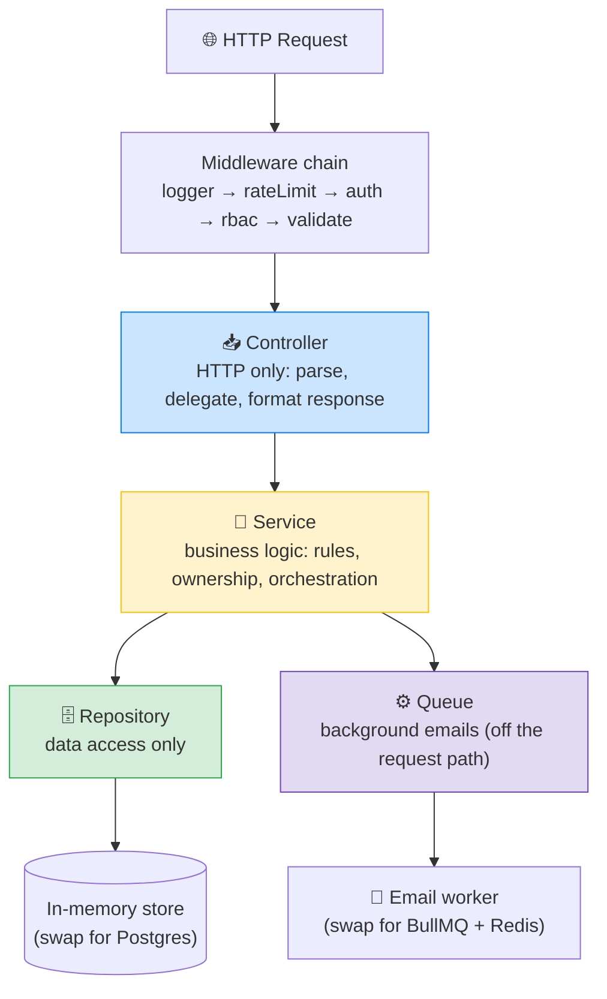

# 💼 Job Board API — Runnable Practice Project

A complete, **runnable** job board API you can `npm install && npm start` with **zero infrastructure** — no Postgres, no Redis, no AWS account. It's built to *practise and study* the backend concepts from your notes: JWT auth, RBAC, layered architecture (Controller → Service → Repository), cursor pagination, file uploads, and background jobs.

> 🎓 **How to learn from this:** run it, read the code top-to-bottom following the request flow, hit the endpoints with curl, then try changing things. Every file has teaching comments explaining *why* it's built that way and which concept it demonstrates.

---

## 🚀 Quick Start

```bash
npm install        # install dependencies (express, jsonwebtoken, bcryptjs, zod, cookie-parser)
npm start          # start the API on http://localhost:3000 (auto-seeds sample data)

# in another terminal, verify everything works end-to-end:
npm run smoke      # runs 28 automated checks across the whole API
```

On boot, the database is seeded with sample data so you can try it immediately:

| Role | Email | Password |
|---|---|---|
| **Employer** | `employer@demo.com` | `password123` |
| **Seeker** | `seeker@demo.com` | `password123` |

---

## 🧪 Try It (copy-paste curl)

```bash
# 1. Browse jobs (public, cursor-paginated, filterable)
curl "http://localhost:3000/v1/jobs?limit=3"
curl "http://localhost:3000/v1/jobs?type=remote&minSalary=30"

# 2. Log in as the employer → grab the accessToken from the response
curl -X POST http://localhost:3000/v1/auth/login \
  -H "Content-Type: application/json" \
  -d '{"email":"employer@demo.com","password":"password123"}'

# 3. Use the token (replace <TOKEN>) to see who you are
curl http://localhost:3000/v1/auth/me -H "Authorization: Bearer <TOKEN>"

# 4. Post a job (employers only — a seeker token gets 403)
curl -X POST http://localhost:3000/v1/jobs \
  -H "Authorization: Bearer <TOKEN>" -H "Content-Type: application/json" \
  -d '{"companyId":"<COMPANY_ID>","title":"DevOps Engineer","type":"remote","minSalary":35,"description":"Own our infrastructure."}'
```

> 💡 The seeded company id is printed in the logs on boot, or fetch it via the seeker/employer flow. You can also just read jobs to see the shape of the data.

---

## 🏛️ Architecture

Clean **layered architecture** — each layer has one job and only talks to the layer below. This is the pattern from your *Architecture Patterns* notes.



**The golden rule:** a controller never touches the database; a repository never knows about HTTP. Errors flow as **domain errors** thrown by services and get mapped to HTTP status codes in one central error handler.

---

## 📁 Project Structure

```
job-board-api/
├── src/
│   ├── config.js              # all config in one place (env vars + defaults)
│   ├── app.js                 # Express app: middleware + route wiring
│   ├── server.js              # entry point: seed + listen
│   ├── controllers/           # HTTP layer (parse → delegate → respond)
│   ├── services/              # business logic (rules, ownership, orchestration)
│   ├── repositories/          # data access (the ONLY layer touching the store)
│   ├── middleware/            # auth, rbac, validate, rateLimit, logger, error
│   ├── routes/                # endpoint definitions + their middleware chains
│   ├── schemas/               # zod validation schemas
│   ├── jobs/                  # background email worker
│   ├── lib/                   # db, jwt, storage(S3 mock), queue(BullMQ mock), logger
│   └── utils/                 # envelope, cursor, domain errors
├── seed.js                    # sample data (runs on boot)
├── smoke-test.js              # end-to-end verification (28 checks)
└── uploads/                   # local "S3" — uploaded resumes land here
```

---

## 🌐 API Reference

All endpoints live under `/v1` and return a **consistent envelope**: `{ data, error, meta }`.

### Auth
| Method | Endpoint | Auth | Success | Errors |
|---|---|---|---|---|
| POST | `/v1/auth/register` | — | 201 | 409 (dup email), 422 (validation), 429 |
| POST | `/v1/auth/login` | — | 200 | 401 (bad creds), 422, 429 |
| POST | `/v1/auth/refresh` | refresh cookie | 200 | 401 |
| POST | `/v1/auth/logout` | refresh cookie | 204 | — |
| GET | `/v1/auth/me` | Bearer | 200 | 401 |

### Companies
| Method | Endpoint | Auth | Success | Errors |
|---|---|---|---|---|
| POST | `/v1/companies` | employer | 201 | 401, 403, 422 |
| GET | `/v1/companies/:id` | — | 200 | 404 |
| PATCH | `/v1/companies/:id` | owner | 200 | 401, 403, 404 |
| DELETE | `/v1/companies/:id` | owner | 204 | 401, 403, 404 |

### Jobs
| Method | Endpoint | Auth | Success | Errors |
|---|---|---|---|---|
| GET | `/v1/jobs` | — | 200 | 429 |
| GET | `/v1/jobs/:id` | — | 200 | 404 |
| POST | `/v1/jobs` | employer + owns company | 201 | 401, 403, 404, 422 |
| PATCH | `/v1/jobs/:id` | owner | 200 | 401, 403, 404 |
| DELETE | `/v1/jobs/:id` | owner | 204 | 401, 403, 404 |

**Jobs list query params:** `?location=Bangalore&type=remote&minSalary=30&q=react&limit=10&cursor=<opaque>`
- `location`, `type` (remote/onsite/hybrid), `minSalary` — filters
- `q` — case-insensitive title search
- `limit` (1–50, default 10), `cursor` — keyset pagination; `meta.nextCursor` carries the next page token

### Applications
| Method | Endpoint | Auth | Success | Errors |
|---|---|---|---|---|
| POST | `/v1/jobs/:id/apply` | seeker | 201 | 401, 403, 404, 409 (already applied), 422 (not a PDF) |
| GET | `/v1/jobs/:id/applications` | employer (owns job) | 200 | 401, 403 |
| GET | `/v1/applications/me` | seeker | 200 | 401 |

> The resume is sent as a **base64 PDF string** (`resumeBase64`) to keep the project dependency-free. In production this is a `multipart/form-data` file parsed by multer — see *Swapping in real infrastructure* below.

---

## 🎓 What This Demonstrates (mapped to your notes)

| Concept | Where to look | Your note |
|---|---|---|
| **JWT auth** (access + refresh) | `lib/jwt.js`, `services/auth.service.js` | JWT Internals, Access/Refresh Tokens |
| **Refresh token rotation + denylist** | `auth.service.js` (`refresh`, `logout`) | Access/Refresh Tokens |
| **Password hashing** (bcrypt) | `auth.service.js` (`register`) | Password Security |
| **RBAC** (role + ownership) | `middleware/rbac.middleware.js`, services | RBAC |
| **Layered architecture** | the whole `src/` structure | Architecture Patterns |
| **Domain errors → HTTP mapping** | `utils/errors.js`, `middleware/error.middleware.js` | Architecture Patterns |
| **Cursor pagination** | `repositories/job.repository.js`, `utils/cursor.js` | Pagination Patterns |
| **REST design** (status codes, envelope, /v1) | `utils/envelope.js`, all routes | REST API Design |
| **File upload + magic-byte validation** | `lib/storage.js`, `application.service.js` | File Uploads + S3 |
| **Background jobs** (queue + worker, retries) | `lib/queue.js`, `jobs/email.worker.js` | BullMQ Background Jobs |
| **Input validation** (zod) | `schemas/`, `middleware/validate.middleware.js` | — |
| **Rate limiting** | `middleware/rateLimit.middleware.js` (auth + search) | Security Audit |
| **Structured logging** | `lib/logger.js`, `middleware/logger.middleware.js` | — |

---

## 🔧 Swapping in Real Infrastructure

This project uses lightweight in-process stand-ins so it runs with zero setup. The **patterns are identical** to production — here's how you'd graduate each one:

| Mock (here) | Production | What changes |
|---|---|---|
| `lib/db.js` (in-memory arrays) | **PostgreSQL** / MongoDB | Rewrite the **repositories** only — services & controllers are untouched (that's the Repository pattern's payoff) |
| `lib/storage.js` (local files) | **AWS S3** | Swap `uploadResume` for `PutObjectCommand` or a pre-signed URL; accept multipart via multer |
| `lib/queue.js` (in-process) | **BullMQ + Redis** | Replace with real `Queue`/`Worker`; run the worker as a separate process |
| `lib/logger.js` (console JSON) | **pino** | Drop-in for performance + log levels |
| base64 resume string | **multipart/form-data** | Add multer middleware; the controller reads `req.file.buffer` instead of decoding base64 |

Because everything is behind clean interfaces, each swap is **localised** — you change one file, not the whole app.

---

## ⚙️ How It Works (request lifecycle)

A `POST /v1/jobs` request, end to end:

1. **Middleware chain** runs: request logged → (no rate limit on create) → `requireAuth` verifies the Bearer token → `requireRole('employer')` checks the role → `validate(createJobSchema)` checks the body.
2. **Controller** (`job.controller.js`) parses `req.body` + `req.user.sub`, calls the service.
3. **Service** (`job.service.js`) applies the business rule — *you can only post jobs for a company you own* — fetching the company and comparing `owner_id`. Throws `ForbiddenError` if not.
4. **Repository** (`job.repository.js`) inserts the job into the store.
5. **Controller** wraps the result in the `{ data, error, meta }` envelope with status `201`.
6. Any thrown **domain error** skips to the **central error handler**, which maps it to the right HTTP status.

---

## 📝 Notes

- **Data is in-memory** — it resets every restart, and re-seeds fresh sample data. That's intentional for a practice project (nothing to set up or clean up).
- **Secrets** have dev defaults so it runs immediately. For anything real, set `ACCESS_SECRET` / `REFRESH_SECRET` via `.env` (see `.env.example`) and never commit them.
- **bcrypt cost** is 10 here for fast demos; use 12 in production.

---

Built as the Phase 1 capstone — a hands-on way to see how auth, databases, REST design, file handling, background jobs, and clean architecture fit together in one working system. 🚀
