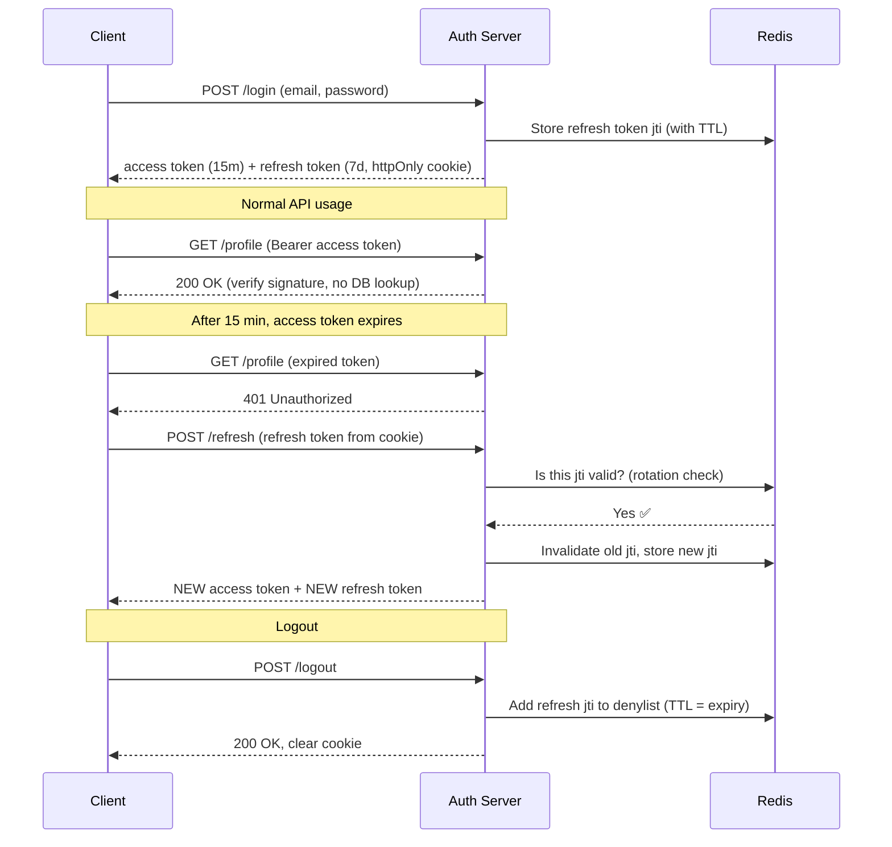

# 🔄 Access + Refresh Token Pattern — Complete Study Notes

> Notes for becoming a strong software engineer. Easy language, real code, and interview-ready explanations.
> 👉 This builds on the JWT notes — a JWT is the *token*; this is the *strategy* of using two tokens together.

---

## 📌 1. The Big Idea (in simple words)

We have **two tokens** instead of one. They have **different jobs**.

Think of it like a **shopping mall** 🛍️:
- The **access token** is a **temporary entry pass** — valid for a short time. You show it at every shop. If you lose it, it expires soon, so no big damage.
- The **refresh token** is your **membership card** — kept safely in your wallet. You only show it at the **front desk** to get a fresh entry pass when the old one expires.

So:
- **Access token** → used **everywhere** (every API call), but **short life** (15 min).
- **Refresh token** → used only at **one place** (`/refresh` endpoint), but **long life** (7–30 days), and **stored very carefully**.

This gives the best of both worlds: **good security** (short access token) + **good user experience** (user doesn't log in again every 15 minutes).

---

## ⚡ 2. Why Access Tokens are Short-Lived (15 min)

The access token is sent on **every single request**. That means it is exposed a lot — in headers, logs, proxies, browser memory. More exposure = more chance to leak.

**The trick:** if it leaks, make it **useless quickly**.

> A short expiry means a stolen access token is only dangerous for a few minutes. After that, it's just a dead string. This **limits the blast radius** of a leak.

Because access tokens are stateless JWTs, the server does **not** check a database for them — it just verifies the signature. So we **cannot revoke them mid-life**. The short expiry *is* our safety mechanism.

---

## 🔒 3. Why Refresh Tokens are Long-Lived & Stored Carefully

The refresh token is powerful — it can **mint new access tokens**. So it is a juicy target for hackers. We protect it in two ways:

### (a) It is used rarely
It only ever goes to the `/refresh` endpoint, not to every API. Less exposure = less risk.

### (b) It is stored safely → `httpOnly` cookie, NOT `localStorage`

| Storage | Can JavaScript read it? | XSS risk |
|---|---|---|
| `localStorage` | ✅ Yes — any script can steal it | ❌ Dangerous |
| `httpOnly` cookie | ❌ No — JS cannot touch it | ✅ Safe from XSS |

> 🎯 Key interview point: *"We store the refresh token in an `httpOnly`, `Secure`, `SameSite` cookie so that even if an attacker injects malicious JavaScript (XSS), they cannot read the token."*

**Common, practical setup:**
- **Access token** → kept in **memory** (a JS variable / React state). Lost on refresh, but that's fine — we just call `/refresh`.
- **Refresh token** → kept in **`httpOnly` cookie**, automatically sent by the browser only to the refresh route.

---

## 🌊 4. The Full Flow (with diagram)



**In words:**
1. **Login** → server returns *both* tokens.
2. **Use the app** → client sends the **access token** with each request.
3. **Access token expires** → API returns `401`.
4. **Refresh** → client calls `/refresh` with the refresh token → gets a **new access token** (and a new refresh token, see rotation below).
5. **Logout** → server **invalidates** the refresh token so it can never be reused.

---

## 🔁 5. Token Rotation (very important for interviews)

**The problem:** What if someone *steals* a refresh token? They could keep generating access tokens forever.

**The solution — rotation:** Every time a refresh token is used, **issue a brand-new refresh token and kill the old one**.

Now imagine this attack scenario:
1. Hacker steals the refresh token.
2. Hacker uses it → gets a new token, old one is now dead.
3. The **real user** later tries to refresh with their (now-dead) old token → it **fails**.
4. The server sees an **already-used / invalid refresh token** → 🚨 this is a strong signal of theft → server **revokes the entire token family** (logs out everyone using it).

> This is called **refresh token rotation with reuse detection**. Saying this phrase in an interview instantly signals senior-level knowledge. 💎

---

## 🗄️ 6. Refresh Token Blacklisting with Redis

Since refresh tokens live long, we need a way to **revoke** them (logout, theft detection). We use **Redis** because it is fast and supports **TTL (auto-expiry)**.

**The idea:**
- Give every refresh token a unique ID → the **`jti`** claim.
- On logout (or theft), store that `jti` in a Redis **denylist Set**.
- Set the Redis key's **TTL equal to the token's remaining expiry** — so the entry auto-cleans itself once the token would have expired anyway. No garbage piles up. 🧹

```
On logout:   SET denylist:<jti> "1"  EX <seconds-until-expiry>
On refresh:  EXISTS denylist:<jti>  → if yes, reject the token
```

> Two valid designs:
> - **Denylist (blocklist):** store *revoked* tokens. Good when most tokens are valid.
> - **Allowlist (whitelist):** store *currently valid* tokens. Stronger security but more storage.

---

## 💻 7. Complete Code Example (Node.js + Express + Redis)

A full working auth flow: **register → login → protected route → refresh → logout**.

```js
// auth.js
const express = require('express');
const jwt = require('jsonwebtoken');
const bcrypt = require('bcrypt');
const crypto = require('crypto');
const cookieParser = require('cookie-parser');
const Redis = require('ioredis');

const app = express();
app.use(express.json());
app.use(cookieParser());

const redis = new Redis(); // connects to localhost:6379 by default

const ACCESS_SECRET = process.env.ACCESS_SECRET || 'access-secret';
const REFRESH_SECRET = process.env.REFRESH_SECRET || 'refresh-secret';
const ACCESS_TTL = '15m';
const REFRESH_TTL = '7d';
const REFRESH_TTL_SECONDS = 7 * 24 * 60 * 60;

const users = []; // fake DB for the demo

// ---------- Helpers ----------
function makeAccessToken(user) {
  return jwt.sign(
    { sub: user.id, role: user.role },
    ACCESS_SECRET,
    { expiresIn: ACCESS_TTL }
  );
}

function makeRefreshToken(user) {
  const jti = crypto.randomUUID(); // unique ID for this refresh token
  const token = jwt.sign(
    { sub: user.id, jti },
    REFRESH_SECRET,
    { expiresIn: REFRESH_TTL }
  );
  return { token, jti };
}

// Send refresh token as a safe httpOnly cookie
function setRefreshCookie(res, token) {
  res.cookie('refreshToken', token, {
    httpOnly: true,                          // JS cannot read it → XSS safe
    secure: process.env.NODE_ENV === 'prod', // HTTPS only in production
    sameSite: 'strict',                      // CSRF protection
    path: '/refresh',                        // cookie only sent to /refresh
    maxAge: REFRESH_TTL_SECONDS * 1000,
  });
}

// ---------- 1. REGISTER ----------
app.post('/register', async (req, res) => {
  const { email, password } = req.body;
  const hashed = await bcrypt.hash(password, 10);
  const user = { id: crypto.randomUUID(), email, password: hashed, role: 'user' };
  users.push(user);
  res.status(201).json({ message: 'Registered successfully' });
});

// ---------- 2. LOGIN ----------
app.post('/login', async (req, res) => {
  const { email, password } = req.body;
  const user = users.find((u) => u.email === email);
  if (!user || !(await bcrypt.compare(password, user.password))) {
    return res.status(401).json({ error: 'Invalid credentials' });
  }

  const accessToken = makeAccessToken(user);
  const { token: refreshToken, jti } = makeRefreshToken(user);

  // Allowlist: remember this refresh token is valid
  await redis.set(`refresh:${jti}`, user.id, 'EX', REFRESH_TTL_SECONDS);

  setRefreshCookie(res, refreshToken);
  res.json({ accessToken }); // access token goes in the JSON body (kept in memory)
});

// ---------- Middleware: protect routes ----------
function requireAuth(req, res, next) {
  const header = req.headers.authorization || '';
  const token = header.startsWith('Bearer ') ? header.slice(7) : null;
  if (!token) return res.status(401).json({ error: 'No token' });

  try {
    req.user = jwt.verify(token, ACCESS_SECRET);
    next();
  } catch (err) {
    return res.status(401).json({ error: 'Token expired or invalid' });
  }
}

// ---------- 3. PROTECTED ROUTE ----------
app.get('/profile', requireAuth, (req, res) => {
  res.json({ message: 'Secret profile data', userId: req.user.sub });
});

// ---------- 4. REFRESH (with rotation + reuse detection) ----------
app.post('/refresh', async (req, res) => {
  const token = req.cookies.refreshToken;
  if (!token) return res.status(401).json({ error: 'No refresh token' });

  let payload;
  try {
    payload = jwt.verify(token, REFRESH_SECRET);
  } catch (err) {
    return res.status(401).json({ error: 'Invalid refresh token' });
  }

  // Is this token still valid in our allowlist?
  const exists = await redis.get(`refresh:${payload.jti}`);
  if (!exists) {
    // 🚨 Reuse detected! This token was already rotated or revoked.
    // In production: revoke the whole token family for this user.
    return res.status(401).json({ error: 'Refresh token reuse detected' });
  }

  // ROTATION: kill the old one, issue a new one
  await redis.del(`refresh:${payload.jti}`);

  const user = users.find((u) => u.id === payload.sub);
  const accessToken = makeAccessToken(user);
  const { token: newRefresh, jti: newJti } = makeRefreshToken(user);

  await redis.set(`refresh:${newJti}`, user.id, 'EX', REFRESH_TTL_SECONDS);
  setRefreshCookie(res, newRefresh);

  res.json({ accessToken });
});

// ---------- 5. LOGOUT ----------
app.post('/logout', async (req, res) => {
  const token = req.cookies.refreshToken;
  if (token) {
    try {
      const payload = jwt.verify(token, REFRESH_SECRET);
      await redis.del(`refresh:${payload.jti}`); // invalidate in Redis
    } catch (_) {}
  }
  res.clearCookie('refreshToken', { path: '/refresh' });
  res.json({ message: 'Logged out' });
});

app.listen(3000, () => console.log('Auth server on http://localhost:3000'));
```

### How to test the full flow (using curl / Postman)

```bash
# 1. Register
curl -X POST localhost:3000/register -H "Content-Type: application/json" \
  -d '{"email":"a@b.com","password":"pass123"}'

# 2. Login → returns accessToken in body + refresh cookie
curl -X POST localhost:3000/login -c cookies.txt -H "Content-Type: application/json" \
  -d '{"email":"a@b.com","password":"pass123"}'

# 3. Access protected route with the access token
curl localhost:3000/profile -H "Authorization: Bearer <ACCESS_TOKEN>"

# 4. Refresh (uses the cookie) → new access token + rotated refresh token
curl -X POST localhost:3000/refresh -b cookies.txt -c cookies.txt

# 5. Logout → refresh token invalidated in Redis
curl -X POST localhost:3000/logout -b cookies.txt
```

> 💡 The `-c` saves cookies and `-b` sends them — that's how curl mimics the browser holding the `httpOnly` cookie.

---

## 🎤 8. How to Explain in an Interview

Use this **5-step structure**:

**Step 1 — The why:**
> "We use two tokens to balance security and user experience. A short-lived access token limits damage if leaked, while a long-lived refresh token keeps the user logged in without re-entering their password."

**Step 2 — Storage:**
> "The access token lives in memory and is sent with every request. The refresh token goes in an `httpOnly`, `Secure`, `SameSite` cookie so it's protected from XSS and only sent to the refresh endpoint."

**Step 3 — The flow:**
> "On login we issue both. The client uses the access token until it expires, gets a 401, then calls `/refresh` to silently get a new one."

**Step 4 — Rotation (the senior touch):**
> "We rotate refresh tokens — each refresh issues a new one and invalidates the old. If an old token is reused, that's a theft signal and we revoke the whole token family."

**Step 5 — Revocation:**
> "For logout and revocation we keep refresh token IDs in Redis with a TTL matching the expiry, so cleanup is automatic."

> 🟢 If they ask *"Why not just use one long-lived token?"* → answer: *"Because we can't revoke a stateless JWT mid-life. A long-lived access token would be a long-lived risk if leaked. Splitting the concern lets the frequently-used token stay short and the powerful token stay rare and protected."*

---

## 💎 9. Impressive Words & Phrases

| Instead of saying... | Say this 💪 |
|---|---|
| "Short token" | "**Short-lived** access token to **limit the blast radius**" |
| "Get a new token" | "**Silently refresh** without re-authentication" |
| "Swap the token each time" | "**Refresh token rotation** with **reuse detection**" |
| "Stop a logged-out token" | "**Token revocation** via a Redis **denylist**" |
| "Safe cookie" | "**`httpOnly`, `Secure`, `SameSite`** cookie — XSS and CSRF safe" |
| "Tokens for one user" | "A **token family**" |
| "Auto-delete old entries" | "**TTL-based eviction** matching token expiry" |
| "Don't store sensitive token in JS" | "Avoid `localStorage` to **mitigate XSS exposure**" |

**Power vocabulary:** *blast radius, short-lived vs long-lived, silent refresh, token rotation, reuse detection, token family revocation, httpOnly/Secure/SameSite, denylist vs allowlist, TTL-based eviction, sliding session.*

---

## ⏱️ 10. Quick Revision (read 5 min before interview)

> **Two tokens, two jobs:**
> - **Access token** → 15 min, sent on *every* request, stored in **memory**. Short life = limited damage if leaked.
> - **Refresh token** → 7–30 days, sent *only* to `/refresh`, stored in **`httpOnly` cookie** (never `localStorage` → XSS safe).
>
> **Flow:** login → both tokens → use access token → it expires (401) → `/refresh` with refresh token → new access token → logout invalidates refresh token.
>
> **Rotation:** new refresh token every refresh, old one dies. Old token reused = theft signal → revoke the **token family**.
>
> **Redis:** store refresh `jti` with **TTL = expiry** → auto-cleanup. Denylist (revoked) or allowlist (valid).
>
> **Golden line:** *"Short access token limits the blast radius; the carefully-stored refresh token keeps the user logged in."*

---

### ✅ Practice checklist
- [ ] Build `register` with `bcrypt` password hashing
- [ ] Build `login` that returns access token (body) + refresh token (httpOnly cookie)
- [ ] Build a `requireAuth` middleware that verifies the access token
- [ ] Build `/refresh` with **rotation** (issue new, delete old in Redis)
- [ ] Add **reuse detection** (old jti missing in Redis → reject)
- [ ] Build `/logout` that deletes the refresh `jti` from Redis + clears cookie
- [ ] Test the whole loop with curl/Postman using saved cookies

Master this and you can confidently answer *any* authentication system-design question. 🚀
