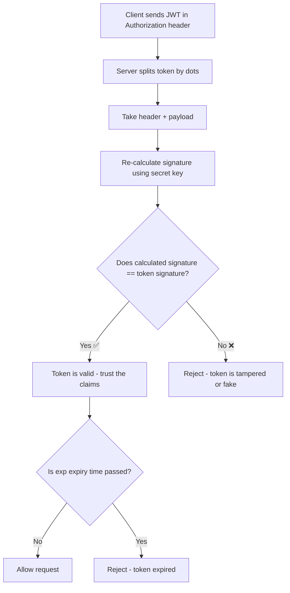

# 🔐 JWT Internals — Complete Study Notes

> Notes for becoming a strong software engineer. Easy language, real code, and interview-ready explanations.

---

## 📌 1. What is a JWT (in simple words)

JWT = **JSON Web Token**. It is just a **string** that carries information in a safe, verifiable way.

Think of it like a **movie ticket** 🎟️:
- Anyone can read what is printed on it (your seat, show time).
- But only the cinema can **verify** it is real, because of the special stamp/hologram.
- If you try to change the seat number with a pen, the stamp no longer matches and the ticket becomes invalid.

A JWT works exactly like this. It is **readable** by anyone, but **tamper-evident** — if you change it, the signature breaks.

A JWT has **three parts**, joined by **dots (`.`)**:

```
xxxxx.yyyyy.zzzzz
HEADER.PAYLOAD.SIGNATURE
```

Each part is **Base64URL-encoded** (not encrypted — just encoded).

> ⚠️ Important: Base64 is **NOT** encryption. It is just a way to write data in URL-safe text. Anyone can decode the header and payload. So **never put passwords or secrets inside a JWT payload.**

---

## 🧩 2. The Structure (with diagram)

```
┌──────────────────────────────────────────────────────────────┐
│                        JWT TOKEN                               │
│                                                                │
│  eyJhbGciOiJIUzI1NiI...  .  eyJ1c2VySWQiOjEyMy...  .  SflKxw...│
│  └─────────┬──────────┘     └────────┬──────────┘    └───┬───┘ │
│         HEADER                    PAYLOAD            SIGNATURE  │
│   (algorithm + type)         (your claims)      (proof it is   │
│                                                   not tampered)│
└──────────────────────────────────────────────────────────────┘
```

### Verification flow (Mermaid diagram — GitHub will render this):



### Part 1 — HEADER

Tells which algorithm signed the token and the type.

```json
{
  "alg": "HS256",
  "typ": "JWT"
}
```

### Part 2 — PAYLOAD

Contains the **claims** — the actual data (statements about the user).

```json
{
  "userId": 123,
  "role": "admin",
  "iat": 1735000000,
  "exp": 1735003600
}
```

### Part 3 — SIGNATURE

This is the **proof of authenticity**. It is created like this:

```
signature = HMAC-SHA256(
    base64Url(header) + "." + base64Url(payload),
    secret
)
```

The signature **cannot be decoded back** into readable text. It is a one-way hash. Its only job is to be **re-calculated and compared** during verification.

---

## ⚡ 3. Why JWTs are "Stateless" (and the logout problem)

This is a **very common interview question**, so understand it deeply.

### What "stateless" means

With **old session-based auth**:
- Server creates a session and stores it in DB / memory.
- On every request, server does a **DB lookup** to check if the session is valid.

With **JWT (stateless)**:
- The token itself carries all the info AND the proof.
- Server only needs the **secret key** to verify — **no DB lookup needed**.
- This makes it easy to **scale** across many servers (any server with the secret can verify).

### The logout problem (the catch!)

Because the server stores **nothing**, you **cannot truly invalidate a JWT** before it expires.

If a user logs out, the token is **still technically valid** until its `exp` time. If a hacker copied it, they can keep using it.

**Solutions** (mention these in interviews — it shows depth):

| Approach | How it works | Trade-off |
|---|---|---|
| **Short expiry + refresh token** | Access token lives ~15 min, refresh token used to get new ones | Most popular, industry standard |
| **Denylist / Blocklist** | Store revoked token IDs (`jti`) in Redis | Adds state back — slightly less "stateless" |
| **Token versioning** | Store a `tokenVersion` per user in DB; bump it on logout | Needs one DB read |
| **Rotate the secret** | Changes the secret key | Nuclear option — logs out *everyone* |

> 🎯 Interview gold line: *"JWTs trade easy revocation for statelessness and scalability. To handle logout, we usually keep access tokens short-lived and pair them with refresh tokens."*

---

## 🔑 4. Symmetric vs Asymmetric (HS256 vs RS256)

| | **HS256 (Symmetric)** | **RS256 (Asymmetric)** |
|---|---|---|
| Keys | **One** shared secret | **Two** keys: private + public |
| Who signs | Anyone with the secret | Only the **private key** holder |
| Who verifies | Anyone with the **same** secret | Anyone with the **public** key |
| Best for | Single app / one team | Microservices, third-party verifiers |
| Risk | If secret leaks → game over | Public key can be shared safely |

**Simple way to remember:**
- **HS256** = same key locks and unlocks (like a normal house key).
- **RS256** = private key **signs**, public key **verifies** (like a wax seal — only the king has the stamp, but everyone can recognise the seal).

> Use **RS256** when many services need to *verify* tokens but should NOT be able to *create* them. The auth server keeps the private key; everyone else gets the public key.

---

## 📖 5. Standard (Registered) Claims

These are the official "reserved" claim names. Knowing them by heart impresses interviewers.

| Claim | Full name | Meaning |
|---|---|---|
| `iss` | Issuer | Who created the token (e.g. `auth.myapp.com`) |
| `sub` | Subject | Who the token is about (usually the user ID) |
| `aud` | Audience | Who the token is meant for (which service) |
| `exp` | Expiry | Unix timestamp when token expires |
| `iat` | Issued At | Unix timestamp when token was created |
| `nbf` | Not Before | Token is invalid before this time |
| `jti` | JWT ID | Unique ID for the token (useful for denylists) |

> Memory trick: **"I Saw A Elephant Is Not Just"** → `iss, sub, aud, exp, iat, nbf, jti`.

---

## 💻 6. Code Examples (Node.js)

### Exercise A — Hand-write a JWT decoder (no library!)

This shows you truly understand the structure.

```js
// decode-jwt.js
function decodeJWT(token) {
  // 1. Split the token into 3 parts by the dot
  const [headerB64, payloadB64, signature] = token.split('.');

  // 2. Base64URL decode + parse JSON
  const decode = (str) =>
    JSON.parse(Buffer.from(str, 'base64url').toString('utf8'));

  return {
    header: decode(headerB64),
    payload: decode(payloadB64),
    signature, // stays encoded — it is a one-way hash, cannot be "decoded"
  };
}

const token = 'eyJhbGciOiJIUzI1NiIsInR5cCI6IkpXVCJ9' +
  '.eyJ1c2VySWQiOjEyMywicm9sZSI6ImFkbWluIn0' +
  '.SflKxwRJSMeKKF2QT4fwpMeJf36POk6yJV_adQssw5c';

console.log(decodeJWT(token));
// { header: { alg: 'HS256', typ: 'JWT' },
//   payload: { userId: 123, role: 'admin' },
//   signature: 'SflKxw...' }
```

**Browser version** (since you do React/frontend too):

```js
function decodeJWTBrowser(token) {
  const [headerB64, payloadB64] = token.split('.');

  // atob does not understand URL-safe base64, so fix the characters first
  const decode = (str) => {
    const fixed = str.replace(/-/g, '+').replace(/_/g, '/');
    return JSON.parse(decodeURIComponent(escape(atob(fixed))));
  };

  return { header: decode(headerB64), payload: decode(payloadB64) };
}
```

> 💡 Key insight: decoding the payload needs **no secret**. This proves anyone can *read* a JWT. The secret is only needed to **verify** the signature.

---

### Exercise B — Build the signature yourself (the "magic" demystified)

```js
// build-jwt.js
const crypto = require('crypto');

const secret = 'my-super-secret';

const base64url = (obj) =>
  Buffer.from(JSON.stringify(obj)).toString('base64url');

const header = base64url({ alg: 'HS256', typ: 'JWT' });
const payload = base64url({ userId: 123, role: 'admin' });

// The signature is an HMAC of "header.payload" using the secret
const signature = crypto
  .createHmac('sha256', secret)
  .update(`${header}.${payload}`)
  .digest('base64url');

const token = `${header}.${payload}.${signature}`;
console.log(token);
```

This is **literally** what `jsonwebtoken` does internally. Once you write this by hand, JWT stops feeling like magic.

---

### Exercise C — Compare with the `jsonwebtoken` library

```js
// jwt-library.js
const jwt = require('jsonwebtoken');
const secret = 'my-super-secret';

// Generate (sign)
const token = jwt.sign(
  { userId: 123, role: 'admin' },
  secret,
  { expiresIn: '1h' }   // library auto-adds iat + exp for you
);
console.log('Generated:', token);

// Verify
try {
  const decoded = jwt.verify(token, secret);
  console.log('Valid ✅', decoded);
} catch (err) {
  console.log('Invalid ❌', err.message);
}
```

> Notice: the library adds `iat` and `exp` automatically when you pass `expiresIn`. Your hand-built version did not — that is the convenience the library gives.

---

### Exercise D — Tamper with the payload and watch it fail

This is the **most important experiment** for understanding *why JWT is secure*.

```js
// tamper-test.js
const jwt = require('jsonwebtoken');
const secret = 'my-super-secret';

const token = jwt.sign({ userId: 123, role: 'user' }, secret);

// Split it
const [header, payload, signature] = token.split('.');

// Try to become admin by changing the payload manually 😈
const hackedPayload = Buffer.from(
  JSON.stringify({ userId: 123, role: 'admin' })
).toString('base64url');

const hackedToken = `${header}.${hackedPayload}.${signature}`;

try {
  jwt.verify(hackedToken, secret);
  console.log('Hack worked 😱');
} catch (err) {
  console.log('Hack blocked ✅ →', err.message);
  // → "invalid signature"
}
```

**Why does it fail?** The old signature was calculated from the *original* payload (`role: user`). When you change the payload to `role: admin`, the server re-calculates the signature for the new payload — and it does **not match** the signature in the token. Because the hacker does **not know the secret**, they cannot create a matching signature. 🔒

---

## 🎤 7. How to Explain JWT in an Interview

Keep it **structured**. Use this 4-step flow:

**Step 1 — One-line definition:**
> "A JWT is a self-contained, signed token with three parts — header, payload, and signature — used for stateless authentication."

**Step 2 — How verification works:**
> "The server doesn't store the token. It just re-computes the signature from the header and payload using its secret, and compares it. If they match, the token is trusted — no database lookup needed."

**Step 3 — The trade-off (shows maturity):**
> "Because it's stateless, you can't easily revoke a token before it expires. So in production we use short-lived access tokens with refresh tokens, or a Redis denylist for logout."

**Step 4 — When to use which algorithm:**
> "HS256 for a single backend, RS256 when multiple services need to verify tokens without the power to create them."

> 🟢 **Tip:** If they ask *"Is JWT encrypted?"* — say **"No, it's encoded and signed, not encrypted. The payload is readable by anyone, so we never store sensitive data in it."** This single answer separates strong candidates from weak ones.

---

## 💎 8. Impressive Words & Phrases (to sound senior)

Use these naturally in interviews and code reviews:

| Instead of saying... | Say this 💪 |
|---|---|
| "The token has data" | "The token carries **claims**" |
| "You can't change it" | "It is **tamper-evident**" |
| "No DB needed" | "It enables **stateless authentication**" |
| "It can be checked anywhere" | "It is **self-contained** and **verifiable**" |
| "Login system" | "**Token-based / bearer-token authentication**" |
| "The math part" | "**Cryptographic signature** via **HMAC**" |
| "Different keys" | "**Asymmetric cryptography** (public/private key pair)" |
| "Blocking logged-out tokens" | "**Token revocation** via a **denylist**" |
| "Getting a new token" | "**Refresh token rotation**" |
| "Who made the token" | "The **issuer (iss)**" |

**Power vocabulary to drop:** *claims-based identity, bearer token, tamper-evident, statelessness vs scalability trade-off, signature verification, token revocation, JWKS (JSON Web Key Set), refresh token rotation, short-lived access tokens.*

---

## ⏱️ 9. Quick Revision (read this 5 min before interview)

> **JWT = Header.Payload.Signature**, joined by dots, each Base64URL encoded.
>
> - **Header** → algorithm + type (`HS256`, `JWT`)
> - **Payload** → claims (`userId`, `iat`, `exp`) — *readable by anyone, never store secrets*
> - **Signature** → `HMAC(header.payload, secret)` — *proves it is not tampered*
>
> **Stateless** = no DB lookup, just verify signature with secret → great for scaling.
> **Logout problem** = can't revoke before expiry → use short-lived tokens + refresh tokens / Redis denylist.
>
> **HS256** = one shared secret. **RS256** = private signs, public verifies.
>
> **Claims:** `iss, sub, aud, exp, iat, nbf, jti` → *"I Saw A Elephant Is Not Just"*
>
> **Golden line:** *"JWT is encoded and signed, NOT encrypted."*
>
> **Tampering fails** because the hacker doesn't know the secret, so the recalculated signature won't match.

---

### ✅ Practice checklist
- [ ] Hand-write a decoder (split → base64url decode → JSON parse)
- [ ] Build a signature manually with `crypto.createHmac`
- [ ] Generate + verify using `jsonwebtoken`
- [ ] Tamper with the payload and confirm `invalid signature`
- [ ] Explain the logout problem out loud in under 60 seconds

Happy learning! Master these and JWT questions will feel easy in any interview. 🚀
