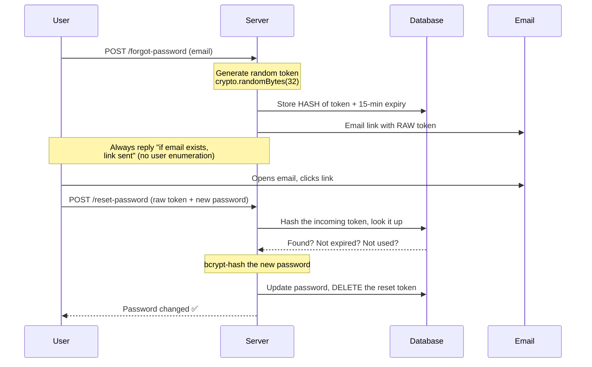

# 🔐 Password Security — Complete Study Notes

> Notes for becoming a strong software engineer. Easy language, real code, and interview-ready explanations.
> 👉 Third in the auth series — JWT (the token) → Access/Refresh (the strategy) → **Password Security (the foundation)**.

---

## 📌 1. Never Store Plaintext Passwords (the #1 rule)

If you save passwords as plain text and your database leaks, **every user's password is instantly exposed**. Worse — people reuse passwords, so you also leak their email, bank, and everything else.

The golden rule:

> **A server should never know the user's actual password.** It should only store a one-way **hash** of it.

A **hash** is a one-way function:
- You can go password → hash easily.
- You **cannot** go hash → password (no reverse button).

So even if the DB leaks, attackers get hashes, not passwords. ✅

> 🎯 Interview line: *"We store a one-way hash, not the password itself. Even our own system cannot recover the original password — we can only verify it."*

---

## ❌ 2. Why MD5 and SHA1 are WRONG

MD5 and SHA1 *are* hashes — so why are they wrong for passwords?

**Because they are too FAST.** ⚡

They were designed to hash files quickly. But for passwords, speed is the enemy:
- A modern **GPU** can compute **billions** of MD5/SHA1 hashes per second.
- Attackers pre-compute huge tables of `hash → password` called **rainbow tables**.
- They just look up your leaked hash in the table → password found in seconds. 😱

Two killer weaknesses:

| Problem | Why it's bad |
|---|---|
| **Too fast** | Billions of guesses/sec on a GPU = brute force is easy |
| **No salt by default** | Same password → same hash, so rainbow tables work |

> Remember: *"Fast hashing is good for files, terrible for passwords."*

---

## ✅ 3. Why bcrypt is RIGHT

`bcrypt` is built specifically for passwords. It fixes everything MD5/SHA1 got wrong:

| Feature | What it does |
|---|---|
| **Deliberately slow** | Takes ~100–300ms per hash on purpose → brute force becomes painfully slow |
| **Built-in salt** | Adds random data to each password → same password gives different hashes → rainbow tables useless |
| **Configurable cost factor** | You can make it *slower over time* as computers get faster |

The beautiful part: a bcrypt hash **stores the salt and cost factor inside itself**. You don't manage them separately.

```
$2b$12$N9qo8uLOickgx2ZMRZoMye   IjZAgcfl7p92ldGxad68LJZdL17lhWy
│  │  │  └──────────┬─────────┘   └────────────┬──────────────┘
│  │  │          salt (22 chars)          actual hash
│  │  └─ cost factor = 12
│  └──── bcrypt version (2b)
└─────── algorithm identifier
```

> Other good modern choices: **argon2** (winner of the Password Hashing Competition, even stronger) and **scrypt**. But bcrypt is still the most common and a safe answer in interviews.

---

## 🔢 4. Cost Factor (work factor)

The cost factor controls **how slow** bcrypt is. In **2026, use 10–12**.

The key fact to memorise:

> **Every +1 to the cost factor DOUBLES the work.** It is exponential — `2^cost` iterations.

So:
- cost 10 → 1,024 rounds
- cost 11 → 2,048 rounds (2× slower)
- cost 12 → 4,096 rounds (4× slower than 10)

**Why this matters:** as hardware gets faster every year, you simply **bump the cost factor up by 1** to keep attackers slow — without changing any code logic.

> 🎯 Interview line: *"The cost factor is exponential — each increment doubles the hashing time. We tune it so a single hash takes around 250ms, which is invisible to a real user but devastating for a brute-force attacker."*

**Sweet spot:** pick the highest cost where a login still feels instant (~250ms). Too high (e.g. 15+) and your own login endpoint becomes slow and easy to DoS.

---

## ⏱️ 5. Timing-Safe Comparison (a subtle but classic question)

When comparing secret tokens (like password reset tokens), **never use `===`**.

**Why?** Normal string comparison (`===`) stops at the **first character that doesn't match**. That tiny time difference leaks information.

An attacker measuring response times can guess a secret **character by character** — this is a **timing attack**.

```js
"abcde" === "axxxx"  // fails fast at char 2 → quicker
"abcde" === "abcdx"  // fails late at char 5 → slower
```

The fix → use a **constant-time comparison** that always takes the same time, no matter where the mismatch is:

```js
const crypto = require('crypto');

function safeCompare(a, b) {
  const bufA = Buffer.from(a);
  const bufB = Buffer.from(b);
  // Must be equal length, else timingSafeEqual throws
  if (bufA.length !== bufB.length) return false;
  return crypto.timingSafeEqual(bufA, bufB);
}
```

> 📝 Note: for **passwords specifically**, you use `bcrypt.compare()`, which is *already* timing-safe internally. `crypto.timingSafeEqual` matters most when you compare **reset tokens, API keys, or HMAC signatures** yourself.

> 🎯 Interview line: *"`===` short-circuits on the first mismatch, leaking timing information. For comparing secrets I use `crypto.timingSafeEqual` to prevent timing attacks."*

---

## 🔄 6. The Password Reset Flow (with diagram)

This flow has many security traps. Getting it right shows real maturity.



**The 6 critical steps:**

1. **Generate a cryptographically random token** → `crypto.randomBytes(32)`. Never use `Math.random()` (predictable!).
2. **Store the HASH of the token**, not the raw token. (If the DB leaks, attackers still can't reset accounts — same logic as passwords.)
3. **Set a short expiry** → 15 minutes. A reset link should not live forever.
4. **Email the RAW token** in the link. The user holds the only copy of the raw token.
5. **Verify on click** → hash the incoming token, look it up, check expiry + not-already-used.
6. **Invalidate the token** immediately after a successful reset (single-use).

> 🔒 **Anti-enumeration:** always respond with the same "If that email exists, we've sent a link" message — whether or not the email exists. Otherwise attackers can discover which emails are registered.

---

## 💻 7. Complete Code Example (Node.js + Express)

```js
// auth-password.js
const express = require('express');
const bcrypt = require('bcrypt');
const crypto = require('crypto');

const app = express();
app.use(express.json());

const COST_FACTOR = 12;              // 2026 sweet spot
const RESET_EXPIRY_MS = 15 * 60 * 1000; // 15 minutes

const users = [];        // fake DB
const resetTokens = [];  // fake DB: { userId, tokenHash, expiresAt }

// Hash a token with SHA256 (fast hash is fine here — token is already
// high-entropy & random, so brute force is not the threat)
function hashToken(token) {
  return crypto.createHash('sha256').update(token).digest('hex');
}

// ---------- 1. REGISTER (bcrypt hashing) ----------
app.post('/register', async (req, res) => {
  const { email, password } = req.body;

  if (users.find((u) => u.email === email)) {
    return res.status(409).json({ error: 'Email already in use' });
  }

  // bcrypt auto-generates a salt and embeds it in the hash
  const passwordHash = await bcrypt.hash(password, COST_FACTOR);

  users.push({ id: crypto.randomUUID(), email, passwordHash });
  res.status(201).json({ message: 'Registered successfully' });
});

// ---------- 2. LOGIN (bcrypt.compare is timing-safe) ----------
app.post('/login', async (req, res) => {
  const { email, password } = req.body;
  const user = users.find((u) => u.email === email);

  // bcrypt.compare handles the salt + does a constant-time check
  const ok = user && (await bcrypt.compare(password, user.passwordHash));
  if (!ok) {
    // Same generic message → don't reveal if email exists
    return res.status(401).json({ error: 'Invalid email or password' });
  }
  res.json({ message: 'Logged in' });
});

// ---------- 3. FORGOT PASSWORD (generate + store hashed token) ----------
app.post('/forgot-password', async (req, res) => {
  const { email } = req.body;
  const user = users.find((u) => u.email === email);

  if (user) {
    // 32 random bytes = 256 bits of entropy → impossible to guess
    const rawToken = crypto.randomBytes(32).toString('hex');

    resetTokens.push({
      userId: user.id,
      tokenHash: hashToken(rawToken), // store HASH, not raw token
      expiresAt: Date.now() + RESET_EXPIRY_MS,
    });

    // In real life: send email. Here we just log the link.
    const link = `https://myapp.com/reset?token=${rawToken}`;
    console.log('Reset link (email this):', link);
  }

  // Always the same response → prevents user enumeration
  res.json({ message: 'If that email exists, a reset link has been sent.' });
});

// ---------- 4. RESET PASSWORD (verify + update + invalidate) ----------
app.post('/reset-password', async (req, res) => {
  const { token, newPassword } = req.body;
  const incomingHash = hashToken(token);

  // Find a matching, non-expired token
  const idx = resetTokens.findIndex(
    (t) => t.tokenHash === incomingHash && t.expiresAt > Date.now()
  );

  if (idx === -1) {
    return res.status(400).json({ error: 'Invalid or expired reset token' });
  }

  const record = resetTokens[idx];
  const user = users.find((u) => u.id === record.userId);

  // Hash the NEW password
  user.passwordHash = await bcrypt.hash(newPassword, COST_FACTOR);

  // Invalidate the token → single use only
  resetTokens.splice(idx, 1);

  res.json({ message: 'Password reset successful' });
});

app.listen(3000, () => console.log('Server on http://localhost:3000'));
```

### Test it

```bash
# Register
curl -X POST localhost:3000/register -H "Content-Type: application/json" \
  -d '{"email":"a@b.com","password":"oldpass123"}'

# Login
curl -X POST localhost:3000/login -H "Content-Type: application/json" \
  -d '{"email":"a@b.com","password":"oldpass123"}'

# Forgot password → check server console for the reset link/token
curl -X POST localhost:3000/forgot-password -H "Content-Type: application/json" \
  -d '{"email":"a@b.com"}'

# Reset password using that token
curl -X POST localhost:3000/reset-password -H "Content-Type: application/json" \
  -d '{"token":"<TOKEN_FROM_CONSOLE>","newPassword":"newpass456"}'
```

> 💡 Note the asymmetry: **passwords use bcrypt** (slow, because users pick weak passwords), but **reset tokens use SHA256** (fast is fine, because the token is already 256 random bits — there's nothing to brute-force).

---

## 🎤 8. How to Explain in an Interview

**Step 1 — Never plaintext:**
> "We never store plaintext passwords. We store a one-way hash, so even a DB leak doesn't expose passwords."

**Step 2 — Why not MD5/SHA1:**
> "MD5 and SHA1 are too fast — a GPU can compute billions of guesses per second, making rainbow-table and brute-force attacks easy. They also lack salting by default."

**Step 3 — Why bcrypt:**
> "bcrypt is deliberately slow, has built-in per-password salting, and a configurable cost factor we can raise over time as hardware improves."

**Step 4 — Cost factor:**
> "Each +1 to the cost factor doubles the work. We tune it so one hash takes ~250ms — fine for a user, brutal for an attacker."

**Step 5 — Timing safety:**
> "For comparing secrets like reset tokens I use `crypto.timingSafeEqual` instead of `===`, to avoid leaking timing information."

**Step 6 — Reset flow:**
> "On reset I generate a random token, store only its hash with a 15-minute expiry, email the raw token, verify on click, then invalidate it after use. And I keep responses generic to prevent user enumeration."

> 🟢 Trap question: *"Why store a hash of the reset token too?"* → *"Same reason as passwords — if the DB leaks, an attacker shouldn't be able to take over accounts using stored reset tokens."*

---

## 💎 9. Impressive Words & Phrases

| Instead of saying... | Say this 💪 |
|---|---|
| "Scramble the password" | "Apply a **one-way cryptographic hash**" |
| "MD5 is bad" | "MD5 is **computationally cheap**, enabling **GPU-accelerated brute force**" |
| "bcrypt is slow on purpose" | "bcrypt is an **adaptive, deliberately expensive** hash" |
| "Add random data" | "**Per-password salting** to defeat **rainbow tables**" |
| "Make it slower later" | "Increase the **work/cost factor** as hardware improves" |
| "Don't use ===" | "Use **constant-time comparison** to prevent **timing attacks**" |
| "Random token" | "**Cryptographically secure random token** (256 bits of **entropy**)" |
| "Don't reveal if email exists" | "Prevent **user enumeration**" |
| "Token works once" | "**Single-use**, with **short TTL**" |

**Power vocabulary:** *one-way hash, adaptive hashing, work/cost factor, per-password salt, rainbow table, GPU-accelerated brute force, timing attack, constant-time comparison, cryptographic entropy, user enumeration, single-use token, peppering.*

> 🌶️ Bonus term — **peppering**: a *secret* added to all passwords before hashing, stored separately from the DB (e.g. in an env var/HSM). Salt is per-user and in the DB; pepper is global and outside the DB. Mentioning this is a real flex.

---

## ⏱️ 10. Quick Revision (read 5 min before interview)

> **Never store plaintext** → store a one-way hash.
>
> **MD5/SHA1 = WRONG** → too fast (GPU brute force, rainbow tables), no salt.
>
> **bcrypt = RIGHT** → deliberately slow + built-in salt + configurable cost factor. Salt & cost are stored *inside* the hash string.
>
> **Cost factor** → 10–12 in 2026. **+1 doubles the work** (exponential, `2^cost`). Tune to ~250ms.
>
> **Comparison** → never `===` (timing leak). Use `bcrypt.compare()` for passwords, `crypto.timingSafeEqual` for tokens.
>
> **Reset flow:** random token (`randomBytes(32)`) → store **hash** of token + 15-min expiry → email **raw** token → verify on click → reset → **invalidate** (single-use). Keep responses generic (**no user enumeration**).
>
> **Golden line:** *"Fast hashing is good for files but terrible for passwords — bcrypt is slow on purpose."*

---

### ✅ Practice checklist
- [ ] Register endpoint with `bcrypt.hash(password, 12)`
- [ ] Login with `bcrypt.compare()` (note: it's already timing-safe)
- [ ] Generate reset tokens with `crypto.randomBytes(32).toString('hex')`
- [ ] Store the **hash** of the reset token, not the raw token
- [ ] Add a 15-minute expiry and single-use invalidation
- [ ] Return a generic message to prevent user enumeration
- [ ] Try `crypto.timingSafeEqual` for comparing a token manually

Nail this and you've covered the entire authentication foundation — token format, token strategy, and password storage. 🚀
