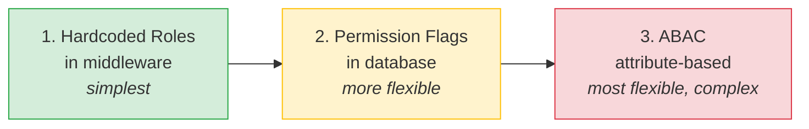

# 🛡️ Role-Based Access Control (RBAC) — Complete Study Notes

> Notes for becoming a strong software engineer. Easy language, real code, and interview-ready explanations.
> 👉 Fourth in the auth series — JWT → Access/Refresh → Password Security → **RBAC (controlling *what* a user can do)**.

---

## 📌 1. Authentication vs Authorization (don't mix these up!)

This is the most common confusion in interviews. Learn it cold.

| | **Authentication (AuthN)** | **Authorization (AuthZ)** |
|---|---|---|
| Question | **Who are you?** | **What are you allowed to do?** |
| Example | Logging in with email + password | "Can this user delete this post?" |
| Comes... | **First** | **After** authentication |
| Tools | JWT, password, OTP | Roles, permissions, ownership checks |

Simple analogy — an **airport** ✈️:
- **Authentication** = showing your passport at check-in. *"Yes, you are Nayan."*
- **Authorization** = your boarding pass says **Economy**. *"You can sit in seat 34B, but NOT in the business-class lounge."*

> 🎯 Interview line: *"Authentication confirms identity; authorization decides what that identity is permitted to do. You authenticate first, then authorize on each protected action."*

---

## 🎭 2. Roles vs Permissions

These two words are often used loosely, but they are different **levels of granularity**.

### Roles → coarse-grained (broad labels)
A role is a **job title**. It groups many abilities under one name.
- `admin`, `user`, `moderator`, `editor`

### Permissions → fine-grained (specific abilities)
A permission is a **single action** a user can perform.
- `can_delete_post`, `can_edit_user`, `can_publish_article`, `can_ban_user`

### How they connect
A **role is just a bundle of permissions**:

```
Role: moderator
  ├── can_delete_post
  ├── can_ban_user
  └── can_hide_comment

Role: user
  └── can_create_post
```

> 🎯 Interview line: *"Roles are coarse groupings, permissions are fine-grained capabilities. We assign permissions to roles, and roles to users — so we manage access at the role level but enforce it at the permission level."*

---

## 🏗️ 3. RBAC Patterns (from simplest to most flexible)

There are three levels. Knowing **when to use which** is the senior skill.



### Pattern 1 — Hardcoded roles in middleware (simplest)
You read the `role` from the JWT and check it in code.
```js
requireRole('admin')
```
- ✅ Dead simple, no DB lookup, great for small apps.
- ❌ Adding a new role/permission means a **code change + redeploy**.

### Pattern 2 — Permission flags in DB (more flexible)
Store roles → permissions in the database. Check permissions instead of role names.
```js
requirePermission('can_delete_post')
```
- ✅ Admins can change who-can-do-what **without redeploying**.
- ❌ Needs DB design + usually a lookup (often cached).

### Pattern 3 — ABAC: Attribute-Based Access Control (most flexible, complex)
Decisions use **attributes** of the user, resource, and context — not just roles.
> Example rule: *"A manager can approve an expense **only if** it's under ₹50,000 **and** belongs to **their own** department **and** it's a working day."*
- ✅ Extremely powerful and granular.
- ❌ Complex to build, test, and reason about. Overkill for most apps.

> 🎯 Senior take: *"Start with role-based checks. Move to DB-driven permissions when business rules change often. Reach for ABAC only when access depends on many dynamic attributes — it's powerful but expensive to maintain."*

---

## 🔑 4. Resource Ownership Checks (the part people forget!)

Roles alone are **not enough**. Consider:

> `DELETE /posts/:id` — an **admin** can delete *any* post, but a normal **user** should only delete **their own** post.

A role check (`requireRole('user')`) would let *any* logged-in user delete *anyone's* post — a serious security hole. 🚨

The fix → **ownership check**: fetch the resource, then compare `resource.ownerId` with the logged-in `user.id`.

```
Allow if:  user is admin   OR   user.id === post.authorId
```

This is why ownership checks usually run **after** the role check and **require a DB fetch** — you can't know who owns the post without looking it up.

> 🎯 Interview line: *"Role checks answer 'what type of user is this?', but many actions also need an ownership check — 'does this specific user own this specific resource?'. That requires fetching the resource first."*

This bug class has a name: **IDOR — Insecure Direct Object Reference** (changing `/posts/5` to `/posts/6` to touch someone else's data). Ownership checks are how you prevent it. ⭐

---

## 💻 5. Complete Code Example (Node.js + Express)

A real setup: `requireAuth` → `requireRole` → `requireOwnership`, applied to a posts API.

```js
// rbac.js
const express = require('express');
const jwt = require('jsonwebtoken');

const app = express();
app.use(express.json());

const ACCESS_SECRET = process.env.ACCESS_SECRET || 'access-secret';

// Fake DB
const posts = [
  { id: '1', authorId: 'user-A', title: 'Hello from A' },
  { id: '2', authorId: 'user-B', title: 'Hello from B' },
];

// ---------- AUTHENTICATION: who are you? ----------
function requireAuth(req, res, next) {
  const header = req.headers.authorization || '';
  const token = header.startsWith('Bearer ') ? header.slice(7) : null;
  if (!token) return res.status(401).json({ error: 'Not authenticated' });

  try {
    // payload looks like: { sub: 'user-A', role: 'user' }
    req.user = jwt.verify(token, ACCESS_SECRET);
    next();
  } catch {
    return res.status(401).json({ error: 'Invalid or expired token' });
  }
}

// ---------- AUTHORIZATION (role): what type are you? ----------
// Accepts one or more allowed roles → requireRole('admin', 'moderator')
function requireRole(...allowedRoles) {
  return (req, res, next) => {
    if (!allowedRoles.includes(req.user.role)) {
      // 403 = authenticated but NOT allowed (vs 401 = not logged in)
      return res.status(403).json({ error: 'Forbidden: insufficient role' });
    }
    next();
  };
}

// ---------- AUTHORIZATION (ownership): do YOU own THIS? ----------
// admins bypass ownership; everyone else must own the resource
function requireOwnership(req, res, next) {
  const post = posts.find((p) => p.id === req.params.id);
  if (!post) return res.status(404).json({ error: 'Post not found' });

  const isOwner = post.authorId === req.user.sub;
  const isAdmin = req.user.role === 'admin';

  if (!isOwner && !isAdmin) {
    return res.status(403).json({ error: 'Forbidden: not the owner' });
  }

  req.post = post; // pass the fetched resource along (avoid a second lookup)
  next();
}

// ---------- ROUTES ----------

// Anyone logged in can read
app.get('/posts/:id', requireAuth, (req, res) => {
  const post = posts.find((p) => p.id === req.params.id);
  if (!post) return res.status(404).json({ error: 'Not found' });
  res.json(post);
});

// Admin OR owner can delete → chain auth + ownership
app.delete('/posts/:id', requireAuth, requireOwnership, (req, res) => {
  const idx = posts.findIndex((p) => p.id === req.params.id);
  posts.splice(idx, 1);
  res.json({ message: `Post ${req.params.id} deleted` });
});

// Admin-only route → pure role check, no ownership needed
app.get('/admin/dashboard', requireAuth, requireRole('admin'), (req, res) => {
  res.json({ message: 'Welcome to the admin dashboard' });
});

app.listen(3000, () => console.log('RBAC server on http://localhost:3000'));
```

### Bonus — Permission-based version (Pattern 2)

When you outgrow hardcoded roles, switch to permission checks:

```js
// A role → permissions map (in real life: from DB, cached in Redis)
const rolePermissions = {
  admin:     ['can_delete_post', 'can_edit_user', 'can_ban_user'],
  moderator: ['can_delete_post', 'can_ban_user'],
  user:      ['can_create_post'],
};

function requirePermission(permission) {
  return (req, res, next) => {
    const perms = rolePermissions[req.user.role] || [];
    if (!perms.includes(permission)) {
      return res.status(403).json({ error: `Forbidden: needs ${permission}` });
    }
    next();
  };
}

// Usage — route no longer cares about role names, only the capability
app.delete('/posts/:id',
  requireAuth,
  requirePermission('can_delete_post'),
  requireOwnership,
  (req, res) => { /* ... */ }
);
```

> 💡 The order of middleware matters: **authenticate → check role/permission → check ownership → run the handler.** Cheapest checks first, DB-touching checks last.

---

## 🚦 6. 401 vs 403 (a small detail that impresses)

| Code | Meaning | When |
|---|---|---|
| **401 Unauthorized** | "I don't know who you are" | Missing / invalid / expired token |
| **403 Forbidden** | "I know who you are, but you can't do this" | Valid login, but wrong role / not owner |

> Funny naming trap: HTTP **401 is named "Unauthorized" but actually means *unauthenticated*.** **403 Forbidden** is the real *authorization* failure. Knowing this distinction is a nice signal in interviews.

---

## 🎤 7. How to Explain in an Interview

**Step 1 — The distinction:**
> "Authentication verifies identity; authorization decides permissions. They're separate layers — you authenticate once, then authorize on every protected action."

**Step 2 — Roles vs permissions:**
> "Roles are coarse labels like admin or user. Permissions are fine-grained capabilities like can_delete_post. We bundle permissions into roles for easy management."

**Step 3 — The patterns:**
> "The simplest approach is hardcoded role checks in middleware. When rules change often, we move permissions into the database. For highly dynamic, context-dependent rules we'd use ABAC, but that's complex so we only use it when needed."

**Step 4 — Ownership (the key insight):**
> "Role checks aren't always enough. For something like deleting a post, an admin can delete any post but a user only their own — so I add an ownership check that fetches the resource and compares the owner ID. This prevents IDOR vulnerabilities."

**Step 5 — Status codes:**
> "I return 401 when the user isn't authenticated, and 403 when they're authenticated but not allowed."

> 🟢 Trap question: *"Why not just trust the role in the JWT for everything?"* → *"Because the role tells you the *type* of user, not whether they own a *specific* resource. Ownership is per-resource and must be checked against the database at request time."*

---

## 💎 8. Impressive Words & Phrases

| Instead of saying... | Say this 💪 |
|---|---|
| "Check login" | "Verify **authentication**" |
| "Check what they can do" | "Enforce **authorization**" |
| "Broad role" | "**Coarse-grained** role" |
| "Specific permission" | "**Fine-grained** permission / capability" |
| "Check if they own it" | "Perform a **resource ownership check**" |
| "URL-tampering bug" | "**IDOR** — Insecure Direct Object Reference" |
| "Give minimum access" | "Apply the **principle of least privilege**" |
| "Flexible rule system" | "**Attribute-based access control (ABAC)**" |
| "Stack of checks" | "A **middleware chain** / **authorization pipeline**" |
| "Admin can do anything" | "**Privilege escalation** must be prevented" |

**Power vocabulary:** *authentication vs authorization, coarse vs fine-grained, principle of least privilege, RBAC, ABAC, resource ownership, IDOR, privilege escalation, middleware chain, policy enforcement point, separation of concerns.*

> 🌶️ Bonus flex — **Principle of Least Privilege (PoLP):** *"Every user and process should get the minimum access needed to do its job, nothing more."* Drop this phrase and you instantly sound security-aware.

---

## ⏱️ 9. Quick Revision (read 5 min before interview)

> **AuthN vs AuthZ:** Authentication = *who are you* (login). Authorization = *what can you do* (roles/permissions). AuthN first, AuthZ on every action.
>
> **Roles vs Permissions:** Roles = coarse (admin, user). Permissions = fine-grained (can_delete_post). A role = a bundle of permissions.
>
> **3 patterns:** (1) Hardcoded roles in middleware = simplest. (2) Permission flags in DB = flexible, no redeploy. (3) ABAC = attribute-based, most flexible, most complex.
>
> **Ownership check:** roles aren't enough. Admin deletes any post; user deletes only their own → fetch the resource, compare owner ID. Prevents **IDOR**.
>
> **Middleware order:** authenticate → role/permission → ownership → handler.
>
> **401** = not authenticated. **403** = authenticated but forbidden.
>
> **Golden line:** *"Roles tell you the type of user; ownership tells you if they control this specific resource — you usually need both."*

---

### ✅ Practice checklist
- [ ] Build `requireAuth` that reads the role from the JWT payload
- [ ] Build `requireRole('admin')` returning 403 on mismatch
- [ ] Build `requireOwnership` that fetches the post and compares `authorId` to `user.sub`
- [ ] Let admins bypass the ownership check
- [ ] Apply both to `DELETE /posts/:id` in the right order
- [ ] Add an admin-only route using just `requireRole`
- [ ] (Stretch) Refactor to a `requirePermission('can_delete_post')` map

That's the full picture: **AuthN proves identity, AuthZ controls actions, and ownership protects individual resources.** You now have the complete authentication + authorization foundation. 🚀
