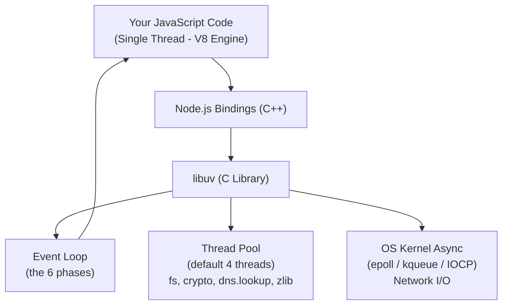
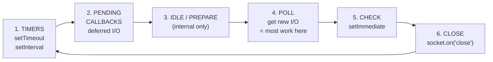
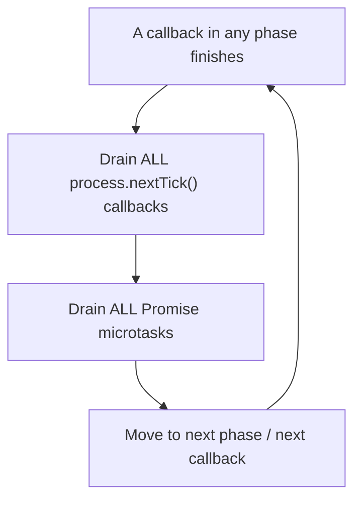

# Node.js Event Loop — Deep Notes 🧠

> Most developers say *"Node is non-blocking and async"* without knowing **why**.
> These notes explain the **why** — with code, diagrams, interview answers, and quick revision tips.

---

## 📑 Table of Contents

1. [The Big Picture (Single Thread vs libuv)](#1-the-big-picture)
2. [The 6 Phases of the Event Loop](#2-the-6-phases-of-the-event-loop)
3. [process.nextTick() and Promise Microtasks](#3-processnexttick-and-promise-microtasks)
4. [The Thread Pool (libuv)](#4-the-thread-pool-libuv)
5. [Why CPU Work Blocks + Worker Threads](#5-why-cpu-work-blocks-the-loop)
6. [The Classic Output Question](#6-the-classic-output-question)
7. [Practical Exercises](#7-practical-exercises)
8. [How to Explain in Interview](#8-how-to-explain-in-interview)
9. [Impressive Words to Use](#9-impressive-words-to-use)
10. [Quick Revision (Last 5 Minutes Before Interview)](#10-quick-revision)

---

## 1. The Big Picture

People think Node is "multi-threaded magic". Real story is simple:

- **Your JavaScript runs on ONE thread** (the V8 engine, single-threaded).
- But **Node is not just V8**. Under it sits **libuv** — a C library that gives Node the **event loop** and a **thread pool**.
- So *JavaScript* is single-threaded, but *Node as a whole* uses multiple threads behind the scene.

Think of it like a **restaurant**:
- **One waiter** (JS main thread) takes all the orders. He never sits and waits.
- **Kitchen staff** (libuv thread pool + OS) cook the food in background.
- When food is ready, waiter (event loop) picks it up and serves. Waiter is always free to take new orders.

This is what "non-blocking" means — the **waiter never blocks** waiting for one dish.



**Key line for interview:**
> "JavaScript execution is single-threaded, but Node delegates heavy work to libuv, which uses a thread pool and the OS kernel. So the main thread stays free — that is the source of non-blocking behaviour."

---

## 2. The 6 Phases of the Event Loop

The event loop runs in a **fixed order of 6 phases**, again and again (one full round = one "tick" / iteration). Each phase has its **own queue (FIFO)** of callbacks.



| # | Phase | What runs here |
|---|-------|----------------|
| 1 | **Timers** | Callbacks of `setTimeout` and `setInterval` whose time is done |
| 2 | **Pending Callbacks** | Some I/O callbacks deferred from previous loop (e.g. TCP errors) |
| 3 | **Idle / Prepare** | Internal use only — you never touch this |
| 4 | **Poll** | ⭐ Heart of the loop. Gets new I/O events and runs their callbacks. **Loop can sleep/wait here** if nothing else to do |
| 5 | **Check** | `setImmediate()` callbacks run here |
| 6 | **Close** | Close events, e.g. `socket.on('close', ...)` |

**Important about the Poll phase** (favourite interview trap):
- If poll queue has callbacks → run them.
- If poll queue is empty:
  - If `setImmediate()` is scheduled → loop jumps to **Check** phase.
  - Otherwise → loop **waits here** for new I/O (this is the "blocking sleep" that costs zero CPU).

**Key line for interview:**
> "The poll phase is where most I/O callbacks execute, and it is also where the loop blocks efficiently when idle — waiting on the OS instead of busy-spinning."

---

## 3. process.nextTick() and Promise Microtasks

This is the part that separates **average** from **strong** candidates.

`process.nextTick()` and Promise callbacks (`.then` / `.catch` / `.finally`, and `await`) are **NOT part of the 6 phases**. They live in **microtask queues** that run **between every phase** — and also **after every single callback**.

**Order of priority (very important):**

1. Current operation finishes
2. **`process.nextTick()` queue** drains *completely* (highest priority)
3. **Promise microtask queue** drains *completely*
4. *Then* the loop moves to the next phase



⚠️ **Danger:** Because `nextTick` drains *fully* before anything else, an infinite or recursive `nextTick` can **starve** the event loop — I/O will never get a chance to run. Same risk with recursive promises, but `nextTick` is worse because it has top priority.

**Key line for interview:**
> "`process.nextTick` and Promise microtasks run between phases, not inside them. `nextTick` has higher priority than promises. Both queues are emptied fully before the loop continues — which is powerful but can starve I/O if misused."

---

## 4. The Thread Pool (libuv)

libuv keeps a **thread pool** for operations that **cannot be done async by the OS**.

- **Default size = 4 threads.**
- Change it with the env variable: `UV_THREADPOOL_SIZE` (max 1024).
- Used by:
  - **`fs.*`** — file system operations
  - **`crypto`** — e.g. `pbkdf2`, `randomBytes`, `scrypt`
  - **`dns.lookup()`** (but **NOT** `dns.resolve()`)
  - **`zlib`** — compression

**Very common myth to correct in interview:**
> "All async work uses the thread pool." ❌ **Wrong.**
> **Network I/O (TCP/HTTP sockets) does NOT use the thread pool.** It uses the OS kernel's async features — `epoll` (Linux), `kqueue` (macOS), `IOCP` (Windows). Only the things listed above use the pool.

So if you fire 5 file reads with a default pool of 4, the 5th read **waits in queue** until a thread is free. This is a real performance gotcha.

```bash
# Increase thread pool size
UV_THREADPOOL_SIZE=8 node app.js
```

---

## 5. Why CPU Work Blocks the Loop

The event loop is amazing for **I/O-bound** work (DB calls, file reads, network). It is **terrible** for **CPU-bound** work (big loops, image processing, heavy crypto, big JSON parsing).

**Reason:** JavaScript runs on **one thread**. If you run a heavy `for` loop or a sync function, that one thread is **busy** — it cannot pick up any other callback. The waiter is stuck cooking, so no new orders are taken. Everything freezes.

```js
// ❌ This BLOCKS the whole server for a few seconds
const crypto = require("crypto");

console.log("start");
crypto.pbkdf2Sync("password", "salt", 1_000_000, 64, "sha512"); // SYNC = blocks
console.log("end"); // nothing else runs until this finishes
```

```js
// ✅ This does NOT block — it uses the thread pool
const crypto = require("crypto");

console.log("start");
crypto.pbkdf2("password", "salt", 1_000_000, 64, "sha512", (err, key) => {
  console.log("crypto done"); // runs later, main thread stayed free
});
console.log("end"); // prints immediately
```

### Solution: Worker Threads

For **real CPU-heavy work**, use the `worker_threads` module. It runs JavaScript on a **separate thread**, so the main event loop stays free.

```js
const { Worker } = require("worker_threads");

const worker = new Worker(`
  const { parentPort } = require('worker_threads');
  let sum = 0;
  for (let i = 0; i < 1e9; i++) sum += i;   // heavy CPU work
  parentPort.postMessage(sum);
`, { eval: true });

worker.on("message", (result) => console.log("Result:", result));
console.log("Main thread is still free 🎉");
```

**Rule of thumb:**
- **I/O-bound** → event loop (default Node) is perfect.
- **CPU-bound** → use Worker Threads (or offload to another service).

---

## 6. The Classic Output Question

```js
console.log("1");
setTimeout(() => console.log("2"), 0);
setImmediate(() => console.log("3"));
process.nextTick(() => console.log("4"));
Promise.resolve().then(() => console.log("5"));
console.log("6");
```

### Step-by-step reasoning

1. **Synchronous code runs first**, top to bottom → prints `1`, then `6`.
   (The `setTimeout`, `setImmediate`, `nextTick`, `Promise` only *schedule* callbacks; they don't run yet.)
2. **Sync stack empty → drain microtasks.**
   - `process.nextTick` first → `4`
   - Then Promise microtask → `5`
3. **Now the event loop phases run.**
   - Timers phase → `setTimeout` → `2`
   - Check phase → `setImmediate` → `3`

### Output

```
1
6
4
5
2
3   ← (see note below)
```

⚠️ **Interview gold:** When `setTimeout(0)` and `setImmediate` are called from the **main module** (top level), their order is **NOT guaranteed**. It depends on process timing. So the last two lines can be `2, 3` **or** `3, 2`.

**BUT** — if both are called **inside an I/O callback** (e.g. inside `fs.readFile`), `setImmediate` **always** runs before `setTimeout`. That is deterministic.

```js
const fs = require("fs");
fs.readFile(__filename, () => {
  setTimeout(() => console.log("timeout"), 0);
  setImmediate(() => console.log("immediate"));
});
// Inside I/O callback → ALWAYS prints: immediate, then timeout
```

Saying this nuance in interview = instant respect. Most people miss it.

---

## 7. Practical Exercises

Do these by hand first (predict output), **then** run and check.

### Exercise A — Microtask vs Macrotask
```js
setTimeout(() => console.log("timeout"), 0);
Promise.resolve().then(() => console.log("promise"));
process.nextTick(() => console.log("nextTick"));
console.log("sync");

// Predict, then run.
// Answer: sync → nextTick → promise → timeout
```

### Exercise B — nextTick beats Promise
```js
Promise.resolve().then(() => console.log("promise 1"));
process.nextTick(() => console.log("tick 1"));
Promise.resolve().then(() => console.log("promise 2"));
process.nextTick(() => console.log("tick 2"));

// Answer: tick 1 → tick 2 → promise 1 → promise 2
// (all nextTicks drain first, then all promises)
```

### Exercise C — See the thread pool waiting
```js
const crypto = require("crypto");
const start = Date.now();

for (let i = 0; i < 6; i++) {
  crypto.pbkdf2("pwd", "salt", 100000, 64, "sha512", () => {
    console.log(`Task ${i + 1} done in ${Date.now() - start}ms`);
  });
}
// With default pool size 4: first 4 finish together,
// tasks 5 & 6 finish ~2x later (they waited for a free thread).
// Try again with UV_THREADPOOL_SIZE=8 and see all 6 finish together.
```

### Exercise D — Visual debugging
```bash
node --inspect your-file.js
```
Then open **Chrome → `chrome://inspect` → "Open dedicated DevTools for Node"**.
Use the **Performance / Profiler** tab to see call stacks and where time is spent.

---

## 8. How to Explain in Interview

Use this **layered** approach — start simple, go deeper if they probe. Interviewers love this structure.

**Level 1 (one line):**
> "Node uses a single-threaded event loop to handle many connections without creating a thread per request. Heavy work is offloaded to libuv's thread pool or the OS, so the main thread never blocks."

**Level 2 (the loop):**
> "The event loop has 6 phases — timers, pending callbacks, idle/prepare, poll, check, and close — and it cycles through them. Each phase has its own callback queue. The poll phase does most of the I/O work."

**Level 3 (microtasks):**
> "Between every phase, two microtask queues drain completely — first `process.nextTick`, then Promises. They have higher priority than the phase callbacks, which is why a promise resolves before a `setTimeout`."

**Level 4 (the gotcha):**
> "CPU-heavy work blocks the loop because JS is single-threaded. For that, Node gives us worker threads. Also, `setTimeout(0)` vs `setImmediate` ordering is non-deterministic at top level but deterministic inside an I/O callback."

**Pro tip:** Always tie it to a **real problem**:
> "In production, I avoid sync functions like `fs.readFileSync` or `pbkdf2Sync` in request handlers, because one blocking call freezes all concurrent requests."

---

## 9. Impressive Words

Sprinkle these naturally — they signal depth (but only use words you can explain!):

| Word / Phrase | Use it like this |
|---------------|------------------|
| **Non-blocking I/O** | "Node achieves concurrency through non-blocking I/O." |
| **Concurrency vs Parallelism** | "Node gives concurrency on one thread, not true parallelism." |
| **Offload / Delegate** | "It offloads file ops to the libuv thread pool." |
| **Starvation** | "Recursive `nextTick` can cause event loop starvation." |
| **Macrotask vs Microtask** | "Promises are microtasks; timers are macrotasks." |
| **Deterministic ordering** | "Inside I/O callbacks the ordering becomes deterministic." |
| **Backpressure** | "Streams handle backpressure to avoid overwhelming memory." |
| **CPU-bound vs I/O-bound** | "The event loop shines for I/O-bound, struggles with CPU-bound." |
| **Kernel-level async (epoll/kqueue/IOCP)** | "Network I/O uses kernel async, not the thread pool." |
| **Tick / iteration** | "One full pass of the loop is called a tick." |
| **Single point of failure** | "A blocking call becomes a single point of failure for throughput." |

---

## 10. Quick Revision

*(Read this in the last 5 minutes before the interview.)*

- 🧵 **JS = single thread. Node = multi-thread** (via libuv).
- 🔁 **6 phases in order:** Timers → Pending → Idle/Prepare → **Poll** → Check → Close.
  - Memory trick: **T**iny **P**andas **I**n **P**oland **C**hew **C**arrots.
- ⭐ **Poll** = most I/O work + where loop sleeps when idle.
- 🥇 **Between phases:** `process.nextTick` (1st) → Promises (2nd). Both drain fully.
- 🧮 **Thread pool default = 4.** Change with `UV_THREADPOOL_SIZE`.
- 🛠️ Thread pool used by: **fs, crypto, dns.lookup, zlib**. **NOT network** (that's kernel async).
- 🚫 **CPU-heavy work blocks** the loop → use **Worker Threads**.
- ⚖️ `setTimeout(0)` vs `setImmediate`: random order at top level, but **`setImmediate` first inside I/O callbacks**.
- 🔥 Output rule: **sync code → nextTick → promises → timers → setImmediate**.
- ⚠️ Never use `*Sync` functions inside request handlers in production.

**One sentence to remember everything:**
> "Sync runs first, then microtasks (nextTick before promises), then the loop's phases — and heavy CPU work needs worker threads because JS is single-threaded."

---

*Made for deep understanding — predict the output before you run, and you'll truly own this topic. All the best, future top-tier engineer! 🚀*
