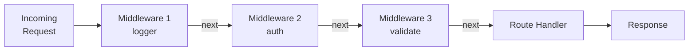
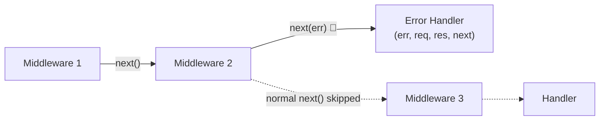
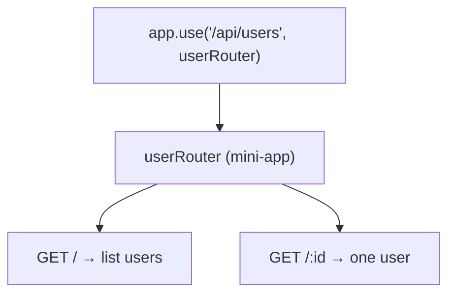
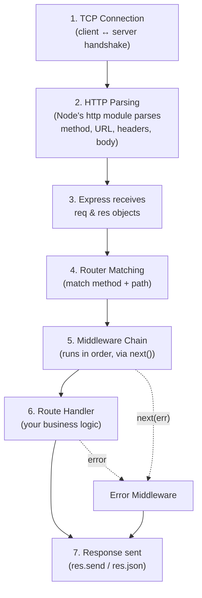
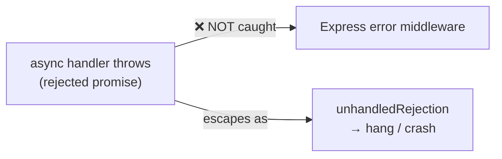

# Express Architecture — Deep Notes 🚦

> Express is basically **one idea repeated**: a request flows through a chain of functions, and each function decides whether to pass it forward.
> Master that one idea — middleware — and the whole framework opens up.
> These notes explain **how** and **why** — with code, diagrams, interview answers, and quick revision tips.

---

## 📑 Table of Contents

1. [What Middleware Actually Is](#1-what-middleware-actually-is)
2. [The Middleware Chain & next()](#2-the-middleware-chain--next)
3. [Error-Handling Middleware (4 Arguments)](#3-error-handling-middleware-4-arguments)
4. [App-level vs Router-level Middleware](#4-app-level-vs-router-level-middleware)
5. [The Request Lifecycle](#5-the-request-lifecycle)
6. [Async Errors — The Trap & The Fixes](#6-async-errors--the-trap--the-fixes)
7. [Practical Exercises](#7-practical-exercises)
8. [How to Explain in Interview](#8-how-to-explain-in-interview)
9. [Impressive Words](#9-impressive-words)
10. [Quick Revision](#10-quick-revision)

---

## 1. What Middleware Actually Is

A middleware is **just a function** with this exact signature:

```js
function middleware(req, res, next) {
  // do something
  next(); // pass control to the next function
}
```

That's it. No magic. It is a function that sits **in the middle** of the request and the response, and gets three things:

- **`req`** — the incoming request object (URL, headers, body, params...).
- **`res`** — the response object (used to send data back).
- **`next`** — a function you call to **pass control to the next middleware**.

A middleware can do **4 things**:
1. Run any code (logging, timing...).
2. Change `req` or `res` (e.g. `req.user = ...`).
3. **End** the request-response cycle (`res.send(...)`).
4. Call **`next()`** to hand over to the next middleware.

⚠️ **Golden rule:** A middleware must **either** send a response **or** call `next()`. If it does neither, the request **hangs forever** (client keeps waiting). This is the #1 beginner bug.

**Key line for interview:**
> "Middleware is simply a function with the signature `(req, res, next)` that sits in the request pipeline. It can inspect or modify the request and response, end the cycle, or pass control forward with `next()`."

---

## 2. The Middleware Chain & next()

Express keeps middlewares in a **stack**, executed **in the order you register them**. `next()` is what moves the request from one to the next.



### Two ways to call next()

| Call | Meaning |
|------|---------|
| **`next()`** | Go to the **next normal middleware** in the chain |
| **`next(err)`** | Something went wrong → **skip all normal middleware** and jump straight to the **error-handling middleware** |



**Important:** passing **anything** to `next()` (except the string `'route'`) tells Express *"this is an error"*. It then jumps over every remaining normal middleware/handler and looks for an **error-handling middleware**.

```js
app.use((req, res, next) => {
  console.log("First");
  next();                  // → goes to next middleware
});

app.use((req, res, next) => {
  console.log("Second");
  next(new Error("Boom")); // → SKIPS handlers, jumps to error middleware
});

app.get("/", (req, res) => {
  res.send("This never runs"); // skipped because of next(err) above
});
```

**Key line for interview:**
> "`next()` advances the chain; `next(err)` short-circuits it and jumps directly to the error-handling middleware, skipping all remaining normal handlers."

---

## 3. Error-Handling Middleware (4 Arguments)

Error middleware looks like normal middleware but takes **4 arguments**:

```js
function errorHandler(err, req, res, next) {
  console.error(err.stack);
  res.status(err.status || 500).json({
    error: err.message || "Internal Server Error",
  });
}
```

### Why ALL 4 arguments must be present

Express decides *"is this an error handler or a normal middleware?"* by **counting the function's parameters (its arity)**.

- **3 params** `(req, res, next)` → normal middleware.
- **4 params** `(err, req, res, next)` → **error-handling middleware**.

So even if you never use `next` inside, you **must still write all 4 parameters**, otherwise Express treats it as a normal middleware and your error handling silently breaks.

```js
// ❌ WRONG — only 3 params → Express thinks it's normal middleware
app.use((err, req, res) => { ... });

// ✅ CORRECT — 4 params → recognized as error handler
app.use((err, req, res, next) => { ... });
```

⚠️ **Placement matters:** Error-handling middleware must be defined **LAST**, after all `app.use()` calls and routes. Express runs middleware top-to-bottom, so the error handler must be at the bottom to catch errors from everything above it.

**Key line for interview:**
> "Express identifies error middleware by its arity — exactly four parameters `(err, req, res, next)`. All four must be present even if unused, otherwise Express treats it as ordinary middleware. And it must be registered last."

---

## 4. App-level vs Router-level Middleware

### App-level
Bound directly to the app instance with `app.use()` or `app.METHOD()`. Runs for the whole application.

```js
const express = require("express");
const app = express();

app.use(express.json());           // app-level: runs for every request
app.use((req, res, next) => { ...; next(); });
```

### Router-level
The same idea, but bound to a `express.Router()` instance — a **mini-app** you can group routes into and **mount** wherever you want.

```js
// routes/users.js
const router = express.Router();

router.use((req, res, next) => {   // router-level middleware
  console.log("User route hit");
  next();
});

router.get("/", (req, res) => res.send("All users"));
router.get("/:id", (req, res) => res.send(`User ${req.params.id}`));

module.exports = router;
```

### Mounting a router
```js
// app.js
const userRouter = require("./routes/users");
app.use("/api/users", userRouter);

// Now:
//   GET /api/users      → router's  "/"
//   GET /api/users/42   → router's  "/:id"
```



**Why this matters:** Routers keep code **modular**. Instead of 100 routes in one file, you split by feature (users, products, orders) and mount each under a prefix. This is how real apps stay organized.

**Key line for interview:**
> "App-level middleware runs for the whole app; router-level middleware is scoped to a Router instance. I use `express.Router()` to modularize routes by feature and mount them under a base path with `app.use('/api/users', router)`."

---

## 5. The Request Lifecycle

What actually happens from the moment a request arrives:



In words:
1. **TCP connection** — the client and server complete the TCP handshake.
2. **HTTP parsing** — Node's built-in `http` module parses the raw bytes into method, URL, headers, and body.
3. **Express takes over** — it wraps the raw request/response into the enhanced `req` and `res` objects.
4. **Router matching** — Express finds routes matching the HTTP method **and** path.
5. **Middleware chain** — runs registered middleware in order, each calling `next()`.
6. **Route handler** — your final function runs the business logic.
7. **Response** — `res.json()` / `res.send()` sends data back and ends the cycle.

**Mental model for interview:**
> "Under the hood, Express sits on top of Node's `http` module. Node handles the TCP and HTTP parsing; Express adds routing and the middleware pipeline on top. A request flows: connection → parsing → routing → middleware chain → handler → response."

---

## 6. Async Errors — The Trap & The Fixes

This is the **#1 production bug** in Express apps and a **very common interview question**.

### The trap (Express 4)

```js
// ❌ This does NOT get caught by your error middleware!
app.get("/bad", async (req, res) => {
  const user = await db.findUser(); // suppose this REJECTS
  res.json(user);
});
```

**Why it breaks:** Express 4's internal code wraps your handler in a `try/catch`, but a `try/catch` **cannot catch a rejected promise** from an `async` function unless it `await`s it. Express doesn't `await` your handler, so the rejection becomes an **`unhandledRejection`** — it **never reaches** your error middleware. The request **hangs** (and your process may crash).



### Fix 1 — Manual try/catch + next(err)
```js
app.get("/good", async (req, res, next) => {
  try {
    const user = await db.findUser();
    res.json(user);
  } catch (err) {
    next(err);   // ✅ now it reaches the error middleware
  }
});
```
Works, but writing try/catch in **every** route is repetitive and easy to forget.

### Fix 2 — A reusable wrapper (the clean pattern)
```js
// wrap any async fn so rejections auto-forward to next()
const asyncHandler = (fn) => (req, res, next) =>
  Promise.resolve(fn(req, res, next)).catch(next);

app.get("/good", asyncHandler(async (req, res) => {
  const user = await db.findUser();
  res.json(user);   // any rejection → automatically next(err)
}));
```
This is how libraries like `express-async-handler` work internally — good to mention.

### Fix 3 — The express-async-errors package
```js
require("express-async-errors"); // import ONCE at the very top of your entry file

// now plain async throws are auto-forwarded — no wrapper needed
app.get("/good", async (req, res) => {
  const user = await db.findUser();
  res.json(user);
});
```

### Bonus — Express 5 fixes this natively
> In **Express 5**, async handlers that return a rejected promise are **automatically** passed to `next(err)`. So if you are on Express 5, you don't need the wrapper or the package. **Mention this — it shows you keep up with versions.**

**Key line for interview:**
> "By default in Express 4, an error thrown inside an async handler becomes an unhandled rejection and never reaches the error middleware, so the request hangs. I fix it with a small async wrapper that catches the rejection and forwards it to `next()`, or use `express-async-errors`. Express 5 handles this automatically."

---

## 7. Practical Exercises

### Exercise A — Express app from scratch (no boilerplate)
```js
const express = require("express");
const app = express();

app.use(express.json());          // parse JSON request bodies

app.get("/", (req, res) => {
  res.send("Hello from scratch!");
});

const PORT = 3000;
app.listen(PORT, () => console.log(`🚀 Server on http://localhost:${PORT}`));
```

### Exercise B — Your own logger middleware (method, URL, response time)
```js
function logger(req, res, next) {
  const start = Date.now();

  // 'finish' fires when the response is fully sent — perfect for timing
  res.on("finish", () => {
    const duration = Date.now() - start;
    console.log(
      `${req.method} ${req.originalUrl} ${res.statusCode} - ${duration}ms`
    );
  });

  next();
}

app.use(logger);
// Example log:  GET /api/users 200 - 14ms
```
**Talking point:** using `res.on('finish')` (instead of logging before `next()`) is the correct way to capture the *real* response time and final status code.

### Exercise C — Your own error-handling middleware
```js
// Define AFTER all routes (must be last)
app.use((err, req, res, next) => {
  console.error("💥", err.stack);
  res.status(err.status || 500).json({
    success: false,
    error: err.message || "Internal Server Error",
  });
});
```

### Exercise D — Crash with async error, then fix it
```js
// 1) Crashes / hangs (Express 4)
app.get("/crash", async (req, res) => {
  throw new Error("Boom 💣");   // never reaches error middleware
});

// 2) Fixed with try/catch
app.get("/safe", async (req, res, next) => {
  try {
    throw new Error("Boom 💣");
  } catch (err) {
    next(err);                  // ✅ reaches error middleware
  }
});

// 3) Fixed globally with the package (top of file)
require("express-async-errors");
app.get("/safe2", async (req, res) => {
  throw new Error("Boom 💣");   // ✅ now auto-forwarded
});
```

### Exercise E — Multiple middleware in sequence (auth → validation → handler)
```js
// 1) Auth middleware
function auth(req, res, next) {
  const token = req.headers.authorization;
  if (!token) return res.status(401).json({ error: "No token provided" });
  req.user = { id: 1, name: "Nayan" }; // pretend we verified the token
  next();
}

// 2) Validation middleware
function validateUser(req, res, next) {
  if (!req.body.name) {
    return res.status(400).json({ error: "Name is required" });
  }
  next();
}

// 3) Chain them: auth → validate → handler
app.post("/users", auth, validateUser, (req, res) => {
  res.status(201).json({
    message: `User ${req.body.name} created by ${req.user.name}`,
  });
});
```
**Talking point:** notice each middleware does **one job** and either rejects early (`return res.status(...)`) or calls `next()`. This is the **single-responsibility** pattern that keeps routes clean.

---

## 8. How to Explain in Interview

**Level 1 (one line):**
> "Express is a thin layer over Node's http module that adds routing and a middleware pipeline. Every request flows through a chain of `(req, res, next)` functions."

**Level 2 (middleware + next):**
> "Middleware are functions that inspect or modify the request/response. They call `next()` to pass control forward, or `next(err)` to jump straight to the error handler, skipping the rest of the chain."

**Level 3 (error handling):**
> "Error middleware has four parameters `(err, req, res, next)` — Express identifies it by that arity — and must be registered last so it catches errors from everything above."

**Level 4 (the async gotcha):**
> "The classic trap is async errors. In Express 4 a rejected promise in a handler becomes an unhandled rejection and never hits the error middleware. I fix it with an async wrapper or `express-async-errors`. Express 5 handles it natively."

**Tie to a real problem:**
> "I always put a logger and a global error handler in place first, so every failure returns a consistent JSON shape and gets logged with method, URL, status, and timing."

---

## 9. Impressive Words

| Word / Phrase | Use it like this |
|---------------|------------------|
| **Middleware pipeline** | "Requests flow through the middleware pipeline." |
| **Arity** | "Express detects error handlers by their arity." |
| **Short-circuit** | "`next(err)` short-circuits the chain." |
| **Single responsibility** | "Each middleware has a single responsibility." |
| **Modular routing** | "I use Routers for modular routing per feature." |
| **Mounting** | "I mount the router under `/api`." |
| **Request lifecycle** | "Let me walk through the request lifecycle." |
| **Centralized error handling** | "A centralized error handler gives consistent responses." |
| **Unhandled rejection** | "An async throw becomes an unhandled rejection." |
| **Composition** | "Middleware lets you compose behaviour cleanly." |
| **Cross-cutting concerns** | "Logging and auth are cross-cutting concerns handled by middleware." |

---

## 10. Quick Revision

*(Read this in the last 5 minutes before the interview.)*

- 🧩 **Middleware** = a function `(req, res, next)`. Must **send a response** OR call **`next()`** — else the request hangs.
- ➡️ **`next()`** = go to next middleware. **`next(err)`** = skip to error handler.
- 🚨 **Error middleware** = **4 params** `(err, req, res, next)`. All 4 required (Express uses **arity** to detect it). Place it **LAST**.
- 🏠 **App-level** (`app.use`) runs app-wide. **Router-level** (`express.Router()`) is scoped & mountable.
- 📌 **Mounting:** `app.use('/api/users', router)` → prefixes all the router's routes.
- 🔄 **Lifecycle:** TCP → HTTP parse (Node http) → Express routing → middleware chain → handler → response.
- 🏗️ **Express sits on top of Node's `http` module** — Node does TCP/parsing, Express does routing/middleware.
- 💣 **Async error trap (Express 4):** a rejected promise in a handler → unhandled rejection → never reaches error middleware → request hangs.
- 🛠️ **Fixes:** (1) try/catch + `next(err)`, (2) `asyncHandler` wrapper `(fn)=>(req,res,next)=>Promise.resolve(fn(...)).catch(next)`, (3) `express-async-errors` package. **Express 5 fixes it natively.**
- 🔗 **Sequence pattern:** `app.post('/x', auth, validate, handler)` — each does one job, rejects early or calls `next()`.

**One sentence to remember everything:**
> "A request flows through an ordered chain of `(req, res, next)` middleware; `next()` moves forward, `next(err)` jumps to the 4-argument error handler at the end — and async throws need a wrapper because Express 4 won't catch them."

---

*Build the auth → validation → handler chain yourself and watch how `next()` threads the request through each stage — that is the moment Express stops feeling like magic. Keep building, future top-tier engineer! 🚀*
