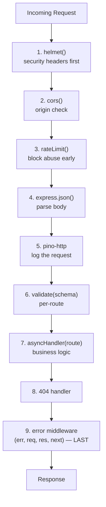

# Production Express Patterns — Deep Notes 🛡️

> A `app.get()` that returns JSON is a toy. A **production** Express app also handles errors gracefully, logs in a machine-readable way, validates every input, sets secure headers, controls CORS, and rate-limits abuse.
> These notes cover the **7 things** that turn a demo into a real service — with current code, diagrams, interview answers, and quick revision tips.

---

## 📑 Table of Contents

1. [The Async Wrapper Pattern](#1-the-async-wrapper-pattern)
2. [Structured Logging (pino)](#2-structured-logging-pino)
3. [Input Validation with Zod](#3-input-validation-with-zod)
4. [Helmet — Secure HTTP Headers](#4-helmet--secure-http-headers)
5. [CORS — Done Right](#5-cors--done-right)
6. [Rate Limiting](#6-rate-limiting)
7. [Putting It All Together (+ Order Matters)](#7-putting-it-all-together)
8. [Practical Exercises & Testing](#8-practical-exercises--testing)
9. [How to Explain in Interview](#9-how-to-explain-in-interview)
10. [Impressive Words](#10-impressive-words)
11. [Quick Revision](#11-quick-revision)

---

## 1. The Async Wrapper Pattern

From the earlier Express notes: in Express 4, an error thrown in an async handler becomes an **unhandled rejection** and never reaches your error middleware. The clean, reusable fix is a tiny wrapper.

```js
const asyncHandler = (fn) => (req, res, next) =>
  Promise.resolve(fn(req, res, next)).catch(next);
```

**How it works, line by line:**
- `fn` is your real async route handler.
- `Promise.resolve(fn(...))` wraps the call so that **whatever** `fn` returns (a promise or not) becomes a promise.
- `.catch(next)` — if that promise rejects, the error is passed to `next(err)` → which forwards it to your error-handling middleware.

```js
// Use it like this — no try/catch needed inside the handler
app.get("/users/:id", asyncHandler(async (req, res) => {
  const user = await db.findUser(req.params.id);  // if this throws...
  if (!user) {
    const err = new Error("User not found");
    err.status = 404;
    throw err;                                     // ...it's caught & forwarded
  }
  res.json(user);
}));
```

**Why this is "production":** you write your business logic cleanly, and **every** rejection automatically reaches one central error handler. No forgotten try/catch, no hung requests.

**Key line for interview:**
> "I wrap async handlers in a small `asyncHandler` so any rejected promise is automatically forwarded to `next()`. It keeps handlers clean and guarantees errors hit my centralized error middleware. This is what `express-async-handler` does internally."

---

## 2. Structured Logging (pino)

### Why `console.log` is not enough in production

`console.log("User", userId, "logged in")` produces a **plain string**. In production with millions of logs, you need to **search, filter, and aggregate** them (in tools like Datadog, Loki, CloudWatch, ELK). Plain strings are painful to query.

**Structured logging** means logging **JSON objects** instead:

```json
{"level":"info","time":1717000000000,"userId":42,"event":"login","msg":"User logged in"}
```

Now you can query *"show all logs where `event=login` and `userId=42`"* instantly. Machines love JSON; humans can still read it in dev with pretty-printing.

| | `console.log` | Structured (pino) |
|---|---|---|
| Format | Plain string | JSON |
| Searchable / filterable | ❌ Hard | ✅ Easy |
| Log levels | ❌ No | ✅ trace/debug/info/warn/error/fatal |
| Performance | Slow-ish | ✅ Very fast (pino is built for speed) |
| Production-ready | ❌ | ✅ |

### pino setup: pretty in dev, JSON in prod

```js
// logger.js
const pino = require("pino");

const isDev = process.env.NODE_ENV !== "production";

const logger = pino({
  level: process.env.LOG_LEVEL || "info",
  // Pretty colored output in dev; raw fast JSON in prod
  transport: isDev
    ? { target: "pino-pretty", options: { colorize: true } }
    : undefined,
});

module.exports = logger;
```

```js
// usage
const logger = require("./logger");

logger.info({ userId: 42, event: "login" }, "User logged in");
logger.warn({ ip: req.ip }, "Suspicious request");
logger.error({ err }, "DB connection failed");
```

### Auto-log every HTTP request with `pino-http`
```js
const pinoHttp = require("pino-http");
const logger = require("./logger");

app.use(pinoHttp({ logger }));
// now every request is logged with method, url, status, response time, and a request id
```

**Key line for interview:**
> "In production I use structured JSON logging with pino — it's machine-parsable, searchable, and extremely fast. I pretty-print in development for readability and emit raw JSON in production so log aggregators can index it. `pino-http` gives me automatic per-request logs with a correlation id."

---

## 3. Input Validation with Zod

**Never trust client input.** Validate the shape, types, and constraints of every request body, query, and param. Zod is a TypeScript-first schema validator that does this cleanly.

### Define a schema
```js
const { z } = require("zod");

const createUserSchema = z.object({
  name: z.string().min(2, "Name must be at least 2 characters"),
  email: z.email("Invalid email address"),     // zod v4: z.email() (v3: z.string().email())
  age: z.number().int().positive().optional(),
  role: z.enum(["user", "admin"]).default("user"),
});
```
> ℹ️ **Version note:** In **Zod v4**, top-level validators are preferred — z.string().email() is preferably z.email(), and similarly z.string().uuid() is preferably z.uuid() with stricter RFC validation. On **Zod v3**, use `z.string().email()` instead.

### parse vs safeParse
- **`.parse(data)`** → returns valid data, but **throws** a `ZodError` if invalid.
- **`.safeParse(data)`** → never throws; returns a result object. The result type is a discriminated union — `{ success: true, data }` or `{ success: false, error }`.

For middleware, `safeParse` is cleaner (no try/catch):

### A reusable validation middleware
```js
const validate = (schema) => (req, res, next) => {
  const result = schema.safeParse(req.body);

  if (!result.success) {
    // zod v4 exposes issues on error.issues
    return res.status(400).json({
      error: "Validation failed",
      details: result.error.issues.map((i) => ({
        field: i.path.join("."),
        message: i.message,
      })),
    });
  }

  req.body = result.data;   // use the parsed/cleaned data (defaults applied, types coerced)
  next();
};

// Use it on a route
app.post("/users", validate(createUserSchema), (req, res) => {
  // req.body is now guaranteed valid and typed
  res.status(201).json({ message: `Created ${req.body.name}` });
});
```

**Bonus — free TypeScript types from your schema:**
```ts
type CreateUserInput = z.infer<typeof createUserSchema>;
// { name: string; email: string; age?: number; role: "user" | "admin" }
```
One schema gives you **both** runtime validation **and** compile-time types — no duplication.

**Key line for interview:**
> "I validate all inputs with Zod schemas using `safeParse` inside a reusable middleware, returning a 400 with structured error details on failure. A big win is `z.infer` — one schema gives me runtime validation and the TypeScript type, so they never drift apart."

---

## 4. Helmet — Secure HTTP Headers

Browsers respect special HTTP **response headers** for security. Helmet sets sensible secure defaults with one line, so you don't have to remember them all.

```js
const helmet = require("helmet");
app.use(helmet());   // apply early, before routes
```

**Key headers Helmet manages:**

| Header | Protects against |
|--------|------------------|
| **Content-Security-Policy (CSP)** | XSS — controls which scripts/styles/images can load |
| **Strict-Transport-Security (HSTS)** | Forces HTTPS, blocks downgrade attacks |
| **X-Frame-Options** | Clickjacking — stops your site being embedded in an `<iframe>` |
| **X-Content-Type-Options: nosniff** | MIME-sniffing attacks |
| **X-DNS-Prefetch-Control** | Privacy leakage via DNS prefetch |
| **Referrer-Policy** | Controls how much referrer info is sent |

> Helmet **removes** the revealing `X-Powered-By: Express` header too — a small but real win (don't advertise your stack to attackers).

### Customizing CSP (common real need)
```js
app.use(
  helmet({
    contentSecurityPolicy: {
      directives: {
        defaultSrc: ["'self'"],
        scriptSrc: ["'self'", "https://trusted-cdn.com"],
        imgSrc: ["'self'", "data:", "https:"],
      },
    },
  })
);
```

**Key line for interview:**
> "Helmet sets secure HTTP response headers with sensible defaults — CSP for XSS, HSTS to enforce HTTPS, X-Frame-Options against clickjacking, and nosniff against MIME sniffing. I apply it early in the middleware stack and tighten the CSP for the app's specific needs."

---

## 5. CORS — Done Right

### What CORS actually is
**CORS (Cross-Origin Resource Sharing)** is a **browser** security feature. By default, a browser **blocks** a web page on `https://myapp.com` from calling an API on `https://api.other.com` (a different *origin*). CORS headers from the **server** tell the browser *"yes, this origin is allowed."*

> Important: CORS is enforced by the **browser**, not the server. Tools like curl/Postman ignore it. It protects **users**, not your server.

### Why `origin: "*"` is almost always wrong
```js
const cors = require("cors");
app.use(cors({ origin: "*" }));   // ❌ allows EVERY website to call your API
```
- It lets **any** site on the internet call your API from a browser.
- It **cannot** be combined with credentials (cookies/auth) — browsers forbid `*` + `credentials: true`.
- Use `*` only for **truly public, read-only, no-auth** APIs.

### The right way — an allowlist
```js
const cors = require("cors");

const allowedOrigins = [
  "https://myapp.com",
  "https://admin.myapp.com",
  "http://localhost:3000",   // dev
];

app.use(
  cors({
    origin: (origin, callback) => {
      // allow requests with no origin (mobile apps, curl, server-to-server)
      if (!origin || allowedOrigins.includes(origin)) {
        return callback(null, true);
      }
      callback(new Error("Not allowed by CORS"));
    },
    credentials: true,             // allow cookies / Authorization header
    methods: ["GET", "POST", "PUT", "DELETE"],
  })
);
```

**Key line for interview:**
> "CORS is a browser-enforced policy. The server uses CORS headers to declare which origins may call it. I almost never use `*` — it allows any site and can't be used with credentials. Instead I maintain an allowlist of trusted origins and enable credentials only for those."

---

## 6. Rate Limiting

Rate limiting protects your API from abuse — brute-force login attempts, scrapers, accidental request floods, and DoS. `express-rate-limit` is the standard.

### Basic per-IP limiter (current v7 API)
```js
const { rateLimit } = require("express-rate-limit");

const limiter = rateLimit({
  windowMs: 60 * 1000,        // 1 minute window
  limit: 100,                 // max 100 requests per IP per window (v7: 'limit', was 'max')
  standardHeaders: "draft-8", // adds RateLimit-* headers so clients can self-throttle
  legacyHeaders: false,       // drop the old X-RateLimit-* headers
  message: { error: "Too many requests, please try again later." },
});

app.use(limiter);  // apply to all routes
```
> ℹ️ **Version note:** In express-rate-limit v7 the basic config is windowMs, limit, standardHeaders: 'draft-8', legacyHeaders: false. The old `max` option still works as an alias for `limit`. When the limit is exceeded, the server responds with a **429 Too Many Requests**.

### Per-route — stricter limits on sensitive endpoints
```js
// Login is a brute-force target → much stricter
const authLimiter = rateLimit({
  windowMs: 15 * 60 * 1000,   // 15 minutes
  limit: 5,                   // only 5 attempts
  message: { error: "Too many login attempts. Try again in 15 minutes." },
});

app.post("/login", authLimiter, loginHandler);   // applies only to /login
```

### Per-user (not just per-IP)
By default it limits per IP. To limit per logged-in user, set a custom `keyGenerator`:
```js
const userLimiter = rateLimit({
  windowMs: 60 * 1000,
  limit: 1000,
  keyGenerator: (req) => req.user?.id || req.ip,   // per-user if logged in, else per-IP
});
```

> ⚠️ **Production gotcha:** behind a proxy/load balancer (Nginx, AWS ELB, Heroku), every request looks like it comes from the proxy's IP. Set `app.set("trust proxy", 1)` so Express reads the real client IP from `X-Forwarded-For`.

**Key line for interview:**
> "I use `express-rate-limit` with per-IP limits globally and much stricter per-route limits on sensitive endpoints like login. For authenticated traffic I key the limiter on the user id instead of the IP. Behind a proxy I enable `trust proxy` so the real client IP is used."

---

## 7. Putting It All Together

**Order matters.** Middleware runs top to bottom, so the production stack has a deliberate order:



**Why this order:**
1. **helmet** first — set security headers on *every* response, even errors.
2. **cors** — reject disallowed origins early.
3. **rate limit** — block abusers **before** doing expensive work like body parsing or DB calls.
4. **body parser** (`express.json()`) — needed before validation can read `req.body`.
5. **logger** — log requests that made it past the gates.
6. **validation** — per-route, right before the handler.
7. **handler** (wrapped in `asyncHandler`).
8. **404** — catch unmatched routes.
9. **error handler** — always last, 4 arguments.

```js
const express = require("express");
const helmet = require("helmet");
const cors = require("cors");
const { rateLimit } = require("express-rate-limit");
const pinoHttp = require("pino-http");
const logger = require("./logger");

const app = express();
app.set("trust proxy", 1);

app.use(helmet());
app.use(cors({ origin: allowedOrigins, credentials: true }));
app.use(rateLimit({ windowMs: 60_000, limit: 100, standardHeaders: "draft-8", legacyHeaders: false }));
app.use(express.json());
app.use(pinoHttp({ logger }));

// ...routes with validate() + asyncHandler()...
app.post("/users", validate(createUserSchema), asyncHandler(createUser));

// 404
app.use((req, res) => res.status(404).json({ error: "Not found" }));

// error handler — LAST, 4 args
app.use((err, req, res, next) => {
  req.log?.error({ err }, "Request failed");
  res.status(err.status || 500).json({ error: err.message || "Internal Server Error" });
});

app.listen(3000, () => logger.info("🚀 Server on :3000"));
```

---

## 8. Practical Exercises & Testing

### Setup
```bash
npm init -y
npm install express helmet cors express-rate-limit pino pino-http zod
npm install --save-dev pino-pretty
```

### Test 1 — Zod catches invalid input
```bash
# Missing name, bad email → expect 400 with details
curl -X POST http://localhost:3000/users \
  -H "Content-Type: application/json" \
  -d '{"email":"not-an-email"}'

# Expected: 400 {"error":"Validation failed","details":[...]}
```

### Test 2 — See helmet's headers
```bash
curl -I http://localhost:3000/
# Look for: Content-Security-Policy, Strict-Transport-Security,
#           X-Frame-Options, X-Content-Type-Options: nosniff
# And notice: NO "X-Powered-By: Express"
```

### Test 3 — Trigger the rate limit
```bash
# Fire 200 requests fast; after the limit you get HTTP 429
for i in $(seq 1 200); do
  curl -s -o /dev/null -w "%{http_code}\n" http://localhost:3000/;
done | sort | uniq -c
# Expected output like:  100 200   and   100 429
```

### Test 4 — See structured logs
Run in dev (`NODE_ENV=development`) → pretty colored logs.
Run in prod (`NODE_ENV=production node app.js`) → raw JSON lines. Pipe them: `node app.js | npx pino-pretty` to confirm they're valid JSON.

### Test 5 — Async error reaches the handler
```js
app.get("/boom", asyncHandler(async () => {
  throw new Error("kaboom");   // should return a clean 500, NOT crash/hang
}));
```
```bash
curl http://localhost:3000/boom   # expect 500 {"error":"kaboom"}, server still alive
```

---

## 9. How to Explain in Interview

**Level 1 (one line):**
> "A production Express app layers security, observability, and validation on top of the basics — secure headers, CORS, rate limiting, structured logging, input validation, and centralized async error handling."

**Level 2 (the stack & order):**
> "I order middleware deliberately: helmet → cors → rate limit → body parser → logger → per-route validation → handler → 404 → error handler. Security and rate limiting come first so I reject bad traffic before doing expensive work."

**Level 3 (the why behind each):**
> "Zod validates and types inputs from one schema; pino gives fast searchable JSON logs; helmet sets headers like CSP and HSTS; CORS uses an allowlist instead of `*`; rate-limit returns 429 on abuse, with stricter per-route limits on login."

**Level 4 (the subtle stuff):**
> "Behind a proxy I set `trust proxy` so rate limiting uses the real client IP. CORS `*` can't be combined with credentials. And I wrap async handlers so rejections always reach my central error middleware instead of hanging the request."

**Tie to a real problem:**
> "On a login endpoint I combine a strict per-IP rate limit, Zod validation, and structured logging of failed attempts — that single endpoint shows almost every production pattern at once."

---

## 10. Impressive Words

| Word / Phrase | Use it like this |
|---------------|------------------|
| **Observability** | "Structured logging is the foundation of observability." |
| **Defense in depth** | "Helmet, CORS, and rate limiting give defense in depth." |
| **Fail closed** | "My CORS allowlist fails closed — unknown origins are rejected." |
| **Schema-driven** | "Validation is schema-driven with Zod." |
| **Single source of truth** | "The Zod schema is the single source of truth for shape and types." |
| **Correlation id** | "pino-http attaches a correlation id per request." |
| **Allowlist (not blocklist)** | "I use an origin allowlist, never a blocklist." |
| **Throttling / 429** | "Abusive clients get throttled with a 429." |
| **Least privilege** | "CSP follows least privilege for script sources." |
| **Centralized error handling** | "All errors funnel to a centralized handler." |
| **Machine-parsable** | "JSON logs are machine-parsable and queryable." |

---

## 11. Quick Revision

*(Read this in the last 5 minutes before the interview.)*

- 🎁 **asyncHandler:** `fn => (req,res,next) => Promise.resolve(fn(req,res,next)).catch(next)` — auto-forwards async errors to the error middleware.
- 📊 **Structured logging (pino):** JSON logs = searchable, filterable, fast. Pretty in dev (`pino-pretty`), raw JSON in prod. `pino-http` logs every request.
- ✅ **Zod:** define schema → `safeParse` in middleware → 400 with `error.issues` on failure. `z.infer` gives free TS types. (v4: `z.email()`, `z.uuid()`; v3: `z.string().email()`.)
- 🪖 **Helmet:** one line sets secure headers — **CSP** (XSS), **HSTS** (force HTTPS), **X-Frame-Options** (clickjacking), **nosniff** (MIME). Also removes `X-Powered-By`.
- 🌍 **CORS:** browser-enforced, protects users. **Never `*`** for real apps (and `*` can't use credentials). Use an **allowlist** + `credentials: true`.
- 🚦 **Rate limit (express-rate-limit v7):** `windowMs`, `limit`, `standardHeaders:'draft-8'`, `legacyHeaders:false` → **429** when exceeded. Per-IP global, stricter per-route (login), per-user via `keyGenerator`. Set `trust proxy` behind a proxy.
- 🔢 **Order:** helmet → cors → rateLimit → express.json → logger → validate → handler → 404 → **error handler (last, 4 args)**.

**One sentence to remember everything:**
> "Production Express = secure headers (helmet) + CORS allowlist + rate limiting up front, then JSON body parsing, structured pino logs, Zod validation per route, async-wrapped handlers, and one centralized error handler at the very end."

---

*Build the single app in section 7 and run all 5 tests — watching the 429 appear and seeing helmet's headers in `curl -I` makes these patterns stick. This is the stuff that separates 'I know Express' from 'I ship Express'. Keep going, future top-tier engineer! 🚀*
