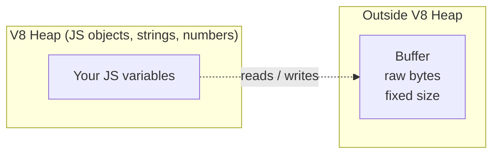
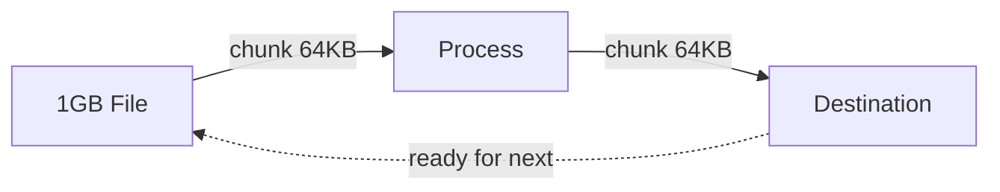
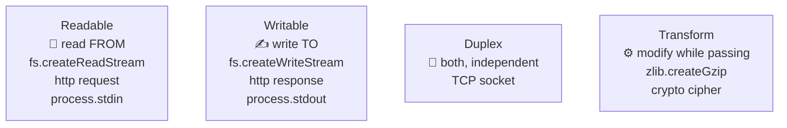
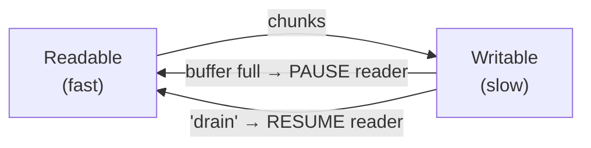
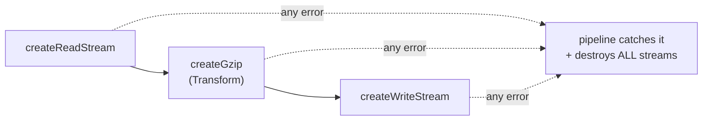

# Node.js Streams & Buffers — Deep Notes 🌊

> Loading a 1GB file into memory will crash your server.
> Streaming it chunk by chunk uses almost no RAM.
> These notes explain **how** and **why** — with code, diagrams, interview answers, and quick revision tips.

---

## 📑 Table of Contents

1. [Buffers — Raw Memory Outside V8](#1-buffers--raw-memory-outside-v8)
2. [Why Streams Exist](#2-why-streams-exist)
3. [The 4 Types of Streams](#3-the-4-types-of-streams)
4. [Stream Events](#4-stream-events)
5. [pipe() and Backpressure](#5-pipe-and-backpressure)
6. [pipeline() — The Modern Way](#6-pipeline--the-modern-way)
7. [Practical Exercises](#7-practical-exercises)
8. [How to Explain in Interview](#8-how-to-explain-in-interview)
9. [Impressive Words](#9-impressive-words)
10. [Quick Revision](#10-quick-revision)

---

## 1. Buffers — Raw Memory Outside V8

JavaScript was made for text and objects, not for **raw binary data** (images, video, file bytes, network packets). To handle binary, Node gives us the **Buffer**.

**What a Buffer actually is:**
- A **fixed-size** chunk of **raw memory**.
- Allocated **outside the V8 heap** (so it does not count against V8's memory limit, and the garbage collector treats it specially).
- Technically a subclass of `Uint8Array` — it is just a sequence of bytes (0–255 each).
- **Fixed size** — once you create a 10-byte buffer, it stays 10 bytes. You cannot resize it.



### Creating Buffers

```js
// Safe — zero-filled (recommended)
const buf1 = Buffer.alloc(10);            // <Buffer 00 00 00 ... > 10 bytes

// Fast but UNSAFE — may contain old leftover memory (security risk!)
const buf2 = Buffer.allocUnsafe(10);      // fill it before using

// From existing data
const buf3 = Buffer.from("Hello");        // from string
console.log(buf3);                        // <Buffer 48 65 6c 6c 6f>
console.log(buf3.toString());             // "Hello"
console.log(buf3.toString("hex"));        // "48656c6c6f"
console.log(buf3.toString("base64"));     // "SGVsbG8="
```

**Interview gotcha:**
> "`Buffer.alloc()` is safe and zero-filled. `Buffer.allocUnsafe()` is faster because it skips zeroing, but it may expose old memory contents — never send it over network or to a user without overwriting it first."

**Key line for interview:**
> "A Buffer is fixed-size raw memory allocated outside the V8 heap, used to handle binary data efficiently. Streams move data around as Buffers under the hood."

---

## 2. Why Streams Exist

Imagine copying a 1GB video file.

- **Without streams** (`fs.readFileSync`): Node loads the **entire 1GB into RAM** first, then writes it. If 50 users do this at once → **50GB RAM → server crashes**.
- **With streams**: Node reads a **small chunk** (e.g. 64KB), passes it along, then reads the next. **RAM usage stays flat** no matter the file size.



**Two big wins of streams:**
1. **Memory efficiency** — process data piece by piece, never load it all at once.
2. **Time efficiency** — start processing the first chunk **before** the whole data has arrived (great for network responses).

**Real-world examples you already use:**
- HTTP request/response bodies are streams.
- `fs.createReadStream` / `fs.createWriteStream`.
- `process.stdin` / `process.stdout`.
- Video streaming (Netflix idea), file uploads, log processing.

**Key line for interview:**
> "Streams let us process data incrementally — chunk by chunk — instead of buffering everything in memory. This keeps memory flat and lets processing begin before all data arrives."

---

## 3. The 4 Types of Streams



| Type | Direction | Think of it as | Examples |
|------|-----------|----------------|----------|
| **Readable** | Read **from** | A tap (water comes out) | `fs.createReadStream`, HTTP request (server side), `process.stdin` |
| **Writable** | Write **to** | A sink (water goes in) | `fs.createWriteStream`, HTTP response, `process.stdout` |
| **Duplex** | Both ways (independent) | A phone call (talk + listen separately) | TCP socket (`net.Socket`) |
| **Transform** | Both ways (output **derived** from input) | A water filter (in → cleaned → out) | `zlib.createGzip()`, encryption/decryption |

**Key difference — Duplex vs Transform** (popular question):
- **Duplex**: read side and write side are **independent**. What you write has no relation to what you read (like a socket).
- **Transform**: it is a Duplex where the **output is a transformed version of the input** (you write raw data, you read modified data). Gzip is the classic example.

**Key line for interview:**
> "A Transform stream is a special Duplex where the readable output is computed from the writable input — like gzip, which takes raw bytes in and gives compressed bytes out."

---

## 4. Stream Events

Streams are `EventEmitter`s, so we listen to events.

### Readable stream events
| Event | When it fires |
|-------|---------------|
| **`data`** | A chunk is available to read (puts stream in flowing mode) |
| **`end`** | No more data left to read (source finished) |
| **`error`** | Something went wrong |
| **`close`** | Stream and its resources are closed |

### Writable stream events
| Event | When it fires |
|-------|---------------|
| **`drain`** | Buffer emptied — safe to write more (backpressure signal) |
| **`finish`** | `.end()` called and all data flushed to the underlying system |
| **`error`** | Something went wrong |
| **`close`** | Stream and resources closed |

```js
const fs = require("fs");
const readStream = fs.createReadStream("input.txt");

readStream.on("data", (chunk) => {
  console.log(`Received ${chunk.length} bytes`);
});
readStream.on("end", () => console.log("No more data."));
readStream.on("error", (err) => console.error("Error:", err.message));
```

⚠️ **`end` vs `finish` confusion (very common):**
- **`end`** is on the **Readable** side → "I have finished **reading**."
- **`finish`** is on the **Writable** side → "I have finished **writing** everything."

**Key line for interview:**
> "`end` fires on readable streams when the source is exhausted; `finish` fires on writable streams when all writes are flushed. People mix these two up constantly."

---

## 5. pipe() and Backpressure

`pipe()` connects a readable stream to a writable stream and **automatically manages the flow**.

```js
const fs = require("fs");

fs.createReadStream("input.txt")
  .pipe(fs.createWriteStream("output.txt"));
```

### What is Backpressure?

Imagine reading from a **fast** source but writing to a **slow** destination (slow disk, slow network). The data starts **piling up in memory** because writing can't keep up. If unchecked → **memory explosion**.

**Backpressure** is the mechanism that says: *"Hey reader, slow down! The writer is full — wait until it drains."*



**How it works under the hood:**
- `writable.write(chunk)` returns **`false`** when its internal buffer (`highWaterMark`, default ~16KB / 64KB for files) is full.
- That `false` is the signal to **pause** reading.
- When the buffer empties, the writable emits **`'drain'`**, and reading **resumes**.

**The magic of `pipe()`:**
> `pipe()` does ALL of this automatically. It pauses and resumes the readable based on the writable's state. You get backpressure handling for free.

**Why this matters in interview:**
> "If you manually do `readStream.on('data', chunk => writeStream.write(chunk))` and ignore the return value of `write()`, you lose backpressure and risk running out of memory. `pipe()` handles backpressure automatically — that is its biggest benefit."

### The problem with pipe()

`pipe()` has **bad error handling**. If an error happens mid-stream:
- The error does **not** propagate down the chain.
- Streams are **not** automatically destroyed → **file descriptor / memory leaks**.

You must attach `.on('error')` to **every** stream manually. This is painful and easy to get wrong — which is exactly why `pipeline()` exists.

---

## 6. pipeline() — The Modern Way

`pipeline()` chains multiple streams **and** handles errors + cleanup **properly**. It destroys all streams if any one fails. This is the **recommended** modern approach.

### Promise version (cleanest)
```js
const { pipeline } = require("stream/promises");
const fs = require("fs");
const zlib = require("zlib");

async function compressFile() {
  try {
    await pipeline(
      fs.createReadStream("input.txt"),
      zlib.createGzip(),
      fs.createWriteStream("input.txt.gz")
    );
    console.log("✅ Compression done");
  } catch (err) {
    console.error("❌ Pipeline failed:", err.message);
    // all streams already cleaned up automatically
  }
}
compressFile();
```



### pipe() vs pipeline() — the comparison

| Feature | `pipe()` | `pipeline()` |
|---------|----------|--------------|
| Backpressure | ✅ Auto | ✅ Auto |
| Error propagation | ❌ Manual on each stream | ✅ Single catch |
| Auto cleanup on error | ❌ No (leaks) | ✅ Yes (destroys all) |
| Chain many streams | 😣 Messy | ✅ Clean |
| Modern recommendation | ⚠️ Avoid for chains | ✅ Use this |

**Key line for interview:**
> "I prefer `pipeline()` from `stream/promises` over chained `pipe()` calls, because it propagates errors from any stage and automatically destroys every stream on failure — preventing resource leaks. `pipe()` handles backpressure but leaves error handling and cleanup to me."

---

## 7. Practical Exercises

### Exercise A — Feel the memory difference
```js
// ❌ Loads entire file into RAM — watch memory spike
const fs = require("fs");
const data = fs.readFileSync("big-file.txt");   // 1GB → ~1GB RAM
fs.writeFileSync("copy.txt", data);

// ✅ Streams — RAM stays flat (~tens of MB)
fs.createReadStream("big-file.txt")
  .pipe(fs.createWriteStream("copy.txt"));
```
Run both and watch with: `node --inspect` → DevTools Memory tab, or just observe Task Manager / `htop`.

### Exercise B — CSV → JSON Transformer
Real-world detail: chunks can split a line in half, so we **buffer the partial line** (`tail`) until the next chunk.

```js
const { Transform } = require("stream");

class CSVtoJSON extends Transform {
  constructor(options) {
    super({ ...options });
    this.headers = null;
    this.tail = "";           // leftover partial line from previous chunk
  }

  _transform(chunk, encoding, callback) {
    const text = this.tail + chunk.toString();
    const lines = text.split("\n");
    this.tail = lines.pop();   // last item may be incomplete → save it

    for (const line of lines) {
      if (!line.trim()) continue;
      const values = line.split(",").map((v) => v.trim());

      if (!this.headers) {
        this.headers = values;          // first line = headers
      } else {
        const obj = {};
        this.headers.forEach((h, i) => (obj[h] = values[i]));
        this.push(JSON.stringify(obj) + "\n");
      }
    }
    callback();
  }

  _flush(callback) {
    // handle the very last line (no trailing newline)
    if (this.tail.trim() && this.headers) {
      const values = this.tail.split(",").map((v) => v.trim());
      const obj = {};
      this.headers.forEach((h, i) => (obj[h] = values[i]));
      this.push(JSON.stringify(obj) + "\n");
    }
    callback();
  }
}

// Usage
const fs = require("fs");
const { pipeline } = require("stream/promises");

await pipeline(
  fs.createReadStream("data.csv"),
  new CSVtoJSON(),
  fs.createWriteStream("data.json")
);
```
**Interview talking point:** the `tail` buffering shows you understand that **chunk boundaries do not respect line boundaries** — a detail that trips up many people.

### Exercise C — File Compression Utility (gzip)
```js
const fs = require("fs");
const zlib = require("zlib");
const { pipeline } = require("stream/promises");

async function gzipFile(input) {
  await pipeline(
    fs.createReadStream(input),
    zlib.createGzip(),
    fs.createWriteStream(`${input}.gz`)
  );
  console.log(`✅ Compressed → ${input}.gz`);
}

async function gunzipFile(input) {
  await pipeline(
    fs.createReadStream(input),
    zlib.createGunzip(),
    fs.createWriteStream(input.replace(/\.gz$/, ""))
  );
  console.log("✅ Decompressed");
}

gzipFile("input.txt");
```

### Exercise D — Error handling at every stage
```js
const { pipeline } = require("stream/promises");

try {
  await pipeline(
    fs.createReadStream("missing.txt"),   // error here (file not found)
    zlib.createGzip(),
    fs.createWriteStream("out.gz")
  );
} catch (err) {
  // ONE place catches errors from ANY stage — and all streams are cleaned up
  console.error("Stage failed:", err.code, err.message);
}
```
Compare this to the old `pipe()` way where you would need `.on('error')` on **each** of the three streams. Much cleaner.

---

## 8. How to Explain in Interview

**Level 1 (one line):**
> "Streams process data in chunks instead of loading everything into memory, and Buffers are the raw binary chunks they move around."

**Level 2 (buffers):**
> "A Buffer is fixed-size raw memory allocated outside the V8 heap, designed for binary data. `Buffer.alloc` is safe and zero-filled; `allocUnsafe` is faster but may leak old memory."

**Level 3 (stream types + events):**
> "There are 4 types — Readable, Writable, Duplex, and Transform. Transform is a Duplex where output is derived from input, like gzip. We listen to events like `data`, `end`, `error` on readables and `drain`, `finish` on writables."

**Level 4 (backpressure + pipeline):**
> "`pipe()` connects streams and handles backpressure automatically — it pauses the reader when the writer's buffer is full and resumes on `drain`. But `pipe()` has poor error handling, so for production I use `pipeline()` from `stream/promises`, which propagates errors and destroys all streams on failure."

**Tie to a real problem:**
> "On a file upload endpoint, I stream the upload straight to storage instead of buffering it in memory, so one large upload can't take down the server."

---

## 9. Impressive Words

| Word / Phrase | Use it like this |
|---------------|------------------|
| **Backpressure** | "`pipe()` handles backpressure automatically." |
| **Chunk** | "Data flows in chunks, not all at once." |
| **highWaterMark** | "The internal buffer threshold is the highWaterMark." |
| **Flowing vs Paused mode** | "A readable in flowing mode pushes data via `data` events." |
| **Memory footprint** | "Streaming keeps the memory footprint flat." |
| **Incremental processing** | "Streams enable incremental processing of large data." |
| **Resource cleanup / leak** | "`pipeline()` prevents file descriptor leaks." |
| **Binary-safe** | "Buffers are binary-safe, unlike strings." |
| **Object mode** | "In object mode, streams can pass JS objects, not just bytes." |
| **Composability** | "Transform streams give great composability in a pipeline." |
| **Lazy evaluation** | "We process the first chunk before the rest has even arrived." |

---

## 10. Quick Revision

*(Read this in the last 5 minutes before the interview.)*

- 🧱 **Buffer** = fixed-size raw memory, **outside V8 heap**, for binary data. Subclass of `Uint8Array`.
- ⚠️ `Buffer.alloc` (safe, zeroed) vs `Buffer.allocUnsafe` (fast, may leak old memory).
- 🌊 **Streams** = process data **chunk by chunk** → flat memory + faster start.
- 4️⃣ **Four types:** **R**eadable (read from), **W**ritable (write to), **D**uplex (both, independent), **T**ransform (output derived from input, e.g. gzip).
  - Memory trick: **R**eally **W**ant **D**ata **T**ransformed.
- 📡 **Readable events:** `data`, `end`, `error`, `close`.
- 📥 **Writable events:** `drain`, `finish`, `error`, `close`.
- 🔀 **`end`** = finished **reading** (readable). **`finish`** = finished **writing** (writable).
- 🔧 **`pipe()`** = connects streams + **auto backpressure**, but **bad error handling** (manual, leaks).
- 🎯 **Backpressure** = slow writer makes fast reader pause until `drain`. `write()` returns `false` when full.
- ✅ **`pipeline()`** (from `stream/promises`) = backpressure **+** error propagation **+** auto cleanup. **Use this.**
- 🧠 **Duplex vs Transform:** Transform's output is computed from input; Duplex's two sides are independent.

**One sentence to remember everything:**
> "Buffers are raw binary memory outside V8; streams move those buffers in chunks to keep memory flat; `pipe()` gives free backpressure but `pipeline()` adds proper error handling and cleanup."

---

*Build the CSV transformer and the gzip utility yourself — the moment you handle a chunk that splits a line in half, streams will finally 'click'. Keep going, future top-tier engineer! 🚀*
