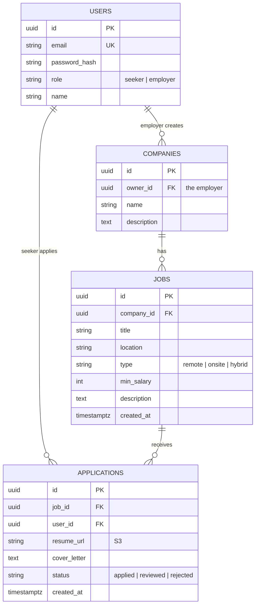
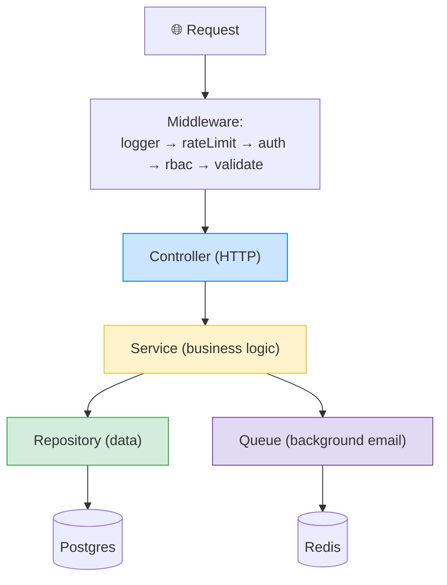
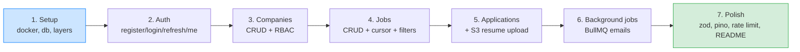

# 💼 Job Board API — Phase 1 Capstone Build Blueprint

> Your portfolio piece for Phase 1. This guide pulls together **every** concept from your notes — auth, RBAC, databases, cursor pagination, S3 uploads, background jobs, layered architecture, and clean API design — into one complete, shippable project.

---

## 📌 1. What You're Building (and why it matters)

A complete **job board API** — like a backend for an Indeed/LinkedIn-style site. Two kinds of users (job seekers + employers), companies, job postings, and applications, with file uploads, background emails, and production-quality polish.

> 🎯 **Why this is the perfect capstone:** it forces you to combine *every* skill at once. A recruiter or interviewer looking at this repo sees you can design schemas, secure an API, handle files, run background work, and structure code cleanly — not in isolation, but working together. **This is the project you point to when someone asks "show me something you've built."**

> 💡 Build it, document it well, and put it on GitHub under your `NayanDevLab` / "build in public" presence. A polished capstone like this is exactly the kind of inbound-magnet artifact worth showcasing.

---

## 🗂️ 2. The Data Model



**The relationships** (from your relationships + schema-design notes):
- A **User** has a `role`: `seeker` or `employer`.
- An **employer** owns **Companies** (1-to-many via `owner_id`).
- A **Company** has **Jobs** (1-to-many).
- A **Job** receives **Applications**; a **seeker** submits them (the application is the junction between User and Job, *with extra data* — resume + cover letter, so it's its own table, exactly the "relationship has data → junction table" rule from your relationships notes).

### PostgreSQL schema sketch
```sql
CREATE TABLE users (
  id UUID PRIMARY KEY DEFAULT gen_random_uuid(),
  email VARCHAR(255) NOT NULL UNIQUE,
  password_hash TEXT NOT NULL,
  role VARCHAR(20) NOT NULL DEFAULT 'seeker' CHECK (role IN ('seeker','employer')),
  name VARCHAR(100) NOT NULL,
  created_at TIMESTAMPTZ DEFAULT NOW()
);
CREATE TABLE companies (
  id UUID PRIMARY KEY DEFAULT gen_random_uuid(),
  owner_id UUID NOT NULL REFERENCES users(id),
  name VARCHAR(200) NOT NULL,
  description TEXT
);
CREATE TABLE jobs (
  id UUID PRIMARY KEY DEFAULT gen_random_uuid(),
  company_id UUID NOT NULL REFERENCES companies(id) ON DELETE CASCADE,
  title VARCHAR(200) NOT NULL,
  location VARCHAR(100),
  type VARCHAR(20) CHECK (type IN ('remote','onsite','hybrid')),
  min_salary INT CHECK (min_salary >= 0),
  description TEXT,
  created_at TIMESTAMPTZ DEFAULT NOW()
);
CREATE TABLE applications (
  id UUID PRIMARY KEY DEFAULT gen_random_uuid(),
  job_id UUID NOT NULL REFERENCES jobs(id) ON DELETE CASCADE,
  user_id UUID NOT NULL REFERENCES users(id),
  resume_url VARCHAR(500),
  cover_letter TEXT,
  status VARCHAR(20) DEFAULT 'applied' CHECK (status IN ('applied','reviewed','rejected')),
  created_at TIMESTAMPTZ DEFAULT NOW(),
  UNIQUE (job_id, user_id)         -- can't apply to the same job twice
);
-- Index foreign keys + common filters (Postgres doesn't auto-index FKs!)
CREATE INDEX idx_jobs_company ON jobs(company_id);
CREATE INDEX idx_jobs_filters ON jobs(location, type, min_salary);
CREATE INDEX idx_jobs_created ON jobs(created_at DESC, id DESC);  -- cursor pagination
CREATE INDEX idx_apps_job ON applications(job_id);
CREATE INDEX idx_apps_user ON applications(user_id);
```

---

## 🧱 3. The Architecture (Controller → Service → Repository)

Structure the whole project in clean layers (from your architecture-patterns notes):

```
src/
├── controllers/      ← HTTP only: parse, delegate, format response
│   ├── auth.controller.ts
│   ├── companies.controller.ts
│   ├── jobs.controller.ts
│   └── applications.controller.ts
├── services/         ← business logic: rules, orchestration
│   ├── auth.service.ts
│   ├── companies.service.ts
│   ├── jobs.service.ts
│   └── applications.service.ts
├── repositories/     ← database only: queries
│   ├── user.repository.ts
│   ├── company.repository.ts
│   ├── job.repository.ts
│   └── application.repository.ts
├── middleware/       ← cross-cutting concerns
│   ├── auth.middleware.ts        (verify JWT → req.user)
│   ├── rbac.middleware.ts        (requireRole, requireOwnership)
│   ├── validate.middleware.ts    (zod validation)
│   ├── rateLimit.middleware.ts
│   └── logger.middleware.ts      (pino request logging)
├── jobs/             ← BullMQ queues + workers
│   ├── email.queue.ts
│   └── email.worker.ts
├── lib/              ← s3, redis, db clients
└── app.ts
```



---

## 🌐 4. The Endpoints (API Contract)

All under `/v1`, all with consistent `{ data, error, meta }` envelope (REST API notes).

### Auth (from your auth series)
| Method | Endpoint | Auth | Codes | Notes |
|---|---|---|---|---|
| POST | `/v1/auth/register` | No | 201, 400, 409 | seeker or employer |
| POST | `/v1/auth/login` | No | 200, 401, 429 | returns access + refresh |
| POST | `/v1/auth/refresh` | Cookie | 200, 401 | rotate refresh token |
| POST | `/v1/auth/logout` | Yes | 204 | invalidate refresh (Redis) |
| GET | `/v1/auth/me` | Yes | 200, 401 | current user |

### Companies (employers only, own company only)
| Method | Endpoint | Auth | Codes |
|---|---|---|---|
| POST | `/v1/companies` | Employer | 201, 403 |
| GET | `/v1/companies/:id` | Any | 200, 404 |
| PATCH | `/v1/companies/:id` | Owner | 200, 403, 404 |
| DELETE | `/v1/companies/:id` | Owner | 204, 403, 404 |

### Jobs (cursor pagination + filters + search)
| Method | Endpoint | Auth | Codes |
|---|---|---|---|
| GET | `/v1/jobs?location=Bangalore&type=remote&minSalary=20&cursor=...&q=react` | Any | 200 |
| GET | `/v1/jobs/:id` | Any | 200, 404 |
| POST | `/v1/jobs` | Employer (owns company) | 201, 403 |
| PATCH | `/v1/jobs/:id` | Owner | 200, 403, 404 |
| DELETE | `/v1/jobs/:id` | Owner | 204, 403, 404 |

### Applications
| Method | Endpoint | Auth | Codes | Notes |
|---|---|---|---|---|
| POST | `/v1/jobs/:id/apply` | Seeker | 201, 403, 409 | upload resume to S3 |
| GET | `/v1/jobs/:id/applications` | Employer (owns job) | 200, 403 | employer sees applicants |
| GET | `/v1/applications/me` | Seeker | 200 | applicant's own applications |

---

## 🔑 5. Key Implementation Patterns

### A) Cursor pagination + filters for the job list (pagination notes)
```typescript
// GET /v1/jobs?location=Bangalore&type=remote&minSalary=20&cursor=...
async listJobs(filters, cursor, limit = 20) {
  const where = [];
  if (filters.location)  where.push({ location: filters.location });
  if (filters.type)      where.push({ type: filters.type });
  if (filters.minSalary) where.push({ min_salary: { gte: filters.minSalary } });
  if (filters.q)         where.push({ title: { contains: filters.q } });  // search

  // cursor: keyset pagination on (created_at, id)
  if (cursor) {
    const { createdAt, id } = decodeCursor(cursor);   // base64 → { createdAt, id }
    where.push({ OR: [
      { created_at: { lt: createdAt } },
      { created_at: createdAt, id: { lt: id } },       // tiebreaker
    ]});
  }
  const jobs = await jobRepo.find(where, { orderBy: [{ created_at: 'desc' }, { id: 'desc' }], limit: limit + 1 });
  const hasMore = jobs.length > limit;
  const page = jobs.slice(0, limit);
  const nextCursor = hasMore ? encodeCursor(page[page.length - 1]) : null;
  return { data: page, meta: { nextCursor } };
}
```

### B) RBAC — employers post, owners edit (RBAC notes)
```typescript
// Only employers can create jobs:
router.post("/v1/jobs", requireAuth, requireRole("employer"), validate(createJobSchema), jobsController.create);

// Only the company owner can edit their job:
async function requireJobOwnership(req, res, next) {
  const job = await jobRepo.findById(req.params.id);
  if (!job) return res.status(404).json({ error: "Job not found" });
  const company = await companyRepo.findById(job.company_id);
  if (company.owner_id !== req.user.sub) return res.status(403).json({ error: "Not your job" });
  next();
}
```

### C) Resume upload to S3 on apply (S3 notes)
```typescript
// POST /v1/jobs/:id/apply  (multipart: resume file + cover_letter)
async apply(jobId, userId, resumeBuffer, coverLetter) {
  // validate file by magic bytes (PDF), size limit
  const type = await fileTypeFromBuffer(resumeBuffer);
  if (type?.mime !== "application/pdf") throw new ValidationError("Resume must be a PDF");

  // upload with a UUID key
  const key = `resumes/${crypto.randomUUID()}.pdf`;
  await s3.putObject({ Bucket: BUCKET, Key: key, Body: resumeBuffer });
  const resumeUrl = `https://${BUCKET}.s3.amazonaws.com/${key}`;

  // save application (UNIQUE(job_id,user_id) prevents double-apply → 409)
  const app = await appRepo.create({ job_id: jobId, user_id: userId, resume_url: resumeUrl, cover_letter: coverLetter });

  // queue confirmation emails (don't block the response — BullMQ notes)
  await emailQueue.add("application-confirm", { to: applicantEmail, jobTitle });
  await emailQueue.add("new-application",     { to: employerEmail,  jobTitle });
  return app;
}
```

### D) Background emails (BullMQ notes)
```typescript
// email.worker.ts — separate process
new Worker("emails", async (job) => {
  switch (job.name) {
    case "application-confirm": await sendMail(job.data.to, "Application received", ...); break;
    case "new-application":     await sendMail(job.data.to, "New applicant", ...); break;
    case "daily-digest":        await sendDigest(job.data.userId, job.data.matches); break;
  }
}, { connection, concurrency: 5 });

// Daily digest — repeatable cron job:
await emailQueue.add("daily-digest", {}, { repeat: { pattern: "0 9 * * *" } });
```

---

## ✅ 6. Quality Checklist (the "production-grade" polish)

This is what separates a toy from a portfolio piece. **Every endpoint** must have:

| Quality bar | Tool / pattern | From |
|---|---|---|
| **Proper status codes** | 201/204/400/401/403/404/409/422/429 | REST API notes |
| **Input validation** | **zod** schemas on every body/query | (validation) |
| **Consistent envelope** | `{ data, error, meta }` everywhere | REST API notes |
| **Structured logging** | **pino** on every request (method, path, status, latency) | (observability) |
| **Rate limiting** | on auth + search endpoints (429) | security notes |
| **RBAC** | employers post jobs; owners edit own jobs only | RBAC notes |
| **Password security** | bcrypt cost 12, never store plaintext | password notes |
| **Token security** | short access + httpOnly refresh, rotation, Redis denylist | access/refresh notes |
| **SQL safety** | parameterised queries (no injection) | security-audit notes |

### Zod validation example
```typescript
const createJobSchema = z.object({
  title: z.string().min(3).max(200),
  location: z.string().optional(),
  type: z.enum(["remote", "onsite", "hybrid"]),
  minSalary: z.number().int().nonnegative().optional(),
  description: z.string().min(10),
});
// validate middleware: parse req.body → 422 with details if invalid
```

### Pino structured logging
```typescript
// logs every request as structured JSON (searchable, not console.log soup)
app.use(pinoHttp({ logger }));
// → {"level":"info","method":"POST","url":"/v1/jobs","status":201,"responseTime":42,"reqId":"..."}
```

---

## 📄 7. The README (your documentation deliverable)

A great README is part of the build. Include:
1. **Overview** — what the API does, in 2–3 lines.
2. **Architecture diagram** — the Controller→Service→Repository + queues/Redis/S3 diagram.
3. **Setup instructions** — `.env` variables, `docker-compose up` (Postgres + Redis), migrations, `npm run dev`, `npm run worker`.
4. **API documentation** — the endpoint tables above (method, path, auth, codes, body).
5. **Tech stack** — Node/TS, Express, Postgres, Redis, BullMQ, S3, zod, pino.
6. **Design decisions** — why cursor pagination, why the applications junction table, etc. *(This section impresses — it shows reasoning.)*

> 💡 The README *is* the first thing anyone sees. A clean one with an architecture diagram and design rationale signals senior-level thinking before they read a line of code.

---

## 🎤 8. How to Talk About This in an Interview

> *"I built a job board API end-to-end. It has full JWT auth with refresh-token rotation, RBAC so only employers post jobs and only owners edit their own, cursor-based pagination with filters and search on the jobs list, resume uploads to S3 with magic-byte validation, and BullMQ background jobs for confirmation emails and a daily digest. It's structured in Controller-Service-Repository layers with dependency injection, every endpoint has zod validation, a consistent response envelope, proper status codes, pino structured logging, and rate limiting. I documented it with an architecture diagram and design rationale."*

That single paragraph demonstrates ~15 distinct competencies. **This is your strongest interview asset** — a concrete thing you built that touches the whole stack.

> 🟢 Likely follow-ups: *"How does cursor pagination work?"* · *"How do you prevent double-applications?"* (UNIQUE constraint → 409) · *"Why background jobs for emails?"* (off the request path) · *"How is ownership enforced?"* (fetch resource, compare owner id). You have notes on every one of these.

---

## 🗺️ 9. Suggested Build Order (don't do it all at once)



Build **incrementally** — get auth working and tested before companies, companies before jobs, and so on. Each layer builds on the last. Don't add validation/logging/rate-limiting last as an afterthought on a few routes — bake the patterns in from the start so they're uniform.

---

## ⏱️ 10. Quick Reference (the capstone at a glance)

> **Model:** Users (seeker/employer) → Companies (owned by employer) → Jobs → Applications (junction with resume + cover letter, `UNIQUE(job_id,user_id)`).
>
> **Endpoints:** `/v1` · full auth · Companies CRUD (employer+owner) · Jobs CRUD (cursor pagination + `?location&type=remote&minSalary&q=` filters/search) · Applications (apply+S3 resume, employer views applicants, seeker views own).
>
> **Background (BullMQ):** confirm email to applicant, notify employer, daily digest (cron) of matching jobs.
>
> **Quality:** proper status codes · zod validation · `{data,error,meta}` envelope · pino logging · rate limit (auth+search) · RBAC (employers post, owners edit) · README with architecture diagram + API docs.
>
> **Architecture:** Controller → Service → Repository + DI; middleware chain (logger→rateLimit→auth→rbac→validate); Postgres + Redis + S3.
>
> **Golden line:** *"This capstone combines every Phase 1 skill — auth, RBAC, schema design, cursor pagination, S3 uploads, background jobs, and layered architecture — into one production-grade, documented API. It's the project I show when asked what I've built."*

---

## 🎯 Final Build Checklist
- [ ] **Setup:** docker-compose (Postgres + Redis), `.env`, Controller/Service/Repository skeleton
- [ ] **Auth:** register, login, refresh (rotation), logout (Redis denylist), me — bcrypt + JWT
- [ ] **Companies:** CRUD, `requireRole('employer')`, ownership on edit/delete
- [ ] **Jobs:** CRUD, cursor pagination, filters (`location/type/minSalary`), search (`q`), ownership
- [ ] **Applications:** apply (S3 resume upload + magic-byte validation), `UNIQUE` double-apply guard, employer views applicants, seeker views own
- [ ] **Background jobs:** BullMQ worker — applicant confirm, employer notify, daily digest (cron)
- [ ] **Quality pass:** zod on every endpoint, `{data,error,meta}` everywhere, pino logging, rate limit auth+search, correct status codes throughout
- [ ] **README:** overview, architecture diagram, setup, full API docs, design decisions
- [ ] **Ship it:** push to GitHub, write a "build in public" post about it

🎉 **This is your Phase 1 portfolio piece.** Build it carefully, document it proudly, and it becomes the centrepiece of your job search — concrete proof you can build production backends. 🚀
