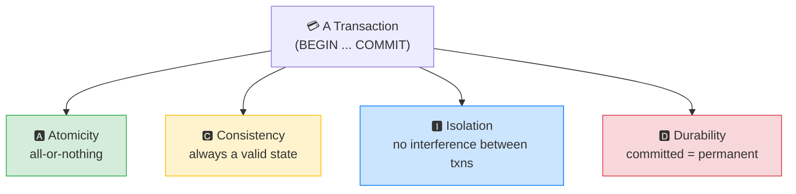
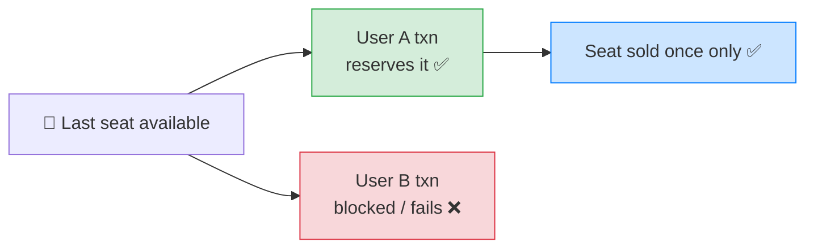

# 🔐 ACID Properties — Complete Study Notes (Interview Essential)

> Notes for becoming a strong software engineer. Easy language, real code, and interview-ready explanations.
> ⭐ Memorise this one — it comes up in **nearly every backend interview.**

---

## 📌 1. What is ACID? (in simple words)

**ACID** is the set of **four guarantees** that make traditional (relational) databases **trustworthy**. They ensure that even when things go wrong — crashes, errors, thousands of users at once — your data stays **correct**.

ACID = **A**tomicity, **C**onsistency, **I**solation, **D**urability.

These guarantees apply to **transactions** — a transaction is a **group of operations treated as one single unit** (wrapped in `BEGIN ... COMMIT`).

> Analogy 🏦: a bank transfer. Moving ₹100 from A to B is really *two* steps — subtract from A, add to B. ACID is the set of promises that make this safe: the two steps happen together or not at all (A), balances never go invalid (C), two transfers don't tangle (I), and once done it's permanent even if the power dies (D).

> 🎯 Interview line: *"ACID is the set of guarantees relational databases provide for transactions — Atomicity, Consistency, Isolation, and Durability — which together keep data correct even during failures and concurrent access."*



---

## 🅰️ 2. A — Atomicity (all-or-nothing)

A transaction is **all-or-nothing**. Either **every** operation in it succeeds, or **none** of them do. There's no "half-done" state.

The classic example — a bank transfer:

```sql
BEGIN;
UPDATE accounts SET balance = balance - 100 WHERE id = 1;  -- take from A
UPDATE accounts SET balance = balance + 100 WHERE id = 2;  -- give to B
COMMIT;
```

If **anything** fails between `BEGIN` and `COMMIT` (a crash, an error, a constraint violation), the database **rolls back both updates**. The world **never sees** the state where ₹100 left account A but never arrived in account B.

> Think of it like a **light switch** — it's either fully ON or fully OFF, never stuck halfway. Atomicity makes a transaction behave like one indivisible switch.

> 🎯 Atomicity in one line: *"A transaction either fully commits or fully rolls back — no partial results ever survive."*

---

## 🅲 3. C — Consistency (always a valid state)

The database always moves from **one valid state to another valid state**. Every transaction must respect **all the rules** — constraints, foreign keys, data types — both before and after it runs.

You can **never** end up with:
- an `orders` row pointing to a `customer_id` that doesn't exist (foreign key),
- two users with the same email (unique constraint),
- a negative price (check constraint).

```sql
BEGIN;
-- This will FAIL and roll back the whole transaction if customer 999 doesn't exist:
INSERT INTO orders (customer_id, total) VALUES (999, 500);  -- FK violation
COMMIT;   -- never reached → database stays valid
```

> Consistency leans on everything from the **Constraints** topic — the DBMS refuses to commit anything that would break a rule, so the data is *always* valid.

> 🎯 Consistency in one line: *"Every transaction leaves the database in a valid state with all constraints satisfied — invalid data can never be committed."*

> 💡 Subtle point for interviews: the **"C" is partly your responsibility too.** The DB enforces the rules you *define* (constraints); you must define the right ones. The DB can't know a business rule you never told it about.

---

## 🅸 4. I — Isolation (transactions don't interfere)

When many transactions run **at the same time**, isolation ensures they **don't step on each other** — each behaves as if it were running **alone**, even though they're concurrent.

The classic example — two users buying the **last** item:

```
Time →
User A:  BEGIN ... check stock (1 left) ... buy ... COMMIT
User B:           BEGIN ... check stock ... buy ... COMMIT
```

Without isolation, **both** might see "1 left" and both succeed → you've sold an item you don't have (**oversold**). Isolation prevents this — only **one** transaction wins; the other is correctly blocked or retried.



> 💡 Isolation has **levels** of strictness (Read Committed, Repeatable Read, Serializable...) — stricter = safer but slower. That's a separate, deeper topic. For now: **isolation = concurrent transactions don't corrupt each other's view of the data.**

> 🎯 Isolation in one line: *"Concurrent transactions don't interfere — each runs as if it had the database to itself, so two simultaneous bookings can't both grab the last seat."*

---

## 🅳 5. D — Durability (committed = permanent)

Once a transaction is **committed**, its data is **saved permanently** — even if the server **crashes one millisecond later**. A committed result never disappears.

**How?** The **Write-Ahead Log (WAL)**: the database first **writes a log of what it's about to do** to disk, *then* applies the change. If it crashes, on restart it **replays the log** to restore every committed transaction.

```
1. Transaction commits
2. Change is recorded in the WAL on disk  ✅ (this is what makes it durable)
3. CRASH 💥
4. Server restarts → replays the WAL → committed data is back
```

> Real meaning: when your payment app shows **"Payment successful,"** durability is the guarantee that this fact survives a crash a second later. Without it, that "success" could vanish.

> 🎯 Durability in one line: *"Once committed, data survives crashes — the write-ahead log records changes before applying them, so they can be replayed on recovery."* (This is the Durability you met in the DBMS-fundamentals note.)

---

## 🎤 6. The Interview Answer (memorise & say out loud)

> **Question:** *"Explain ACID with an example."*

This is a **60-second answer that signals competence.** Practise saying it smoothly in English:

> *"ACID is the set of guarantees relational databases provide for transactions.*
>
> ***Atomicity** means transactions are all-or-nothing — a bank transfer can't end up with money subtracted from one account but not added to the other.*
>
> ***Consistency** means the database stays in a valid state — all constraints and foreign keys hold before and after.*
>
> ***Isolation** means concurrent transactions don't interfere — two simultaneous bookings can't both reserve the last seat.*
>
> ***Durability** means once committed, data survives crashes — there's a write-ahead log that preserves committed transactions through restarts."*

> 💪 **Practice tip:** say this out loud until it flows in about 60 seconds without notes. Use **one consistent example** (bank transfer or booking) to tie all four together — it sounds far more polished than four unrelated examples.

> 🟢 Trap question: *"Which letter is YOUR responsibility, not just the database's?"* → *"Consistency, partly — the DB enforces the constraints I define, but I have to define the right ones. The other three are the database's machinery."*

> 🟢 Trap question: *"Do NoSQL databases have ACID?"* → *"Traditionally NoSQL favoured availability and scale over strict ACID (often 'eventual consistency'), but many modern ones (like MongoDB with multi-document transactions) now offer ACID guarantees too. It's a spectrum, not a hard line anymore."*

---

## 💻 7. Transactions in Practice (the mechanics)

ACID is delivered through **transactions**. The key commands:

```sql
BEGIN;                                  -- start a transaction
UPDATE accounts SET balance = balance - 100 WHERE id = 1;
UPDATE accounts SET balance = balance + 100 WHERE id = 2;
-- if all good:
COMMIT;                                 -- make it permanent (durable)
-- if something looks wrong instead:
ROLLBACK;                               -- undo everything since BEGIN (atomicity)
```

| Command | What it does |
|---|---|
| `BEGIN` (or `START TRANSACTION`) | Opens a transaction |
| `COMMIT` | Saves all changes permanently |
| `ROLLBACK` | Undoes all changes since `BEGIN` |
| `SAVEPOINT` | A partial checkpoint you can roll back to without aborting the whole txn |

> 💡 In app code (e.g. Node with `pg`), you wrap related writes in `BEGIN/COMMIT` and `ROLLBACK` in your error handler — so a failure halfway never leaves the database half-updated. This is exactly the safety habit from the CRUD and INSERT...SELECT notes, formalised.

---

## 💎 8. Impressive Words & Phrases

| Instead of saying... | Say this 💪 |
|---|---|
| "All or nothing" | "**Atomicity** — an indivisible unit of work" |
| "Stays valid" | "**Consistency** — constraints and invariants hold" |
| "Don't clash" | "**Isolation** — concurrent transactions don't interfere" |
| "Saved forever" | "**Durability** — committed data survives crashes" |
| "Undo it" | "**Roll back** the transaction" |
| "Save it" | "**Commit** the transaction" |
| "Group of operations" | "An **atomic unit of work / transaction**" |
| "Crash safety log" | "The **write-ahead log (WAL)**" |
| "Two buys clash" | "A **race condition** prevented by isolation" |
| "Levels of strictness" | "**Isolation levels** (Read Committed → Serializable)" |

**Power vocabulary:** *transaction, atomicity, consistency, isolation, durability, commit, rollback, savepoint, write-ahead log (WAL), isolation levels, race condition, invariant, eventual consistency, two-phase commit.*

> 🌶️ Bonus flex — **eventual consistency contrast:** *"ACID is the strong-consistency model of relational databases. Distributed/NoSQL systems often trade some of it for availability under the CAP theorem, settling for *eventual* consistency. Knowing when you need strict ACID — like payments — versus when eventual consistency is fine — like a like-counter — is a real design decision."* This shows system-design maturity.

---

## ⏱️ 9. Quick Revision (read 5 min before interview)

> **ACID = 4 transaction guarantees** that make databases trustworthy. A transaction = a group of operations as one unit (`BEGIN ... COMMIT`).
>
> - **A — Atomicity:** all-or-nothing. Failure → `ROLLBACK` everything. *(Bank transfer: never subtract without adding.)*
> - **C — Consistency:** always a valid state; all constraints/FKs hold. *(No order pointing to a non-existent customer.)*
> - **I — Isolation:** concurrent transactions don't interfere. *(Two buyers can't both get the last seat.)* Has **levels**.
> - **D — Durability:** committed data survives crashes, via the **write-ahead log (WAL)**. *("Payment successful" stays true after a crash.)*
>
> **Commands:** `BEGIN` → `COMMIT` (save) / `ROLLBACK` (undo). `SAVEPOINT` = partial checkpoint.
>
> **Golden line (the 60-sec answer):** *"ACID gives transactions four guarantees — atomicity (all-or-nothing), consistency (always valid), isolation (no interference between concurrent transactions), and durability (committed data survives crashes via the write-ahead log)."*

---

### ✅ Practice checklist
- [ ] Write a bank-transfer transaction with `BEGIN ... COMMIT`
- [ ] Force a failure mid-transaction and confirm `ROLLBACK` undoes both updates
- [ ] Trigger a constraint violation inside a txn → see consistency protect the DB
- [ ] Explain the last-seat example for isolation in your own words
- [ ] Explain the write-ahead log for durability at a high level
- [ ] 🎤 **Say the full 60-second ACID answer out loud** until it flows naturally
- [ ] Be ready for "which letter is your responsibility?" (Consistency, partly)

⭐ This is one of the **highest-ROI things to memorise** for backend interviews. A crisp 60-second ACID answer instantly signals you know how databases really work. 🚀
