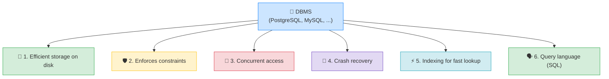
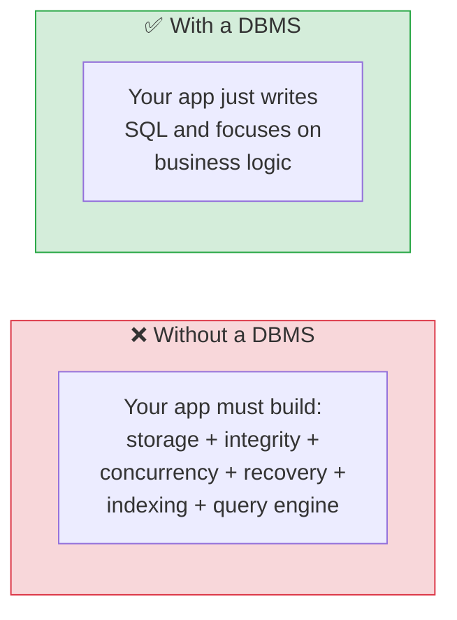

# 🧠 DBMS Fundamentals — What a DBMS Actually Does — Complete Study Notes

> Notes for becoming a strong software engineer. Easy language, real examples, and interview-ready explanations.
> The theory layer: understanding *why* a database is more than "a place to store data."

---

## 📌 1. What is a DBMS? (in simple words)

A **DBMS (Database Management System)** is the **software that manages your data** for you. PostgreSQL, MySQL, SQL Server, Oracle, and SQLite are all DBMS.

The important shift in thinking:

> A DBMS is not "a folder where data sits." It's a whole **program** that solves a pile of genuinely hard problems — storing data safely, letting thousands of people use it at once, surviving crashes, and finding things fast — so **you don't have to build any of that yourself.**

> Analogy 🏦: a DBMS is like a **bank**, not a piggy bank. A piggy bank just *holds* money. A bank also: keeps your money safe, lets thousands of customers transact at the same time without mixing up balances, survives a power cut without losing your deposit, keeps records, and lets you ask "what's my balance?" instantly. A DBMS does all of that — for data.

> 🎯 Interview line: *"A DBMS is the software layer that manages data — storage, integrity, concurrency, crash recovery, indexing, and a query language. Without it, every application would have to re-solve these hard problems on its own."*

---

## ⚙️ 2. The 6 Things a DBMS Handles For You



---

### 💾 1. Stores data on disk efficiently

The DBMS decides **how bytes are laid out on disk** — in pages, blocks, and files — so reads and writes are fast and space is used well. You just say `INSERT INTO users ...`; you never think about disk sectors or file formats.

> Without a DBMS, you'd be writing your own file format, managing how rows are packed, handling growth and fragmentation — a huge, error-prone job.

---

### 🛡️ 2. Enforces constraints (data integrity)

The DBMS guarantees your **rules** are never broken — no duplicate emails, no negative prices, no **orphan foreign keys** (a post pointing to a user that doesn't exist). (This is the whole Constraints topic.)

```sql
email VARCHAR(255) UNIQUE          -- DBMS guarantees no duplicates
user_id INTEGER REFERENCES users(id) -- DBMS guarantees the user exists
```

> The DBMS is the **final gatekeeper** — these rules hold no matter which app, script, or person writes the data.

---

### 👥 3. Handles concurrent access (the hard one)

Thousands of users read and write **at the same time**, and each must get **consistent results** — nobody sees half-finished data, and two people updating the same row don't corrupt it.

> Imagine 10,000 people booking the *last* movie seat at the exact same millisecond. The DBMS makes sure **only one** succeeds and the rest are correctly told "sold out" — using **locks**, **transactions**, and **isolation**. Building this correctly yourself is extremely hard; the DBMS gives it to you.

> 🎯 This is often the **#1 reason** to use a real DBMS over flat files — concurrency done right.

---

### 🔄 4. Recovers from crashes without losing committed data

If the server **loses power mid-write**, the DBMS still guarantees that any data you **committed** is safe when it restarts — and any half-done work is cleanly undone.

> It does this with a **write-ahead log (WAL)** — it records *what it's about to do* before doing it. After a crash, it replays the log to restore a consistent state. (This is the **D — Durability** in ACID, a later topic.)

> Real meaning: when your payment app says "payment successful," a DBMS guarantees that fact survives a crash one second later.

---

### ⚡ 5. Indexes data for fast lookup

The DBMS maintains **indexes** so it can find rows without scanning the whole table — the difference between reading 1 row and reading 1,000,000. (The whole Indexes topic.)

```sql
CREATE INDEX idx_users_email ON users(email);  -- fast lookups by email
```

---

### 🗣️ 6. Provides a query language (SQL)

You describe **what** you want (`SELECT name FROM users WHERE id = 5`), and the DBMS figures out **how** to get it — which index to use, what order to join, how to read the disk. You think in **data**, not in disk pages.

> This is **declarative** programming: you state the goal, the DBMS's **query planner** works out the optimal steps.

> 🎯 Interview line: *"SQL is declarative — I say what data I want, and the DBMS's query planner decides how to fetch it efficiently. That abstraction is a huge part of a DBMS's value."*

---

## 🧰 3. Why This Matters: "For Free"

The big point: **without a DBMS, every application would have to solve all six problems itself.** Storage formats, integrity checks, concurrency control, crash recovery, indexing, a query layer — each is a hard, specialised problem that has taken database engineers **decades** to get right.

The DBMS gives you all of it **for free**, battle-tested, so you can focus on **your application's logic** instead of reinventing a database.

> 💡 This is also *why* you should resist the urge to "just use a JSON file" or roll your own storage for anything serious — you'll slowly, painfully reinvent a worse DBMS.



---

## 🗂️ 4. Where a DBMS Sits (the mental picture)

```
┌────────────────┐     SQL queries      ┌──────────────────────────┐
│  Your App      │  ───────────────────▶ │  DBMS (PostgreSQL)       │
│ (Node, etc.)   │  ◀─────────────────── │  • storage engine        │
└────────────────┘     rows / results    │  • constraint checker    │
                                          │  • concurrency control   │
                                          │  • crash recovery (WAL)  │
                                          │  • indexes               │
                                          │  • query planner         │
                                          └───────────┬──────────────┘
                                                      │ reads/writes
                                                      ▼
                                                ┌──────────┐
                                                │   Disk   │
                                                └──────────┘
```

Your app talks SQL to the DBMS; the DBMS does all the heavy lifting against the disk and hands back clean results.

---

## 🎤 5. How to Explain in an Interview

**Step 1 — Definition:**
> "A DBMS is the software that manages data — Postgres, MySQL, and so on. It's much more than storage."

**Step 2 — The six jobs:**
> "It handles efficient disk storage, enforces constraints for integrity, manages concurrent access so many users get consistent results, recovers from crashes without losing committed data, maintains indexes for fast lookups, and gives you SQL as a declarative query language."

**Step 3 — Concurrency & recovery as the hard parts:**
> "The genuinely hard parts are concurrency — thousands of simultaneous reads and writes staying consistent — and crash recovery via a write-ahead log, so committed data survives a power failure."

**Step 4 — The value:**
> "Without a DBMS, every app would re-solve all of these. The DBMS gives them to you, battle-tested, so you focus on business logic."

> 🟢 Trap question: *"Why not just store everything in a JSON file?"* → *"A file gives you none of this — no concurrency control, so simultaneous writes corrupt each other; no crash safety; no integrity rules; no indexing, so lookups get slow; and no query language. You'd end up reinventing a worse database."*

> 🟢 Trap question: *"What's the difference between SQLite and PostgreSQL — both are DBMS?"* → *"Both are relational DBMS, but SQLite is embedded (a single file, in-process, great for apps/devices with light concurrency), while Postgres is a full client-server system built for heavy concurrent access, advanced features, and scale."*

---

## 💎 6. Impressive Words & Phrases

| Instead of saying... | Say this 💪 |
|---|---|
| "Database software" | "A **DBMS** / **database engine**" |
| "Stops bad data" | "Enforces **data integrity** via constraints" |
| "Many users at once" | "**Concurrency control** (locks, isolation)" |
| "Doesn't lose data on crash" | "**Durability** via a **write-ahead log (WAL)**" |
| "Finds rows fast" | "**Indexed lookups** via the storage engine" |
| "You write SQL, it figures it out" | "**Declarative** queries optimised by the **query planner**" |
| "How data sits on disk" | "The **storage engine** / on-disk layout (pages)" |
| "It does it all for you" | "It **abstracts** away storage, concurrency, and recovery" |
| "No half-finished data seen" | "**Consistency / isolation** guarantees" |

**Power vocabulary:** *DBMS, storage engine, data integrity, concurrency control, isolation, write-ahead log (WAL), durability, query planner, declarative language, abstraction, ACID, page/block storage, embedded vs client-server.*

> 🌶️ Bonus flex — **declarative vs imperative:** *"SQL is declarative — I describe the desired result and the DBMS's planner decides the execution. That's the opposite of imperative code where I'd spell out every step. It's why the same SQL can get faster just by adding an index — the planner adapts."* This contrast sounds genuinely senior.

---

## ⏱️ 7. Quick Revision (read 5 min before interview)

> **DBMS = software that manages data** (Postgres, MySQL, SQLite, Oracle, SQL Server). More than storage — it's a bank, not a piggy bank.
>
> **6 jobs it does for you:**
> 1. **Efficient disk storage** (pages/blocks — you never touch them).
> 2. **Constraints / integrity** (no duplicates, no orphan foreign keys).
> 3. **Concurrency** — thousands of simultaneous users, consistent results (locks, isolation). *The hard one.*
> 4. **Crash recovery** — committed data survives power loss (**write-ahead log**, = Durability in ACID).
> 5. **Indexing** — fast lookups instead of full scans.
> 6. **SQL** — a **declarative** language; the **query planner** decides *how*.
>
> **Why it matters:** without it, every app re-solves all six hard problems. The DBMS gives them **for free**, battle-tested.
>
> **Golden line:** *"A DBMS isn't just storage — it gives you integrity, concurrency, crash recovery, indexing, and a declarative query language for free, so you build features instead of reinventing a database."*

---

### ✅ Understanding checklist (conceptual — explain each out loud)
- [ ] Name the 6 things a DBMS does for you
- [ ] Explain *why concurrency* is the hard problem (the last-movie-seat example)
- [ ] Explain how crash recovery works at a high level (write-ahead log)
- [ ] Explain what "declarative" means (you say what, not how)
- [ ] Answer "why not just use a JSON file?" convincingly
- [ ] Explain the difference between SQLite (embedded) and Postgres (client-server)

This is the *why* behind everything else — once you see what a DBMS quietly handles, every SQL feature you've learned makes more sense. 🚀
