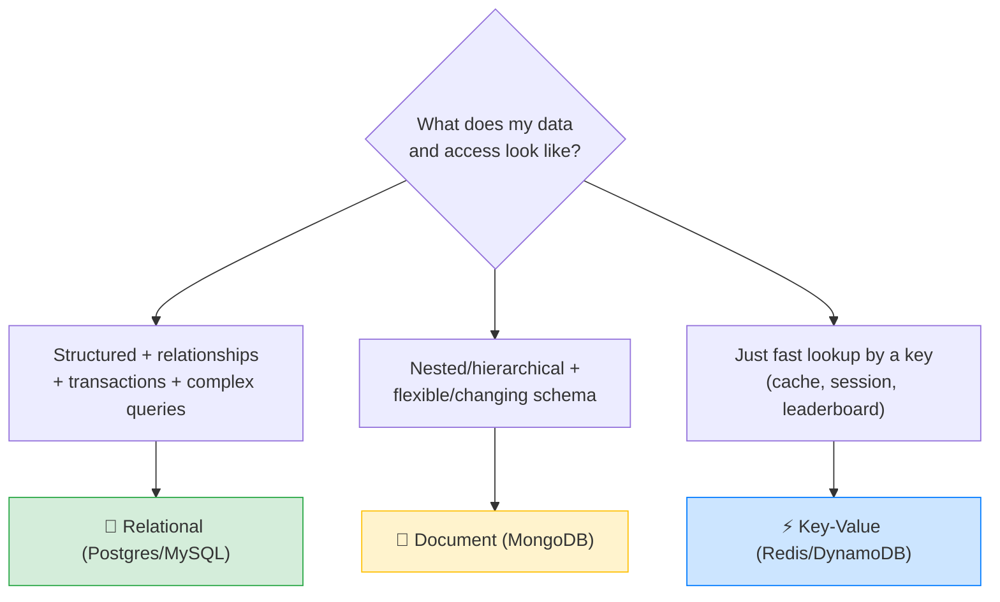
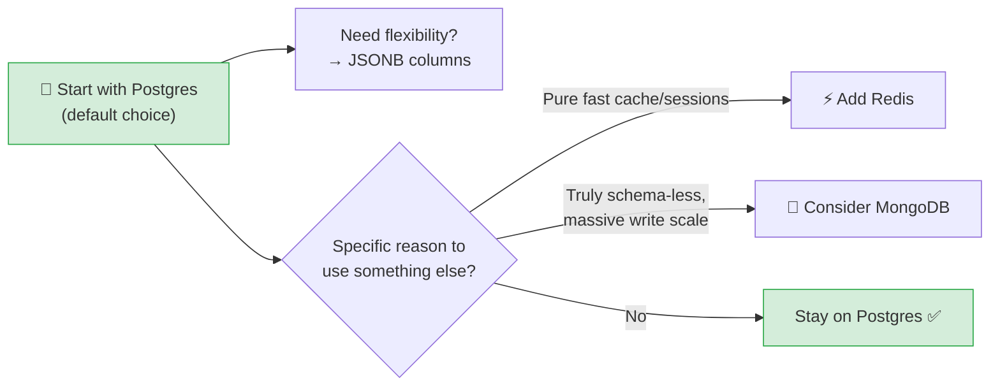

# ⚖️ SQL vs NoSQL — When to Use Which — Complete Study Notes

> Notes for becoming a strong software engineer. Easy language, real examples, and interview-ready explanations.
> A classic interview question — what matters is showing **balanced judgement**, not picking a "favourite."

---

## 📌 1. The Big Picture

"SQL vs NoSQL" isn't a fight where one wins. They're **different tools for different shapes of data and access patterns.** A senior engineer picks based on the **problem**, not on hype.

- **SQL (relational)** → Postgres, MySQL. Data in **tables** with strict **relationships** and **ACID** guarantees.
- **NoSQL** → an umbrella for several non-relational types. The three you should know:
  - **Document** (MongoDB) → flexible JSON-like documents.
  - **Key-Value** (Redis, DynamoDB) → super-fast lookups by a key.
  - (others: column-family, graph — but the above three cover most interviews.)

> Analogy 🧰: it's like tools in a toolbox. SQL is a **precise, sturdy spanner** — perfect when parts fit together in a known way (relationships, transactions). A document DB is a **flexible multi-tool** — handy when the shape keeps changing. A key-value store is a **super-fast screwdriver** — does one thing (lookup by key) extremely fast. You don't argue which tool is "best"; you pick by the job.

> 🎯 Interview line: *"SQL and NoSQL aren't competitors — they solve different problems. I choose based on the data's structure, the consistency requirements, and the access patterns, not on trends."*



---

## 🐘 2. Use a Relational Database (Postgres, MySQL) when...

| Reason | Example |
|---|---|
| **Data is structured & relationships matter** | E-commerce: users → orders → products (the classic) |
| **You need ACID transactions across rows/tables** | Banking, inventory — money must never be half-moved |
| **You need complex queries** | Joins, aggregations, reports, analytics |
| **The schema is reasonably stable** | Well-understood domain that doesn't change shape daily |

```sql
-- Relational shines at queries like this across related tables:
SELECT u.name, COUNT(o.id) AS orders, SUM(o.total) AS spent
FROM users u
LEFT JOIN orders o ON u.id = o.user_id
GROUP BY u.id, u.name
ORDER BY spent DESC;
```

> 🎯 Strength in one line: *"Relational databases excel at structured data with relationships, multi-table ACID transactions, and complex queries."*

---

## 📄 3. Use a Document Database (MongoDB) when...

| Reason | Example |
|---|---|
| **Data is naturally nested/hierarchical** | A blog post with its comments embedded inside it |
| **Schema changes often or varies per record** | Each product has wildly different attributes |
| **You need easy horizontal write scaling** | Massive write volume spread across many servers |
| **You rarely need joins across collections** | Self-contained documents read as one unit |

```js
// A document stores related data together, nested:
{
  _id: "post_1",
  title: "Learning Databases",
  author: { name: "Nayan", id: 7 },
  comments: [                          // embedded, no join needed
    { user: "Amit", text: "Great post!" },
    { user: "Riya", text: "Thanks!" }
  ],
  tags: ["sql", "mongodb"]
}
```

> 💡 The big appeal: read the whole post + its comments in **one** fetch, no join. The trade-off: data can get **duplicated** across documents, and there's no built-in referential integrity.

> 🎯 Strength in one line: *"Document databases fit nested, flexible data that's read as a self-contained unit and needs easy write scaling."*

---

## ⚡ 4. Use a Key-Value Store (Redis, DynamoDB) when...

| Reason | Example |
|---|---|
| **You need extremely fast lookups by key** | "Give me the value for `session:abc123`" in microseconds |
| **Data fits a simple key → value model** | Caching, user sessions, leaderboards, rate-limit counters |
| **You don't need complex queries** | No joins, no reports — just get/set by key |

```
SET session:abc123  "{userId: 7, role: 'admin'}"   EX 3600   -- cache a session, 1hr TTL
GET session:abc123                                            -- blazing-fast lookup
INCR leaderboard:player42                                     -- atomic counter
```

> 💡 Redis is often used **alongside** Postgres — Postgres as the source of truth, Redis as a fast cache in front of it. They're partners, not rivals. (Connects to your access/refresh-token notes — Redis for the token denylist.)

> 🎯 Strength in one line: *"Key-value stores give microsecond lookups by key — perfect for caching, sessions, and counters, not for complex queries."*

---

## 🎯 5. The Honest 2026 Reality (the senior take)

This is the part that makes you sound experienced, not just textbook:

> **Postgres handles ~90% of use cases.** And its **JSONB** column type lets it act as a document database *when you need flexibility* — while keeping all the relational power (joins, transactions, constraints).

```sql
-- Postgres with JSONB: structured columns AND flexible nested data, together
CREATE TABLE products (
    id         SERIAL PRIMARY KEY,
    name       VARCHAR(200) NOT NULL,        -- structured
    price      DECIMAL(10,2) NOT NULL,       -- structured + constrained
    attributes JSONB                          -- flexible, varies per product
);

-- Query inside the JSON, and even index it:
SELECT name FROM products WHERE attributes->>'color' = 'red';
CREATE INDEX idx_attrs ON products USING GIN (attributes);  -- fast JSONB queries
```

> Most *"we need MongoDB for flexibility"* arguments are **weaker than they sound** — Postgres with JSONB is more flexible than people realise, and you don't give up relational guarantees. **Default to Postgres unless you have a specific, concrete reason to use something else.**

> 🎯 Interview line: *"My default is Postgres — it covers most use cases, and JSONB gives document-style flexibility without losing relational power. I'd only reach for MongoDB or a key-value store when there's a specific reason, like genuinely schema-less data or pure cache-style lookups."*



---

## 🎤 6. How to Explain in an Interview

**Step 1 — Frame it as a tool choice:**
> "They're not rivals — they solve different problems. I choose by data structure, consistency needs, and access patterns."

**Step 2 — When SQL:**
> "Relational for structured data with relationships, multi-table ACID transactions, and complex queries — like e-commerce or banking."

**Step 3 — When document:**
> "Document databases for nested, flexible data read as a self-contained unit, with easy write scaling and few cross-collection joins."

**Step 4 — When key-value:**
> "Key-value stores for microsecond lookups by key — caching, sessions, leaderboards — often alongside Postgres, not instead of it."

**Step 5 — The default (the strong finish):**
> "In practice I default to Postgres — it handles most cases, and JSONB gives document-style flexibility while keeping relational power. I switch only with a concrete reason."

> 🟢 Trap question: *"Isn't NoSQL faster than SQL?"* → *"Not inherently. NoSQL can scale writes more easily and skip join overhead, but it usually trades away ACID and consistency. For lookups, a well-indexed Postgres query is extremely fast too. 'Faster' depends entirely on the access pattern — there's no blanket winner."*

> 🟢 Trap question: *"When would you genuinely pick MongoDB over Postgres?"* → *"When records are truly schema-less or vary a lot per document, the data is read as one self-contained unit, and I need to scale writes horizontally without complex joins. But I'd be honest that JSONB covers many 'flexibility' cases without leaving Postgres."*

---

## 💎 7. Impressive Words & Phrases

| Instead of saying... | Say this 💪 |
|---|---|
| "Tables database" | "**Relational** database (RDBMS)" |
| "Not-tables database" | "**Non-relational / NoSQL** store" |
| "Flexible structure" | "**Schema-less / flexible schema**" |
| "Nested data together" | "**Embedded documents** (denormalised)" |
| "Spread across servers" | "**Horizontal scaling / sharding**" |
| "Fast key lookups" | "**O(1) key-value access**" |
| "Eventually correct" | "**Eventual consistency** (vs strong ACID)" |
| "Postgres can do JSON" | "**JSONB** for document-style flexibility" |
| "Query inside the JSON" | "**Semi-structured** querying" |
| "Use the right one" | "Choose by **access pattern** and **consistency requirements**" |

**Power vocabulary:** *relational vs non-relational, schema-less, embedded documents, horizontal scaling, sharding, eventual consistency vs strong consistency, CAP theorem, JSONB, semi-structured data, access pattern, source of truth, polyglot persistence.*

> 🌶️ Bonus flex — **polyglot persistence:** *"Real systems often use multiple databases together — Postgres as the source of truth, Redis for caching, maybe a search engine for full-text. That's called polyglot persistence: pick the right store per job rather than forcing one database to do everything."* This phrase signals real architecture maturity.

---

## ⏱️ 8. Quick Revision (read 5 min before interview)

> **Not a fight — different tools.** Choose by data shape, consistency needs, access patterns.
>
> **Relational (Postgres/MySQL):** structured data + relationships + multi-table **ACID** + complex queries (joins/aggregations) + stable schema. → *e-commerce, banking.*
>
> **Document (MongoDB):** nested/hierarchical data + flexible/changing schema + easy write scaling + few joins. → *blog post with embedded comments.*
>
> **Key-Value (Redis/DynamoDB):** microsecond lookups by key + simple key→value + no complex queries. → *caching, sessions, leaderboards.* Often used **alongside** Postgres.
>
> **2026 reality:** Postgres handles ~90% of cases; **JSONB** gives document flexibility without losing relational power. **Default to Postgres** unless there's a specific reason.
>
> **Golden line:** *"Default to Postgres — it covers most cases and JSONB adds document flexibility while keeping joins and ACID. I reach for NoSQL only with a concrete reason like schema-less data or pure cache-style lookups."*

---

### ✅ Understanding checklist (explain each out loud)
- [ ] Name the 3 NoSQL types and one use case for each
- [ ] Give the 4 reasons to choose a relational database
- [ ] Explain when a document DB genuinely fits (and when JSONB covers it instead)
- [ ] Explain why Redis is often used *with* Postgres, not instead
- [ ] State the "default to Postgres" reasoning convincingly
- [ ] Answer "isn't NoSQL faster?" with nuance (no blanket winner)
- [ ] Drop "polyglot persistence" naturally

This is a judgement question, not a trivia question. Showing you choose by **trade-offs** — and defaulting sensibly to Postgres — is exactly what signals a strong engineer. 🚀
