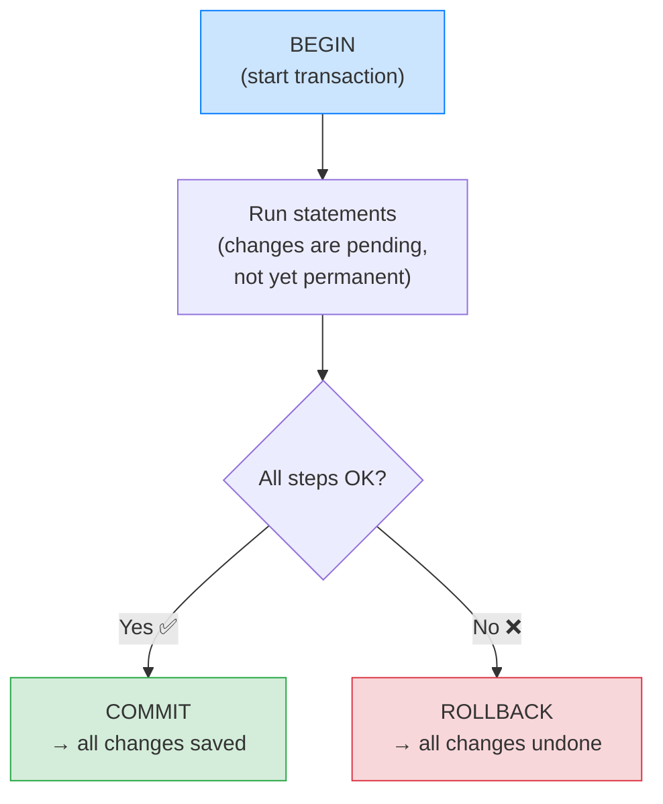

# 💳 Transactions (The Basic Mental Model) — Complete Study Notes

> Notes for becoming a strong software engineer. Easy language, real code, and interview-ready explanations.
> The practical companion to ACID — how to actually *use* transactions in real code.

---

## 📌 1. What is a Transaction? (in simple words)

A **transaction** is a **unit of work that should succeed or fail as a whole.** You group several statements together and tell the database: *"treat all of these as ONE thing — either do all of them, or do none of them."*

> Analogy 🛒: think of an online checkout. "Place order" really means: (1) charge the card, (2) reduce stock, (3) create the order record. You'd never want step 1 to succeed but step 2 to fail — you'd have charged someone for an item you didn't reserve. A transaction bundles all three so they happen **together or not at all.**

This is the **Atomicity** from the ACID notes, made practical.

> 🎯 Interview line: *"A transaction is a group of operations treated as a single all-or-nothing unit. Either every statement commits together, or the whole thing rolls back — so the data is never left half-updated."*

---

## 🛠️ 2. The Three Commands

```sql
BEGIN;
  -- multiple statements here
  UPDATE ...
  INSERT ...
COMMIT;     -- ✅ save ALL changes permanently
-- OR --
ROLLBACK;   -- ❌ discard ALL changes since BEGIN
```

| Command | What it does |
|---|---|
| `BEGIN` (or `START TRANSACTION`) | Opens a transaction — changes are now "pending" |
| `COMMIT` | Saves **everything** since `BEGIN`, permanently |
| `ROLLBACK` | Undoes **everything** since `BEGIN`, as if it never happened |



> 💡 Between `BEGIN` and `COMMIT`, your changes are **invisible to everyone else** and not yet permanent. Only `COMMIT` makes them real and visible. `ROLLBACK` (or a crash) throws them away cleanly.

---

## ✅ 3. When to Use Transactions

Use a transaction whenever **multiple writes must succeed or fail together**:

1. **Money / inventory operations — ALWAYS.** Transfers, payments, stock changes. Partial completion here = real-world damage (lost money, oversold stock).
2. **Multi-step updates that must succeed together.** e.g. create an order *and* its order-items *and* decrement stock.
3. **Anything where partial completion would corrupt your data.** If "half-done" is a broken state, wrap it.

```sql
-- Checkout: all three must happen together
BEGIN;
  UPDATE products SET stock = stock - 1 WHERE id = 50;
  INSERT INTO orders (user_id, product_id, total) VALUES (7, 50, 999);
  UPDATE users SET loyalty_points = loyalty_points + 10 WHERE id = 7;
COMMIT;
```

If the `INSERT` fails (say, a constraint violation), `ROLLBACK` ensures the stock isn't decremented and points aren't added — the world stays consistent.

> 🎯 Interview line: *"My rule: any time I have two or more writes that only make sense together — especially money or inventory — I wrap them in a transaction so a failure halfway can't leave the data in a broken state."*

---

## 🐛 4. The #1 Production Bug — Forgetting the Transaction

This is the **most common transaction-related bug**, and it's worth knowing cold.

> Your code does **step 1** (succeeds), then **step 2** (fails). Now your data is in an **invalid state** — step 1 happened, step 2 didn't, and there's no transaction to undo step 1.

Real example — a money transfer **without** a transaction:

```js
// ❌ DANGEROUS — no transaction
await db.query('UPDATE accounts SET balance = balance - 100 WHERE id = 1'); // ✅ succeeds
await db.query('UPDATE accounts SET balance = balance + 100 WHERE id = 2'); // 💥 crashes here
// Result: ₹100 vanished from account 1, never arrived in account 2. Money lost. 😱
```

The fix — wrap both in a transaction so a failure rolls back **everything**:

```js
// ✅ SAFE
const client = await pool.connect();
try {
  await client.query('BEGIN');
  await client.query('UPDATE accounts SET balance = balance - 100 WHERE id = 1');
  await client.query('UPDATE accounts SET balance = balance + 100 WHERE id = 2');
  await client.query('COMMIT');           // both succeed together
} catch (err) {
  await client.query('ROLLBACK');         // any failure → undo everything
  throw err;
} finally {
  client.release();
}
```

> 🎯 Interview line: *"The most common transaction bug is simply forgetting to use one — step one succeeds, step two fails, and now the data is corrupt. The fix is to wrap multi-step operations in BEGIN/COMMIT with ROLLBACK in the error handler."*

> 💡 The pattern is always: **`BEGIN` → do the work → `COMMIT` on success → `ROLLBACK` in the `catch`.** Make this muscle memory.

---

## 🧩 5. SAVEPOINT — Partial Rollback (good to know)

Sometimes you want to undo **part** of a transaction without aborting the whole thing. That's a **SAVEPOINT** — a checkpoint you can roll back to.

```sql
BEGIN;
  INSERT INTO orders (...) VALUES (...);
  SAVEPOINT before_discount;
  UPDATE orders SET total = total * 0.9 WHERE id = 1;  -- try a discount
  -- changed our mind / it failed:
  ROLLBACK TO before_discount;                          -- undo just the discount
  -- the INSERT above is still intact
COMMIT;
```

> Foundation level: just know SAVEPOINTs exist for partial rollbacks. You won't need them often, but mentioning them shows depth.

---

## ⚡ 6. A Note on Concurrency (the next level)

When **multiple transactions run at the same time**, things get subtle — two transactions touching the same rows can interfere. The database controls this with **isolation levels** (different strictness settings).

For now, the foundation rule is enough:

> **When you have multiple writes that must be consistent together, wrap them in `BEGIN`/`COMMIT`.**

The deeper details — isolation levels (Read Committed, Repeatable Read, Serializable) and the anomalies they prevent — are a separate, more advanced topic. You don't need them to use transactions correctly today.

> 💡 One practical tip you *can* use now: keep transactions **short**. A transaction that stays open a long time holds locks and blocks other users. Do the work, commit quickly, don't `BEGIN` and then wait on a slow API call inside it.

---

## 🎤 7. How to Explain in an Interview

**Step 1 — What it is:**
> "A transaction groups multiple operations into one all-or-nothing unit — either all commit, or all roll back."

**Step 2 — The commands:**
> "BEGIN starts it, COMMIT saves everything, ROLLBACK undoes everything since BEGIN."

**Step 3 — When to use:**
> "Any time multiple writes must succeed together — money, inventory, multi-step updates. Anywhere partial completion would corrupt data."

**Step 4 — The common bug:**
> "The classic bug is forgetting a transaction — step one succeeds, step two fails, data is now inconsistent. I wrap multi-step writes in BEGIN/COMMIT and ROLLBACK in the catch block."

**Step 5 — Good practice:**
> "I keep transactions short so they don't hold locks and block other users, and I avoid slow operations like external API calls inside them."

> 🟢 Trap question: *"A transfer debited one account but never credited the other — what went wrong?"* → *"The two updates weren't in a transaction. Step one committed, step two failed, and there was nothing to roll back step one. Wrapping both in BEGIN/COMMIT with ROLLBACK on error prevents it."*

> 🟢 Trap question: *"Is a single UPDATE a transaction?"* → *"Yes — in most databases every statement runs in its own implicit transaction (auto-commit). You only need explicit BEGIN/COMMIT when you want *multiple* statements to be atomic together."*

---

## 💎 8. Impressive Words & Phrases

| Instead of saying... | Say this 💪 |
|---|---|
| "Group of operations" | "An **atomic unit of work / transaction**" |
| "Save the changes" | "**Commit** the transaction" |
| "Undo the changes" | "**Roll back** the transaction" |
| "Half-done data" | "A **partially-applied / inconsistent state**" |
| "Wrap the steps" | "Wrap writes in a **transactional boundary**" |
| "Partial undo" | "Roll back to a **SAVEPOINT**" |
| "Don't hold it open long" | "Keep transactions **short** to minimise **lock contention**" |
| "Two transactions clash" | "**Concurrency** handled via **isolation levels**" |
| "Each statement auto-saves" | "**Auto-commit** mode (implicit transaction)" |

**Power vocabulary:** *transaction, atomic unit of work, commit, rollback, savepoint, transactional boundary, auto-commit, lock contention, isolation level, partial application, all-or-nothing.*

> 🌶️ Bonus flex — **keep transactions short:** *"A transaction holds locks until it commits, so a long-running transaction blocks others. I keep them tight — do the writes, commit fast, and never wait on a slow external call inside an open transaction."* This shows real production awareness, not just textbook knowledge.

---

## ⏱️ 9. Quick Revision (read 5 min before interview)

> **Transaction = a unit of work that succeeds or fails as a whole** (all-or-nothing → the "A" in ACID).
>
> **Commands:** `BEGIN` (start) → `COMMIT` (save all) / `ROLLBACK` (undo all). `SAVEPOINT` = partial rollback point.
>
> **When to use:** money/inventory **always**, multi-step updates that must succeed together, anything where "half-done" = corrupt.
>
> **#1 bug:** forgetting a transaction → step 1 succeeds, step 2 fails → inconsistent data. **Fix:** wrap in `BEGIN/COMMIT`, `ROLLBACK` in the `catch`.
>
> **The code pattern:** `BEGIN → do work → COMMIT on success → ROLLBACK on error`.
>
> **Good practice:** keep transactions **short** (they hold locks); no slow API calls inside them.
>
> **Golden line:** *"Any time multiple writes only make sense together — especially money or inventory — I wrap them in a transaction, so a failure halfway rolls everything back instead of corrupting the data."*

---

### ✅ Practice checklist
- [ ] Write a multi-step transaction (`BEGIN ... COMMIT`) — e.g. a checkout
- [ ] Force a failure mid-transaction and confirm `ROLLBACK` undoes everything
- [ ] Write the Node pattern: `BEGIN` in `try`, `COMMIT` on success, `ROLLBACK` in `catch`
- [ ] Try a `SAVEPOINT` and `ROLLBACK TO` it (partial undo)
- [ ] Reproduce the "transfer without a transaction" bug, then fix it
- [ ] Explain out loud why long-running transactions are bad (locks)

> 💡 This is the practical, everyday companion to ACID. ACID is the *theory*; transactions with `BEGIN/COMMIT/ROLLBACK` are how you *apply* it in real code. Get the habit ingrained and you'll never corrupt data with a half-finished operation. 🚀
