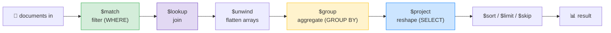

# 🍃 MongoDB Aggregation Pipelines — Complete Study Notes

> Notes for becoming a strong software engineer. Easy language, real code, and interview-ready explanations.
> MongoDB's analytical querying powerhouse — and many stages map directly to the SQL you already know.

---

## 📌 1. What is the Aggregation Pipeline?

The aggregation pipeline is MongoDB's way of doing **complex data processing** — filtering, grouping, joining, reshaping — as a **series of stages.** Documents flow through the pipeline, and **each stage transforms the stream** before passing it to the next.

> Analogy 🏭: think of a **factory assembly line.** Raw documents enter at one end; each station (stage) does one job — one filters, one groups, one reshapes — and the finished result comes out the other end. The output of each station is the input to the next.

It's MongoDB's answer to a complex SQL query — but instead of one big nested statement, you compose **small, ordered steps** (which actually reads a lot like CTEs from your advanced-SQL notes).

> 🎯 Interview line: *"The aggregation pipeline processes documents through an ordered series of stages, each transforming the stream — `$match` to filter, `$group` to aggregate, `$lookup` to join, `$project` to reshape. It's how MongoDB does the complex querying that SQL does with WHERE, GROUP BY, JOIN, and SELECT."*

---

## 📄 2. First — When a Document DB Beats Relational

Quick context (ties to your SQL-vs-NoSQL note). A document database shines when:
- **Flexible schema** — records vary in shape, fields change often.
- **Deeply nested data** — naturally hierarchical documents (a post with embedded structure).
- **No joins needed often** — self-contained documents read as one unit.

The aggregation pipeline is what lets you still do *powerful* analytical queries on that document data when you need to.

---

## 🔧 3. The Core Stages



| Stage | What it does | SQL equivalent |
|---|---|---|
| **`$match`** | Filter documents | `WHERE` |
| **`$group`** | Aggregate per group | `GROUP BY` + COUNT/SUM/AVG |
| **`$project`** | Reshape / choose fields | `SELECT` (columns + computed) |
| **`$lookup`** | Join another collection | `JOIN` |
| **`$unwind`** | Split an array into one doc per element | (no direct SQL equiv) |
| **`$sort`** | Order results | `ORDER BY` |
| **`$limit`** / **`$skip`** | Cap / skip rows | `LIMIT` / `OFFSET` |
| **`$facet`** | Run multiple sub-pipelines in parallel | (no direct SQL equiv) |

> 💡 **Put `$match` first!** Filtering early shrinks the document stream so later stages do less work — and `$match` at the start can **use indexes** (later stages can't). This is the #1 aggregation performance rule.

### `$match` — filter (like WHERE)
```javascript
{ $match: { city: "Bangalore", age: { $gte: 18 } } }
```

### `$group` — aggregate (like GROUP BY)
```javascript
{ $group: {
    _id: "$city",                      // the group key (what you GROUP BY)
    count: { $sum: 1 },                // count docs per city
    avgAge: { $avg: "$age" }           // average age per city
} }
```
> `_id` is the **group key**; the **accumulators** (`$sum`, `$avg`, `$max`, `$push`) compute per group. `$sum: 1` counts documents (like `COUNT(*)`).

### `$project` — reshape (like SELECT)
```javascript
{ $project: { name: 1, city: 1, _id: 0, ageNextYear: { $add: ["$age", 1] } } }
```
> Choose fields (like projection) **and** compute new ones.

### `$lookup` — join (from your relationships notes)
```javascript
{ $lookup: { from: "users", localField: "user_id", foreignField: "_id", as: "author" } }
```

### `$unwind` — flatten an array
```javascript
{ $unwind: "$author" }     // turns the author array into a single object (one doc per element)
```
> After a `$lookup` (which returns an array) you usually `$unwind` to flatten the single match into an object.

---

## ⚡ 4. `$facet` — Multiple Sub-Pipelines in Parallel

`$facet` runs **several independent pipelines on the same input** at once, returning all their results in one document. The classic use: *"give me the total count **AND** the first page in one query"* — exactly what a paginated UI needs.

```javascript
{ $facet: {
    totalCount: [ { $count: "count" } ],                        // sub-pipeline 1
    page:       [ { $skip: 0 }, { $limit: 10 } ]                // sub-pipeline 2
} }
```

> 💡 Without `$facet` you'd run two separate queries (one to count, one to fetch the page). `$facet` does both in **one round trip** — fewer DB calls, and the count + data are guaranteed consistent with each other.

> 🎯 Interview line: *"`$facet` runs multiple sub-pipelines in parallel on the same data — perfect for pagination, where I need the total count and the current page together in one query instead of two."*

---

## 💻 5. Practical Exercise — Posts with Comment Count + Top 3 Comments

Build a `posts` and `comments` dataset, then write an aggregation returning **each post with its comment count and top 3 comments**, using `$lookup` and `$facet`.

```javascript
db.posts.aggregate([
  // 1️⃣ (optional) filter to the post(s) we care about — $match first for index use
  { $match: { status: "published" } },

  // 2️⃣ join the comments for each post
  { $lookup: {
      from: "comments",
      localField: "_id",
      foreignField: "post_id",
      as: "all_comments"
  } },

  // 3️⃣ use $facet-style reshaping per post: count + top 3
  { $project: {
      title: 1,
      author: 1,
      comment_count: { $size: "$all_comments" },          // count = array length
      top_comments: {                                      // top 3 by likes
        $slice: [
          { $sortArray: { input: "$all_comments", sortBy: { likes: -1 } } },
          3
        ]
      }
  } },

  { $sort: { comment_count: -1 } }   // most-commented posts first
])
```

> 💡 Two handy operators here: **`$size`** gives an array's length (the comment count), and **`$slice` + `$sortArray`** sorts the comments by likes and takes the top 3 — all without leaving the pipeline.

### The `$facet` version (count + page in one query)
```javascript
db.posts.aggregate([
  { $match: { status: "published" } },
  { $facet: {
      total:   [ { $count: "count" } ],                          // total published posts
      results: [ { $sort: { created_at: -1 } }, { $limit: 10 } ] // first page
  } }
])
// → { total: [{ count: 53 }], results: [ ...10 posts... ] }  in ONE query
```

> 🎯 This pattern — count + page in one `$facet` — is the production-standard way to power a paginated list endpoint efficiently.

---

## 🗂️ 6. Indexing in MongoDB (the types — quick reference)

The pipeline is only fast if `$match`/`$sort` can use indexes. MongoDB index types:

| Index type | For |
|---|---|
| **Single field** | One field (`{ email: 1 }`) |
| **Compound** | Multiple fields (order matters — ESR rule) |
| **Multikey** | **Arrays** — auto-created when you index an array field |
| **Text** | Full-text search on strings |
| **Geospatial** | Location/coordinate queries (`2dsphere`) |

> ⚡ **Verify index usage with `.explain("executionStats")`** (from your indexes notes) — look for **IXSCAN** (good) vs **COLLSCAN** (bad). Crucially, only a **`$match`/`$sort` at the *start*** of a pipeline can use an index, which is why `$match` goes first.

> 🎯 Interview line: *"MongoDB has single-field, compound, multikey for arrays, text, and geospatial indexes. I put `$match` first in a pipeline so it can use an index, and verify with `.explain('executionStats')` for IXSCAN versus COLLSCAN."*

---

## 🎤 7. How to Explain in an Interview

**Step 1 — What it is:**
> "The aggregation pipeline processes documents through ordered stages, each transforming the stream — like an assembly line. It's MongoDB's tool for complex querying."

**Step 2 — The stages map to SQL:**
> "$match is WHERE, $group is GROUP BY, $project is SELECT, $lookup is JOIN, $sort/$limit/$skip are ORDER BY/LIMIT/OFFSET. $unwind flattens arrays and $facet runs parallel sub-pipelines."

**Step 3 — Performance:**
> "I always put $match first so it filters early and can use an index — later stages can't. I verify with .explain for IXSCAN."

**Step 4 — $facet:**
> "$facet runs multiple sub-pipelines at once — I use it to get a total count and the current page in a single query for pagination."

> 🟢 Trap question: *"Why does the order of pipeline stages matter?"* → *"Two reasons: correctness (grouping before filtering gives different results than after) and performance — a $match early shrinks the stream and can use an index, while the same $match late can't. So I filter and limit as early as possible."*

> 🟢 Trap question: *"Aggregation vs find() — when do you use which?"* → *"`find()` for simple reads — fetch documents with a filter and projection. The aggregation pipeline when I need to transform: group, join, compute, reshape, or multi-stage processing. find is a single step; aggregate is a composable pipeline."*

---

## 💎 8. Impressive Words & Phrases

| Instead of saying... | Say this 💪 |
|---|---|
| "Series of steps" | "An **aggregation pipeline** of **stages**" |
| "Filter the docs" | "A **`$match`** stage (filter early for index use)" |
| "Group and count" | "A **`$group`** with **accumulators**" |
| "Reshape the output" | "A **`$project`** stage" |
| "Join collections" | "A **`$lookup`** stage" |
| "Flatten the array" | "**`$unwind`** the array field" |
| "Count and page at once" | "A **`$facet`** with parallel sub-pipelines" |
| "Filter first for speed" | "**Predicate pushdown** — `$match` early to use indexes" |
| "Index on an array" | "A **multikey index**" |

**Power vocabulary:** *aggregation pipeline, stage, $match/$group/$project/$lookup/$unwind/$facet, accumulator, predicate pushdown, multikey index, text/geospatial index, $size/$slice/$sortArray, IXSCAN, composable pipeline.*

> 🌶️ Bonus flex — **"filter early, project early" (predicate pushdown):** *"The golden rule of pipeline performance is to push `$match` and `$project` as early as possible — shrink the stream before expensive stages like `$group` or `$lookup`, and let `$match` use an index. The query optimiser even reorders some of this automatically, but I write it that way to be safe."* This shows you think about pipeline performance, not just correctness.

---

## ⏱️ 9. Quick Revision (read 5 min before interview)

> **Aggregation pipeline = ordered stages, each transforms the document stream** (an assembly line). MongoDB's complex-query tool.
>
> **Core stages → SQL:** `$match`=WHERE, `$group`=GROUP BY, `$project`=SELECT, `$lookup`=JOIN, `$unwind`=flatten array, `$sort`/`$limit`/`$skip`=ORDER BY/LIMIT/OFFSET.
>
> **`$group`:** `_id` = group key; accumulators `$sum`/`$avg`/`$max`/`$push`. `$sum: 1` = COUNT(*).
>
> **`$facet`:** multiple sub-pipelines in parallel → **count + page in one query** (pagination).
>
> **Performance:** put **`$match` first** — filters early + can use an index (later stages can't). Verify with `.explain("executionStats")` → IXSCAN good, COLLSCAN bad.
>
> **Index types:** single, compound (ESR), **multikey** (arrays), text, geospatial.
>
> **Golden line:** *"The aggregation pipeline is ordered stages transforming a document stream — $match/$group/$project/$lookup map to WHERE/GROUP BY/SELECT/JOIN. I put $match first for index use, and use $facet to get a count and a page in one query."*

---

### ✅ Practice checklist
- [ ] Build a `posts` + `comments` dataset
- [ ] Write `$match` → `$group` to count comments per post
- [ ] Add `$lookup` to join comments onto posts
- [ ] Use `$project` with `$size` for comment_count and `$slice`+`$sortArray` for top 3
- [ ] Write a `$facet` returning total count + first page together
- [ ] Put `$match` first and confirm index use with `.explain("executionStats")`
- [ ] Explain why stage order matters (correctness + index use)
- [ ] Map each stage to its SQL equivalent out loud

The aggregation pipeline is where MongoDB does its heavy analytical lifting. Master the stages, put `$match` first, and reach for `$facet` when you need count + data in one shot. 🚀
