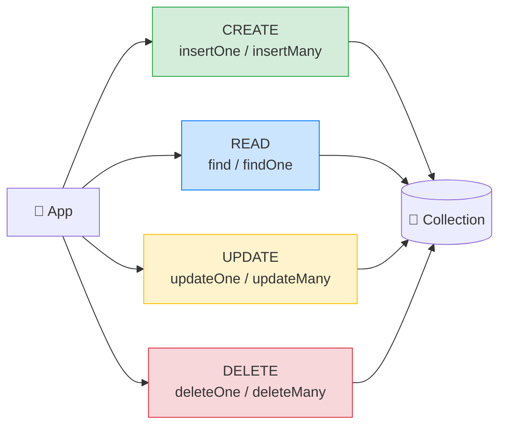

# 🍃 MongoDB CRUD — The 4 Basic Operations — Complete Study Notes

> Notes for becoming a strong software engineer. Easy language, real code, and interview-ready explanations.
> Same CRUD concepts as SQL — just different syntax. You already know the *why*; this is the MongoDB *how*.

---

## 📌 1. The Big Idea

MongoDB's CRUD (**C**reate, **R**ead, **U**pdate, **D**elete) is **conceptually identical to SQL CRUD** — you're still adding, fetching, changing, and removing records. Only the **syntax** differs: instead of SQL keywords, you call **methods** on a collection, and your **queries are themselves JSON objects.**

The clean mapping (lean on your SQL knowledge):

| Operation | SQL | MongoDB |
|---|---|---|
| **Create** | `INSERT` | `insertOne` / `insertMany` |
| **Read** | `SELECT` | `find` / `findOne` |
| **Update** | `UPDATE` | `updateOne` / `updateMany` |
| **Delete** | `DELETE` | `deleteOne` / `deleteMany` |

> 🎯 Interview line: *"MongoDB CRUD maps directly to SQL — insert, find, update, delete — but the syntax is method calls on a collection, and the filter is a JSON object instead of a WHERE clause."*



---

## ➕ 2. CREATE — insertOne, insertMany

```javascript
// One document
db.users.insertOne({
  email: "alice@example.com",
  name: "Alice",
  age: 25
})

// Many at once (more efficient than looping insertOne)
db.users.insertMany([
  { email: "bob@example.com",     name: "Bob",     age: 30 },
  { email: "charlie@example.com", name: "Charlie", age: 35 }
])
```

**Key point:** you **don't** specify `_id` — MongoDB **auto-generates** it as an ObjectId (like `SERIAL` auto-incrementing the id in SQL). You *can* provide your own `_id` (string, number, anything unique) if you want.

> 💡 `insertMany` is the batch insert — far faster than calling `insertOne` in a loop, the same way multi-row `INSERT` beats single inserts in SQL.

---

## 👀 3. READ — find, findOne

The **query is a JSON object.** `{ city: "Bangalore" }` literally means *"where city equals Bangalore."*

```javascript
db.users.find()                                 // all documents (like SELECT *)
db.users.find({ city: "Bangalore" })            // filter (like WHERE city = ...)
db.users.findOne({ _id: ObjectId("...") })      // exactly one document
db.users.find({ age: { $gte: 18 } })            // age >= 18
db.users.find({ city: "Bangalore", age: { $gte: 18 } })  // multiple conditions (AND)
```

### Query operators (the `$` operators)

The `$gte` is an **operator** — MongoDB's equivalent of SQL comparison/logic. Common ones:

| MongoDB | SQL equivalent | Meaning |
|---|---|---|
| `$eq` | `=` | equals (often implicit: `{ age: 25 }`) |
| `$ne` | `!=` | not equal |
| `$gt` / `$gte` | `>` / `>=` | greater than / or equal |
| `$lt` / `$lte` | `<` / `<=` | less than / or equal |
| `$in` | `IN (...)` | value is in a list |
| `$nin` | `NOT IN` | not in a list |
| `$and` / `$or` | `AND` / `OR` | combine conditions |

```javascript
db.users.find({ city: { $in: ["Bangalore", "Mumbai"] } })       // IN list
db.users.find({ age: { $gte: 18, $lte: 65 } })                  // BETWEEN 18 and 65
db.users.find({ $or: [{ city: "Delhi" }, { age: { $lt: 20 } }] }) // OR

// Projection — choose which fields to return (like SELECT name, email):
db.users.find({ city: "Bangalore" }, { name: 1, email: 1 })     // 1 = include
db.users.find({}, { password: 0 })                              // 0 = exclude
```

> 💡 Multiple conditions in one object are joined by **AND** automatically. For **OR** you use `$or`. This mirrors the WHERE-clause logic from your SQL notes — just expressed as JSON.

> 🎯 Interview line: *"In MongoDB the filter is a JSON object — keys are fields, and values can be exact matches or operator objects like `{ $gte: 18 }`. Multiple keys are ANDed; `$or` gives OR. A second object is the projection, choosing which fields to return."*

---

## ✏️ 4. UPDATE — updateOne, updateMany (⚠️ the big gotcha)

Update takes **two** arguments: a **filter** (which documents) and an **update** (what to change).

```javascript
db.users.updateOne(
  { _id: ObjectId("...") },             // 1. filter — which doc
  { $set: { name: "Nayan Kumar" } }     // 2. update — what to change
)

db.users.updateMany(
  { city: "Bangalore" },                // all matching docs
  { $set: { country: "India" } }
)
```

### 🚨 The #1 MongoDB Production Bug — forgetting `$set`

> You **must** use an update operator like **`$set`**. Writing the update **without** `$set` **REPLACES the entire document**, deleting every other field.

```javascript
// ❌ DISASTER — no $set: this REPLACES the whole document
db.users.updateOne({ _id: ObjectId("...") }, { name: "Nayan" })
// Result: the document now has ONLY { name: "Nayan" } — email, age, address... all GONE. 😱

// ✅ CORRECT — $set changes only the named field, keeps the rest
db.users.updateOne({ _id: ObjectId("...") }, { $set: { name: "Nayan" } })
```

This is one of the most common and painful MongoDB bugs. **Always use `$set` (or another operator) for updates.**

### Other useful update operators

| Operator | What it does | SQL-ish meaning |
|---|---|---|
| `$set` | Set/overwrite a field | `SET col = value` |
| `$inc` | Increment a number | `SET views = views + 1` |
| `$unset` | Remove a field | (no direct SQL equiv) |
| `$push` | Add an item to an array | append to a list |
| `$pull` | Remove an item from an array | remove from a list |

```javascript
db.posts.updateOne({ _id: ObjectId("...") }, { $inc: { views: 1 } })          // +1 view
db.users.updateOne({ _id: ObjectId("...") }, { $push: { hobbies: "gaming" } }) // add to array
```

> 🎯 Interview line: *"The classic MongoDB update bug is forgetting `$set` — without an update operator, the document gets fully replaced and you lose every other field. I always use `$set`, `$inc`, `$push`, etc."*

---

## 🗑️ 5. DELETE — deleteOne, deleteMany

```javascript
db.users.deleteOne({ _id: ObjectId("...") })   // delete one matching doc
db.users.deleteMany({ city: "Delhi" })          // delete all matching docs
```

> ⚠️ **Same warning as SQL DELETE:** an empty filter `{}` matches **everything**. `db.users.deleteMany({})` **wipes the whole collection.** Always **test your filter with `find()` first** to see exactly what you'll delete. (This is the SELECT-before-DELETE safety habit from your SQL CRUD notes.)

```javascript
// Safety habit:
db.users.find({ city: "Delhi" })        // 1. preview what matches
db.users.deleteMany({ city: "Delhi" })  // 2. then delete
```

---

## 💻 6. Practical Exercise — Full CRUD Cycle

```javascript
// CREATE — seed 10 users (mix single + batch)
db.users.insertOne({ email: "u1@x.com", name: "Nayan", age: 28, city: "Bangalore" })
db.users.insertMany([
  { email: "u2@x.com",  name: "Amit",   age: 31, city: "Mumbai" },
  { email: "u3@x.com",  name: "Riya",   age: 19, city: "Delhi" },
  { email: "u4@x.com",  name: "Neha",   age: 24, city: "Bangalore" },
  { email: "u5@x.com",  name: "Kiran",  age: 45, city: "Bangalore" },
  { email: "u6@x.com",  name: "Sam",    age: 22, city: "Mumbai" },
  { email: "u7@x.com",  name: "Priya",  age: 33, city: "Delhi" },
  { email: "u8@x.com",  name: "Arjun",  age: 29, city: "Bangalore" },
  { email: "u9@x.com",  name: "Maya",   age: 38, city: "Mumbai" },
  { email: "u10@x.com", name: "Dev",    age: 27, city: "Bangalore" }
])

// READ — various filters
db.users.find()                                          // all
db.users.find({ city: "Bangalore" })                     // by city
db.users.find({ age: { $gte: 30 } })                     // age >= 30
db.users.find({ city: "Bangalore", age: { $lt: 30 } })   // city + age (AND)
db.users.find({ city: { $in: ["Mumbai", "Delhi"] } })    // IN list
db.users.findOne({ name: "Nayan" })                      // one doc
db.users.find({}, { name: 1, city: 1, _id: 0 })          // projection only

// UPDATE — one and many (always with $set!)
db.users.updateOne({ name: "Nayan" }, { $set: { name: "Nayan Kumar" } })
db.users.updateMany({ city: "Bangalore" }, { $set: { country: "India" } })
db.users.updateOne({ name: "Amit" }, { $inc: { age: 1 } })   // birthday +1

// DELETE — one and many (preview with find first!)
db.users.find({ city: "Delhi" })                          // preview
db.users.deleteOne({ name: "Riya" })                      // one
db.users.deleteMany({ city: "Delhi" })                    // many
```

> 💡 Most methods return a small result summary — e.g. `updateMany` returns `matchedCount` and `modifiedCount`, `deleteMany` returns `deletedCount`. **Check these** to confirm you affected the rows you expected (the equivalent of checking "affected row count" in SQL).

---

## 🎤 7. How to Explain in an Interview

**Step 1 — The mapping:**
> "MongoDB CRUD mirrors SQL — insertOne/Many, find/findOne, updateOne/Many, deleteOne/Many — but it's method calls and the filter is a JSON object instead of a WHERE clause."

**Step 2 — Queries as objects:**
> "A query like `{ age: { $gte: 18 } }` is just JSON — field, then an operator object. Multiple fields are ANDed; `$or` gives OR. A second argument is the projection."

**Step 3 — The update gotcha (the key one):**
> "The most important detail is that updates need an operator like `$set`. Without it, the whole document is replaced and you lose every other field — a very common bug."

**Step 4 — Safety:**
> "Like SQL, deleteMany with an empty filter wipes the collection, so I always preview with find() first, and I check matchedCount / deletedCount in the result."

> 🟢 Trap question: *"`updateOne({...}, { name: 'X' })` — what happens?"* → *"That replaces the entire matched document with `{ name: 'X' }`, dropping all other fields, because there's no update operator. You need `{ $set: { name: 'X' } }`."*

> 🟢 Trap question: *"How do you do `WHERE city='X' AND age>18` in MongoDB?"* → *"`db.users.find({ city: 'X', age: { $gt: 18 } })` — two keys in one filter object are ANDed automatically."*

---

## 💎 8. Impressive Words & Phrases

| Instead of saying... | Say this 💪 |
|---|---|
| "Add a document" | "**Insert** a document" |
| "Add many at once" | "**Batch insert** with `insertMany`" |
| "The search conditions" | "The **query filter** (a JSON predicate)" |
| "Choose which fields" | "A **projection**" |
| "Greater-than thing" | "A **query operator** (`$gte`)" |
| "Change a field" | "A **`$set` update**" |
| "Add 1 to a field" | "An **atomic `$inc`**" |
| "Replaced the whole doc" | "An accidental **full-document replacement**" |
| "Check it worked" | "Inspect **`matchedCount` / `modifiedCount`**" |
| "Delete everything by mistake" | "An unfiltered (`{}`) **destructive operation**" |

**Power vocabulary:** *query filter, predicate, projection, query operator, update operator, batch insert, full-document replacement, atomic increment, matched/modified count, ObjectId, upsert.*

> 🌶️ Bonus flex — **upsert:** *"`updateOne` with `{ upsert: true }` updates the doc if it exists, or inserts it if it doesn't — an 'update-or-insert' in one atomic operation. Great for 'create if missing' logic without a race condition."* Knowing upsert signals real MongoDB experience.

---

## ⏱️ 9. Quick Revision (read 5 min before interview)

> **CRUD = same as SQL, different syntax:** `insertOne/Many` (INSERT), `find/findOne` (SELECT), `updateOne/Many` (UPDATE), `deleteOne/Many` (DELETE).
>
> **Filter is JSON:** `{ city: "X", age: { $gte: 18 } }` → field = value, or `{ $operator: value }`. Multiple keys = **AND**; use `$or` for OR. Second arg = **projection** (`1` include, `0` exclude).
>
> **Operators:** `$gt $gte $lt $lte $ne $in $nin $and $or`.
>
> **UPDATE ⚠️:** **always use `$set`** (or `$inc`/`$push`/etc.). Without an operator → **whole document is replaced** and other fields are lost. (#1 Mongo bug.)
>
> **DELETE ⚠️:** empty filter `{}` deletes **everything** → always `find()` first. Check `deletedCount`.
>
> **`_id`** is auto-generated; `insertMany` for batch; `{ upsert: true }` = update-or-insert.
>
> **Golden line:** *"MongoDB CRUD mirrors SQL with JSON filters — and the one rule that bites everyone is: always use `$set` for updates, or you replace the entire document."*

---

### ✅ Practice checklist
- [ ] `insertOne` and `insertMany` to seed ~10 users
- [ ] `find` with: exact match, `$gte`, `$in`, two-field AND, and a projection
- [ ] `findOne` for a single document
- [ ] `updateOne` with `$set` — then deliberately try it *without* `$set` and see the document get wiped
- [ ] `updateMany` to set a field on many docs; try `$inc` and `$push`
- [ ] `find()` to preview, then `deleteOne` and `deleteMany`
- [ ] Check `matchedCount` / `modifiedCount` / `deletedCount` in the results
- [ ] Bonus: try an `{ upsert: true }` update

Master MongoDB CRUD — especially the `$set` rule — and you can confidently work with documents the same way you work with SQL rows. 🚀
