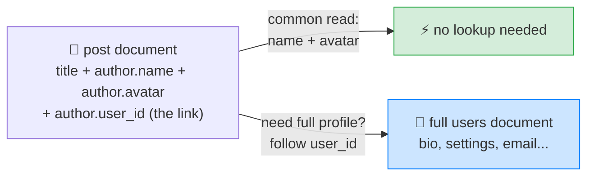
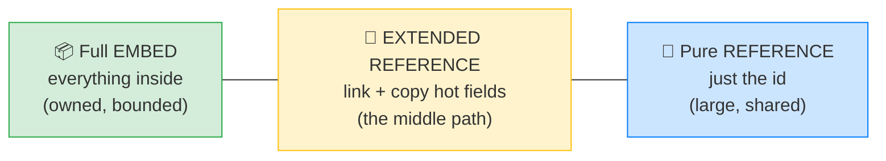

# 🍃 The Extended Reference Pattern — Complete Study Notes

> Notes for becoming a strong software engineer. Easy language, real code, and interview-ready explanations.
> The practical **middle path** between embed and reference — extremely common in real production MongoDB.

---

## 📌 1. The Big Idea

In the schema-design notes, the choice was **embed** (data inside) vs **reference** (link to another collection). The **extended reference** pattern is a **smart hybrid**:

> **Reference the other document — but ALSO copy the few fields you most commonly need right into the parent.**

You keep the link (`user_id`) *and* embed a small, frequently-used slice of the referenced document (like `name` and `avatar_url`). So your common reads need **no lookup**, but the full document is still available by reference when you need the rest.

> Analogy 📇: think of a **contact card** saved in your phone. You don't store your friend's *entire life* in the contact — just their name and photo (what you see when they call). For everything else (full address, work history) you'd look them up properly. The extended reference is that contact card: the handy bits embedded, the full record referenced.

> 🎯 Interview line: *"The extended reference pattern references a document but also denormalises its most commonly-needed fields into the parent — so frequent reads avoid a join, while the full record stays available by reference."*



---

## 🧩 2. What It Looks Like

A blog post that needs to show the author's name and avatar on every post card:

```json
{
  "_id": ObjectId("..."),
  "title": "My post",
  "author": {
    "user_id": ObjectId("..."),         // 🔗 the reference (full doc lives in users)
    "name": "Nayan",                     // 📦 embedded copy (commonly needed)
    "avatar_url": "https://..."          // 📦 embedded copy (commonly needed)
  }
}
```

The **full user document** (bio, email, settings, preferences) still lives in the `users` collection. You only copied the **two fields you show most often.**

```javascript
// Displaying a post → everything you need is RIGHT HERE, no second query:
db.posts.findOne({ _id: ObjectId("...") })
// → title + author.name + author.avatar_url, all in one fetch ⚡

// Need the full author (bio, settings)? Follow the reference:
db.users.findOne({ _id: post.author.user_id })
```

---

## ⚖️ 3. Why Use It — The Trade-off

**The win:** when displaying a post, you almost always need just the author's **name and avatar** — nothing more. Storing them denormalised in the post **saves a lookup** (no `$lookup` join, no second query) for your most common read. That's a big performance gain on a hot path.

**The cost — stale data:** if the user **changes their name**, every post still shows the **old name** — the embedded copies are now out of date. You have two ways to handle this:

| Approach | What you do | Trade-off |
|---|---|---|
| **Accept it** | Live with a small inconsistency window | Simple, fast reads; slightly stale display until refreshed |
| **Update all posts** | When the user updates, update the copies everywhere | Always correct, but **many extra writes** |

```javascript
// If you choose to keep copies fresh, on a name change:
db.users.updateOne({ _id: userId }, { $set: { name: newName } });
db.posts.updateMany(
  { "author.user_id": userId },
  { $set: { "author.name": newName } }   // fan-out update to all the copies
);
```

> 💡 Which to pick? It depends how much **staleness** matters. A display name on old posts being briefly outdated is usually **fine** (accept it). A price or a permission level would **not** be fine (keep it fresh, or don't denormalise it at all). **Choose fields to copy that rarely change.**

> 🎯 Interview line: *"The trade-off is staleness — denormalised copies can go out of date when the source changes. I either accept a small inconsistency window for display-only fields, or fan-out an update to the copies. So I only copy fields that change rarely and tolerate brief staleness."*

---

## 🎯 4. When to Reach for It

The extended reference is the **practical middle path**, and it's **everywhere in production MongoDB**. Use it when:
- You **reference** something (it's large/shared/independent — so full embedding is wrong),
- **but** a **small, stable slice** of it is needed on a **very common read**,
- **and** that slice changes **rarely** (so staleness is low-risk).

**Classic uses:**
- Post → author's `name` + `avatar` (show on every post).
- Order → customer's `name` + `email` (show on the order summary).
- Order line item → product's `name` + `price` **at time of purchase** (this one is *intentionally* frozen — links to the point-in-time snapshot idea from your SQL normalisation notes!).
- Comment → commenter's `name` + `avatar`.

> 💡 The order-line-item case is special: there, staleness is the **goal** — you *want* the invoice to show the price as it was when bought, even if the product's price later changes. Same pattern, but the "downside" becomes the feature.

> 🎯 Decision hint: it sits between embed and reference → *"reference for the source of truth, embed a stable, hot-path slice for speed."*

---

## 🧭 5. Where It Fits (the spectrum)



- **Full embed** → great for owned, bounded, always-together data.
- **Pure reference** → great for large, shared, independent data, but every read needs a lookup.
- **Extended reference** → you've referenced (correctly), but copy a tiny hot slice to **kill the lookup** on the common read. Best of both, *if* the copied fields are stable.

---

## 🎤 6. How to Explain in an Interview

**Step 1 — What it is:**
> "The extended reference pattern references a document but also denormalises its most-used fields into the parent — like keeping the author's name and avatar inside each post while still linking to the full user."

**Step 2 — The win:**
> "Most reads of a post only need the author's name and avatar. Embedding those saves a lookup on a hot path, so the common read is one fast fetch with no join."

**Step 3 — The cost:**
> "The trade-off is staleness — if the user renames, the copies are outdated. I either accept a small inconsistency window for display fields, or fan-out an update to all copies."

**Step 4 — When:**
> "I use it when something must be referenced but a small, stable slice is needed on a very common read. I only copy fields that rarely change. It's extremely common in production."

> 🟢 Trap question: *"Isn't duplicating data bad — doesn't it violate normalisation?"* → *"Yes, it's deliberate denormalisation. In MongoDB we optimise for the access pattern, not for pure normalisation. I accept controlled duplication of stable fields to make the common read fast, and manage staleness explicitly — it's a conscious trade-off, not an accident."*

> 🟢 Trap question: *"What fields would you NOT put in an extended reference?"* → *"Anything that changes often or must be exactly current — like a price for live checkout, a balance, or a permission level. Stale copies of those cause real bugs. I only copy rarely-changing display fields, or fields I *want* frozen, like a purchase-time price."*

---

## 💎 7. Impressive Words & Phrases

| Instead of saying... | Say this 💪 |
|---|---|
| "Copy some fields in" | "**Denormalise** a hot-path slice" |
| "Link + copy" | "An **extended reference**" |
| "Avoid the lookup" | "Eliminate a **join / `$lookup`** on the common read" |
| "Data gets out of date" | "**Staleness** / a small **inconsistency window**" |
| "Update everywhere" | "**Fan-out update** to the denormalised copies" |
| "Design for the read" | "Optimise for the **access pattern**" |
| "Frozen at purchase time" | "A **point-in-time snapshot**" |
| "Middle ground" | "The pragmatic **middle path** on the embed↔reference spectrum" |
| "Only stable fields" | "Copy **low-volatility** fields only" |

**Power vocabulary:** *extended reference, denormalisation, access pattern, hot path, staleness, eventual/inconsistency window, fan-out update, point-in-time snapshot, low-volatility fields, source of truth.*

> 🌶️ Bonus flex — **"source of truth vs read copy":** *"The referenced document stays the single source of truth; the embedded fields are just a fast read-cache. I never treat the copies as authoritative — for anything critical I read from the source."* This framing shows you understand *why* it's safe, not just how to write it.

---

## ⏱️ 8. Quick Revision (read 5 min before interview)

> **Extended reference = reference + embed the hot fields.** Keep the link (`user_id`) AND copy a small, commonly-needed slice (`name`, `avatar`) into the parent.
>
> **Win:** the common read (e.g. showing a post) needs **no lookup** — name + avatar are right there. Fast hot path.
>
> **Cost:** **staleness** — if the source changes, copies go outdated. Handle by either **accepting** a small inconsistency window (display fields) or **fan-out updating** all copies (more writes).
>
> **Use when:** must reference (large/shared) BUT a **small, stable slice** is needed on a **very common read**. Only copy **rarely-changing** fields.
>
> **Special case:** order line item copies product **name + price at purchase time** — staleness is *intended* (a frozen snapshot).
>
> **Spectrum:** full embed ↔ **extended reference (middle)** ↔ pure reference.
>
> **Golden line:** *"Reference the source of truth, but denormalise a small stable slice for the hot read — saving a lookup at the cost of managed staleness. It's the pragmatic middle path, and it's everywhere in production MongoDB."*

---

### ✅ Practice checklist
- [ ] Model a `post` with an `author` extended reference (`user_id` + `name` + `avatar_url`)
- [ ] Read a post and confirm you get author name/avatar with **no second query**
- [ ] Follow `author.user_id` to fetch the full user when you need bio/settings
- [ ] Write the fan-out `updateMany` that refreshes copies when a user renames
- [ ] List which fields are safe to copy (stable) vs unsafe (price, balance, permissions)
- [ ] Explain the order-line-item "frozen snapshot" version out loud
- [ ] Explain why it's deliberate denormalisation, not a mistake

This pattern is a daily reality in production MongoDB. Knowing *when* and *which fields* to denormalise — and how to manage staleness — is exactly what senior MongoDB design looks like. 🚀
