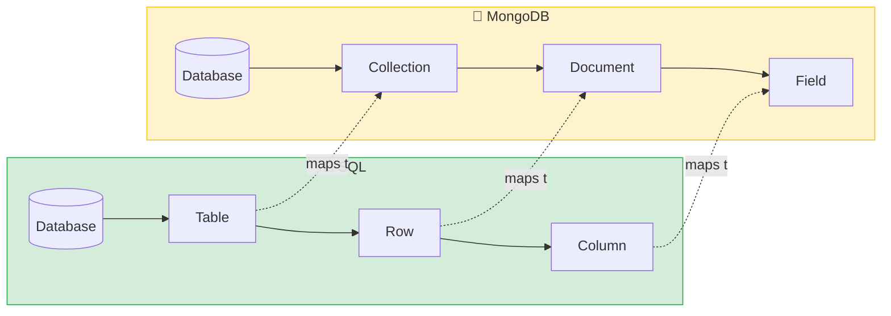
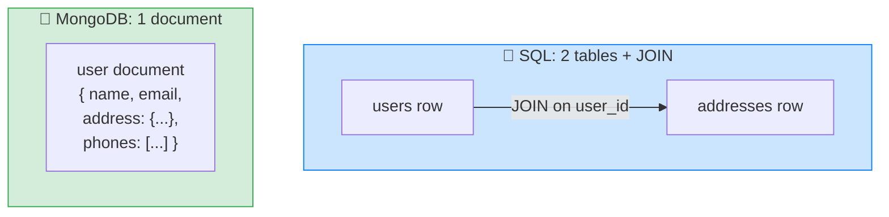

# 🍃 MongoDB Fundamentals — Complete Study Notes

> Notes for becoming a strong software engineer. Easy language, real code, and interview-ready explanations.
> The document-database model — explained by comparing it to the SQL you already know well.

---

## 📌 1. What MongoDB Actually Is

MongoDB stores data as **documents** inside **collections**. The mental model is simple if you know JSON:

- A **document** ≈ a **JSON object** (one record).
- A **collection** ≈ a folder of documents (one "table").
- A **database** contains multiple collections.

> Analogy 🗄️: a SQL table is like a strict government form — every row must have the exact same boxes filled the exact same way. A MongoDB collection is more like a folder of freeform notes — each note (document) describes itself and can have its own shape. Looser, more flexible, but you give up the form's guarantees.

> 🎯 Interview line: *"MongoDB is a document database — it stores self-describing, JSON-like documents in collections, instead of rigid rows in tables. Documents can nest objects and arrays, and don't have to share the same fields."*

---

## 🔄 2. SQL → MongoDB Mapping (lean on what you know)

Since you know SQL deeply, the fastest way to learn MongoDB is by translation:

| SQL term | MongoDB term | Note |
|---|---|---|
| Database | Database | same idea |
| **Table** | **Collection** | a group of documents |
| **Row** | **Document** | one JSON-like record |
| **Column** | **Field** | a key in the document |
| **Primary key** | **`_id` field** | auto-generated as an **ObjectId** |
| **Foreign key** | **Reference** | ⚠️ **NOT enforced** — it's the app's job |
| **JOIN** | **`$lookup`** stage *or* app-level merge | joins are possible but less natural |
| **Schema** | Schema (but **flexible**) | docs in one collection can differ |



> ⚠️ **Two big differences to remember:**
> 1. **No enforced foreign keys.** MongoDB won't stop you from referencing a non-existent document — referential integrity is *your* code's responsibility. (Contrast with the constraints/relationships notes — SQL guarantees this; MongoDB doesn't.)
> 2. **Flexible schema.** Two documents in the same collection can have totally different fields. Powerful, but it means *you* enforce consistency, not the database.

---

## 🆚 3. A SQL Row vs a MongoDB Document (visual)

**SQL row** in a `users` table:
```
id | email           | name  | created_at
1  | nayan@email.com | Nayan | 2026-05-18 10:30:00
```

**MongoDB document** in a `users` collection:
```json
{
  "_id": ObjectId("507f1f77bcf86cd799439011"),
  "email": "nayan@email.com",
  "name": "Nayan",
  "created_at": ISODate("2026-05-18T10:30:00Z")
}
```

Both store the **same logical data**. But the document is:
- **Self-describing** → field names travel *with* the data (`"email": ...`), not defined separately in a schema.
- **Nestable** → a field's value can be another object or an array.
- **Schemaless** → a different user document could have extra or missing fields.

---

## ⭐ 4. The Killer Feature — Embedded Documents

This is the heart of the document model. In SQL, a user + their address needs **two tables and a JOIN**. In MongoDB, you **embed** the address right inside the user:

```json
{
  "_id": ObjectId("..."),
  "email": "nayan@email.com",
  "name": "Nayan",
  "address": {
    "street": "MG Road",
    "city": "Bangalore",
    "pincode": "560001"
  },
  "phone_numbers": ["9876543210", "9999999999"]
}
```

**One document. No joins.** The address is an **embedded object**; the phone numbers are an **array**. You fetch the whole user — with address and phones — in a single read.



> 💡 The trade-off (links to your normalisation notes): embedding **duplicates** data and there's **no referential integrity**, but reads are fast and atomic (the whole document updates together). SQL normalises to avoid duplication; MongoDB often **denormalises by embedding** for read speed. Different philosophies for different needs.

> 🎯 Interview line: *"MongoDB's signature feature is embedded documents — related data nested inside one document, so you read it in a single fetch with no join. It trades the duplication-avoidance of normalisation for read performance and atomic single-document updates."*

---

## 🔢 5. Important MongoDB Data Types

| Type | Use for | Note |
|---|---|---|
| **String** | text | UTF-8 |
| **Number** | int or double | no separate int/float types in basic usage |
| **Boolean** | true/false | |
| **Date** | timestamps | use `ISODate` or `new Date()` |
| **ObjectId** | the `_id` | 12-byte auto-generated unique id |
| **Array** | ordered list | can hold mixed types |
| **Object** | embedded document | nested JSON |
| **Null** | explicit "no value" | |
| **Decimal128** | **money / exact decimals** | ⭐ the money type |

> 💰 **Money rule (same as SQL!):** **never use plain `Number` for money** — floating-point math means `0.1 + 0.2 ≠ 0.3`. Use **`Decimal128`** (MongoDB's equivalent of SQL's `DECIMAL`). This is the exact same lesson from your relational-basics notes — and an easy interview point to connect across both databases.

> 💡 The **ObjectId** is interesting: it's a 12-byte value that actually **encodes a timestamp** in its first bytes, so it's roughly sortable by creation time and globally unique without a central counter — handy for distributed systems.

---

## 💻 6. Practical Exercise — Your First Document

In **mongosh** or **MongoDB Compass**, insert a document by hand:

```javascript
db.users.insertOne({
  email: "nayan@example.com",
  name: "Nayan",
  age: 28,
  city: "Bangalore",
  hobbies: ["coding", "reading", "running"],   // an array
  address: {                                    // an embedded object
    street: "MG Road",
    pincode: "560001"
  }
})
```

**Notice three things — this IS the MongoDB workflow:**
1. You **didn't define a schema first.** No `CREATE TABLE`. You just inserted.
2. The **collection was created automatically** the moment you inserted into it.
3. The document **naturally holds arrays and nested objects** — no separate tables needed.

```javascript
// Read it back
db.users.findOne({ email: "nayan@example.com" })

// Insert another user with DIFFERENT fields — totally allowed (flexible schema!)
db.users.insertOne({ name: "Amit", company: "Acme", verified: true })
// no email, no age, extra "company" field — MongoDB doesn't complain
```

> ⚠️ That last example is the double-edged sword: flexibility is convenient, but without discipline your collection becomes a mess of inconsistent shapes. In real projects, teams add a **schema layer** (like Mongoose, or MongoDB's schema validation) to bring back *some* structure.

> 🎯 Interview line: *"In MongoDB you don't pre-define a schema — inserting a document creates the collection on the fly, and documents can have different shapes. It's flexible, but in production I'd add schema validation or use an ODM like Mongoose to keep documents consistent."*

---

## 🎤 7. How to Explain in an Interview

**Step 1 — What it is:**
> "MongoDB is a document database. It stores JSON-like documents in collections instead of rows in tables. Documents are self-describing, can nest objects and arrays, and don't have to share a fixed schema."

**Step 2 — The mapping:**
> "Table maps to collection, row to document, column to field, and the primary key is the auto-generated _id ObjectId. Foreign keys exist only as references the application enforces — MongoDB doesn't enforce them."

**Step 3 — The killer feature:**
> "The big idea is embedded documents — instead of a user table joined to an addresses table, I nest the address inside the user document and read it all in one fetch. No join."

**Step 4 — The trade-off:**
> "Embedding trades normalisation for read speed — data can duplicate and there's no referential integrity, but reads are fast and single-document updates are atomic."

**Step 5 — Money & discipline:**
> "I use Decimal128 for money, just like DECIMAL in SQL, and in production I add schema validation or Mongoose so the flexibility doesn't become inconsistency."

> 🟢 Trap question: *"If MongoDB is schemaless, do you still design a schema?"* → *"Yes — 'schemaless' means the database doesn't *enforce* one, not that you skip designing it. You still model documents deliberately, decide what to embed vs reference, and usually add validation. Good design matters just as much."*

> 🟢 Trap question: *"When do you embed vs reference?"* → *"Embed when the related data is read together and 'owned' by the parent (a post's comments, a user's address). Reference when the data is large, shared across many documents, or grows unbounded — to avoid huge or duplicated documents."*

---

## 💎 8. Impressive Words & Phrases

| Instead of saying... | Say this 💪 |
|---|---|
| "JSON record" | "A **document** (BSON under the hood)" |
| "Folder of records" | "A **collection**" |
| "Data has field names in it" | "**Self-describing** documents" |
| "Nest data inside" | "**Embed** a sub-document" |
| "Link to another document" | "A **reference** (app-enforced)" |
| "No fixed structure" | "**Flexible / dynamic schema**" |
| "The auto id" | "The **`_id` ObjectId**" |
| "Mongo's join" | "The **`$lookup`** aggregation stage" |
| "Money type" | "**Decimal128** (exact decimal)" |
| "Add structure back" | "A **schema validation** layer / **ODM** (Mongoose)" |

**Power vocabulary:** *document, collection, BSON, self-describing, embedded document, reference, flexible/dynamic schema, ObjectId, $lookup, denormalisation by embedding, Decimal128, schema validation, ODM (Mongoose), atomic single-document write.*

> 🌶️ Bonus flex — **BSON:** *"MongoDB doesn't actually store raw JSON — it stores BSON, a binary-encoded superset of JSON that adds types like Date, ObjectId, and Decimal128 and is faster to traverse. That's why it has richer types than plain JSON."* Knowing JSON vs BSON signals you've gone past the surface.

---

## ⏱️ 9. Quick Revision (read 5 min before interview)

> **MongoDB = document database.** Document ≈ JSON object; Collection ≈ table (folder of docs); Database holds collections.
>
> **SQL → Mongo:** table→collection, row→document, column→field, PK→**`_id` ObjectId**, FK→**reference (NOT enforced)**, JOIN→**`$lookup`**, schema→**flexible**.
>
> **Documents are:** self-describing (field names included), nestable (objects + arrays), schemaless (docs can differ).
>
> **Killer feature — embedding:** nest related data (address, comments) inside one document → no join, one fetch, atomic updates. Trades normalisation for read speed + no referential integrity.
>
> **Data types:** String, Number, Boolean, Date (ISODate), ObjectId, Array, Object, Null, **Decimal128 for money** (never plain Number — floating-point!).
>
> **Workflow:** no `CREATE TABLE` — inserting creates the collection; documents can vary. Add **schema validation / Mongoose** in production.
>
> **Golden line:** *"MongoDB stores flexible, self-describing documents and lets you embed related data so you read it in one fetch without joins — trading normalisation and referential integrity for read speed and flexibility."*

---

### ✅ Practice checklist
- [ ] `insertOne` a user with an array (`hobbies`) and an embedded object (`address`)
- [ ] Notice the collection was created without defining a schema
- [ ] `findOne` to read it back
- [ ] Insert a second doc with **different fields** → see flexible schema in action
- [ ] Recite the SQL→MongoDB term mapping from memory
- [ ] Use `Decimal128` for a money field (not plain Number)
- [ ] Explain embed-vs-reference out loud

---

### 👉 Connects to
This pairs directly with your **SQL vs NoSQL** note (when to choose document databases) and contrasts with **normalisation** (SQL avoids duplication; MongoDB often embeds/denormalises). You know SQL deeply — MongoDB is mostly the same data-modelling thinking with different trade-offs. 🚀
