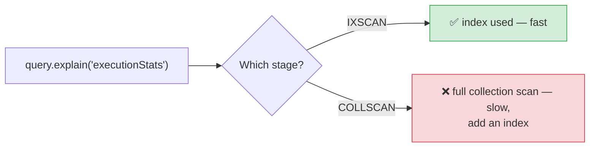

# 🍃 MongoDB Indexes (Basics) — Complete Study Notes

> Notes for becoming a strong software engineer. Easy language, real code, and interview-ready explanations.
> Foundation level — and the concepts map almost one-to-one to your SQL indexes notes, just different syntax.

---

## 📌 1. Why MongoDB Needs Indexes (same idea as SQL)

Just like SQL, MongoDB needs **indexes** to find documents fast. **Without an index, MongoDB does a "collection scan" — it reads EVERY document** in the collection to find matches. On a collection with a million documents, that's a million reads to find one.

> 📖 Same book analogy as the SQL version: no index = read every page to find a topic; with an index = flip to the back, look it up, jump to the page. A **collection scan (COLLSCAN)** is reading every page; an **index scan (IXSCAN)** is the shortcut.

> 🎯 Interview line: *"MongoDB indexes work like SQL indexes — a separate sorted structure that lets it find documents without scanning the whole collection. No index means a full collection scan, reading every document."*

> 💡 Good news: because you already learned SQL indexes deeply, **MongoDB indexes are 90% the same concepts** — B-trees under the hood, foreign-key indexing, compound indexes, the read/write trade-off. Only the syntax and a couple of names differ (COLLSCAN instead of Seq Scan, `.explain()` instead of `EXPLAIN ANALYZE`).

---

## 🛠️ 2. Creating Indexes

```javascript
db.users.createIndex({ email: 1 })                      // ascending index on email
db.users.createIndex({ email: 1 }, { unique: true })    // unique → no duplicate emails
db.posts.createIndex({ user_id: 1 })                    // index the foreign key (fast lookups)
db.posts.createIndex({ created_at: -1 })                // descending (for "newest first" sorts)
```

**The number is the direction:** `1` = ascending, `-1` = descending.

- For **single-field** indexes the direction usually **doesn't matter** (MongoDB can read the index both ways).
- For **compound** indexes, direction **does** matter (covered below).

> 💡 `{ unique: true }` makes the index also a **uniqueness constraint** — MongoDB rejects a second document with the same value. This is how you enforce "no duplicate emails" at the database level (the same defence-in-depth idea from your SQL constraints notes — and the right fix for a duplicate-on-race bug).

---

## 🧩 3. Compound Indexes (multiple fields)

```javascript
db.posts.createIndex({ user_id: 1, created_at: -1 })
```

A **compound index** covers multiple fields. This one supports queries that **filter by `user_id`** and/or **sort by `created_at` descending** — perfect for *"this user's posts, newest first."*

**Field order matters** (exactly like SQL's leftmost-prefix rule from your SQL indexes notes). The deep version is the **ESR rule** — **E**quality, **S**ort, **R**ange — the recommended order for fields in a compound index:
1. **Equality** fields first (exact matches like `user_id = X`),
2. then **Sort** fields (what you `ORDER BY`),
3. then **Range** fields (like `age > 18`).

> 🎯 Interview line: *"Compound indexes cover multiple fields, and order matters — same idea as SQL's leftmost-prefix rule. MongoDB's guideline is the ESR rule: equality fields first, then sort fields, then range fields."*

> 💡 For now, just know field order matters and that ESR is the guideline. The full ESR deep-dive comes later — knowing the acronym already signals you've gone past the basics.

---

## ✅ 4. When to Add Indexes (the basic rules)

The rules are **identical to SQL**:

1. **Every field you frequently filter by** in `find()` queries.
2. **Every foreign-key field** (like `user_id` in posts) — joined/looked-up constantly.
3. **Fields you sort by often** (for `ORDER BY`-style queries).
4. The **`_id` field is auto-indexed** — never index it yourself.

```javascript
// You often query posts by user → index user_id
db.posts.createIndex({ user_id: 1 })
// You often sort posts newest-first → index created_at descending
db.posts.createIndex({ created_at: -1 })
// You look users up by email → index (and make unique) email
db.users.createIndex({ email: 1 }, { unique: true })
```

> ⭐ Same beginner rule as SQL: **index every field you filter, join, or sort by — especially foreign keys.** And `_id` is already done for you.

---

## 🔍 5. Checking If a Query Uses an Index (`.explain()`)

MongoDB's equivalent of SQL's `EXPLAIN ANALYZE` is `.explain("executionStats")`:

```javascript
db.posts.find({ user_id: ObjectId("...") }).explain("executionStats")
```

Look at the winning plan's **stage**:

| Stage | Meaning | Good? |
|---|---|---|
| **`IXSCAN`** | **Index scan** — used an index | ✅ Fast |
| **`COLLSCAN`** | **Collection scan** — read every document | ❌ Slow on big collections |



> 🎯 Interview line: *"I verify index usage with `.explain('executionStats')` — looking for IXSCAN (index used) versus COLLSCAN (full collection scan). It's the MongoDB equivalent of checking Index Scan vs Seq Scan in SQL's EXPLAIN."*

> 💡 For now, just knowing `.explain()` exists and that **IXSCAN = good, COLLSCAN = bad** is enough. Reading the full output in depth is a later topic.

---

## ⚠️ 6. Indexes Have a Cost (same trade-off as SQL)

> Indexes **speed up reads but slow down writes** — every `insert`/`update` must also **update each relevant index** — and they use **extra disk/memory.**

So the rule is the same as SQL: **don't index every field.** Index the ones you actually query, join, or sort by; skip the rest.

```
Read  (find on indexed field):   ⚡ much faster
Write (insert / update):         🐢 slightly slower (must update indexes)
Storage:                         📦 extra space (in RAM too — Mongo keeps indexes in memory)
```

> 💡 MongoDB adds one extra wrinkle: indexes are most effective when they **fit in RAM**. Too many indexes (or huge ones) can blow past available memory and hurt performance — another reason to index deliberately, not defensively.

> 🎯 Interview line: *"Indexes trade write speed and memory for read speed, so I index based on real query patterns. In MongoDB there's an added concern — indexes should ideally fit in RAM, so over-indexing has a memory cost too."*

---

## 💻 7. Practical Example

```javascript
// Setup + indexes
db.posts.createIndex({ user_id: 1 })            // FK lookups
db.posts.createIndex({ created_at: -1 })        // newest-first sorts
db.posts.createIndex({ user_id: 1, created_at: -1 })  // "this user's posts, newest first"
db.users.createIndex({ email: 1 }, { unique: true })  // unique email

// Before vs after — check with explain:
db.posts.find({ user_id: ObjectId("...") }).explain("executionStats")
// No index → "stage": "COLLSCAN" (reads all docs)
// With idx_user_id → "stage": "IXSCAN" (jumps straight to matches) ⚡

// See all indexes on a collection:
db.posts.getIndexes()

// Drop an unused index (it's only costing you writes):
db.posts.dropIndex({ created_at: -1 })
```

> 💡 `getIndexes()` lists every index — handy for auditing. Unused indexes are pure cost (slower writes, wasted memory), so dropping the ones nothing queries is a real optimisation.

---

## 🎤 8. How to Explain in an Interview

**Step 1 — Why:**
> "MongoDB indexes work like SQL's — without one, a query does a full collection scan, reading every document. An index lets it jump straight to matches."

**Step 2 — Creating + when:**
> "I create them with createIndex, 1 for ascending and -1 for descending. I index fields I filter, join, or sort by — especially foreign keys like user_id. The _id field is auto-indexed."

**Step 3 — Compound + ESR:**
> "Compound indexes cover multiple fields and field order matters, like SQL's leftmost-prefix rule. MongoDB's guideline is ESR — equality, sort, range."

**Step 4 — Verify + cost:**
> "I check usage with .explain('executionStats') — IXSCAN is good, COLLSCAN is bad. And indexes cost write speed and memory, so I index deliberately, not everywhere."

> 🟢 Trap question: *"A find() is slow — how do you diagnose and fix it?"* → *"Run `.explain('executionStats')`. If I see COLLSCAN, the query isn't using an index, so I'd add one on the filtered field — and a compound index if it also sorts. Then re-check for IXSCAN."*

> 🟢 Trap question: *"Why not index every field to be safe?"* → *"Each index slows writes and consumes memory — and MongoDB indexes ideally fit in RAM, so over-indexing can actually degrade performance. I index based on actual query patterns."*

---

## 💎 9. Impressive Words & Phrases

| Instead of saying... | Say this 💪 |
|---|---|
| "Reads every document" | "A **collection scan (COLLSCAN)**" |
| "Uses the index" | "An **index scan (IXSCAN)**" |
| "Index on multiple fields" | "A **compound index**" |
| "Field order rule" | "The **ESR rule** (Equality, Sort, Range)" |
| "Index the foreign key" | "Index the **reference field** for fast lookups" |
| "Check if it's fast" | "Inspect the plan with **`.explain()`**" |
| "No duplicates" | "A **unique index** (constraint at the index level)" |
| "Slows down writes" | "**Write/index-maintenance overhead**" |
| "Should fit in memory" | "Indexes should be **RAM-resident** for best performance" |

**Power vocabulary:** *collection scan (COLLSCAN), index scan (IXSCAN), compound index, ESR rule, unique index, explain/executionStats, write overhead, RAM-resident index, covered query, query selectivity.*

> 🌶️ Bonus flex — **covered query:** *"If an index contains all the fields a query needs (filter + projection), MongoDB answers it straight from the index without touching the documents — a covered query. It's MongoDB's version of SQL's covering index, and it's very fast."* This connects your SQL and MongoDB index knowledge and signals depth.

---

## ⏱️ 10. Quick Revision (read 5 min before interview)

> **Same as SQL, different syntax.** No index → **COLLSCAN** (reads every doc). Index → fast lookup.
>
> **Create:** `db.coll.createIndex({ field: 1 })` (`1` asc, `-1` desc). `{ unique: true }` for no-duplicates.
>
> **When:** index fields you **filter / join / sort** by — **especially foreign keys** (`user_id`). `_id` is **auto-indexed** (don't add it).
>
> **Compound index:** multiple fields, **order matters** (like SQL leftmost-prefix). Guideline = **ESR** (Equality → Sort → Range).
>
> **Verify:** `.explain("executionStats")` → **IXSCAN** (good) vs **COLLSCAN** (bad). (= SQL's EXPLAIN ANALYZE.)
>
> **Cost:** speeds reads, **slows writes**, uses memory. Don't index everything — and MongoDB indexes ideally **fit in RAM**.
>
> **Golden line:** *"MongoDB indexes mirror SQL — index the fields you filter, join, and sort by (especially foreign keys), verify with `.explain()` for IXSCAN vs COLLSCAN, and don't over-index because every index taxes writes and memory."*

---

### ✅ Practice checklist
- [ ] `createIndex` on `email` with `{ unique: true }`
- [ ] Index a foreign key (`posts.user_id`)
- [ ] Index a sort field descending (`created_at: -1`)
- [ ] Create a compound index (`{ user_id: 1, created_at: -1 }`)
- [ ] Run `.explain("executionStats")` before/after → see COLLSCAN become IXSCAN
- [ ] `getIndexes()` to list them; `dropIndex` an unused one
- [ ] Explain the read/write/RAM trade-off out loud
- [ ] Connect ESR to SQL's leftmost-prefix rule

Because you already know SQL indexes deeply, MongoDB indexing is mostly the same thinking with new syntax — index what you query, verify with `.explain()`, and don't over-index. 🚀
