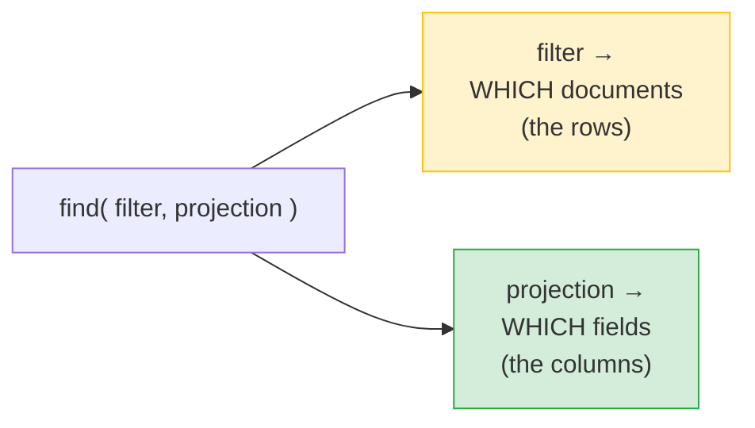
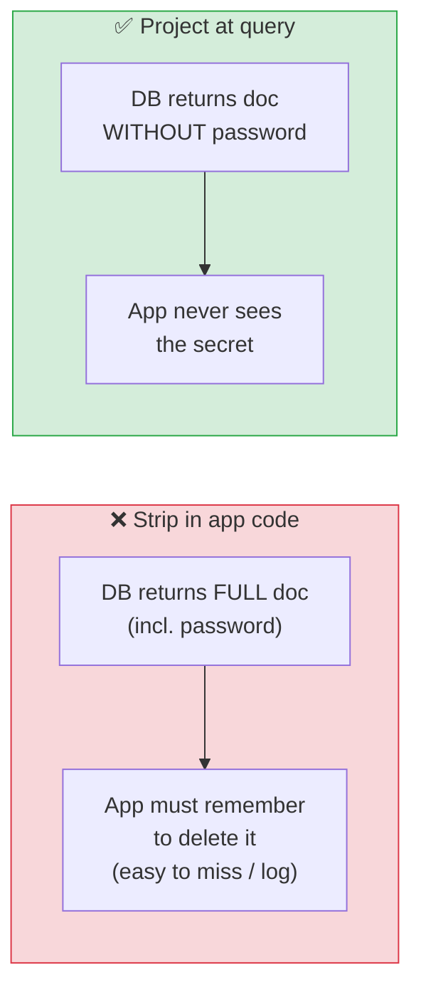

# 🍃 MongoDB Projection — Selecting Specific Fields — Complete Study Notes

> Notes for becoming a strong software engineer. Easy language, real code, and interview-ready explanations.
> Projection = choosing *which fields* come back. The MongoDB equivalent of picking columns in `SELECT`.

---

## 📌 1. What is Projection? (in simple words)

In SQL you write `SELECT name, email FROM users` to fetch **only the columns you want**. In MongoDB, the equivalent is **projection** — the **second argument** to `find()` that says which fields to include or exclude.

```javascript
db.users.find( {filter}, {projection} )
//             ↑ which docs   ↑ which fields
```

> Analogy 📋: imagine ordering from a big form. The **filter** decides *which records* you get (the rows). The **projection** decides *which boxes on each record* are shown to you (the columns/fields). You can ask for the whole form, or just the name and email lines.

> 🎯 Interview line: *"Projection is MongoDB's way of selecting specific fields, like choosing columns in a SQL SELECT. It's the second argument to find — you pass a JSON object marking fields to include with 1 or exclude with 0."*



---

## 🛠️ 2. The Syntax — Include (1) or Exclude (0)

```javascript
// Include ONLY name and email (_id comes back by default)
db.users.find({}, { name: 1, email: 1 })

// Include name and email, and turn OFF the default _id
db.users.find({}, { name: 1, email: 1, _id: 0 })

// Include everything EXCEPT password
db.users.find({}, { password: 0 })
```

| Value | Meaning |
|---|---|
| `1` (or `true`) | **Include** this field |
| `0` (or `false`) | **Exclude** this field |

> 💡 SQL comparison: `{ name: 1, email: 1 }` ≈ `SELECT name, email`. `{ password: 0 }` has no clean SQL equivalent — it's "give me everything *except* this column."

---

## ⚠️ 3. The Golden Rule — Don't Mix 1s and 0s

> **You either list fields to INCLUDE (with `1`), OR fields to EXCLUDE (with `0`) — never both in the same projection.** The **only exception** is `_id`, which is special: you can turn it off (`_id: 0`) even in an include-projection.

```javascript
// ✅ Valid — all includes
db.users.find({}, { name: 1, email: 1 })

// ✅ Valid — all excludes
db.users.find({}, { password: 0, ssn: 0 })

// ✅ Valid — includes + the special _id exception
db.users.find({}, { name: 1, email: 1, _id: 0 })

// ❌ ERROR — mixing include (1) and exclude (0) for non-_id fields
db.users.find({}, { name: 1, password: 0 })   // throws an error
```

**Why?** It's logically ambiguous. If you say "include name" *and* "exclude password," what about the other 20 fields — in or out? MongoDB avoids the confusion by making you pick **one mode**: an allow-list (includes) or a deny-list (excludes).

> 🎯 Interview line: *"A projection is either an include-list or an exclude-list — you can't mix 1s and 0s, because that'd be ambiguous about the unmentioned fields. The single exception is `_id`, which you can always turn off."*

---

## 🔒 4. The Security Angle (this is the important part!)

> **Never return password hashes, JWT tokens, API keys, or other secrets from your API.** Strip them out with projection — **at the database query level**, not just in application code.

```javascript
// ✅ Fetch a user WITHOUT ever pulling the password into memory
db.users.findOne({ email: "nayan@x.com" }, { password: 0, resetToken: 0 })
```

**Why at the database level, not just in app code?**
- If you fetch the password and then "delete it before sending," it still travelled through your app — easy to **forget** to strip it on one code path, or accidentally **log** it.
- Projecting it out at the query means the secret **never even leaves the database** into your app. One safe place, not many fragile ones.

This is **defence in depth** (from your constraints/security notes): the database is the gatekeeper, not your hope that every controller remembered to delete the field.

> 🎯 Interview line: *"I project out secrets like password hashes and tokens at the query level, so they never enter the application at all. Relying on app code to strip them afterwards is fragile — one missed code path and you leak credentials."*



---

## 💻 5. Practical Examples

```javascript
// Public profile — only safe fields, no _id
db.users.find({ city: "Bangalore" }, { name: 1, city: 1, _id: 0 })

// Login lookup — everything EXCEPT secrets
db.users.findOne({ email: "nayan@x.com" }, { password: 0, resetToken: 0 })

// Projection works with any filter + operators
db.users.find({ age: { $gte: 18 } }, { name: 1, age: 1, _id: 0 })

// Projecting a nested field with dot notation
db.users.find({}, { name: 1, "address.city": 1, _id: 0 })

// Projecting also works in findOne and aggregation ($project stage)
db.users.aggregate([
  { $match: { city: "Bangalore" } },
  { $project: { name: 1, email: 1, _id: 0 } }
])
```

> 💡 Performance bonus: projecting fewer fields means **less data over the network** and can enable **covered queries** (when all needed fields are in an index, MongoDB answers from the index alone — like a covering index in SQL). So projection helps both **security** and **speed**.

---

## 🎤 6. How to Explain in an Interview

**Step 1 — What it is:**
> "Projection selects which fields a query returns — the MongoDB equivalent of choosing columns in SELECT. It's the second argument to find, a JSON object with 1 to include or 0 to exclude."

**Step 2 — The mixing rule:**
> "You can't mix 1s and 0s — it's either an include-list or an exclude-list, because mixing is ambiguous about unmentioned fields. The only exception is _id, which is included by default but can be turned off anywhere."

**Step 3 — The security point (lead with this):**
> "Critically, I project out secrets — password hashes, tokens, API keys — at the query level, so they never enter the application. Stripping them in app code afterwards is fragile; one missed path and you leak credentials."

**Step 4 — Performance:**
> "Projection also reduces data transferred and can enable covered queries answered straight from an index."

> 🟢 Trap question: *"`{ name: 1, password: 0 }` — what happens?"* → *"That throws an error — you can't mix include and exclude. I'd use `{ password: 0 }` to drop just the password, or list all the fields I want with 1s."*

> 🟢 Trap question: *"Why project secrets out in the DB instead of deleting them in code?"* → *"Defence in depth — projecting means the secret never leaves the database into the app, so there's no risk of forgetting to strip it on some endpoint or accidentally logging it."*

---

## 💎 7. Impressive Words & Phrases

| Instead of saying... | Say this 💪 |
|---|---|
| "Pick the fields" | "Apply a **projection**" |
| "Only these fields" | "An **include-list / allow-list** projection" |
| "Everything except these" | "An **exclude-list / deny-list** projection" |
| "Hide the password" | "**Project out** sensitive fields at the query layer" |
| "Don't leak secrets" | "Prevent **sensitive data exposure**" |
| "DB is the safe place" | "**Defence in depth** at the data layer" |
| "Send less data" | "Reduce **payload size / over-fetching**" |
| "Answered from index" | "A **covered query**" |
| "Reach nested field" | "**Dot-notation** projection" |

**Power vocabulary:** *projection, include/exclude (allow-list/deny-list), sensitive data exposure, defence in depth, over-fetching, payload size, covered query, $project stage, dot-notation projection.*

> 🌶️ Bonus flex — **over-fetching:** *"Projection fights over-fetching — pulling more fields than the client needs wastes bandwidth and risks exposing data. I return the minimal field set per use case, which is both a performance and a security win."* This framing (a GraphQL-era term) sounds current and senior.

---

## ⏱️ 8. Quick Revision (read 5 min before interview)

> **Projection = choose which fields return** (like SQL column selection). It's the **2nd arg** to `find(filter, projection)`.
>
> **Syntax:** `1` = include, `0` = exclude. `{ name: 1, email: 1 }` ≈ `SELECT name, email`. `{ password: 0 }` = everything except.
>
> **Golden rule:** **don't mix 1s and 0s** — either an include-list or an exclude-list. **Exception: `_id`** (on by default, can always set `_id: 0`).
>
> **Security (the key point):** project out secrets (password, tokens, API keys) **at the query level**, so they never enter the app — not just deleted in code (fragile, easy to miss/log).
>
> **Bonus:** less data on the wire + possible **covered queries** (answered from an index). Works in `findOne` and aggregation's `$project`.
>
> **Golden line:** *"Projection picks fields with 1s or 0s (never mixed), and I use it to strip secrets at the database level so they never reach the app — defence in depth, not a fragile app-side delete."*

---

### ✅ Practice checklist
- [ ] `find` returning only `name` and `email`
- [ ] Same, but exclude `_id` with `_id: 0`
- [ ] Return everything except `password` (`{ password: 0 }`)
- [ ] Try mixing `{ name: 1, password: 0 }` → see the error
- [ ] Project a nested field with dot notation (`"address.city": 1`)
- [ ] Write a `findOne` login lookup that projects out `password` and tokens
- [ ] Explain out loud why projecting secrets in the DB beats deleting in app code

Projection is small but mighty — it's both a performance tool and a real security control. Strip secrets at the source. 🚀
