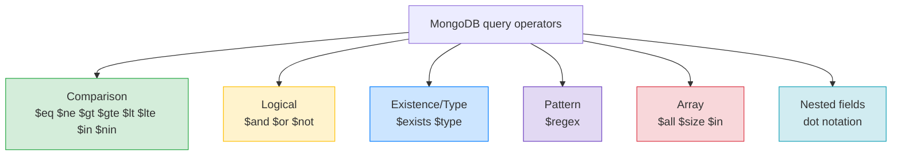

# 🍃 MongoDB Query Operators — Filtering Deeply — Complete Study Notes

> Notes for becoming a strong software engineer. Easy language, real code, and interview-ready explanations.
> This is where MongoDB gets powerful — operators are how you express complex filters.

---

## 📌 1. The Big Idea

In MongoDB, the **query is a JSON object**, and **operators** (the `$` words) are how you express anything beyond a plain equality match. They're the MongoDB equivalent of everything in a SQL `WHERE` clause — comparisons, AND/OR, pattern matching — *plus* extra powers SQL doesn't have natively, like querying inside **arrays** and **nested objects**.

> Analogy 🔍: a plain filter `{ city: "Bangalore" }` is like asking "city equals Bangalore?". Operators are the richer questions: "age *at least* 18?", "name *starting with* N?", "hobbies *containing* coding?". Same JSON shape, just `{ field: { $operator: value } }` instead of `{ field: value }`.

> 🎯 Interview line: *"In MongoDB the filter is a JSON document, and operators like `$gte`, `$in`, `$or`, `$regex` express complex conditions. Beyond SQL-style comparisons, it shines at querying arrays and nested fields directly."*



---

## ⚖️ 2. Comparison Operators

```javascript
{ age: { $eq: 25 } }            // equal (same as { age: 25 })
{ age: { $ne: 25 } }            // not equal
{ age: { $gt: 18 } }            // greater than
{ age: { $gte: 18 } }           // greater than or equal
{ age: { $lt: 65 } }            // less than
{ age: { $lte: 65 } }           // less than or equal
{ age: { $in: [18, 25, 30] } }  // value is in the array
{ age: { $nin: [18, 25] } }     // value is NOT in the array
```

| MongoDB | SQL | Meaning |
|---|---|---|
| `$eq` | `=` | equal (usually implicit: `{ age: 25 }`) |
| `$ne` | `!=` | not equal |
| `$gt` `$gte` | `>` `>=` | greater / or equal |
| `$lt` `$lte` | `<` `<=` | less / or equal |
| `$in` | `IN (...)` | in a list |
| `$nin` | `NOT IN` | not in a list |

> 💡 A **range** (SQL's `BETWEEN 18 AND 65`) is just two operators on one field: `{ age: { $gte: 18, $lte: 65 } }`.

---

## 🔗 3. Logical Operators

```javascript
// AND is IMPLICIT — just list multiple fields
{ age: { $gte: 18 }, city: "Bangalore" }

// Explicit $and (needed for two conditions on the SAME field)
{ $and: [ { age: { $gte: 18 } }, { age: { $lt: 30 } } ] }

// $or
{ $or: [ { city: "Bangalore" }, { city: "Mumbai" } ] }

// $not
{ age: { $not: { $gte: 18 } } }   // NOT (age >= 18)
```

> 💡 Key point: **multiple fields in one object are ANDed automatically.** You only need explicit `$and` when you have **two conditions on the same field** (you can't repeat a key in JSON). `$or` and `$not` are always explicit.

> 🎯 Interview line: *"AND is implicit — multiple keys are ANDed. I use explicit `$and` only when I need two conditions on the same field, and `$or`/`$not` for those cases."*

---

## 🔎 4. Existence and Type (a SQL-dev surprise)

Because MongoDB schemas are **flexible**, *"does this field even exist?"* is a real, useful question — something you'd never ask in rigid SQL.

```javascript
{ email: { $exists: true } }        // documents that HAVE an email field
{ deleted_at: { $exists: false } }  // documents that DON'T have deleted_at
{ age: { $type: "number" } }        // age field is a number
```

> ⚠️ This is one of MongoDB's surprises for SQL developers. In SQL every row has every column. In MongoDB, two documents in the same collection can have different fields — so `$exists` checks *presence of the field itself*, separate from its value.

> 🎯 Interview line: *"Because the schema is flexible, `$exists` lets me query whether a field is even present — a question that doesn't arise in SQL where every row has every column."*

---

## 🔤 5. Pattern Matching (`$regex`)

Same regex syntax as JavaScript.

```javascript
{ name:  { $regex: "^N", $options: "i" } }   // starts with N, case-insensitive
{ email: { $regex: "@gmail\\.com$" } }        // ends with @gmail.com
{ name:  { $regex: "kumar" } }                // contains "kumar"
```

| Regex piece | Meaning |
|---|---|
| `^` | start of string |
| `$` | end of string |
| `$options: "i"` | case-insensitive |
| `\\.` | a literal dot (escaped) |

> 💡 Maps to SQL `LIKE` / `ILIKE`: `^N` ≈ `LIKE 'N%'`, `@gmail\.com$` ≈ `LIKE '%@gmail.com'`, and `$options: "i"` ≈ `ILIKE`.

> ⚠️ Performance note (links to indexing): a regex **anchored at the start** (`^N`) can use an index; one **without a leading anchor** (`kumar` anywhere) cannot, so it scans — the same "leading wildcard is slow" lesson from your SQL WHERE notes.

---

## 📚 6. Array Operators (where MongoDB shines)

This is genuinely beyond what plain SQL columns do — querying *inside* an array field naturally.

```javascript
{ hobbies: "coding" }                         // array CONTAINS "coding"
{ hobbies: { $all: ["coding", "running"] } }  // contains BOTH (in any order)
{ hobbies: { $size: 3 } }                     // array has exactly 3 elements
{ hobbies: { $in: ["coding", "music"] } }     // array contains ANY of these
```

| Operator | Meaning |
|---|---|
| `{ field: value }` | array contains that value |
| `$all` | contains **all** listed values |
| `$in` | contains **any** of the listed values |
| `$size` | array length is exactly N |
| `$elemMatch` | (advanced) one array element matches multiple conditions |

> 💡 Notice the elegant overload: `{ hobbies: "coding" }` means *"the hobbies array contains coding"* — MongoDB automatically checks array membership. No join, no separate table (in SQL you'd need a `user_hobbies` junction table!).

> 🎯 Interview line: *"MongoDB queries arrays natively — `{ hobbies: 'coding' }` matches any document whose hobbies array contains coding, `$all` requires all values, `$size` checks length. In SQL that'd need a separate junction table and joins."*

---

## 🎯 7. Querying Nested Objects (dot notation)

To reach inside an embedded document, use a **dot-notation string** in quotes.

```javascript
{ "address.city": "Bangalore" }
{ "address.pincode": { $regex: "^560" } }
{ "address.geo.lat": { $gt: 12.9 } }   // deeper nesting works too
```

> 💡 The quotes are required because the key contains a dot. This is a **fundamental MongoDB pattern** — it's how the document model lets you filter on embedded data that, in SQL, would live in a separate joined table.

> 🎯 Interview line: *"To query embedded fields I use dot notation in quotes, like `{ 'address.city': 'Bangalore' }` — filtering nested data directly without a join."*

---

## 🕳️ 8. NULL Handling (the opposite of SQL!)

Here's a refreshing twist after the SQL NULL pain:

```javascript
{ deleted_at: null }   // matches docs where deleted_at is null OR doesn't exist
```

In MongoDB, `null` and "field doesn't exist" are treated **similarly by default** — so `{ field: null }` *works* and finds both. (Contrast SQL, where `= NULL` silently returns nothing and you must use `IS NULL`.)

> 💡 If you need to **distinguish** "explicitly null" from "missing", use `$exists`:
> ```javascript
> { deleted_at: { $exists: true, $eq: null } }  // present AND null
> { deleted_at: { $exists: false } }            // truly missing
> ```

> 🎯 Interview line: *"Unlike SQL, `{ field: null }` works directly in MongoDB and matches both null and missing fields. If I need to tell them apart, I combine it with `$exists`."*

---

## 💻 9. Practical Exercise — The 8 Queries

Insert ~20 varied users (some with addresses, some without, varying ages/cities/hobbies), then:

```javascript
// 1️⃣ All users in Bangalore
db.users.find({ city: "Bangalore" })

// 2️⃣ Users aged 25–35
db.users.find({ age: { $gte: 25, $lte: 35 } })

// 3️⃣ Names starting with N (case-insensitive)
db.users.find({ name: { $regex: "^N", $options: "i" } })

// 4️⃣ Users with "coding" in their hobbies
db.users.find({ hobbies: "coding" })

// 5️⃣ Users with BOTH "coding" and "running"
db.users.find({ hobbies: { $all: ["coding", "running"] } })

// 6️⃣ Users who HAVE an address field (any value)
db.users.find({ address: { $exists: true } })

// 7️⃣ Users in Bangalore OR Mumbai
db.users.find({ $or: [ { city: "Bangalore" }, { city: "Mumbai" } ] })
// (cleaner with $in:)
db.users.find({ city: { $in: ["Bangalore", "Mumbai"] } })

// 8️⃣ Users over 18 AND in Bangalore
db.users.find({ age: { $gt: 18 }, city: "Bangalore" })   // implicit AND
```

> 💪 **If you can write all 8 fluently, you've internalised MongoDB query syntax.** Notice how queries #4 and #5 (array membership) would each need a junction table and join in SQL — that's the document model's filtering power.

---

## 🎤 10. How to Explain in an Interview

**Step 1 — Queries are JSON + operators:**
> "MongoDB filters are JSON documents. Plain `{ field: value }` is equality; operators like `$gte`, `$in`, `$or`, `$regex` express everything more complex."

**Step 2 — Logic:**
> "Multiple fields are ANDed automatically. I use explicit `$and` only for two conditions on the same field, and `$or`/`$not` for those."

**Step 3 — The flexible-schema powers:**
> "Because schemas are flexible, `$exists` lets me query whether a field is even present — and `{ field: null }` matches both null and missing, unlike SQL."

**Step 4 — Arrays and nesting (the standout):**
> "MongoDB queries arrays natively — `{ hobbies: 'coding' }` matches documents containing that value, with `$all` and `$size` for more. And dot notation like `'address.city'` filters embedded fields. Both would need joins in SQL."

> 🟢 Trap question: *"Why is `{ hobbies: 'coding' }` enough — don't I need an operator?"* → *"When the field is an array, equality automatically means 'contains'. MongoDB checks membership, so it matches any document whose hobbies array includes coding."*

> 🟢 Trap question: *"How is NULL handling different from SQL?"* → *"In MongoDB `{ field: null }` works directly and matches null *and* missing fields. In SQL `= NULL` silently returns nothing — you must use IS NULL. MongoDB is more forgiving, but I use `$exists` when I need to distinguish missing from null."*

---

## 💎 11. Impressive Words & Phrases

| Instead of saying... | Say this 💪 |
|---|---|
| "The conditions" | "The **query predicate** (a JSON filter)" |
| "Greater-than etc." | "**Comparison operators**" |
| "Check the field is there" | "An **`$exists`** check (presence vs value)" |
| "Search inside the array" | "**Array membership** querying" |
| "Has all of these" | "**`$all`** — contains every listed value" |
| "Reach into nested data" | "**Dot-notation** access to embedded fields" |
| "Pattern match" | "A **`$regex`** match (anchored for index use)" |
| "Mongo's flexibility" | "**Schema flexibility** → presence is queryable" |
| "Match any of these" | "**`$in`** set membership" |

**Power vocabulary:** *query predicate, comparison/logical operators, implicit AND, $exists (field presence), $regex (anchored), array membership, $all, $size, $elemMatch, dot notation, embedded-field query, null-vs-missing semantics.*

> 🌶️ Bonus flex — **`$elemMatch`:** *"For an array of objects, `$elemMatch` requires a *single* element to satisfy multiple conditions at once — e.g. an order with a line item that's both product X *and* quantity > 2 in the *same* element, not spread across different ones."* This is a subtle gotcha that signals real array-querying experience.

---

## ⏱️ 12. Quick Revision (read 5 min before interview)

> **Filter = JSON + operators.** `{ field: value }` = equality; `{ field: { $op: value } }` = everything else.
>
> **Comparison:** `$eq $ne $gt $gte $lt $lte $in $nin`. Range = two ops on one field (`{ age: { $gte: 18, $lte: 65 } }`).
>
> **Logical:** AND is **implicit** (multiple keys); explicit `$and` only for same-field conditions; `$or`, `$not`.
>
> **Existence/type:** `$exists` (field present?), `$type`. Unique to flexible schemas.
>
> **Regex:** `$regex` + `$options: "i"`. `^N` ≈ `LIKE 'N%'`. Anchored regex can use an index.
>
> **Arrays (the shine):** `{ hobbies: "x" }` = contains; `$all` = contains all; `$in` = contains any; `$size` = length; `$elemMatch` = one element matches many conditions.
>
> **Nested:** dot notation in quotes → `{ "address.city": "Bangalore" }`.
>
> **NULL:** `{ field: null }` matches null **and** missing (opposite of SQL's pain). Use `$exists` to distinguish.
>
> **Golden line:** *"MongoDB filters are JSON with operators — implicit AND, `$or` for OR — and it shines at querying arrays (`{hobbies:'coding'}` = contains) and nested fields (`'address.city'`) directly, which would need joins in SQL."*

---

### ✅ Practice checklist (the 8 must-do queries)
- [ ] All users in Bangalore (equality)
- [ ] Aged 25–35 (`$gte` + `$lte` range)
- [ ] Name starts with N, case-insensitive (`$regex` + `$options`)
- [ ] Has "coding" in hobbies (array membership)
- [ ] Has BOTH "coding" and "running" (`$all`)
- [ ] Has an address field (`$exists`)
- [ ] Bangalore OR Mumbai (`$or` / `$in`)
- [ ] Over 18 AND in Bangalore (implicit AND)
- [ ] Bonus: try `$size`, dot notation, and `{ field: null }`

> 💪 If all 8 flow without looking, MongoDB query syntax is internalised. Arrays and nested fields are the powers SQL doesn't have natively — lean into them. 🚀
