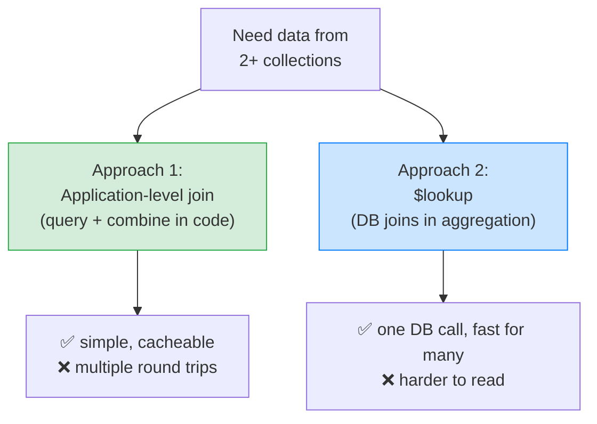
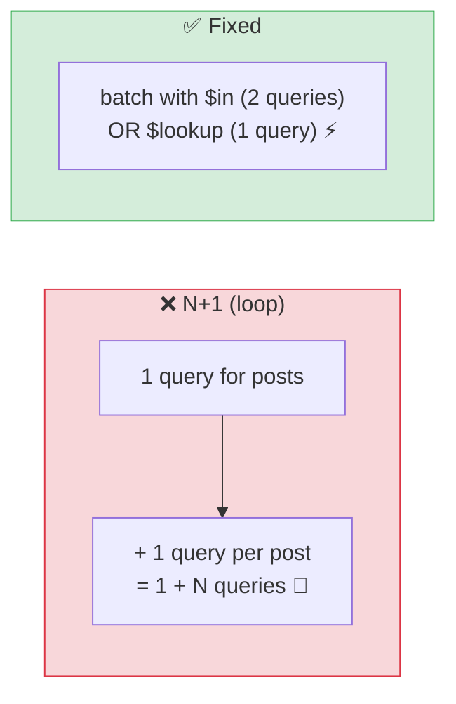

# 🍃 Relationships in Practice — Manual References vs `$lookup` — Complete Study Notes

> Notes for becoming a strong software engineer. Easy language, real code, and interview-ready explanations.
> How to actually *query across* the references you designed — two approaches, and when to use each.

---

## 📌 1. The Big Idea

In SQL, joining is **automatic** — you write `JOIN` and the database stitches tables together. In MongoDB, because the document model leans away from joins, you have **two approaches** to combine data from different collections:

1. **Application-level join** — run two queries, combine them in your Node.js code.
2. **`$lookup`** — let the database do the join inside an aggregation pipeline.

This is the practical follow-up to your schema-design notes: you decided to **reference** some data (posts → users); now you need to actually *fetch them together*.

> Analogy 🍱: imagine a meal with a main dish and a side from two different shops. **Application-level** = you make two trips (one per shop) and plate them yourself at home — simple, and you can remember (cache) the side shop. **`$lookup`** = you order a combo and one delivery brings both together — fewer trips, but a more complex order to write.

> 🎯 Interview line: *"MongoDB doesn't auto-join like SQL. I either do an application-level join — two queries combined in code — or use `$lookup` to join inside an aggregation pipeline. Application-level is my default for simple cases; `$lookup` wins when combining several collections."*



---

## 🔧 2. Approach 1 — Application-Level Join (the pragmatic default)

Run the queries separately and combine them in your application code.

```javascript
const post = await db.posts.findOne({ _id: postId });
const author = await db.users.findOne({ _id: post.author_id });
// combine them in application code:
const result = { ...post, author };
```

Two queries, joined in Node.js. This is the **pragmatic default** — simple, readable, and **easy to optimise** (e.g. cache the author lookup so you don't re-fetch the same author).

**Why it's often the right call:**
- The code is **clear** — anyone reading it sees exactly what happens.
- You can **cache** the second lookup (authors rarely change → cache hits).
- It works great for **simple, 1-or-2-collection** cases.

> 🎯 Application-level in one line: *"Two queries combined in code — simple, readable, and cacheable. Great for fetching a document plus one related document."*

---

## 🔗 3. Approach 2 — `$lookup` (database-level join)

`$lookup` performs the join **inside the database**, as a stage in the aggregation pipeline.

```javascript
db.posts.aggregate([
  { $match: { _id: postId } },          // 1. find the post(s)
  { $lookup: {
      from: "users",                    // the collection to join
      localField: "author_id",          // field on THIS collection (posts)
      foreignField: "_id",              // matching field on the OTHER collection (users)
      as: "author"                      // put the result in this new field (an array)
  } }
])
```

**One database call** — MongoDB does the join and attaches the author data. The four keys read as: *"from the `users` collection, match my `author_id` to their `_id`, and store the matches in a field called `author`."*

> 💡 Gotcha: `$lookup` always puts the result in an **array** (even for one match), because in general a join can match many documents. For a one-to-one like author, you usually follow it with `{ $unwind: "$author" }` to flatten that single-element array into an object.

> 🎯 `$lookup` in one line: *"A database-level join inside the aggregation pipeline — one round trip, MongoDB attaches the related documents as an array field."*

---

## ⚖️ 4. Which to Use — The Decision

| Situation | Use | Why |
|---|---|---|
| **Simple** (post + author) | **Application-level** | Cleaner code, cacheable, one extra query is cheap |
| **Complex** (post + author + comments + comment authors) | **`$lookup`** | One query beats many; the DB does the heavy lifting |
| Readability matters most | Application-level | `$lookup` pipelines get hard to read |
| Performance across 3+ collections | `$lookup` | Avoids many round trips |

**The foundation rule:**
> **Use application-level joins by default. Reach for `$lookup` when you have 3+ collections to combine.**

Most production code uses **both**, picking per case. They're not rivals — they're two tools for the same job.

> 🎯 Interview line: *"For simple cases I use an application-level join — cleaner and cacheable. For complex joins across three or more collections, `$lookup` is faster because it's one round trip instead of many. I pick per case; most codebases use both."*

---

## 🚨 5. The N+1 Problem (the critical performance trap)

This is the **single most important pitfall** in this topic, and a favourite interview question. It happens when an application-level join is done **inside a loop.**

```javascript
// ❌ THE N+1 PROBLEM
const posts = await db.posts.find().toArray();        // 1 query → N posts
for (const post of posts) {
  post.author = await db.users.findOne({ _id: post.author_id }); // 1 query PER post!
}
// Total: 1 + N queries. For 100 posts → 101 database round trips. 🐌
```

You ran **1** query for the posts, then **N** more (one per post) for the authors — hence **N+1**. With 100 posts that's 101 round trips, and it gets worse as data grows. This silently kills performance.

### The fixes

**Fix A — batch the second query (`$in`):** fetch *all* the authors in **one** query, then stitch in code.
```javascript
const posts = await db.posts.find().toArray();
const authorIds = [...new Set(posts.map(p => p.author_id))];   // unique ids
const authors = await db.users.find({ _id: { $in: authorIds } }).toArray();  // ONE query
const byId = Object.fromEntries(authors.map(a => [a._id.toString(), a]));
posts.forEach(p => { p.author = byId[p.author_id.toString()]; });
// Total: 2 queries, regardless of N. ⚡
```

**Fix B — use `$lookup`:** one aggregation call does it all.
```javascript
db.posts.aggregate([
  { $lookup: { from: "users", localField: "author_id", foreignField: "_id", as: "author" } }
])
// Total: 1 query.
```

> 🎯 Interview line: *"The N+1 problem is looping over N results and firing a query per item — 1 + N round trips. I fix it by batching the related fetch with `$in` (so it's 2 queries total) or by using `$lookup` (1 query). It's the most common cause of slow list endpoints."* (This exact problem exists in SQL ORMs too — same trap, same fixes.)



---

## 🎤 6. How to Explain in an Interview

**Step 1 — The two approaches:**
> "MongoDB doesn't auto-join. I either do an application-level join — query each collection and combine in code — or use `$lookup` to join inside an aggregation pipeline."

**Step 2 — When each:**
> "Application-level for simple cases — it's cleaner and I can cache the lookup. `$lookup` when combining three or more collections, because one round trip beats many."

**Step 3 — `$lookup` mechanics:**
> "`$lookup` takes from, localField, foreignField, and as — it matches my local field to the foreign collection's field and attaches results as an array, which I often `$unwind` for one-to-one."

**Step 4 — The N+1 trap (lead with this if perf comes up):**
> "The big pitfall is the N+1 problem — looping over N results with a query per item, giving 1+N round trips. I fix it by batching with `$in` for two queries total, or `$lookup` for one."

> 🟢 Trap question: *"Your list endpoint loads 50 items in 51 queries — what's wrong and how do you fix it?"* → *"That's the N+1 problem — a per-item query inside a loop. I'd batch the related fetch with a single `$in` query, or use `$lookup` so the database joins in one call."*

> 🟢 Trap question: *"Isn't `$lookup` just as slow as N queries?"* → *"No — `$lookup` is one round trip and the database optimises the match (especially with an index on the foreign field). N separate app queries each pay network latency, which dominates. But `$lookup` can be heavier on the DB, so for simple cases a cached application-level join is still often best."*

---

## 💎 7. Impressive Words & Phrases

| Instead of saying... | Say this 💪 |
|---|---|
| "Join in code" | "An **application-level join**" |
| "Join in the database" | "A **`$lookup`** in the aggregation pipeline" |
| "Lots of small queries" | "The **N+1 query problem**" |
| "Fetch them all at once" | "**Batch** the fetch with `$in`" |
| "Trips to the database" | "**Round trips** (network latency dominates)" |
| "Flatten the array" | "**`$unwind`** the joined array" |
| "Remember the author" | "**Cache** the lookup" |
| "Link between collections" | "A **manual reference** (app-enforced)" |
| "Match field to field" | "**localField / foreignField** matching" |

**Power vocabulary:** *application-level join, $lookup, aggregation pipeline, N+1 query problem, batching with $in, round trips, network latency, $unwind, manual reference, localField/foreignField, query caching.*

> 🌶️ Bonus flex — **"latency, not the query, is the cost":** *"The reason N+1 hurts isn't the queries themselves — each is fast — it's the cumulative network round-trip latency. Batching or `$lookup` collapses many round trips into one, which is the real win."* Framing it as a latency problem shows you understand *why*, not just the fix.

---

## ⏱️ 8. Quick Revision (read 5 min before interview)

> **MongoDB doesn't auto-join.** Two approaches to combine collections:
>
> **1. Application-level join** → query each, combine in code. ✅ simple, readable, **cacheable**. Default for simple cases (post + author).
>
> **2. `$lookup`** → DB-level join in the aggregation pipeline: `from`, `localField`, `foreignField`, `as`. ✅ one round trip; best for **3+ collections**. Result is an **array** → `$unwind` for one-to-one.
>
> **Rule:** application-level by default; **`$lookup` when joining 3+ collections.** Most code uses both.
>
> **🚨 N+1 problem:** a query *per item in a loop* → **1 + N** round trips (50 items = 51 queries). **Fix:** batch with `$in` (2 queries) or `$lookup` (1 query). The cost is **network latency**, not the queries.
>
> **Golden line:** *"I default to application-level joins for simple, cacheable cases and reach for `$lookup` across 3+ collections — and I always avoid the N+1 trap by batching with `$in` or `$lookup` instead of querying inside a loop."*

---

### ✅ Practice checklist
- [ ] Do an application-level join: fetch a post, then its author, combine in code
- [ ] Write the equivalent `$lookup` aggregation (from/localField/foreignField/as)
- [ ] `$unwind` the author array into a single object
- [ ] **Reproduce the N+1 problem** with a loop, count the queries
- [ ] Fix it with a single `$in` batch query
- [ ] Fix it again with `$lookup`
- [ ] Explain out loud why N+1 hurts (round-trip latency)

Knowing both join approaches — and never falling into the N+1 trap — is exactly the practical skill that keeps MongoDB endpoints fast. 🚀
