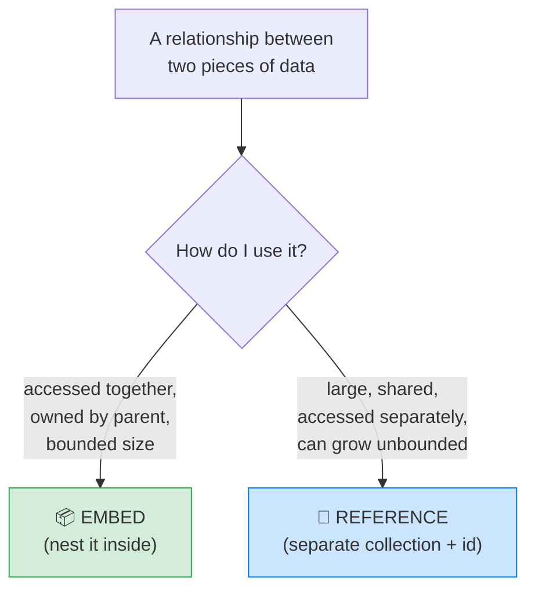
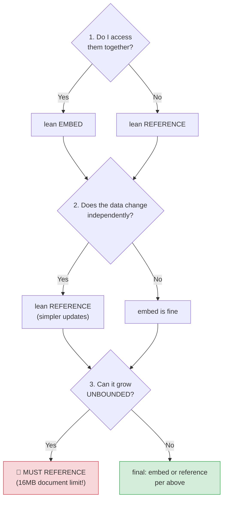

# 🍃 MongoDB Schema Design — Embed vs Reference — Complete Study Notes

> Notes for becoming a strong software engineer. Easy language, real code, and interview-ready explanations.
> ⭐ This is THE critical MongoDB skill — schema design matters **more than syntax**. Get this right and everything else follows.

---

## 📌 1. Why This Is The Most Important MongoDB Skill

In SQL, schema design is mostly solved for you: you **always normalise** (split data into tables, link with foreign keys). There's one "right" way.

In MongoDB, **you decide for every single relationship**: do I **embed** the related data inside the document, or **reference** it in a separate collection? There's no automatic rule — *you* make the call, and a bad call hurts performance or correctness later.

> Analogy 🎒: think of packing for a trip. **Embedding** is putting items *inside* your main bag — everything together, grab it and go (fast), but the bag can only get so big. **Referencing** is checking some bags separately — more trips to collect everything (slower), but each bag stays manageable and can be shared. You pack each item based on how you'll use it. MongoDB schema design is exactly this decision, per relationship.

> 🎯 Interview line: *"In SQL I normalise by default. In MongoDB, the central design decision is embed versus reference for each relationship — and I base it on how the data is accessed, whether it changes independently, and whether it can grow unbounded."*

---

## 🆚 2. Embed vs Reference — The Core Choice



---

## 📦 3. EMBED When...

Embed (nest the data inside the parent document) when:
- The related data is **"owned by" the parent** — the parent is meaningless without it.
- The data is **always accessed together** with the parent.
- The embedded data's **size is bounded** (won't grow forever).

**Example — a user's address.** The address belongs to the user, you almost always need them together, and addresses are small. → **Embed.**

```json
{
  "_id": ObjectId("..."),
  "name": "Nayan",
  "address": {
    "street": "MG Road",
    "city": "Bangalore"
  }
}
```

**Other classic embed cases:**
- A product's **specifications**
- A user's **preferences** object
- A blog post's **tags** array
- An order's **line items**

> 💡 Why embedding is fast: it's all one document, read in **one fetch**, with **no join**, and updates to the whole document are **atomic** (links to your ACID notes — single-document writes are atomic in MongoDB).

> 🎯 Embed in one line: *"Embed data that's owned by the parent, read together, and bounded in size — so it's one fast, atomic read."*

---

## 🔗 4. REFERENCE When...

Reference (store an id pointing to a separate collection) when:
- The related data is **large and independent**.
- The data is **shared between multiple parents**.
- You **frequently need the related data without the parent**.

**Example — posts and authors.** Many posts share one author, you sometimes need just the author, and authors can grow large (bio, profile pic, settings). → **Reference.**

```json
// posts collection
{
  "_id": ObjectId("..."),
  "title": "My first post",
  "user_id": ObjectId("507f1f77bcf86cd799439011")   // 🔗 reference
}

// users collection
{
  "_id": ObjectId("507f1f77bcf86cd799439011"),
  "name": "Nayan",
  "bio": "..."
}
```

**Other classic reference cases:** posts → users, orders → customers, comments → posts.

> 💡 To fetch the related data you do a **second query** (or a `$lookup` join). More work than embedding, but the data stays **un-duplicated**, **shareable**, and **independently updatable**.

> ⚠️ Remember: MongoDB does **not enforce** references (no foreign keys). If you delete a user, posts pointing to them become **dangling references** unless your app cleans up. Referential integrity is *your* responsibility.

> 🎯 Reference in one line: *"Reference data that's large, shared, accessed separately, or unbounded — keeping it independent and un-duplicated."*

---

## 🌳 5. The Decision Tree (memorise these 3 questions)

For any relationship, ask three questions in order:



1. **Do I access them together?** Yes → lean **embed**. No → lean **reference**.
2. **Does the embedded data change independently?** Yes → lean **reference** (updates are simpler — change it in one place, not inside every parent).
3. **Can the embedded data grow unbounded?** Yes → you **MUST reference.** 🚨

> 🚨 **The hard limit:** a MongoDB document **cannot exceed 16MB.** So anything that can grow without bound **must** be referenced, no matter how nicely it would embed.

---

## ❌ 6. The Most Common Mistake — Embedding Comments

> **Embedding comments inside a post is the classic MongoDB design error.** Comments **grow unbounded** — a viral post could have **millions** of them. Embedding would (a) blow past the 16MB document limit, and (b) make every read of the post drag along all those comments.

```json
// ❌ BAD: comments embedded — grows forever, hits 16MB limit
{
  "_id": ObjectId("..."),
  "title": "Viral post",
  "comments": [ /* ...could become millions of entries... */ ]
}

// ✅ GOOD: separate comments collection, referencing the post
// comments collection
{ "_id": ObjectId("..."), "post_id": ObjectId("post_1"), "user": "Amit", "text": "Nice!" }
```

> 🎯 Interview line: *"The classic mistake is embedding comments in a post. Comments grow unbounded — a viral post could have millions — so it would hit the 16MB document limit. Anything unbounded must be a separate, referenced collection."*

> 💡 Rule of thumb: **"few and bounded → embed; many and growing → reference."** Tags (a handful) embed; comments (potentially endless) reference.

---

## 🔀 7. The Many-to-Many Question

In SQL you'd always make a junction table (from your relationships notes). In MongoDB you have **three options** — pick by the situation.

### Option A — Array of references on ONE side
```json
// student document
{
  "_id": ObjectId("..."),
  "name": "Alice",
  "course_ids": [ObjectId("c1"), ObjectId("c2")]
}
```
Simple. Good when you mostly query *"which courses does this student have?"* but rarely the reverse.

### Option B — Array of references on BOTH sides
```json
// student
{ "name": "Alice", "course_ids": [ObjectId("c1")] }
// course
{ "name": "Math", "student_ids": [ObjectId("s1")] }
```
**Faster for queries in both directions**, but you **double the write work** (update both sides on every change) and **risk inconsistency** if one update fails. Use only when read speed in both directions really matters.

### Option C — Junction collection (just like SQL)
```json
// enrollments collection
{ "student_id": ObjectId("s1"), "course_id": ObjectId("c1"), "enrolled_at": ISODate("...") }
```
**Necessary when the relationship itself has data** — when did they enrol? what's their grade? That extra info has nowhere to live in Options A/B, so it needs its own document.

| Option | Best when | Cost |
|---|---|---|
| **A** — one-sided array | Mostly query one direction | Reverse queries are harder |
| **B** — two-sided arrays | Need fast queries both ways | Double writes, inconsistency risk |
| **C** — junction collection | The relationship **has its own data** | An extra collection + joins |

> 🎯 Interview line: *"For many-to-many in MongoDB I have three choices: an array of references on one side, on both sides for two-way speed at the cost of double writes, or a junction collection like SQL — which I must use when the relationship itself carries data like an enrolment date or grade."*

---

## 🎤 8. How to Explain in an Interview

**Step 1 — The core shift:**
> "Unlike SQL where I always normalise, MongoDB makes me choose embed or reference for every relationship — and that's the most important design decision."

**Step 2 — Embed vs reference:**
> "I embed when data is owned by the parent, read together, and bounded — like a user's address — for one fast atomic read. I reference when data is large, shared, accessed separately, or unbounded — like posts to authors."

**Step 3 — The decision tree:**
> "I ask three things: do I access them together, does the data change independently, and can it grow unbounded? Unbounded growth means I *must* reference, because documents are capped at 16MB."

**Step 4 — The classic mistake:**
> "The textbook error is embedding comments in a post — they grow unbounded and would hit the size limit, so comments go in their own collection."

**Step 5 — Many-to-many:**
> "For many-to-many I use arrays of references, or a junction collection when the relationship itself has data like a grade or timestamp."

> 🟢 Trap question: *"Why not embed everything for speed?"* → *"Because of the 16MB document limit and unbounded growth — embedding something that grows forever breaks. Also, embedding shared data duplicates it, so updates get expensive and risk inconsistency. Embedding is great only for owned, bounded, together-read data."*

> 🟢 Trap question: *"There are no foreign keys — how do you keep references valid?"* → *"MongoDB doesn't enforce them, so it's the application's job — clean up or handle dangling references on delete. It's a trade-off: flexibility for the loss of automatic referential integrity."*

---

## 💎 9. Impressive Words & Phrases

| Instead of saying... | Say this 💪 |
|---|---|
| "Put it inside" | "**Embed** the sub-document" |
| "Link to it" | "**Reference** it (store the ObjectId)" |
| "Data belongs to parent" | "Data is **owned by** the parent" |
| "Read it all at once" | "A single **atomic read**, no join" |
| "It can grow forever" | "**Unbounded growth** (risks the 16MB limit)" |
| "Copy of the same data" | "**Duplication** → update anomalies" |
| "Broken link after delete" | "A **dangling reference** (no enforced FK)" |
| "Middle table" | "A **junction collection**" |
| "Design for how it's read" | "Model around the **access pattern**" |
| "Spread to both sides" | "**Bidirectional referencing** (double writes)" |

**Power vocabulary:** *embed vs reference, access pattern, owned-by relationship, bounded vs unbounded, 16MB document limit, atomic single-document write, duplication/update anomaly, dangling reference, referential integrity (app-enforced), junction collection, bidirectional references.*

> 🌶️ Bonus flex — **"model around the access pattern":** *"In MongoDB I design schema around how the app reads data, not around pure normalisation. The golden question is 'what does my most common query need to return in one fetch?' — embed for that, reference the rest."* This single principle is the heart of MongoDB design and sounds genuinely senior.

---

## ⏱️ 10. Quick Revision (read 5 min before interview)

> **The core decision:** SQL = always normalise. MongoDB = **embed or reference**, per relationship. This is THE skill.
>
> **EMBED when:** owned by parent + accessed together + **bounded** size. *(user's address, product specs, tags, order line items.)* → one fast atomic read, no join.
>
> **REFERENCE when:** large + shared + accessed separately + **unbounded**. *(posts→authors, orders→customers, comments→posts.)* → un-duplicated, independent, but needs a 2nd query / `$lookup`.
>
> **Decision tree (3 Qs):** 1) accessed together? (yes→embed) 2) changes independently? (yes→reference) 3) **can grow unbounded? (yes→MUST reference — 16MB limit!)**
>
> **#1 mistake:** embedding **comments** in a post — they grow unbounded → separate collection.
>
> **Many-to-many:** (A) array of refs one side, (B) both sides (fast both ways, double writes + inconsistency risk), (C) **junction collection** — required when the relationship has its own data (grade, enrolled_at).
>
> **No enforced FKs** → app handles dangling references.
>
> **Golden line:** *"I model around the access pattern — embed owned, bounded, together-read data for one fast atomic fetch; reference anything large, shared, or unbounded. The 16MB limit means unbounded data must always be referenced."*

---

### ✅ Practice checklist
- [ ] Embed a user's `address` (owned, bounded) and read it in one fetch
- [ ] Reference posts → users (shared, independent author)
- [ ] Run the 3-question decision tree on: comments, tags, order items, profile
- [ ] Explain why embedding comments is wrong (unbounded → 16MB limit)
- [ ] Model a many-to-many with an array of references (Option A)
- [ ] Model a many-to-many needing extra data (grade) as a junction collection (Option C)
- [ ] Explain "model around the access pattern" out loud

⭐ Schema design is where MongoDB engineers prove themselves. Master embed-vs-reference and the access-pattern mindset, and you design documents like a senior. 🚀
