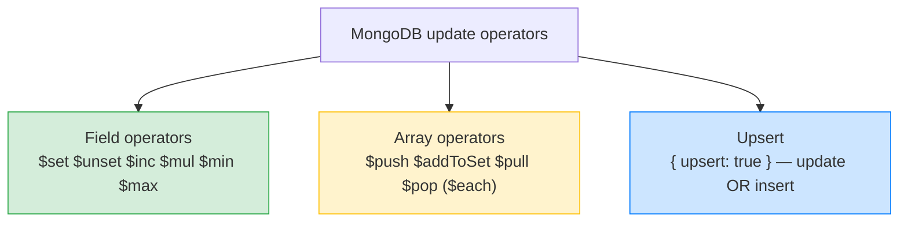
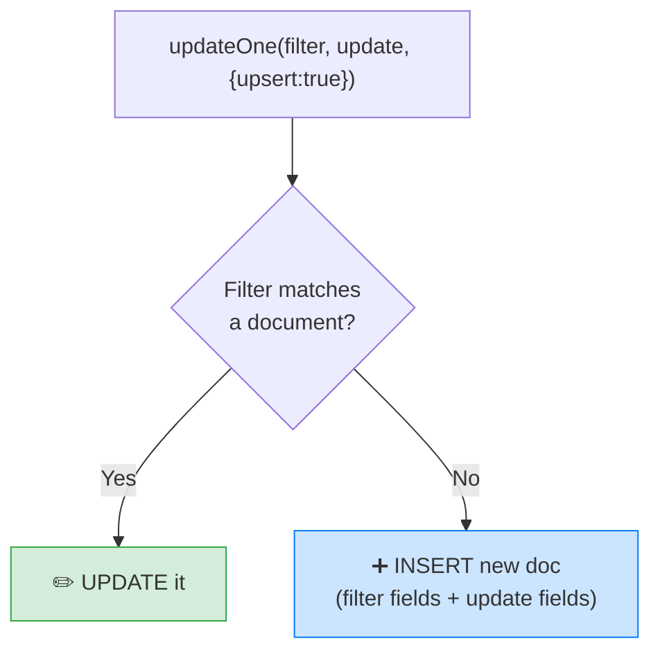

# 🍃 MongoDB Updates — Update Operators, Arrays & Upsert — Complete Study Notes

> Notes for becoming a strong software engineer. Easy language, real code, and interview-ready explanations.
> MongoDB's update operators are genuinely more powerful than SQL's UPDATE — especially for arrays and atomic counters.

---

## 📌 1. The Big Idea

SQL's `UPDATE table SET col = value` feels primitive next to MongoDB's update operators. MongoDB gives you a **toolbox of `$` operators** that can set, remove, increment, multiply, and — the standout — **modify arrays in place, atomically.**

Two themes run through everything in this note:
1. **Operators, not replacement** — updates always use `$set`, `$inc`, `$push`, etc. (remember the #1 bug from the CRUD notes: no operator = the whole document gets replaced).
2. **Atomicity** — these operators are **atomic at the document level**. Concurrent updates to the same document don't corrupt each other. This is *why* `$inc` is the right way to do counters.

> Analogy 🔧: SQL's UPDATE is like having one screwdriver. MongoDB's update operators are a full toolkit — a wrench for numbers (`$inc`), pliers for arrays (`$push`/`$pull`), a remover (`$unset`) — and every tool locks the document while it works, so two people using tools at once don't break anything.

> 🎯 Interview line: *"MongoDB updates use operators — $set, $inc, $push and friends — that modify documents in place atomically. That atomicity is what makes counters and concurrent array updates safe without application-level locking."*



---

## 🔧 2. Field Update Operators

```javascript
// $set — set a field's value (multiple at once is fine)
db.users.updateOne(
  { _id: ObjectId("...") },
  { $set: { name: "Nayan Kumar", city: "Mumbai" } }
)

// $unset — remove a field ENTIRELY from the document
db.users.updateOne(
  { _id: ObjectId("...") },
  { $unset: { deprecated_field: "" } }   // the "" value is ignored; the key matters
)

// $inc — increment (or decrement) a number ATOMICALLY
db.products.updateOne(
  { _id: ObjectId("...") },
  { $inc: { stock: -1, view_count: 1 } }   // -1 stock, +1 views, in one atomic op
)

// $mul — multiply
db.products.updateOne(
  { _id: ObjectId("...") },
  { $mul: { price: 1.1 } }    // 10% price increase
)

// $min / $max — set ONLY IF the new value is smaller / larger than current
db.products.updateOne(
  { _id: ObjectId("...") },
  { $min: { lowest_price: 99 } }   // updates only if 99 < current lowest_price
)
```

| Operator | What it does | SQL-ish equivalent |
|---|---|---|
| `$set` | Set/overwrite field(s) | `SET col = value` |
| `$unset` | Remove the field entirely | (no equivalent — SQL columns always exist) |
| `$inc` | Atomic add/subtract | `SET views = views + 1` |
| `$mul` | Atomic multiply | `SET price = price * 1.1` |
| `$min` / `$max` | Conditional set (only if smaller/larger) | `SET x = LEAST(x, 99)` |

> 💡 `$unset` is another flexible-schema special: SQL rows always have every column, but a Mongo document can genuinely **lose a field**. (Pairs with `$exists` from the query-operators notes — one queries presence, the other removes it.)

### ⭐ Why `$inc` matters — document-level atomicity

`$inc` is **atomic at the document level**. If 100 users view a product simultaneously and all fire `$inc: { view_count: 1 }`, the count ends up **exactly 100 higher** — no lost updates, no race condition.

Contrast the broken way:
```javascript
// ❌ RACE CONDITION: read-modify-write in app code
const p = await db.products.findOne({ _id });   // both requests read 50
await db.products.updateOne({ _id }, { $set: { view_count: p.view_count + 1 } });
// both write 51 → one increment LOST 😱

// ✅ ATOMIC: let the database do the math
await db.products.updateOne({ _id }, { $inc: { view_count: 1 } });
// always correct, no matter how many run concurrently
```

> 🎯 Interview line: *"$inc is atomic, so it's the right way to update counters, stock levels, and view counts. Reading the value into app code and writing it back creates a classic lost-update race — letting the database do the math eliminates it."* (Same race-condition thinking as the UNIQUE-constraint fix in your SQL constraints notes.)

---

## 📚 3. Array Update Operators (where MongoDB really differs from SQL)

In SQL, modifying a "list" means UPDATE/INSERT/DELETE on a separate child table. In MongoDB you edit the array **in place** — atomically.

```javascript
// $push — append to the array
db.users.updateOne(
  { _id: ObjectId("...") },
  { $push: { hobbies: "swimming" } }
)

// $push with $each — append MULTIPLE values
db.users.updateOne(
  { _id: ObjectId("...") },
  { $push: { hobbies: { $each: ["swimming", "cooking"] } } }
)

// $addToSet — add ONLY IF not already present (no duplicates)
db.users.updateOne(
  { _id: ObjectId("...") },
  { $addToSet: { hobbies: "coding" } }   // if "coding" exists, nothing happens
)

// $pull — remove ALL matching items
db.users.updateOne(
  { _id: ObjectId("...") },
  { $pull: { hobbies: "reading" } }
)

// $pop — remove from the END (1) or the FRONT (-1)
db.users.updateOne(
  { _id: ObjectId("...") },
  { $pop: { hobbies: 1 } }    // 1 = remove last, -1 = remove first
)
```

| Operator | What it does | Mental model |
|---|---|---|
| `$push` | Append a value | like JS `array.push()` |
| `$push` + `$each` | Append several values | push a batch |
| `$addToSet` | Add only if absent | treat the array like a **set** (unique) |
| `$pull` | Remove all matches | filter out a value |
| `$pop` | Remove last (`1`) or first (`-1`) | like JS `pop()` / `shift()` |

> ⭐ **`$push` vs `$addToSet` is the classic interview distinction:** `$push` always appends (duplicates allowed); `$addToSet` enforces uniqueness (skips if present). Tags, likes, and follower lists usually want `$addToSet` — you don't want a user "liking" twice.

> ⚡ **All atomic.** Multiple users `$push`-ing to the same array simultaneously won't corrupt it or lose entries — the document-level atomicity covers array edits too. No app-level locking needed.

> 🎯 Interview line: *"Array operators modify arrays in place atomically — $push appends, $addToSet adds only if absent, $pull removes matches. Concurrent pushes don't race. In SQL the equivalent needs a child table and separate statements."*

---

## 🔁 4. Upsert — "Insert or Update" in One Atomic Operation

When you want **"create if it doesn't exist, update if it does"**, add `{ upsert: true }` as the third argument:

```javascript
db.users.updateOne(
  { email: "nayan@example.com" },                       // filter
  { $set: { name: "Nayan", last_login: new Date() } },  // update
  { upsert: true }                                       // ⭐ the magic flag
)
```

**How it behaves:**
- Filter **matches** a document → normal **update**.
- Filter matches **nothing** → MongoDB **inserts** a new document built from the **filter fields + the update fields** (so the new doc gets `email`, `name`, and `last_login`).



**Why it's great:** it replaces the fragile two-step *"check if exists, then insert or update"* — which has a **race window** (two requests both check, both find nothing, both insert → duplicate). Upsert does the whole decision **atomically** in the database. Perfect for **sync operations** and **"find or create"** patterns (e.g. updating a user's `last_login` whether or not their record exists yet).

> 💡 Bonus operator: `$setOnInsert` sets fields **only when the upsert inserts** (not on updates) — e.g. `{ $set: { last_login: new Date() }, $setOnInsert: { created_at: new Date() } }` stamps `created_at` once, on creation only.

> 🎯 Interview line: *"Upsert makes updateOne insert the document if the filter matches nothing — built from the filter plus update fields — atomically. It replaces the racy check-then-insert pattern and is ideal for find-or-create and sync logic."*

---

## 💻 5. Practical Examples (put together)

```javascript
// E-commerce: sell one unit — atomic stock decrement + sales counter
db.products.updateOne(
  { _id: productId, stock: { $gt: 0 } },     // only if stock remains (guard!)
  { $inc: { stock: -1, sold_count: 1 } }
)
// 💡 The filter guard `stock: { $gt: 0 }` + atomic $inc prevents overselling:
//    if stock is 0, the filter matches nothing → modifiedCount is 0 → reject the sale.

// Social: like a post (no double-likes) + counter
db.posts.updateOne(
  { _id: postId },
  { $addToSet: { liked_by: userId }, $inc: { like_count: 1 } }
)

// Settings sync: find-or-create with created_at stamped once
db.settings.updateOne(
  { user_id: userId },
  { $set: { theme: "dark" }, $setOnInsert: { created_at: new Date() } },
  { upsert: true }
)

// Cleanup: remove a deprecated field from ALL docs
db.users.updateMany({}, { $unset: { old_field: "" } })

// Keep a "recent searches" array (push a batch)
db.users.updateOne(
  { _id: userId },
  { $push: { recent_searches: { $each: ["mongodb", "indexes"] } } }
)
```

> ⚠️ Subtle catch in the like example: if the user already liked (so `$addToSet` adds nothing), the `$inc` still runs — the counter drifts. For strict correctness, add the membership check to the **filter**: `{ _id: postId, liked_by: { $ne: userId } }` — then nothing updates if already liked. Knowing this nuance is a genuinely senior detail.

---

## 🎤 6. How to Explain in an Interview

**Step 1 — Operators + atomicity:**
> "MongoDB updates use operators — $set, $unset, $inc, $mul, $min/$max — and they're atomic at the document level, so concurrent updates don't corrupt each other."

**Step 2 — The counter rule:**
> "$inc is the right way to do counters, stock, and views — read-modify-write in app code has a lost-update race; letting the database do the math eliminates it."

**Step 3 — Arrays:**
> "Array operators edit arrays in place — $push appends, $addToSet adds only if absent, $pull removes, $pop trims an end — all atomic. In SQL that'd be a child table and multiple statements."

**Step 4 — Upsert:**
> "Upsert makes updateOne insert if nothing matches, built from the filter plus update fields, atomically — replacing the racy check-then-insert. $setOnInsert stamps fields only on creation."

> 🟢 Trap question: *"How do you prevent overselling when stock hits zero?"* → *"Put the guard in the filter — `{ _id, stock: { $gt: 0 } }` with `$inc: { stock: -1 }`. If stock is zero the filter matches nothing, modifiedCount is 0, and I reject the sale. The check and decrement are one atomic operation."*

> 🟢 Trap question: *"$push vs $addToSet?"* → *"$push always appends, allowing duplicates. $addToSet treats the array as a set — adds only if the value isn't already there. Likes, tags, followers want $addToSet."*

---

## 💎 7. Impressive Words & Phrases

| Instead of saying... | Say this 💪 |
|---|---|
| "Add 1 safely" | "An **atomic increment** (`$inc`)" |
| "Two updates clash" | "A **lost-update race condition**" |
| "Read then write back" | "A racy **read-modify-write** (avoid it)" |
| "No duplicates in array" | "**Set semantics** via `$addToSet`" |
| "Edit the array directly" | "**In-place, atomic array mutation**" |
| "Insert or update" | "An **atomic upsert**" |
| "Only on creation" | "**`$setOnInsert`** (insert-only fields)" |
| "Check stock in the query" | "A **filter guard** for conditional atomic updates" |
| "Remove the field" | "**`$unset`** the field (schema flexibility)" |
| "Document is the lock unit" | "**Document-level atomicity**" |

**Power vocabulary:** *update operator, document-level atomicity, atomic increment, lost update, read-modify-write, set semantics, $addToSet, in-place array mutation, upsert, $setOnInsert, filter guard, conditional update, modifiedCount.*

> 🌶️ Bonus flex — **the filter-guard pattern:** *"For 'decrement only if positive' logic I put the condition in the filter — `{ stock: { $gt: 0 } }` with `$inc: { stock: -1 }` — making the check and the change one atomic operation. It's MongoDB's answer to the last-item race condition, no transaction needed."* This pattern (compare-and-update in one op) is real production craft.

---

## ⏱️ 8. Quick Revision (read 5 min before interview)

> **Updates = operators + atomicity.** Always use an operator (no operator → whole-document replacement, the #1 bug).
>
> **Field ops:** `$set` (set), `$unset` (remove field), `$inc` (atomic ±), `$mul` (×), `$min`/`$max` (conditional set).
>
> **`$inc` is THE counter tool** — atomic, no lost updates. Never read-modify-write counters in app code.
>
> **Array ops (atomic, in place):** `$push` (append; `$each` for batch), `$addToSet` (add if absent — set semantics), `$pull` (remove matches), `$pop` (1=last, -1=first). *$push vs $addToSet = duplicates vs unique.*
>
> **Upsert:** `{ upsert: true }` → update if matched, **insert (filter+update fields) if not** — atomically. Kills the racy check-then-insert. `$setOnInsert` = fields only on creation.
>
> **Filter-guard pattern:** condition in the filter + atomic op = safe conditional update (`{ stock: { $gt: 0 } }` + `$inc: { stock: -1 }` → no overselling).
>
> **Golden line:** *"MongoDB updates are atomic at the document level — $inc for counters, $addToSet for unique arrays, upsert for find-or-create, and a filter guard for 'only if' logic — all without app-level locking."*

---

### ✅ Practice checklist
- [ ] `$set` multiple fields; `$unset` a field and confirm it's gone
- [ ] `$inc` a counter; then simulate the broken read-modify-write and see why $inc wins
- [ ] `$mul` a price by 1.1; try `$min`/`$max`
- [ ] `$push` one value, then a batch with `$each`
- [ ] `$addToSet` an existing value → confirm no duplicate
- [ ] `$pull` and `$pop` (both ends)
- [ ] Upsert a settings doc twice → first inserts, second updates; add `$setOnInsert`
- [ ] Implement the no-oversell pattern: filter `stock: { $gt: 0 }` + `$inc: { stock: -1 }`, check `modifiedCount`

MongoDB's update toolkit — atomic counters, set-like arrays, upserts, filter guards — solves with single operations what SQL needs transactions and child tables for. Master these and your writes are both elegant and race-proof. 🚀
