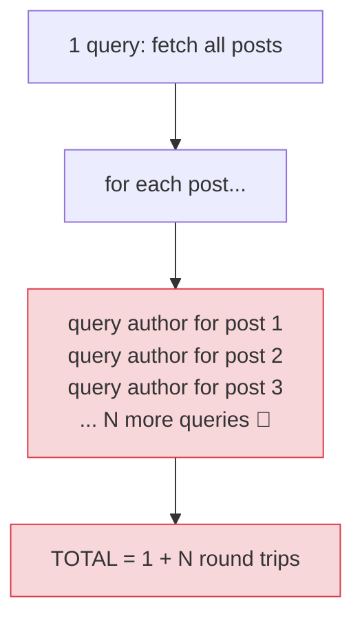

# 🚨 The N+1 Query Problem — Complete Study Notes

> Notes for becoming a strong software engineer. Easy language, real code, and interview-ready explanations.
> One of the most common performance bugs in real apps — and spotting it in code review is a **senior engineer skill.**

---

## 📌 1. What is the N+1 Problem? (in simple words)

The N+1 problem is a performance bug where, to load a list of things **plus** their related data, your code makes **1 query for the list**, then **N more queries** — one for each item in the list. Total: **1 + N** database calls.

> Analogy 📮: imagine you need to post 100 letters. The N+1 way is walking to the post office **101 times** — once to get the list of addresses, then a separate trip for each letter. The smart way is **one trip** carrying all 100 letters together. The letters aren't the problem; the **repeated trips** are.

> 🎯 Interview line: *"The N+1 problem is making one query to fetch a list, then one extra query per item to fetch related data — so loading N items costs 1+N database round trips. It's a top cause of slow list endpoints."*

---

## 🐌 2. The Classic Bug

```javascript
// ❌ BAD: 1 + N queries
const posts = await db.posts.find().toArray();          // 1 query → N posts
for (const post of posts) {
  post.author = await db.users.findOne({ _id: post.author_id });  // N queries! (one per post)
}
```

If there are **100 posts**, this hits the database **101 times** (1 for the posts + 100 for the authors). With 1,000 posts → 1,001 calls. It gets **linearly worse** as data grows, which is why it often passes in testing (10 posts feels fine) but **melts in production** (10,000 posts).

> ⚠️ The tell-tale sign: **a database call inside a loop.** That's the red flag to train your eyes on.



> 💡 This is the **same problem in SQL** — ORMs like Prisma, Sequelize, and ActiveRecord cause it silently when you access a related field inside a loop. Same trap, same fixes. So this one concept covers an interview question across *both* databases.

---

## ✅ 3. Fix A — Batch Fetch (the `$in` pattern)

Instead of fetching authors one-by-one, collect all the ids and fetch them **in a single query** with `$in`, then stitch them together in code using a Map for fast lookup.

```javascript
// ✅ GOOD: 2 queries total, regardless of N
const posts = await db.posts.find().toArray();                  // query 1

const authorIds = posts.map(p => p.author_id);                  // gather the ids
const authors = await db.users
  .find({ _id: { $in: authorIds } })                            // query 2 — ALL authors at once
  .toArray();

// build a Map for O(1) lookup by id
const authorMap = new Map(authors.map(a => [a._id.toString(), a]));

// stitch in memory (no more DB calls)
posts.forEach(post => {
  post.author = authorMap.get(post.author_id.toString());
});
```

**2 queries instead of 101.** And it stays at 2 whether you have 100 posts or 100,000 — the improvement gets **bigger with scale.**

> 💡 Why the **Map** and the `.toString()`? The Map gives **O(1)** lookups instead of scanning the authors array for each post (which would re-introduce slowness as an O(N×M) loop). The `.toString()` is because MongoDB `ObjectId`s are objects, not strings — comparing them directly as Map keys won't match, so you normalise them to strings.

> 🎯 Interview line: *"I fix N+1 by batching — collect all the related ids and fetch them in one `$in` query, then join them in memory with a Map for O(1) lookup. That turns 1+N round trips into a constant 2."*

---

## ✅ 4. Fix B — `$lookup` (let the database join)

Push the join down into the database with a single aggregation call.

```javascript
// ✅ ONE query — the database does the join
const posts = await db.posts.aggregate([
  { $lookup: {
      from: "users",
      localField: "author_id",
      foreignField: "_id",
      as: "author"
  } }
]).toArray();
```

**One query.** MongoDB matches each post's `author_id` to a user `_id` and attaches the author. (Result `author` is an array — `$unwind` it for a one-to-one.)

> 💡 Batch-fetch (Fix A) vs `$lookup` (Fix B): both kill N+1. **Batch-fetch** keeps logic in app code (easy to cache the author fetch, simple to read). **`$lookup`** is one round trip and great when combining several collections. Pick by the case — most production code uses both.

---

## 🔍 5. The Senior Skill — Spotting N+1 in Code Review

> **Recognising the N+1 problem in a code review is a senior engineer skill.** The pattern to scan for is simple: **any database call inside a loop.**

Train your eyes on these shapes:
```javascript
for (const x of items) { await db.something.findOne(...) }   // 🚩
items.map(async x => await db.find(...))                     // 🚩
items.forEach(async x => { await query(...) })               // 🚩
// also hides behind ORM lazy-loading: items.map(i => i.author.name) // 🚩 if author is a relation
```

Whenever you see a query (or an ORM relation access) **inside iteration**, ask: *"is this 1+N? Can I batch it or join it?"*

> 🎯 Interview line: *"In code review I look for database calls inside loops — that's the N+1 signature. It often hides behind ORM lazy-loading too, where accessing a related field in a loop silently fires a query each time."*

---

## ⚡ 6. Why N+1 Really Hurts — It's Latency, Not the Query

The queries themselves are usually **fast** (a few milliseconds each). The real cost is the **network round trip** — the back-and-forth between your app and the database — paid **once per query.**

```
1 query  @ ~2ms round trip   = 2ms
101 queries @ ~2ms each       = ~200ms+ just in round trips 🐌
2 queries (batched)           = ~4ms ✅
```

So N+1 doesn't fail because the database is slow — it fails because you're paying **network latency N times.** Batching and `$lookup` collapse many round trips into one, and *that* is the win.

> 🎯 This framing — *"the cost is round-trip latency, not the queries"* — is the senior-level understanding of *why*, not just the fix.

---

## 🎤 7. How to Explain in an Interview

**Step 1 — Define it:**
> "N+1 is making one query for a list, then one query per item for related data — so N items cost 1+N round trips. It's a top cause of slow endpoints."

**Step 2 — Spot it:**
> "The signature is a database call inside a loop — and it often hides behind ORM lazy-loading when you access a relation in a loop."

**Step 3 — Fix it:**
> "Two fixes: batch the related fetch with a single `$in` query and join in memory with a Map, turning it into 2 queries; or use `$lookup` so the database joins in one query."

**Step 4 — Why it matters (the depth):**
> "The real cost is network round-trip latency paid per query, not the queries themselves — so collapsing many round trips into one is the actual win. It usually passes in testing with little data and only bites in production."

> 🟢 Trap question: *"A list endpoint is fast in dev but times out in production — what's your first guess?"* → *"N+1. With little dev data 1+N feels fine, but at production scale those per-item queries explode. I'd check for a database call inside a loop and fix it with a batched `$in` fetch or `$lookup`."*

> 🟢 Trap question: *"Why a Map instead of `.find()` to match authors to posts?"* → *"Using `authors.find()` inside the posts loop would be O(N×M) in memory — you've removed the DB N+1 but added a CPU one. A Map gives O(1) lookups, keeping the stitch step linear."*

---

## 💎 8. Impressive Words & Phrases

| Instead of saying... | Say this 💪 |
|---|---|
| "Too many queries" | "The **N+1 query problem**" |
| "Get them all at once" | "**Batch-fetch** with `$in`" |
| "Join in the database" | "Push the join down with **`$lookup`**" |
| "Trip to the database" | "A **round trip** (latency paid per call)" |
| "Fast lookup table" | "An **O(1) hash map** join in memory" |
| "Query hidden in ORM" | "**Lazy-loading** firing a query per access" |
| "Load it all upfront" | "**Eager loading** the relation" |
| "It scales badly" | "**Linear blow-up** in round trips" |
| "Query in a loop" | "An **iterative query anti-pattern**" |

**Power vocabulary:** *N+1 query problem, batch fetch, $in, $lookup, round-trip latency, lazy loading vs eager loading, O(1) hash-map join, iterative query anti-pattern, linear blow-up, query fan-out.*

> 🌶️ Bonus flex — **eager vs lazy loading:** *"N+1 is usually lazy-loading gone wrong — each related access triggers its own query. The fix is eager loading: fetch the relations upfront in one batched query or join. Most ORMs expose this (e.g. `include`/`populate`), and knowing to reach for it prevents N+1 by default."* This shows you know the ORM-level cause and cure, not just the raw-query one.

---

## ⏱️ 9. Quick Revision (read 5 min before interview)

> **N+1 = 1 query for a list + N queries (one per item) for related data = 1+N round trips.** A top cause of slow list endpoints.
>
> **The signature:** a **database call inside a loop** (or an ORM relation accessed in a loop — lazy loading).
>
> **Fix A — batch:** gather ids → one `$in` query for all related docs → stitch in memory with a **Map** (O(1), use `.toString()` on ObjectIds). → **2 queries total**, any N.
>
> **Fix B — `$lookup`:** the database joins in **1 query**. (`$unwind` for one-to-one.)
>
> **Why it hurts:** the cost is **network round-trip latency paid per query**, not the queries. Passes in dev (little data), melts in production (lots).
>
> **Senior skill:** spot it in code review — *any query inside a loop.*
>
> **Golden line:** *"N+1 is a query per item in a loop — 1+N round trips. I fix it by batching with `$in` (2 queries) or `$lookup` (1 query); the real cost is round-trip latency, so collapsing the trips is the win."*

---

### ✅ Practice checklist
- [ ] Write the N+1 bug (loop fetching an author per post) and count the queries
- [ ] Fix it with `$in` batch + a Map for O(1) stitching
- [ ] Fix it again with `$lookup`
- [ ] Explain why the Map (not `.find()` in the loop) matters — O(1) vs O(N×M)
- [ ] Explain why it's a *latency* problem (round trips), not a slow-query problem
- [ ] Train the code-review reflex: scan for "DB call inside a loop"
- [ ] Connect it to SQL ORMs (eager vs lazy loading) — same trap, same fix

This is one of the highest-impact bugs to know cold. Spotting and fixing N+1 instantly marks you as someone who writes production-grade, scalable code. 🚀
