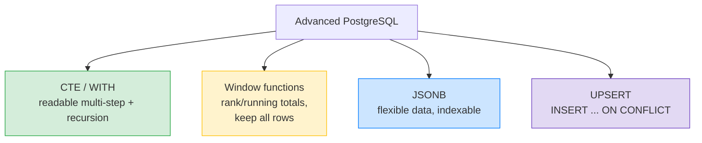
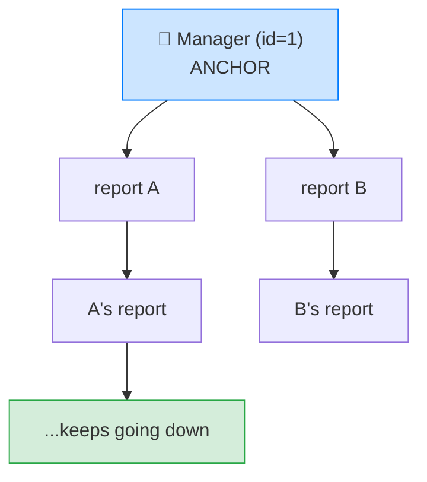

# 🚀 Advanced PostgreSQL Queries — CTEs, Window Functions, JSONB — Complete Study Notes

> Notes for becoming a strong software engineer. Easy language, real code, and interview-ready explanations.
> The powerful, senior-level SQL features — these genuinely impress in interviews and unlock queries that feel impossible otherwise.

---

## 📌 1. Overview — Four Power Tools

This note covers four advanced features that separate intermediate from senior SQL:

1. **CTEs (`WITH`)** — name and chain query steps for readability (and recursion).
2. **Window functions** — aggregate *without* collapsing rows (rankings, running totals, prev/next).
3. **JSONB** — store and query flexible JSON inside Postgres.
4. **UPSERT (`ON CONFLICT`)** — insert-or-update in one statement.



---

## 🧱 2. CTEs (Common Table Expressions) — the `WITH` clause

A **CTE** is a **named temporary result** you define with `WITH`, then use like a table in the main query. It's the cleaner alternative to deeply nested subqueries (from your subqueries notes) — each step has a **name** and the query reads **top-to-bottom like a story.**

```sql
WITH active_users AS (              -- step 1: define a named result
    SELECT id, name FROM users WHERE last_login > NOW() - INTERVAL '30 days'
),
their_orders AS (                  -- step 2: build on the previous CTE
    SELECT u.name, COUNT(o.id) AS order_count
    FROM active_users u
    LEFT JOIN orders o ON o.user_id = u.id
    GROUP BY u.name
)
SELECT * FROM their_orders          -- final query uses the CTEs
WHERE order_count > 5;
```

> 💡 Why CTEs over nested subqueries: **readability.** The tangled 3-level subquery from your subqueries notes becomes named, linear steps anyone can follow. You can also reference a CTE **multiple times** in one query (a subquery you'd have to repeat).

> 🎯 Interview line: *"A CTE is a named temporary result defined with WITH. I use them to break complex queries into readable, named steps instead of nesting subqueries — each step reads top-to-bottom like a story, and I can reference a CTE multiple times."*

---

## 🌲 3. Recursive CTEs (tree / hierarchy traversal)

A **recursive CTE** can refer to **itself** — perfect for **hierarchies**: org charts, category trees, comment threads, folder structures.

It has two parts joined by `UNION`:
1. **Anchor** — the starting row(s).
2. **Recursive part** — repeatedly joins back to the CTE to walk down (or up) the tree.

### Practical exercise — all subordinates of a manager

Given `employees(id, name, manager_id)`:

```sql
WITH RECURSIVE subordinates AS (
    -- 1️⃣ ANCHOR: start with the manager (say id = 1)
    SELECT id, name, manager_id
    FROM employees
    WHERE id = 1

    UNION ALL

    -- 2️⃣ RECURSIVE: find employees whose manager is someone already in the result
    SELECT e.id, e.name, e.manager_id
    FROM employees e
    INNER JOIN subordinates s ON e.manager_id = s.id
)
SELECT * FROM subordinates;
-- → the manager + their reports + their reports' reports + ... all the way down
```

**How it works:** the anchor seeds the manager. The recursive part finds everyone reporting to anyone already found, and keeps repeating until no new rows appear (it terminates automatically). This walks the **entire subtree.**



> 🎯 Interview line: *"A recursive CTE has an anchor and a recursive part joined by UNION. For an employees table with manager_id, the anchor is the top manager and the recursive part repeatedly finds everyone reporting to anyone already found — walking the whole hierarchy. It's how you traverse trees in SQL."*

---

## 🪟 4. Window Functions (the senior-level superpower)

A **window function** performs a calculation across a set of rows (a "window") **without collapsing them** — unlike `GROUP BY`, which squashes rows into one per group.

> Key difference 🔑: `GROUP BY` gives you **one row per group**. A window function keeps **every row** but adds a calculated column (a rank, a running total, the previous row's value). You see the detail *and* the aggregate side by side.

The syntax: `function() OVER (PARTITION BY ... ORDER BY ...)`
- **`PARTITION BY`** = the groups the window resets on (like "per department").
- **`ORDER BY`** = the order within each window (needed for ranking, running totals, prev/next).

### The key window functions

| Function | What it gives | Note |
|---|---|---|
| `ROW_NUMBER()` | Unique sequential rank (1,2,3,4) | No ties — always unique |
| `RANK()` | Rank **with gaps** (1,2,2,4) | Ties share a rank, then skip |
| `DENSE_RANK()` | Rank **without gaps** (1,2,2,3) | Ties share, no skip |
| `LAG(col)` | The **previous** row's value | Great for "change vs last row" |
| `LEAD(col)` | The **next** row's value | "what comes after" |
| `SUM/AVG ... OVER (...)` | **Running** aggregates | Cumulative totals, moving averages |

### Practical exercise — top 3 highest-paid per department

```sql
SELECT name, department, salary, dept_rank
FROM (
    SELECT name, department, salary,
           RANK() OVER (PARTITION BY department ORDER BY salary DESC) AS dept_rank
    FROM employees
) ranked
WHERE dept_rank <= 3;
```

**How it works:** `RANK() OVER (PARTITION BY department ORDER BY salary DESC)` ranks employees **within each department** by salary, highest first — restarting the ranking for each department. Wrapping it in a subquery lets us filter `dept_rank <= 3` (you can't filter on a window function in WHERE directly — it's computed too late, per the execution-order notes).

> 💡 `ROW_NUMBER` vs `RANK` vs `DENSE_RANK` is a **classic interview question**:
> - salaries `[100, 90, 90, 80]` →
> - `ROW_NUMBER`: 1, 2, 3, 4 (arbitrary tiebreak)
> - `RANK`: 1, 2, 2, **4** (gap after the tie)
> - `DENSE_RANK`: 1, 2, 2, **3** (no gap)

### Running total example
```sql
SELECT order_date, amount,
       SUM(amount) OVER (ORDER BY order_date) AS running_total
FROM orders;
-- each row shows the cumulative sum up to that date, keeping every row
```

> 🎯 Interview line: *"Window functions compute over a window of rows without collapsing them, using OVER with PARTITION BY for the groups and ORDER BY for order. I use RANK for top-N-per-group, LAG/LEAD for comparing to adjacent rows, and SUM OVER for running totals — things GROUP BY can't do because it loses the individual rows."*

---

## 📦 5. JSONB (flexible data inside Postgres)

`JSONB` stores JSON in a **binary, indexable** format. **Prefer `JSONB` over `JSON`** — JSON stores raw text (re-parsed every read, preserves whitespace/key order), while **JSONB is parsed once, faster to query, and indexable.**

```sql
CREATE TABLE products (
    id   SERIAL PRIMARY KEY,
    name VARCHAR(200),
    attributes JSONB           -- flexible, varies per product
);

INSERT INTO products (name, attributes)
VALUES ('Laptop', '{"brand": "Dell", "ram_gb": 16, "tags": ["work", "gaming"]}');
```

### The key operators

| Operator | Meaning | Example |
|---|---|---|
| `->` | Get JSON field **as JSON** | `attributes->'brand'` → `"Dell"` (json) |
| `->>` | Get JSON field **as text** | `attributes->>'brand'` → `Dell` (text) |
| `@>` | **Contains** (does the left contain the right?) | `attributes @> '{"brand":"Dell"}'` |

```sql
SELECT name FROM products WHERE attributes->>'brand' = 'Dell';       -- text compare
SELECT name FROM products WHERE (attributes->>'ram_gb')::int >= 16;   -- cast to int
SELECT name FROM products WHERE attributes @> '{"brand": "Dell"}';    -- containment
```

> ⚡ **Index JSONB with GIN** (from your indexes notes) for fast containment/key queries:
> ```sql
> CREATE INDEX idx_attrs ON products USING GIN (attributes);
> ```
> This makes `@>` containment queries fast — the same GIN index used for full-text search.

> 💡 The **`->` vs `->>` distinction** is a common gotcha: `->` returns JSON (keeps quotes, lets you chain deeper), `->>` returns plain text (for comparisons). Remember: **double `>` = text.**

> 🎯 Interview line: *"JSONB stores JSON in a binary, indexable form — I always prefer it over JSON. I query with `->` (returns JSON), `->>` (returns text), and `@>` (containment), and I index it with GIN so containment queries are fast. It gives document-style flexibility without leaving Postgres."* (Ties to your SQL-vs-NoSQL note — JSONB is why Postgres handles 90% of cases.)

---

## 🔁 6. UPSERT — `INSERT ... ON CONFLICT DO UPDATE`

UPSERT = **insert if new, update if it already exists** — in one atomic statement. Postgres does it with `ON CONFLICT`.

```sql
INSERT INTO users (email, name, login_count)
VALUES ('nayan@x.com', 'Nayan', 1)
ON CONFLICT (email)                          -- if this unique column clashes...
DO UPDATE SET                                -- ...update instead of failing
    login_count = users.login_count + 1,
    name = EXCLUDED.name;                     -- EXCLUDED = the row you tried to insert
```

**How it reads:** *"Insert this user. If a row with that email already exists, instead increment their login_count and update the name."*

- **`ON CONFLICT (email)`** — the unique column/constraint to watch.
- **`EXCLUDED`** — refers to the values you *tried* to insert (so you can use them in the update).
- **`DO NOTHING`** — the other option: silently skip on conflict (great for idempotent inserts).

> 💡 Why it's great: it replaces the **racy "check if exists, then insert or update"** pattern (two requests both check, both find nothing, both insert → error/duplicate). UPSERT decides **atomically** in one statement — no race. (Same idea as MongoDB's `{ upsert: true }`.)

> 🎯 Interview line: *"UPSERT is INSERT ... ON CONFLICT DO UPDATE — insert, or update if a unique constraint clashes, atomically. EXCLUDED refers to the rejected row's values. It replaces the racy check-then-insert pattern, and DO NOTHING makes inserts idempotent."*

---

## 🎤 7. How to Explain in an Interview

**Step 1 — CTEs:**
> "CTEs with WITH name query steps for readability and replace nested subqueries. Recursive CTEs have an anchor plus a self-referencing part, which I use to traverse hierarchies like org charts."

**Step 2 — Window functions:**
> "Window functions compute over a window of rows without collapsing them — RANK for top-N per group via PARTITION BY, LAG/LEAD for adjacent rows, SUM OVER for running totals. That's the key difference from GROUP BY, which loses individual rows."

**Step 3 — JSONB:**
> "JSONB is binary, indexable JSON — I prefer it over JSON. I query with ->, ->>, and @>, and index it with GIN. It gives flexible schema inside a relational database."

**Step 4 — UPSERT:**
> "UPSERT via ON CONFLICT DO UPDATE inserts or updates atomically, using EXCLUDED for the attempted values — replacing the racy check-then-insert."

> 🟢 Trap question: *"ROW_NUMBER vs RANK vs DENSE_RANK?"* → *"All rank rows. ROW_NUMBER is always unique. RANK gives ties the same rank then skips (1,2,2,4). DENSE_RANK gives ties the same rank with no gap (1,2,2,3)."*

> 🟢 Trap question: *"Why can't you filter a window function in WHERE?"* → *"Window functions are computed after WHERE in the execution order, in the SELECT phase. So I wrap the query in a CTE or subquery and filter the window result in an outer WHERE."*

---

## 💎 8. Impressive Words & Phrases

| Instead of saying... | Say this 💪 |
|---|---|
| "Named sub-result" | "A **CTE / Common Table Expression**" |
| "Query that calls itself" | "A **recursive CTE** (anchor + recursive term)" |
| "Walk the tree" | "**Hierarchy / tree traversal**" |
| "Rank without grouping" | "A **window function** over a **partition**" |
| "Running sum" | "A **cumulative / running aggregate**" |
| "Previous/next row" | "**`LAG` / `LEAD`** offset functions" |
| "Flexible JSON column" | "**JSONB** (binary, indexable)" |
| "Does it contain this" | "The **`@>` containment** operator" |
| "Insert or update" | "An atomic **UPSERT** (`ON CONFLICT`)" |
| "The row I tried to insert" | "The **`EXCLUDED`** row" |

**Power vocabulary:** *Common Table Expression (CTE), recursive CTE, anchor/recursive term, window function, partition, frame, cumulative aggregate, LAG/LEAD, ROW_NUMBER/RANK/DENSE_RANK, JSONB, GIN index, containment (@>), UPSERT, ON CONFLICT, EXCLUDED, idempotent insert.*

> 🌶️ Bonus flex — **"window functions keep the row, GROUP BY loses it":** *"The mental model I use: GROUP BY collapses N rows into one summary; a window function adds the summary as a column while keeping all N rows. So 'top 3 per department with their actual details' needs a window function — GROUP BY couldn't show the individual employees."* This crisp contrast signals you truly get it.

---

## ⏱️ 9. Quick Revision (read 5 min before interview)

> **CTE (`WITH`):** named temporary result → readable multi-step queries; replaces nested subqueries; reusable in one query.
>
> **Recursive CTE:** **anchor** + **recursive part** (self-join) via `UNION` → traverse hierarchies (org charts, trees). `employees(id, manager_id)` → all subordinates.
>
> **Window functions:** `fn() OVER (PARTITION BY x ORDER BY y)` → compute across rows **without collapsing them**.
> - `ROW_NUMBER` (unique), `RANK` (gaps: 1,2,2,4), `DENSE_RANK` (no gap: 1,2,2,3)
> - `LAG`/`LEAD` (prev/next row), `SUM OVER` (running total)
> - Top-N-per-group = `RANK() OVER (PARTITION BY dept ORDER BY salary DESC)` then filter `<= 3` in an outer query (can't filter in WHERE).
>
> **JSONB:** binary, indexable JSON (prefer over JSON). `->` (as JSON), `->>` (as **text**), `@>` (contains). Index with **GIN**.
>
> **UPSERT:** `INSERT ... ON CONFLICT (col) DO UPDATE SET ... = EXCLUDED.col` → atomic insert-or-update. `DO NOTHING` for idempotent inserts.
>
> **Golden line:** *"CTEs make complex queries readable (and recursive ones traverse trees); window functions rank and run totals without collapsing rows; JSONB adds indexable flexible data; and ON CONFLICT gives atomic upserts."*

---

### ✅ Practice checklist
- [ ] Write a CTE chain (`WITH a AS (...), b AS (...) SELECT ...`)
- [ ] Write the recursive CTE for all subordinates of a manager
- [ ] Write top-3-per-department with `RANK() OVER (PARTITION BY ...)`
- [ ] Compare `ROW_NUMBER` / `RANK` / `DENSE_RANK` on tied values
- [ ] Use `LAG` to show change vs the previous row; `SUM OVER` for a running total
- [ ] Create a JSONB column; query with `->`, `->>`, `@>`; add a GIN index
- [ ] Write an UPSERT with `ON CONFLICT ... DO UPDATE` using `EXCLUDED`
- [ ] Explain why a window function can't be filtered in WHERE (execution order)

These four features are what senior SQL looks like — they turn "I'm not sure SQL can do that" into elegant one-query solutions. 🚀
