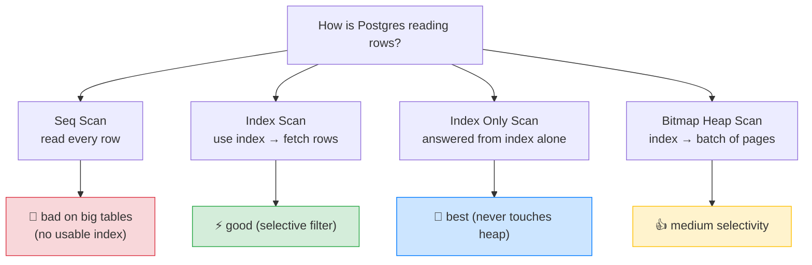
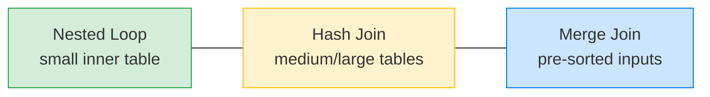

# 🔬 EXPLAIN ANALYZE Deeply — Reading Query Plans — Complete Study Notes

> Notes for becoming a strong software engineer. Easy language, real code, and interview-ready explanations.
> Advanced: how to *read* what Postgres actually does, so you can diagnose and fix slow queries — not just write them.

---

## 📌 1. Why This Matters

You've learned to write queries and add indexes. **`EXPLAIN ANALYZE` is how you check whether they're actually working.** It shows the **query plan** — the exact steps Postgres chose to run your query, and how long each took.

> Analogy 🗺️: writing SQL is telling a driver *"get me to the airport."* `EXPLAIN ANALYZE` is the **GPS route printout** — which roads it took, where the traffic was, and how long each leg lasted. If the trip was slow, the printout shows you *where* — maybe it took a tiny back-road (a scan) when a highway (an index) existed.

> 🎯 Interview line: *"`EXPLAIN` shows the planned steps; `EXPLAIN ANALYZE` actually runs the query and reports real timings and row counts. I use it to find why a query is slow — usually a sequential scan where an index should be used, or a bad join choice."*

> ⚠️ Note: `EXPLAIN` only *plans* (fast, safe). `EXPLAIN ANALYZE` **actually executes** the query — so on an `UPDATE`/`DELETE` it really changes data. Wrap those in a transaction and `ROLLBACK` if you just want the plan.

---

## 🌳 2. How to Read a Plan (the shape)

A query plan is a **tree**, read **inside-out / bottom-up** — the most indented nodes run first, feeding their parents.

```
Sort  (cost=... rows=...) (actual time=...)
  └─ Hash Join  (...)
       ├─ Seq Scan on posts  (...)      ← runs first
       └─ Hash
            └─ Index Scan on users (...) ← runs first
```

Each **node** is one operation (a scan, a join, a sort). For each node you get:
- **cost** — the planner's *estimate* (in arbitrary units).
- **rows** — estimated rows out.
- **actual time** / **actual rows** — what *really* happened (only with `ANALYZE`).

> 🎯 The golden diagnostic: **compare estimated `rows` vs `actual rows`.** A big mismatch means the planner's statistics are stale or wrong — often the root cause of a bad plan. Fix with `ANALYZE tablename;` (refreshes statistics).

---

## 🔍 3. Scan Node Types (how Postgres reads a table)



| Scan type | What it does | When it's good / bad |
|---|---|---|
| **Seq Scan** | Reads **every row** in the table | 🐢 **Bad on big tables** — means no usable index. (Fine for tiny tables.) |
| **Index Scan** | Uses an index to find rows, then fetches them from the heap | ⚡ Good when the filter is **selective** (returns few rows) |
| **Index Only Scan** | Answers entirely **from the index** — never touches the heap | 🚀 **Best** — needs a covering index (all needed columns in the index) |
| **Bitmap Heap Scan** | Uses the index to build a bitmap of pages, then reads them in batches | 👍 Good for **low-selectivity** indexes (filter matches a moderate chunk) |

> 💡 The progression: **Seq Scan (read all) → Index Scan (jump to rows) → Index Only Scan (answer from index alone).** Seeing **Seq Scan on a big table** is the #1 "add an index here" signal. **Index Only Scan** is the dream — it's why covering indexes (from your indexes notes) matter.

> 🎯 Interview line: *"On a big table, a Seq Scan means no index was used — that's my cue to add one. An Index Scan uses an index; an Index Only Scan is best because it answers from the index without touching the heap. A Bitmap Heap Scan sits in between, for filters that match a moderate fraction of rows."*

---

## 🔗 4. Join Node Types (how Postgres combines tables)

Postgres picks a join algorithm based on table sizes and whether inputs are sorted/indexed.

| Join type | How it works | Best when |
|---|---|---|
| **Nested Loop** | For each row of the outer table, look up matches in the inner | **Small** inner table (or indexed inner) — few iterations |
| **Hash Join** | Build a hash table of one side, probe it with the other | **Medium/large** unsorted tables |
| **Merge Join** | Sort both inputs, then walk them together in step | Inputs **already sorted** (e.g. on indexed keys) |



> 💡 You don't usually *choose* the join — the planner does. But understanding them helps you read plans: a **Nested Loop over two huge tables** is a red flag (often a missing index on the join key forcing per-row scans), while a Hash Join there is usually fine.

> 🎯 Interview line: *"The planner picks the join: Nested Loop for a small or indexed inner table, Hash Join for medium-to-large unsorted tables, Merge Join when inputs are already sorted. A Nested Loop across two large tables usually signals a missing index on the join key."*

---

## 💰 5. The Cost Numbers (estimate vs reality)

Each node shows numbers like:
```
(cost=0.43..8.45 rows=1 width=64) (actual time=0.025..0.027 rows=1 loops=1)
```

| Number | Meaning |
|---|---|
| **startup cost** (`0.43`) | Estimated work before the **first row** comes out (e.g. building a hash table, sorting) |
| **total cost** (`8.45`) | Estimated work to return **all rows** |
| **rows** | Estimated rows returned |
| **actual time** (`0.025..0.027`) | Real time: startup..total, **in milliseconds** |
| **loops** | How many times this node ran (multiply actual time × loops!) |

> 💡 Two key reads:
> - **estimated rows vs actual rows** wildly different → stale stats → run `ANALYZE`.
> - high **startup cost** → something must finish before any row appears (a sort or hash build); matters for `LIMIT` queries where you want the first row fast.

> ⚠️ The `cost` units are **arbitrary** (not seconds) — only useful for *comparing* nodes/plans. The **`actual time`** is the real measurement. And remember to **× loops** — a node showing `0.1ms` but `loops=1000` actually took ~100ms.

---

## 🗃️ 6. Buffers — Is Your Working Set in RAM? (`EXPLAIN (ANALYZE, BUFFERS)`)

Add `BUFFERS` to see whether data came from **memory (cache)** or **disk** — the single biggest real-world speed factor.

```sql
EXPLAIN (ANALYZE, BUFFERS)
SELECT * FROM users WHERE email = 'nayan@x.com';
```

You'll see lines like `Buffers: shared hit=5 read=2`:

| Term | Meaning |
|---|---|
| **shared hit** | Pages found in the **cache (RAM)** — fast ✅ |
| **shared read** | Pages read from **disk** — slow 🐢 |

> 💡 What it tells you: **lots of `shared read`** means your **working set doesn't fit in RAM** — Postgres keeps hitting disk. The same query, run twice, often shows `read` on the first run (cold cache) then all `hit` on the second (warm cache) — and is much faster the second time. This is why "it's slow the first time" is usually a caching story.

> 🎯 Interview line: *"I add BUFFERS to EXPLAIN ANALYZE to see shared hit versus shared read — cache versus disk. Heavy disk reads mean the working set doesn't fit in RAM, which is often the real reason a query is slow even when the plan looks fine."*

---

## 💻 7. Practical Exercise — Find & Fix Your Slowest Query

Take ~5 real queries (e.g. from your auth system) and profile them:

```sql
-- 1. Profile a query
EXPLAIN (ANALYZE, BUFFERS)
SELECT * FROM users WHERE email = 'nayan@x.com';
--   → "Seq Scan on users ... actual time=85.2ms"  🐢  (no index!)

-- 2. Add the index that helps
CREATE INDEX idx_users_email ON users(email);

-- 3. Rerun and compare
EXPLAIN (ANALYZE, BUFFERS)
SELECT * FROM users WHERE email = 'nayan@x.com';
--   → "Index Scan using idx_users_email ... actual time=0.05ms"  ⚡  (1700× faster!)

-- 4. Refresh stats if estimates looked wrong
ANALYZE users;
```

**Document the before/after:** *"login lookup: Seq Scan 85ms → Index Scan 0.05ms after adding idx_users_email."* That before/after number is gold in a performance review or interview — concrete proof you can diagnose and fix.

> 💡 The workflow to internalise: **EXPLAIN ANALYZE → spot the Seq Scan / row mismatch / disk reads → add an index or fix stats → rerun → confirm the improvement.**

---

## 🎤 8. How to Explain in an Interview

**Step 1 — What it is:**
> "EXPLAIN shows the planned steps; EXPLAIN ANALYZE runs the query and reports real timings and row counts. I read it as a tree, bottom-up."

**Step 2 — Scans:**
> "I look at scan types first — a Seq Scan on a big table means no index is used. Index Scan is good, Index Only Scan is best because it answers from the index alone, and Bitmap Heap Scan is for moderate-selectivity filters."

**Step 3 — Joins:**
> "For joins, Nested Loop suits a small or indexed inner table, Hash Join for larger unsorted tables, Merge Join for sorted inputs. A Nested Loop across two big tables usually means a missing index on the join key."

**Step 4 — Numbers & buffers:**
> "I compare estimated versus actual rows — a big gap means stale stats, so I run ANALYZE. And I add BUFFERS to see shared hit versus read — cache versus disk — which often explains slowness the plan alone doesn't."

> 🟢 Trap question: *"The plan looks fine but the query is still slow — what now?"* → *"I'd check BUFFERS for heavy shared read — the working set may not fit in RAM, so it's hitting disk. I'd also check loops × actual time on inner nodes, and whether estimated rows match actual rows (stale stats causing a subtly wrong plan)."*

> 🟢 Trap question: *"Cost says 8.45 — is that seconds?"* → *"No, cost units are arbitrary estimates, only for comparing plans. The real measurement is actual time in milliseconds — and I multiply it by loops for nodes that run repeatedly."*

---

## 💎 9. Impressive Words & Phrases

| Instead of saying... | Say this 💪 |
|---|---|
| "How the query runs" | "The **query plan / execution plan**" |
| "Reads the whole table" | "A **sequential scan (Seq Scan)**" |
| "Answered from index" | "An **index-only scan** (covering index)" |
| "Index then read pages" | "A **bitmap heap scan**" |
| "Guessed wrong row count" | "**Cardinality misestimate** (stale statistics)" |
| "Refresh stats" | "Run **`ANALYZE`** to update the planner statistics" |
| "From RAM vs disk" | "**shared hit** vs **shared read** (buffer cache vs disk)" |
| "Data fits in memory" | "The **working set** is **RAM-resident**" |
| "Ran it N times" | "**loops** (multiply actual time by loops)" |
| "Make the first row fast" | "Low **startup cost** (matters for `LIMIT`)" |

**Power vocabulary:** *query/execution plan, Seq Scan, Index Scan, Index Only Scan, Bitmap Heap Scan, Nested Loop / Hash Join / Merge Join, startup vs total cost, actual time, loops, cardinality estimate, stale statistics, ANALYZE, buffers, shared hit/read, working set, selectivity.*

> 🌶️ Bonus flex — **cardinality estimation:** *"Most bad plans come down to cardinality misestimation — the planner guesses the wrong number of rows, so it picks the wrong join or a scan. Running ANALYZE refreshes the statistics; for skewed data I'd raise the statistics target or add extended statistics. Fixing the estimate often fixes the plan without touching the query."* This is genuinely deep and signals real DBA-level understanding.

---

## ⏱️ 10. Quick Revision (read 5 min before interview)

> **`EXPLAIN`** = planned steps. **`EXPLAIN ANALYZE`** = actually runs it + real timings. Read the tree **bottom-up**.
>
> **Scans:** **Seq Scan** = reads all (🐢 bad on big tables, no index). **Index Scan** = uses index (⚡). **Index Only Scan** = from index alone (🚀 best). **Bitmap Heap Scan** = moderate selectivity (👍).
>
> **Joins:** **Nested Loop** = small/indexed inner. **Hash Join** = medium/large unsorted. **Merge Join** = pre-sorted inputs. *Nested Loop over 2 huge tables = missing index on join key.*
>
> **Numbers:** startup cost (before 1st row) vs total cost (all rows); cost units are **arbitrary** — use **actual time (ms)**; **× loops**. Estimated vs actual **rows** mismatch → stale stats → run **`ANALYZE`**.
>
> **Buffers** (`EXPLAIN (ANALYZE, BUFFERS)`): **shared hit** = RAM (fast), **shared read** = disk (slow). Heavy reads → working set doesn't fit in RAM.
>
> **Workflow:** explain → spot Seq Scan / row mismatch / disk reads → add index or `ANALYZE` → rerun → confirm.
>
> **Golden line:** *"I read the plan bottom-up: a Seq Scan on a big table means add an index, an estimate-vs-actual row gap means run ANALYZE, and heavy shared reads in BUFFERS mean the working set isn't in RAM — then I fix and rerun to confirm."*

---

### ✅ Practice checklist
- [ ] Run `EXPLAIN ANALYZE` on 5 real queries; find the slowest
- [ ] Identify each scan type (spot a Seq Scan on a big table)
- [ ] Add an index → rerun → see Seq Scan become Index Scan, document before/after ms
- [ ] Add `BUFFERS`; run a query twice (cold then warm) → see read become hit
- [ ] Find a node where estimated rows ≠ actual rows → run `ANALYZE` → recheck
- [ ] Identify a join type and reason about why the planner chose it
- [ ] Explain "cost is arbitrary, actual time is real, multiply by loops" out loud

Reading query plans is what turns "my query is slow" into "here's exactly why, and here's the fix." It's one of the most senior-marking database skills you can build. 🚀
