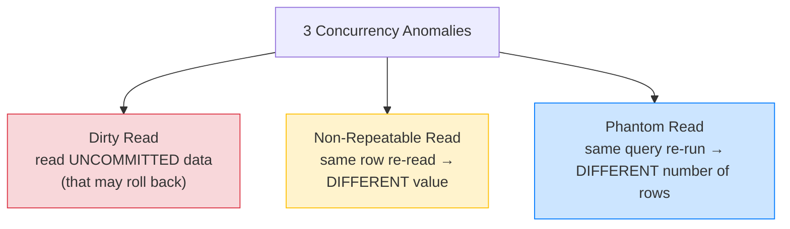
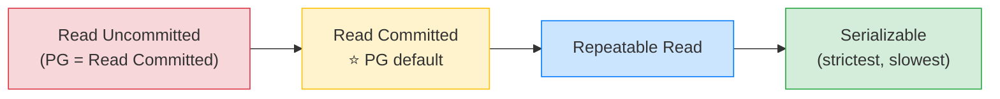

# 🔒 Transactions & Isolation Levels — Deep Dive — Complete Study Notes

> Notes for becoming a strong software engineer. Easy language, real code, and interview-ready explanations.
> The deep-dive on ACID's "I" — how concurrent transactions interfere, and the levels that control it. Heavily tested.

---

## 📌 1. Quick ACID Recap, Then the Focus

ACID = **A**tomicity (all-or-nothing), **C**onsistency (DB stays valid), **I**solation (concurrent transactions don't interfere), **D**urability (committed data survives crashes). *(Full detail is in your ACID note.)*

This note zooms into the **"I" — Isolation.** The big question: when many transactions run **at the same time**, how much are they allowed to **see each other's in-progress work?** That's controlled by **isolation levels**, and each level prevents certain **anomalies** (bugs).

> Analogy 👥: imagine two people editing a shared Google Doc. Isolation level decides what each sees of the other's *unsaved* typing. Loosest: you see their half-typed words (messy but fast). Strictest: you each work as if alone, changes appear only when fully saved (clean but you sometimes have to wait or retry). Databases offer this same dial.

> 🎯 Interview line: *"Isolation levels control how much one transaction sees of another's uncommitted or concurrent changes. Looser levels are faster but allow anomalies; stricter levels prevent anomalies but cost performance. It's a correctness-vs-concurrency trade-off."*

---

## 🐛 2. The 3 Anomalies (the bugs isolation prevents)

You must know these cold — they're how isolation levels are *defined*.



### 1️⃣ Dirty Read — reading uncommitted data
Transaction A reads a row that Transaction B has changed **but not committed.** If B then **rolls back**, A acted on data that **never really existed.** 😱

### 2️⃣ Non-Repeatable Read — same row, different value
Transaction A reads a row, then reads **the same row again** later in the same transaction — and gets a **different value**, because B updated and committed it in between. The "same" read isn't repeatable.

### 3️⃣ Phantom Read — same query, different row count
Transaction A runs `SELECT ... WHERE age > 18` and gets 10 rows. Later in the same transaction it runs the **same query** and gets **11 rows**, because B inserted a new matching row. A "phantom" row appeared.

> 💡 Memory hook: **dirty** = uncommitted data; **non-repeatable** = a *value* changed; **phantom** = the *set of rows* changed (insert/delete). Value-change vs row-set-change is the key distinction between the last two.

---

## 🎚️ 3. The 4 Isolation Levels

Each level **prevents** more anomalies — and costs more performance.

| Level | Dirty read | Non-repeatable read | Phantom read | Notes |
|---|---|---|---|---|
| **Read Uncommitted** | ⚠️ allowed | ⚠️ allowed | ⚠️ allowed | Loosest. **PostgreSQL doesn't implement it** — treats it as Read Committed |
| **Read Committed** | ✅ prevented | ⚠️ allowed | ⚠️ allowed | **PostgreSQL default** |
| **Repeatable Read** | ✅ prevented | ✅ prevented | ✅ prevented* | *In Postgres, also blocks phantoms (uses snapshots) |
| **Serializable** | ✅ prevented | ✅ prevented | ✅ prevented | Strictest — transactions behave as if run one-by-one. Slowest |



> ⚠️ **PostgreSQL specifics worth knowing (impresses interviewers):**
> - **Read Uncommitted doesn't exist** in Postgres — it silently behaves as Read Committed, so **dirty reads never happen in Postgres at all.**
> - Postgres uses **MVCC** (Multi-Version Concurrency Control) — readers see a consistent snapshot and **don't block writers** (and vice versa). This is why Postgres handles concurrency so smoothly.
> - Postgres's **Repeatable Read also prevents phantom reads** (stricter than the SQL standard requires), because each transaction sees a frozen snapshot.

```sql
-- Set the level for a transaction
BEGIN TRANSACTION ISOLATION LEVEL SERIALIZABLE;
  -- ... your statements ...
COMMIT;
```

> 🎯 Interview line: *"There are four levels — Read Uncommitted, Read Committed, Repeatable Read, Serializable — each preventing more anomalies. Postgres defaults to Read Committed, doesn't implement Read Uncommitted, and uses MVCC so readers and writers don't block each other."*

---

## 🤝 4. Deadlocks (two transactions stuck waiting on each other)

A **deadlock** is when Transaction A holds a lock B needs, **and** B holds a lock A needs — so **both wait forever.**

```
Time →
Txn A:  lock row 1 ✅ ... wants row 2 (held by B) → waits ⏳
Txn B:  lock row 2 ✅ ... wants row 1 (held by A) → waits ⏳
        → circular wait → DEADLOCK 💀
```

### Detection vs Prevention
- **Detection:** Postgres **automatically detects** deadlocks and **kills one transaction** (the victim) with an error, so the system doesn't freeze. Your app should **catch that error and retry.**
- **Prevention:** the classic fix — **always acquire locks in a consistent order.** If *every* transaction locks row 1 before row 2 (e.g. always lock the lower account id first), a circular wait can't form.

```javascript
// ✅ Prevent deadlocks: always lock accounts in a fixed order (e.g. by id)
const [first, second] = [fromId, toId].sort();   // consistent ordering
// lock `first`, then `second` — in BOTH transfer directions
```

> 🎯 Interview line: *"A deadlock is a circular wait — A holds what B wants and vice versa. Postgres detects it and aborts one transaction, which the app retries. The standard prevention is acquiring locks in a consistent order, so no cycle can form — like always locking the lower account id first in a transfer."*

---

## 🔐 5. `SELECT ... FOR UPDATE` (explicit row locking)

Sometimes you need to **lock a row while you decide what to do with it**, so no one else can change it in between. `SELECT ... FOR UPDATE` does exactly that — it **locks the selected rows** until your transaction ends.

```sql
BEGIN;
  -- Lock this account's row — others trying to update it must WAIT
  SELECT balance FROM accounts WHERE id = 1 FOR UPDATE;
  -- now safely check and update, knowing no one else can touch it
  UPDATE accounts SET balance = balance - 100 WHERE id = 1;
COMMIT;   -- lock released
```

This solves the **lost-update / race** problem explicitly: between your read and your write, the row is **yours alone.** It's the "last seat" problem from your ACID note, solved with an explicit lock instead of relying on isolation level alone.

> 💡 When to use it: **read-then-write** logic where the decision depends on the current value (check stock, then decrement; check balance, then debit). The atomic-`$inc`/filter-guard tricks handle simple cases, but `FOR UPDATE` is the general tool when you need to **hold** a row across multiple statements.

> 🎯 Interview line: *"`SELECT FOR UPDATE` locks the rows it reads until the transaction ends, so a read-then-write sequence is safe from concurrent changes. It's explicit row-level serialization for things like checking a balance before debiting it."*

---

## 💻 6. Practical Exercise — See It Live (two psql sessions)

### Experiment 1 — watch isolation in action
```sql
-- Session 1:
BEGIN;
UPDATE accounts SET balance = balance - 100 WHERE id = 1;
-- (do NOT commit yet)

-- Session 2 (at the same time):
SELECT * FROM accounts WHERE id = 1;
-- → under Read Committed, you see the OLD (committed) value — Session 1's change is invisible until it commits.
-- → if Session 2 tries to UPDATE the same row, it WAITS for Session 1 to commit or rollback.
```

### Experiment 2 — cause a deadlock on purpose
```sql
-- Session 1:                         -- Session 2:
BEGIN;                                BEGIN;
UPDATE accounts SET ... WHERE id=1;   UPDATE accounts SET ... WHERE id=2;
-- (holds lock on row 1)              -- (holds lock on row 2)
UPDATE accounts SET ... WHERE id=2;   UPDATE accounts SET ... WHERE id=1;
-- waits for Session 2's row 2 ⏳     -- waits for Session 1's row 1 ⏳
--                          → DEADLOCK → Postgres kills one with:
--                            "ERROR: deadlock detected"
```

> 💡 Notice the deadlock came from **opposite lock orders** (Session 1: 1→2, Session 2: 2→1). Make both lock in the **same order** and it vanishes. Doing this live once makes the concept permanent.

---

## 🎤 7. How to Explain in an Interview

**Step 1 — The trade-off:**
> "Isolation levels control how much concurrent transactions see of each other — looser is faster but allows anomalies, stricter prevents them but costs concurrency."

**Step 2 — The anomalies:**
> "Three anomalies: dirty read (reading uncommitted data), non-repeatable read (a row's value changes on re-read), and phantom read (the number of matching rows changes)."

**Step 3 — The levels:**
> "Read Uncommitted allows all; Read Committed (Postgres default) prevents dirty reads; Repeatable Read also prevents non-repeatable reads — and in Postgres, phantoms too; Serializable prevents everything, behaving as if transactions ran one at a time."

**Step 4 — Deadlocks & locking:**
> "Deadlocks are circular waits; Postgres detects and aborts one, and I prevent them by locking in a consistent order. For read-then-write safety I use SELECT FOR UPDATE to lock the row across the operation."

> 🟢 Trap question: *"Difference between non-repeatable read and phantom read?"* → *"Non-repeatable read is the *same row's value* changing between reads — caused by an UPDATE. Phantom read is the *set of rows* changing — new rows appearing or disappearing — caused by an INSERT or DELETE. Value vs row-set."*

> 🟢 Trap question: *"Why is Serializable not the default if it's safest?"* → *"Because it's the slowest — it heavily restricts concurrency and causes more serialization failures that need retries. Read Committed is a pragmatic default; I raise the level only where correctness genuinely demands it, like financial operations."*

---

## 💎 8. Impressive Words & Phrases

| Instead of saying... | Say this 💪 |
|---|---|
| "Transactions clashing" | "**Concurrency anomalies**" |
| "Reading unsaved data" | "A **dirty read** (uncommitted data)" |
| "Value changed on re-read" | "A **non-repeatable read**" |
| "Row count changed" | "A **phantom read**" |
| "Strictness setting" | "The **isolation level**" |
| "Runs as if alone" | "**Serializable** — as if transactions ran serially" |
| "Both stuck waiting" | "A **deadlock** (circular wait)" |
| "Lock in same order" | "**Consistent lock ordering**" |
| "Lock the row" | "**`SELECT FOR UPDATE`** — explicit row-level lock" |
| "Readers don't block writers" | "**MVCC** (multi-version concurrency control)" |

**Power vocabulary:** *isolation level, dirty read, non-repeatable read, phantom read, Read Committed/Repeatable Read/Serializable, MVCC, snapshot isolation, deadlock, circular wait, consistent lock ordering, SELECT FOR UPDATE, pessimistic vs optimistic locking, serialization failure.*

> 🌶️ Bonus flex — **optimistic vs pessimistic locking:** *"`SELECT FOR UPDATE` is pessimistic locking — assume conflict, lock upfront. The alternative is optimistic locking — don't lock, but check a version column on write and retry if it changed. Pessimistic suits high-contention rows; optimistic suits low-contention, read-heavy workloads."* This contrast shows real concurrency-design maturity.

---

## ⏱️ 9. Quick Revision (read 5 min before interview)

> **Isolation = how much concurrent txns see of each other.** Looser = faster + anomalies; stricter = safe + slower.
>
> **3 anomalies:** **dirty read** (uncommitted data), **non-repeatable read** (a row's *value* changes on re-read), **phantom read** (the *number of rows* changes).
>
> **4 levels (each prevents more):**
> - **Read Uncommitted** — all anomalies (PG doesn't implement → acts as Read Committed).
> - **Read Committed** — ⭐ PG default; blocks dirty reads only.
> - **Repeatable Read** — also blocks non-repeatable (PG: phantoms too, via snapshots).
> - **Serializable** — blocks everything; as if run one-by-one; slowest.
>
> **Postgres:** no dirty reads ever; **MVCC** → readers don't block writers.
>
> **Deadlock** = circular wait. PG **detects + aborts one** (app retries). **Prevent** by **consistent lock ordering** (e.g. lock lower id first).
>
> **`SELECT FOR UPDATE`** = lock rows until commit → safe read-then-write (pessimistic locking).
>
> **Golden line:** *"Isolation trades concurrency for correctness — Read Committed by default prevents dirty reads, stricter levels prevent non-repeatable and phantom reads; deadlocks I prevent with consistent lock ordering and handle read-then-write with SELECT FOR UPDATE."*

---

### ✅ Practice checklist
- [ ] In two psql sessions: uncommitted UPDATE in one, SELECT in the other → see the old value / the wait
- [ ] Define dirty / non-repeatable / phantom reads in your own words
- [ ] Map each isolation level to which anomalies it prevents (the table)
- [ ] Cause a deadlock with opposite lock orders → see "deadlock detected"
- [ ] Fix it by locking in the same order in both sessions
- [ ] Use `SELECT ... FOR UPDATE` to lock a row across a read-then-write
- [ ] Explain non-repeatable vs phantom (value change vs row-set change) out loud
- [ ] Explain why Serializable isn't the default (performance)

This is the deep end of ACID's "I" — and concurrency questions are a favourite in senior interviews. Know the anomalies, the levels, and deadlock prevention cold. 🚀
