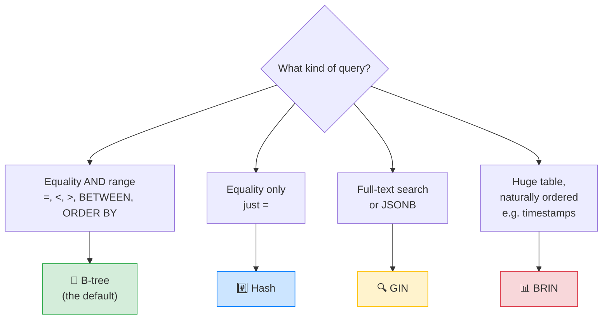

# 🐘 PostgreSQL Fundamentals + Indexes — Complete Study Notes

> Notes for becoming a strong software engineer. Easy language, real code, and interview-ready explanations.
> Topic: how Postgres stores data, and how indexes make queries fast.

---

## 📌 1. Heap vs Index (the core mental model)

This is the foundation. Get this clear and everything else makes sense.

### The Heap
The **heap** is where the actual table rows physically live on disk. It is **unordered** — rows are just dumped wherever there's free space.

> Think of the heap like a **messy storeroom** 📦 where boxes are placed randomly. To find one box, you'd have to check every single box. That checking-everything is a **sequential scan (Seq Scan)** — slow on big tables.

### The Index
An **index** is a **separate, sorted structure** that points to rows in the heap. It does NOT hold the full row — it holds the indexed column value + a pointer to the row's location.

> The index is like the **catalogue at a library** 📖. Instead of walking every shelf, you look up the book in the sorted catalogue, which tells you the exact shelf location. That lookup is an **Index Scan** — fast.

```
   INDEX (sorted)              HEAP (unordered rows)
   ┌──────────────┐           ┌────────────────────────┐
   │ "Amit"  → ●──┼──────────▶│ row: Amit, IN, age 30  │
   │ "Nayan" → ●──┼────┐      │ row: Zoya, US, age 22  │
   │ "Zoya"  → ●──┼─┐  └─────▶│ row: Nayan, IN, age 28 │
   └──────────────┘ └────────▶│ ...                    │
        (the catalogue)        └────────────────────────┘
                                      (the storeroom)
```

> 🎯 Interview line: *"The heap stores the actual rows unordered; an index is a separate sorted structure that points back into the heap. Without an index, Postgres does a sequential scan — reading every row."*

> ⚠️ Trade-off: indexes speed up **reads** but slow down **writes** (every INSERT/UPDATE must also update the indexes) and use **extra disk space**. So you index thoughtfully, not everywhere.

---

## 🌳 2. The Index Types (when to use which)



### 🌲 B-tree — the default (use this 95% of the time)
- Good for **equality** (`=`) **and range** (`<`, `>`, `BETWEEN`) queries.
- Keeps data **sorted**, so it also helps `ORDER BY` and `MIN`/`MAX`.
- When you write `CREATE INDEX ...` with no type, you get a B-tree.

```sql
CREATE INDEX idx_users_email ON users (email);
```

### #️⃣ Hash — equality only
- Only supports `=`. **Cannot** do ranges or sorting.
- Slightly faster for pure equality lookups, but B-tree is usually "good enough" and more versatile, so hash is rarely worth it.

```sql
CREATE INDEX idx_users_email_hash ON users USING HASH (email);
```

### 🔍 GIN — Generalized Inverted Index
- For data where one row contains **many values**: **full-text search**, **JSONB**, and **arrays**.
- Think "one document → many words" — GIN indexes each word pointing back to the document.

```sql
-- JSONB
CREATE INDEX idx_users_metadata ON users USING GIN (metadata);
-- Full-text search
CREATE INDEX idx_posts_search ON posts USING GIN (to_tsvector('english', body));
```

### 📊 BRIN — Block Range Index
- For **huge tables** where data is **naturally ordered** on disk (classic case: a `created_at` timestamp that always increases).
- Instead of indexing every row, it stores the **min/max value per block** of rows → tiny size, great for billions of rows.

```sql
CREATE INDEX idx_logs_created_brin ON logs USING BRIN (created_at);
```

> 🎯 Quick memory hook:
> - **B-tree** = the all-rounder (default).
> - **Hash** = equality-only specialist.
> - **GIN** = search inside documents/JSON/arrays.
> - **BRIN** = giant tables, naturally sorted, tiny index.

---

## 🧱 3. Composite Indexes & the Leftmost Prefix Rule

A **composite index** covers **multiple columns** in a specific order. **Column order matters massively.**

```sql
CREATE INDEX idx_users_country_age ON users (country, age);
```

Think of it like a **phone book sorted by (last name, then first name)** 📞:
- Easy to find everyone with last name "Sharma" → ✅
- Easy to find "Sharma, Amit" specifically → ✅
- But finding everyone with first name "Amit" (any last name)? You'd scan the whole book → ❌

This is the **leftmost prefix rule**: the index can be used only if your query uses the columns **from left to right, without skipping**.

For index `(country, age)`:

| Query | Uses index? | Why |
|---|---|---|
| `WHERE country = 'IN'` | ✅ Yes | Uses the leftmost column |
| `WHERE country = 'IN' AND age = 25` | ✅ Yes | Uses both, in order |
| `WHERE age = 25` | ❌ No | Skips the leftmost column (`country`) |
| `WHERE age = 25 AND country = 'IN'` | ✅ Yes | Order in SQL doesn't matter — the planner reorders; both columns present |

> 🎯 Interview line: *"In a composite index, column order is critical. A query can use it only if it includes a leftmost prefix of the indexed columns. `(country, age)` helps `WHERE country=...` but not `WHERE age=...` alone."*

> 💡 Rule of thumb for ordering: put the column used for **equality** first, and the column used for **ranges** last. Also put the more **selective** (more unique values) column first when in doubt.

---

## 🎯 4. Partial Indexes (index only the rows you query)

A **partial index** indexes only rows that match a condition. Smaller index = faster + less disk.

Great when you almost always query a **subset**.

```sql
-- Only index ACTIVE users (if 90% of queries are about active users)
CREATE INDEX idx_active_users ON users (email) WHERE is_active = true;
```

Now `WHERE email = '...' AND is_active = true` uses a small, fast index that ignores all the inactive users entirely.

> 🎯 Interview line: *"A partial index only covers rows matching a WHERE condition — like indexing only active users or only unprocessed orders. It's smaller and faster when your queries always target that subset."*

---

## 🪄 5. Covering Indexes (never touch the heap)

Normally an index gives you a **pointer**, then Postgres jumps to the **heap** to fetch the rest of the row's columns. That second jump costs time.

A **covering index** includes the extra columns the query needs, so the answer is found **entirely in the index** — the heap is never touched. This is called an **Index-Only Scan**. 🚀

```sql
-- Query: SELECT email, country FROM users WHERE email = '...';
CREATE INDEX idx_users_email_covering ON users (email) INCLUDE (country);
```

The `INCLUDE (country)` stores `country` *inside* the index. Now the query reads only the index — no heap visit.

> Library analogy: imagine the catalogue card also **printed the book's summary** on it. If all you wanted was the summary, you never walk to the shelf at all.

> 🎯 Interview line: *"A covering index includes the columns a query needs via INCLUDE, enabling an index-only scan so Postgres never visits the heap. It's great for hot, read-heavy queries."*

---

## 💻 6. Practical Exercise — Prove It on 1 Million Rows

This is the best way to *feel* the speedup. Run these in `psql`.

### Step 1 — Create a table and stuff 1 million fake rows

```sql
CREATE TABLE users (
  id         SERIAL PRIMARY KEY,
  email      TEXT,
  country    TEXT,
  age        INT,
  is_active  BOOLEAN
);

-- generate_series creates 1..1,000,000; random() makes fake data
INSERT INTO users (email, country, age, is_active)
SELECT
  'user' || g || '@mail.com',
  (ARRAY['IN','US','UK','DE','JP'])[floor(random() * 5 + 1)],
  floor(random() * 60 + 18)::int,                 -- age 18..77
  (random() > 0.3)                                -- ~70% active
FROM generate_series(1, 1000000) AS g;
```

### Step 2 — Query WITHOUT an index (note the time)

```sql
EXPLAIN ANALYZE
SELECT * FROM users WHERE email = 'user500000@mail.com';
```
You'll see **`Seq Scan`** — Postgres reads all 1,000,000 rows. Maybe ~80–150 ms. 🐢

### Step 3 — Add a B-tree index and rerun

```sql
CREATE INDEX idx_users_email ON users (email);

EXPLAIN ANALYZE
SELECT * FROM users WHERE email = 'user500000@mail.com';
```
Now you'll see **`Index Scan`** — maybe ~0.05 ms. A **massive** speedup (often 1000×+). ⚡

### Step 4 — Composite index & the leftmost prefix rule

```sql
CREATE INDEX idx_users_country_age ON users (country, age);

-- ✅ Uses the index (leftmost column present)
EXPLAIN ANALYZE SELECT * FROM users WHERE country = 'IN';

-- ✅ Uses the index (both columns)
EXPLAIN ANALYZE SELECT * FROM users WHERE country = 'IN' AND age = 25;

-- ❌ Does NOT use the index → falls back to Seq Scan (skips leftmost 'country')
EXPLAIN ANALYZE SELECT * FROM users WHERE age = 25;
```

Watch the last one show a **`Seq Scan`** while the others show **`Index Scan`** — that's the leftmost prefix rule with your own eyes. 👀

> 💡 `EXPLAIN ANALYZE` is your best friend. `EXPLAIN` shows the *plan*; `ANALYZE` actually *runs* it and shows real timings. Always look for **Seq Scan** (bad on big tables) vs **Index Scan / Index Only Scan** (good).

---

## 🎤 7. How to Explain in an Interview

**Step 1 — Heap vs index:**
> "The heap stores rows unordered. An index is a separate sorted structure pointing into the heap. Without one, Postgres does a sequential scan reading every row."

**Step 2 — Index types:**
> "B-tree is the default — great for equality and ranges. Hash is equality-only. GIN is for full-text search, JSONB, and arrays. BRIN is for huge, naturally-ordered tables like timestamp logs."

**Step 3 — Composite + leftmost prefix:**
> "For composite indexes, column order is critical. A query can only use a leftmost prefix — `(country, age)` helps filtering by country, or country+age, but not age alone."

**Step 4 — Partial & covering:**
> "A partial index covers only rows matching a condition, like active users — smaller and faster. A covering index uses INCLUDE to store extra columns so the query is answered from the index alone — an index-only scan."

**Step 5 — The trade-off:**
> "Indexes speed up reads but slow writes and cost disk, so I index based on actual query patterns and verify with EXPLAIN ANALYZE."

> 🟢 Trap question: *"You added an index but the query is still slow / not using it — why?"* → *"Could be low selectivity (the planner decides a seq scan is cheaper), a leftmost-prefix violation, a function/type mismatch on the column, or stale statistics — I'd run EXPLAIN ANALYZE and ANALYZE the table."*

---

## 💎 8. Impressive Words & Phrases

| Instead of saying... | Say this 💪 |
|---|---|
| "Reads every row" | "Performs a **sequential scan**" |
| "Uses the index" | "Performs an **index scan**" |
| "Never reads the table" | "Achieves an **index-only scan**" |
| "Where rows are stored" | "The **heap**" |
| "How unique a column is" | "Column **selectivity / cardinality**" |
| "Postgres decides the way to run it" | "The **query planner / optimiser** chooses the plan" |
| "Index on part of the table" | "A **partial index**" |
| "Index with extra columns" | "A **covering index** with **INCLUDE**" |
| "Order of columns matters" | "The **leftmost prefix rule**" |
| "Index on many columns" | "A **composite / multi-column index**" |

**Power vocabulary:** *heap, sequential scan, index scan, index-only scan, query planner, selectivity, cardinality, leftmost prefix rule, composite index, partial index, covering index, B-tree / GIN / BRIN, write amplification, EXPLAIN ANALYZE.*

> 🌶️ Bonus flex — **write amplification:** *"Every index adds write overhead because each INSERT/UPDATE must update all relevant indexes — so over-indexing hurts write-heavy tables."* Mentioning this shows you think about the read/write balance, not just speed.

---

## ⏱️ 9. Quick Revision (read 5 min before interview)

> **Heap** = unordered rows (the storeroom). **Index** = separate sorted structure pointing into the heap (the catalogue). No index → **Seq Scan** (reads all rows).
>
> **Index types:**
> - **B-tree** → default; equality + range + sorting.
> - **Hash** → equality only.
> - **GIN** → full-text search, JSONB, arrays.
> - **BRIN** → huge, naturally-ordered tables (timestamps); tiny.
>
> **Composite index** → column **order matters**. **Leftmost prefix rule:** `(country, age)` works for `country` and `country+age`, NOT `age` alone.
>
> **Partial index** → index only rows matching a condition (e.g. active users). Smaller, faster.
>
> **Covering index** → `INCLUDE` extra columns → **index-only scan**, heap never touched.
>
> **Trade-off:** indexes speed reads, slow writes, cost disk. Verify everything with **`EXPLAIN ANALYZE`** (look for Seq Scan vs Index Scan).
>
> **Golden line:** *"An index is a sorted shortcut into an unordered heap — but every index you add is a tax on writes, so index by real query patterns."*

---

### ✅ Practice checklist
- [ ] Create a `users` table, insert 1M rows with `generate_series` + `random()`
- [ ] Run a query with no index → confirm **Seq Scan** in `EXPLAIN ANALYZE`
- [ ] Add a B-tree index → rerun → confirm **Index Scan** + note the speedup
- [ ] Create composite `(country, age)` → test all three WHERE cases
- [ ] See `WHERE age = 25` fall back to Seq Scan (leftmost prefix rule)
- [ ] Try a partial index `WHERE is_active = true`
- [ ] Try a covering index with `INCLUDE` → confirm **Index Only Scan**

Master indexes and you'll fix the #1 cause of slow queries in real-world backends. 🚀
