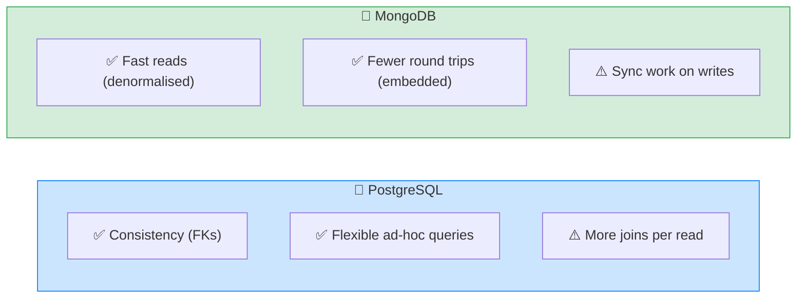

# 🏗️ Weekend Build — Posts + Comments + Likes in BOTH Databases — Complete Study Notes

> Notes for becoming a strong software engineer. Easy language, real code, and interview-ready explanations.
> The capstone: build the **same feature twice** — once in PostgreSQL, once in MongoDB — and compare. This is where every concept comes together.

---

## 📌 1. Why Build the Same Thing Twice?

This is the single most valuable database exercise you can do. By implementing **identical functionality** in both PostgreSQL and MongoDB, you *feel* the trade-offs instead of memorising them. You'll see exactly **where SQL is cleaner, where MongoDB is cleaner, and why.** That hands-on comparison is what turns "I know both databases" into "I know *when to use* each" — the senior-level distinction.

> 🎯 Interview line: *"I built the same posts/comments/likes feature in both Postgres and MongoDB to compare them directly — code complexity, query performance at scale, and ease of schema change. That hands-on comparison taught me when each model genuinely fits, rather than reciting textbook trade-offs."*

---

## 🗂️ 2. The Schema (same logical model, both DBs)

```mermaid
erDiagram
    USERS ||--o{ POSTS : writes
    USERS ||--o{ COMMENTS : writes
    POSTS ||--o{ COMMENTS : has
    USERS ||--o{ LIKES : makes
    POSTS ||--o{ LIKES : receives

    USERS { uuid id; string name }
    POSTS { uuid id; uuid user_id; string title; text content }
    COMMENTS { uuid id; uuid post_id; uuid user_id; text content }
    LIKES { uuid user_id; uuid post_id }
```

**The relationships:**
- **Users** — independent entity.
- **Posts** belong to a User (1-to-many).
- **Comments** belong to a Post *and* a User (1-to-many from each).
- **Likes** — a User likes a Post (many-to-many).

**The queries to implement in both:**
1. Get a post with: **author**, **top 5 comments**, **total like count**, and **whether the current user liked it.**
2. **List a feed** of posts with all the above, **paginated.**

---

## 🐘 3. The PostgreSQL Version

### Schema (normalised — separate tables, foreign keys)
```sql
CREATE TABLE users (
    id   UUID PRIMARY KEY DEFAULT gen_random_uuid(),
    name VARCHAR(100) NOT NULL
);
CREATE TABLE posts (
    id      UUID PRIMARY KEY DEFAULT gen_random_uuid(),
    user_id UUID NOT NULL REFERENCES users(id),
    title   VARCHAR(200) NOT NULL,
    content TEXT,
    created_at TIMESTAMPTZ DEFAULT NOW()
);
CREATE TABLE comments (
    id      UUID PRIMARY KEY DEFAULT gen_random_uuid(),
    post_id UUID NOT NULL REFERENCES posts(id),
    user_id UUID NOT NULL REFERENCES users(id),
    content TEXT NOT NULL,
    created_at TIMESTAMPTZ DEFAULT NOW()
);
CREATE TABLE likes (
    user_id UUID REFERENCES users(id),
    post_id UUID REFERENCES posts(id),
    PRIMARY KEY (user_id, post_id)        -- composite key prevents double-likes
);
-- Index the foreign keys (Postgres doesn't auto-index them!)
CREATE INDEX idx_comments_post ON comments(post_id);
CREATE INDEX idx_likes_post ON likes(post_id);
CREATE INDEX idx_posts_created ON posts(created_at DESC);
```

### Query 1 — one post with everything
```sql
SELECT
    p.id, p.title, p.content,
    u.name AS author,
    (SELECT COUNT(*) FROM likes l WHERE l.post_id = p.id) AS like_count,
    EXISTS(SELECT 1 FROM likes l WHERE l.post_id = p.id AND l.user_id = :current_user) AS liked_by_me,
    (SELECT json_agg(c) FROM (
        SELECT cm.content, cu.name AS commenter
        FROM comments cm JOIN users cu ON cm.user_id = cu.id
        WHERE cm.post_id = p.id ORDER BY cm.created_at DESC LIMIT 5
    ) c) AS top_comments
FROM posts p
JOIN users u ON p.user_id = u.id
WHERE p.id = :post_id;
```

### Query 2 — paginated feed (the same, for many posts)
```sql
SELECT
    p.id, p.title, u.name AS author,
    (SELECT COUNT(*) FROM likes l WHERE l.post_id = p.id) AS like_count,
    EXISTS(SELECT 1 FROM likes l WHERE l.post_id = p.id AND l.user_id = :current_user) AS liked_by_me
FROM posts p
JOIN users u ON p.user_id = u.id
ORDER BY p.created_at DESC
LIMIT 10 OFFSET :offset;       -- or keyset pagination for scale
```

> 💡 Postgres does the joins and aggregation **in the database** — clean and powerful. The comments come back as JSON via `json_agg`. Everything stays **consistent** (foreign keys guarantee no orphan comments/likes).

---

## 🍃 4. The MongoDB Version

### Schema (mixed — embed some, reference + denormalise others)
```javascript
// users collection — referenced
{ _id: ObjectId, name: "Nayan" }

// posts collection — denormalised counter + extended-reference author
{
  _id: ObjectId,
  author: { user_id: ObjectId, name: "Nayan" },  // extended reference
  title: "My post",
  content: "...",
  like_count: 47,                                 // denormalised counter
  liked_by: [ObjectId, ObjectId],                 // array of user ids who liked
  created_at: ISODate
}

// comments collection — SEPARATE (unbounded growth!)
{ _id: ObjectId, post_id: ObjectId,
  author: { user_id: ObjectId, name: "Alice" },   // extended reference
  content: "Great post!", created_at: ISODate }
```
> Design choices (from your schema-design notes): **comments referenced** (unbounded → separate collection), **author extended-referenced** (name embedded for display), **like_count denormalised** + **liked_by array** for O(1) "did I like it?" checks.

### Query 1 — one post with everything (aggregation pipeline)
```javascript
db.posts.aggregate([
  { $match: { _id: postId } },
  { $lookup: {                                   // join top comments
      from: "comments",
      let: { pid: "$_id" },
      pipeline: [
        { $match: { $expr: { $eq: ["$post_id", "$$pid"] } } },
        { $sort: { created_at: -1 } },
        { $limit: 5 }
      ],
      as: "top_comments"
  } },
  { $project: {
      title: 1, content: 1, author: 1,
      like_count: 1,                              // already denormalised — no count!
      liked_by_me: { $in: [currentUserId, "$liked_by"] },  // O(1) array check
      top_comments: 1
  } }
])
```

### Query 2 — paginated feed
```javascript
db.posts.aggregate([
  { $sort: { created_at: -1 } },
  { $skip: offset },
  { $limit: 10 },
  { $project: {
      title: 1, author: 1, like_count: 1,
      liked_by_me: { $in: [currentUserId, "$liked_by"] }
  } }
])
```

> 💡 Notice: `like_count` is **just a field** (denormalised — no counting), and `liked_by_me` is a fast `$in` array check. The denormalisation we designed earlier makes these reads **very fast** — at the cost of keeping the counters in sync on every like.

---

## ⚖️ 5. The Comparison (write this in your README)

This is the **deliverable** — your findings. Here's a strong template:



| Dimension | PostgreSQL | MongoDB |
|---|---|---|
| **Code complexity** | More joins, but declarative & consistent. Counts computed live. | Denormalised reads are simple; **writes are more complex** (keep `like_count`/`liked_by` in sync) |
| **Read performance @ 100k** | Fast **with proper indexes** on FKs; joins/aggregations add work | Very fast reads (counts pre-computed, author embedded) — **fewer round trips** |
| **Write performance** | Simple — just insert a like row | More work — insert like **and** `$inc` counter **and** `$addToSet` the array |
| **Consistency** | **Strong** — foreign keys prevent orphans; like_count always accurate | **Eventual** — denormalised counters can **drift** if a sync is missed |
| **Ease of schema change** | Needs migrations (`ALTER TABLE`) | Add a field freely — **flexible schema** |
| **Ad-hoc / analytical queries** | **Excellent** — arbitrary joins & aggregations | Harder — must pre-design for the access pattern |

### The honest findings (what to actually write)
- **PostgreSQL wins** when you need **strong consistency** (no orphan/inaccurate data), **flexible ad-hoc queries** (reporting, analytics), and you can index well. The like_count is always exactly right because it's counted live.
- **MongoDB wins** when **reads dominate** and you've **denormalised for the access pattern** — the feed loads in fewer round trips because counts and author are pre-baked into the document. The cost is **write complexity** and **possible drift** in the denormalised counts.
- **The big lesson:** Postgres optimises for **correctness + flexibility**; MongoDB optimises for **read speed on a known access pattern.** Neither is "better" — they make opposite trade-offs.

> 🎯 Interview gold: *"Building it in both, the clearest difference was where the work lives. Postgres keeps writes simple and computes counts at read time with strong consistency. MongoDB pushes the work to write time — denormalised counters and embedded author — making reads fast but writes more complex and consistency eventual. So I'd pick Postgres for correctness-critical, query-flexible systems, and MongoDB for read-heavy feeds with a stable access pattern."*

---

## 🎤 6. How to Explain in an Interview

**Step 1 — The exercise:**
> "I built the same posts/comments/likes feature in both Postgres and MongoDB to compare them on real queries — post with author, top comments, like count, and 'did I like it', plus a paginated feed."

**Step 2 — The structural difference:**
> "Postgres normalises into tables with foreign keys and computes counts live with joins. MongoDB denormalises — embedding the author, storing a like_count, and a liked_by array — so reads are fast but writes must keep those in sync."

**Step 3 — The trade-off:**
> "It comes down to where the work lives: Postgres does it at read time with strong consistency; MongoDB does it at write time for fast reads but eventual consistency."

**Step 4 — The conclusion:**
> "So Postgres for correctness and ad-hoc queries; MongoDB for read-heavy feeds with a known access pattern. The exercise made the trade-offs concrete instead of theoretical."

> 🟢 Trap question: *"Which was faster at 100k records?"* → *"For the read, MongoDB — because counts and author were denormalised, so no joins or live counting. But Postgres was very close *with proper indexes*, and stayed correct without sync logic. MongoDB's read speed came at the cost of write complexity and drift risk. 'Faster' depends on the read:write ratio."*

> 🟢 Trap question: *"Which handles a schema change better — say adding 'post tags'?"* → *"MongoDB — just start writing a tags array, no migration. Postgres needs an ALTER TABLE (or a JSONB column). That flexibility is real, though Postgres's JSONB narrows the gap."*

---

## 💎 7. Impressive Words & Phrases

| Instead of saying... | Say this 💪 |
|---|---|
| "Count them each time" | "**Compute at read time** (live aggregation)" |
| "Store the count" | "**Denormalise** — work moves to **write time**" |
| "Always correct" | "**Strong consistency** (foreign keys)" |
| "Might be slightly off" | "**Eventual consistency** / counter **drift**" |
| "Design for the queries" | "Model around the **access pattern**" |
| "Change the table" | "A **schema migration** (`ALTER TABLE`)" |
| "Add a field freely" | "**Flexible schema**, no migration" |
| "Fewer DB trips" | "Fewer **round trips** (embedded/denormalised)" |
| "Depends on the case" | "It's a **read:write ratio** trade-off" |

**Power vocabulary:** *normalisation vs denormalisation, read-time vs write-time work, strong vs eventual consistency, counter drift, access pattern, schema migration, flexible schema, round trips, read:write ratio, referential integrity, extended reference.*

> 🌶️ Bonus flex — **"where does the work live?":** *"The single clearest lens for SQL vs NoSQL is *when* you pay the cost. Normalised SQL pays at read time (joins, live counts) for simple correct writes. Denormalised MongoDB pays at write time (sync counters) for fast reads. Choosing is really choosing where you want the work."* This one framing impresses because it cuts through the hype to the actual engineering trade-off.

---

## ⏱️ 8. Quick Revision (read 5 min before interview)

> **The build:** same posts/comments/likes feature in **both** Postgres & MongoDB. Queries: post + author + top-5 comments + like_count + liked_by_me; paginated feed.
>
> **Postgres:** normalised tables + FKs; joins + live `COUNT`/`EXISTS`; comments via `json_agg`. ✅ strong consistency, flexible queries. ⚠️ more read-time work (index the FKs!).
>
> **MongoDB:** comments in own collection (unbounded); **extended-reference author**; **denormalised `like_count`** + **`liked_by` array** (`$in` for liked_by_me); `$lookup` for top comments. ✅ fast reads, fewer round trips. ⚠️ write-time sync + drift risk.
>
> **Core lesson — where does the work live?** Postgres = read-time work, strong consistency. MongoDB = write-time work, fast reads, eventual consistency.
>
> **Pick:** Postgres for correctness + ad-hoc queries; MongoDB for read-heavy feeds with a known access pattern. ("Faster" depends on read:write ratio.)
>
> **Golden line:** *"Same feature, two databases: Postgres pays at read time for correctness and flexibility; MongoDB pays at write time for fast reads. The choice is really about where you want the work and how much consistency you need."*

---

### ✅ Practice checklist (the actual build)
- [ ] Postgres: create the 4 tables + index the foreign keys
- [ ] Postgres: query 1 (post + author + top 5 + like_count + liked_by_me)
- [ ] Postgres: query 2 (paginated feed)
- [ ] MongoDB: design the collections (embed/reference/denormalise per the schema notes)
- [ ] MongoDB: aggregation for query 1 (`$lookup` + `$in` check)
- [ ] MongoDB: aggregation for query 2 (feed with `$sort`/`$skip`/`$limit`)
- [ ] Seed **100k records** in both; time the feed query (`EXPLAIN ANALYZE` vs `.explain()`)
- [ ] Write the comparison findings in your README (complexity, perf, schema change)
- [ ] Practise the "where does the work live?" framing out loud

🎉 **This is the capstone.** Building the same feature twice — and writing up the honest trade-offs — is exactly what turns database knowledge into database *judgement*. Put this project on GitHub; it's genuinely portfolio-worthy. 🚀
