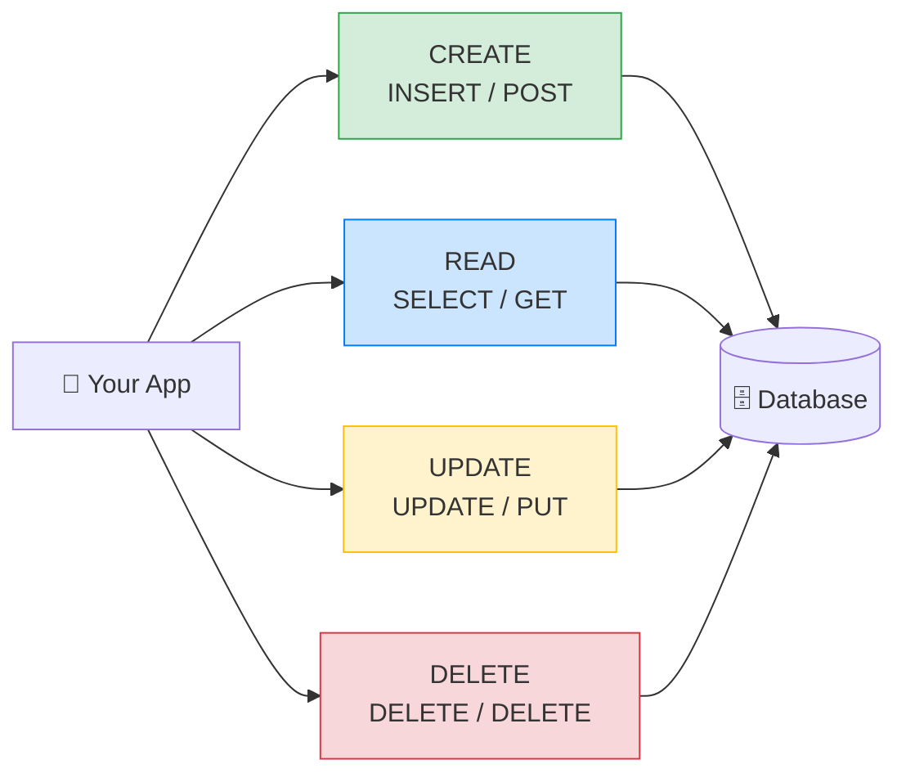

# 🔄 The 4 Basic Operations: CRUD — Complete Study Notes

> Notes for becoming a strong software engineer. Easy language, real code, and interview-ready explanations.
> Builds on the relational-database basics — now we actually *do* things with the data.

---

## 📌 1. What is CRUD? (in simple words)

**CRUD** = **C**reate, **R**ead, **U**pdate, **D**elete. These are the **four basic things** every application does with data. Whether it's Instagram, a banking app, or a to-do list — under the hood it's just CRUD.

| Letter | Operation | SQL keyword | HTTP method (REST) | Everyday example |
|---|---|---|---|---|
| **C** | Create | `INSERT` | `POST` | Sign up a new user |
| **R** | Read | `SELECT` | `GET` | View your profile |
| **U** | Update | `UPDATE` | `PUT` / `PATCH` | Edit your bio |
| **D** | Delete | `DELETE` | `DELETE` | Remove a post |

> 🎯 Interview line: *"CRUD is the four fundamental data operations — Create, Read, Update, Delete — which map directly to SQL's INSERT, SELECT, UPDATE, DELETE and to the HTTP verbs POST, GET, PUT/PATCH, DELETE."*



---

## ➕ 2. CREATE — `INSERT`

Adds new rows into a table.

```sql
-- Insert one row
INSERT INTO users (email, name) VALUES ('nayan@example.com', 'Nayan');

-- Insert many rows at once (more efficient than one-by-one)
INSERT INTO users (email, name) VALUES
    ('alice@example.com', 'Alice'),
    ('bob@example.com',   'Bob');
```

**Key point:** you **don't** insert `id` or `created_at`. The database fills those automatically (`SERIAL` auto-increments the id, `DEFAULT NOW()` sets the timestamp). You only provide the *real* data.

> 💡 Useful trick — `RETURNING` gives you back what was just created (great for getting the new id without a second query):
> ```sql
> INSERT INTO users (email, name)
> VALUES ('zoya@example.com', 'Zoya')
> RETURNING id, created_at;
> ```

> 🎯 Interview tip: batch inserts (many rows in one statement) are far faster than looping single inserts, because each statement has network + transaction overhead.

---

## 👀 3. READ — `SELECT`

The most-used operation. Reads/fetches rows. This is where most of your daily SQL lives.

```sql
SELECT * FROM users;                          -- all columns, all rows
SELECT name, email FROM users;                -- only specific columns
SELECT * FROM users WHERE id = 1;             -- one specific row
SELECT * FROM users WHERE name LIKE 'N%';     -- pattern match (starts with N)
SELECT * FROM users ORDER BY created_at DESC; -- newest first
SELECT * FROM users LIMIT 10;                 -- only the first 10
SELECT * FROM users LIMIT 10 OFFSET 20;       -- skip 20, take 10 → pagination
```

### The pieces explained

| Clause | What it does |
|---|---|
| `SELECT *` | Get **all** columns. ⚠️ Avoid in production — fetch only what you need |
| `SELECT name, email` | Get only chosen columns (faster, less data) |
| `WHERE` | Filter rows by a condition |
| `LIKE 'N%'` | Pattern match — `%` = any characters. `'N%'` = starts with N |
| `ORDER BY ... DESC` | Sort results (`ASC` = ascending, `DESC` = descending) |
| `LIMIT` | Cap how many rows come back |
| `OFFSET` | Skip rows — combined with LIMIT for **pagination** |

> ⚠️ **`SELECT *` warning:** it fetches every column including big ones you don't need, breaks index-only scans, and silently breaks code when columns change. In real apps, **name your columns explicitly**.

### Pagination intuition

`LIMIT 10 OFFSET 20` means *"skip the first 20 rows, then give me the next 10"* — that's **page 3** (rows 21–30). Pattern: `OFFSET = (page - 1) × pageSize`.

> 🌶️ Senior note: `OFFSET` gets **slow on large tables** (it still scans and throws away all the skipped rows). For big datasets, **keyset / cursor pagination** is better:
> ```sql
> -- Instead of OFFSET, remember the last id you saw:
> SELECT * FROM users WHERE id > 20 ORDER BY id LIMIT 10;
> ```

---

## ✏️ 4. UPDATE — `UPDATE`

Changes existing rows.

```sql
UPDATE users SET name = 'Nayan Kumar' WHERE id = 1;   -- one row
UPDATE users SET name = UPPER(name);                  -- ⚠️ EVERY row!
```

You can update multiple columns at once:
```sql
UPDATE users SET name = 'Nayan K', email = 'nk@example.com' WHERE id = 1;
```

### 🚨 The #1 Production Mistake — forgetting `WHERE`

```sql
UPDATE users SET name = 'X';   -- 😱 this updates EVERY row in the table
```

Without a `WHERE`, the update hits **every single row**. People have wiped entire production tables this way.

> 🛡️ **The safety habit:** before any UPDATE or DELETE, run a `SELECT` with the **same `WHERE`** first to see exactly which rows you're about to touch.
> ```sql
> SELECT * FROM users WHERE id = 1;        -- 1. check what you'll change
> UPDATE users SET name = 'X' WHERE id = 1; -- 2. then change it
> ```

> 🎯 Interview line: *"My safety habit is to always SELECT with the same WHERE clause before an UPDATE or DELETE, so I can confirm the exact rows I'm about to modify. Forgetting WHERE is the classic way to corrupt a whole table."*

---

## 🗑️ 5. DELETE — `DELETE`

Removes rows.

```sql
DELETE FROM users WHERE id = 1;                       -- one row
DELETE FROM users WHERE created_at < '2020-01-01';    -- old rows
```

**Same deadly warning:** `DELETE FROM users` with no `WHERE` **deletes everything**. Always `SELECT` first.

### Hard delete vs Soft delete (a senior distinction)

| | **Hard delete** | **Soft delete** |
|---|---|---|
| What | Row is gone forever | Row stays, marked as deleted |
| How | `DELETE FROM ...` | `UPDATE ... SET deleted_at = NOW()` |
| Pros | Frees space, truly gone | Recoverable, keeps history/audit |
| Cons | No undo, breaks references | Must filter `WHERE deleted_at IS NULL` everywhere |

```sql
-- Soft delete: don't remove, just flag it
UPDATE users SET deleted_at = NOW() WHERE id = 1;
-- Then "live" queries always filter:
SELECT * FROM users WHERE deleted_at IS NULL;
```

> 🎯 Interview line: *"Many production systems prefer soft deletes — setting a `deleted_at` flag instead of removing the row — so data is recoverable and auditable. The trade-off is every query must filter out the soft-deleted rows."*

> 💡 Note on foreign keys: if a user has orders, a hard `DELETE` may be **blocked** by referential integrity (from the relational-basics notes). You either delete the children first, or define `ON DELETE CASCADE`. Soft delete sidesteps this entirely.

---

## 💻 6. Practical Exercise — Full CRUD Cycle

Create a `posts` table linked to `users`, then run the complete cycle.

```sql
-- Setup: a posts table with a foreign key to users
CREATE TABLE posts (
    id         SERIAL PRIMARY KEY,
    user_id    INTEGER NOT NULL REFERENCES users(id),  -- 🔗 foreign key
    title      VARCHAR(200) NOT NULL,
    body       TEXT,
    views      INTEGER NOT NULL DEFAULT 0,
    created_at TIMESTAMPTZ NOT NULL DEFAULT NOW()
);

-- CREATE: insert 5 posts (assuming user id 1 exists)
INSERT INTO posts (user_id, title, body, views) VALUES
    (1, 'My first post',   'Hello world',          120),
    (1, 'Learning SQL',    'CRUD is easy',          45),
    (1, 'Node.js tips',    'Async all the things',  300),
    (1, 'Postgres indexes','B-tree is the default', 90),
    (1, 'React vs Vue',    'A friendly comparison',  10);

-- READ: various queries
SELECT * FROM posts;                                  -- everything
SELECT title, views FROM posts;                       -- chosen columns
SELECT * FROM posts WHERE user_id = 1;                -- filter
SELECT * FROM posts WHERE title LIKE '%SQL%';         -- contains "SQL"
SELECT * FROM posts ORDER BY views DESC;              -- most viewed first
SELECT * FROM posts ORDER BY created_at DESC LIMIT 3; -- 3 newest
SELECT * FROM posts WHERE views > 100;                -- popular posts

-- UPDATE: edit one post (always with WHERE!)
SELECT * FROM posts WHERE id = 2;                     -- check first
UPDATE posts SET title = 'Learning SQL the easy way' WHERE id = 2;

-- Increment views (a real-world pattern)
UPDATE posts SET views = views + 1 WHERE id = 3;

-- DELETE: remove one post (always with WHERE!)
SELECT * FROM posts WHERE id = 5;                     -- check first
DELETE FROM posts WHERE id = 5;
```

> 💡 Notice `views = views + 1` — you can use a column's **current value** in its own update. This is the safe way to increment a counter directly in the database.

---

## 🎤 7. How to Explain in an Interview

**Step 1 — Define it:**
> "CRUD is the four core data operations — Create, Read, Update, Delete — mapping to INSERT, SELECT, UPDATE, DELETE in SQL and to POST, GET, PUT/PATCH, DELETE in REST."

**Step 2 — Read is the richest:**
> "SELECT is where most logic lives — filtering with WHERE, sorting with ORDER BY, and paginating with LIMIT/OFFSET. I avoid SELECT * in production and fetch only the columns I need."

**Step 3 — The safety habit:**
> "For UPDATE and DELETE I always run a SELECT with the same WHERE first. Forgetting WHERE updates or deletes every row — a classic production disaster."

**Step 4 — Soft deletes:**
> "In many systems I'd use soft deletes — a deleted_at flag — so data stays recoverable and auditable, at the cost of filtering it out in every read."

**Step 5 — Performance touches:**
> "I batch inserts rather than looping, use RETURNING to get generated values, and switch from OFFSET to keyset pagination on large tables."

> 🟢 Trap question: *"How would you safely run an UPDATE on production?"* → *"Wrap it in a transaction, SELECT with the WHERE first to confirm the row count, run the UPDATE, verify the affected count matches, then COMMIT — or ROLLBACK if it looks wrong."*

---

## 💎 8. Impressive Words & Phrases

| Instead of saying... | Say this 💪 |
|---|---|
| "Add a row" | "**Insert a record**" |
| "Get data" | "**Query / fetch** rows" |
| "Filter" | "Apply a **predicate** in the WHERE clause" |
| "Get data in pages" | "**Paginate** results" |
| "Faster paging on big tables" | "**Keyset / cursor pagination**" |
| "Add many at once" | "**Batch / bulk insert**" |
| "Don't really delete" | "**Soft delete** with a `deleted_at` tombstone" |
| "Get the new id back" | "Use the **`RETURNING` clause**" |
| "Add 1 to a column" | "An **atomic increment** in the database" |
| "Delete linked rows too" | "**Cascade delete** via `ON DELETE CASCADE`" |

**Power vocabulary:** *predicate, projection (choosing columns), batch insert, RETURNING clause, pagination, keyset/cursor pagination, soft delete, tombstone, atomic increment, cascade delete, affected row count.*

> 🌶️ Bonus flex — **idempotency:** *"A well-designed DELETE is idempotent — deleting an already-deleted row twice causes no harm. I keep that in mind when designing APIs so retries are safe."* Dropping this shows API-design maturity.

---

## ⏱️ 9. Quick Revision (read 5 min before interview)

> **CRUD** = Create / Read / Update / Delete → `INSERT` / `SELECT` / `UPDATE` / `DELETE` → `POST` / `GET` / `PUT-PATCH` / `DELETE`.
>
> **INSERT:** don't supply `id` or `created_at` (DB auto-fills). Use multi-row inserts for speed; `RETURNING` to get the new id.
>
> **SELECT:** `WHERE` (filter), `ORDER BY` (sort), `LIMIT`/`OFFSET` (paginate). Avoid `SELECT *`. `OFFSET` is slow on big tables → use keyset pagination.
>
> **UPDATE / DELETE:** ⚠️ **always use `WHERE`** — without it, every row is hit. Habit: `SELECT` with the same WHERE first.
>
> **Soft delete:** `UPDATE ... SET deleted_at = NOW()` instead of removing → recoverable + auditable; must filter `WHERE deleted_at IS NULL`.
>
> **Golden line:** *"Before any UPDATE or DELETE, I run the same WHERE as a SELECT first — forgetting WHERE is how people wipe whole tables."*

---

### ✅ Practice checklist
- [ ] Create a `posts` table with a foreign key to `users`
- [ ] Insert 5 posts (single + multi-row inserts)
- [ ] Run SELECTs using `WHERE`, `LIKE`, `ORDER BY`, `LIMIT`, `OFFSET`
- [ ] Try `RETURNING id` on an insert
- [ ] Update one post — but `SELECT` with the same WHERE first
- [ ] Try `views = views + 1` (atomic increment)
- [ ] Delete one post — again `SELECT` first
- [ ] Bonus: implement a soft delete with a `deleted_at` column

Once the full CRUD cycle feels automatic, you've got the everyday language of every backend on the planet. 🚀
