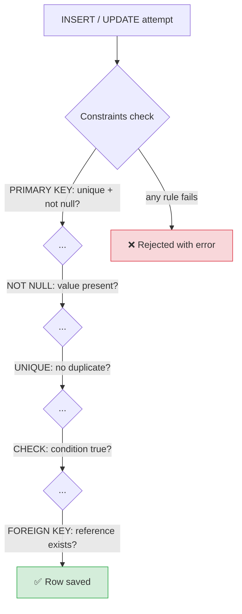
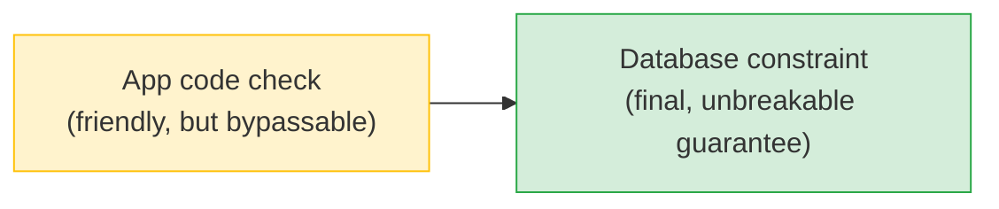

# 🛡️ Constraints — Complete Study Notes

> Notes for becoming a strong software engineer. Easy language, real code, and interview-ready explanations.
> Topic: rules enforced *by the database itself* — the safety net under your data.

---

## 📌 1. What is a Constraint? (in simple words)

A **constraint** is a **rule the database enforces** on your data. If anyone tries to insert or update data that breaks the rule, the database **rejects it** — no exceptions.

The key insight:

> Constraints live in the **database**, not your application code. Application code can be **bypassed** — but a database constraint **cannot**.

> Analogy 🚪: think of a nightclub. The app-level check is like a friendly host who *asks* you not to enter without an ID. The database constraint is the **locked turnstile** that physically won't open without a valid ID. The host can be distracted or fooled; the turnstile can't. Constraints are the turnstile.

> 🎯 Interview line: *"Constraints enforce data rules at the database level, which is more reliable than application code because the database guarantees them no matter how the data gets written — even by a buggy service, a script, or a manual edit."*

---

## 🗂️ 2. The 6 Constraint Types

All six in one table definition:

```sql
CREATE TABLE users (
    id         SERIAL PRIMARY KEY,                      -- 1️⃣ PRIMARY KEY
    email      VARCHAR(255) NOT NULL UNIQUE,            -- 2️⃣ NOT NULL  3️⃣ UNIQUE
    age        INTEGER CHECK (age >= 13),               -- 4️⃣ CHECK
    role       VARCHAR(20) DEFAULT 'user',              -- 5️⃣ DEFAULT
    company_id INTEGER REFERENCES companies(id)         -- 6️⃣ FOREIGN KEY
);
```



---

### 1️⃣ PRIMARY KEY — the unique identifier

Marks the column that **uniquely identifies each row**. It's actually **two rules in one**: `UNIQUE` + `NOT NULL`. Postgres also **auto-creates an index** on it.

```sql
id SERIAL PRIMARY KEY
```

- No two rows can share the same `id`.
- `id` can never be NULL.

> 💡 A table has **exactly one** primary key (though it can span multiple columns — a *composite* primary key, like `(user_id, post_id)` in a junction table from the relationships notes).

---

### 2️⃣ NOT NULL — value required

The column **must have a value**. You can't insert a row leaving it empty.

```sql
email VARCHAR(255) NOT NULL
```

> 💡 Remember from the WHERE notes: NULL means "unknown/missing." `NOT NULL` says *"this fact is mandatory — no unknowns allowed here."*

---

### 3️⃣ UNIQUE — no duplicates

No two rows can have the **same value** in this column. Perfect for emails, usernames, phone numbers.

```sql
email VARCHAR(255) UNIQUE
```

```sql
INSERT INTO users (email) VALUES ('nayan@x.com');  -- ✅
INSERT INTO users (email) VALUES ('nayan@x.com');  -- ❌ duplicate → rejected
```

> 💡 `UNIQUE` differs from `PRIMARY KEY`: a table has **one** primary key, but **many** UNIQUE columns. Also, UNIQUE columns **can** be NULL (and usually multiple NULLs are allowed, since NULL ≠ NULL).

---

### 4️⃣ CHECK — custom rule (the underused powerhouse!)

Enforces **any condition you write**. This one is hugely underused but incredibly valuable — it lets you bake **business rules** right into the schema.

```sql
age INTEGER CHECK (age >= 13)
```

Great uses:
```sql
price   DECIMAL(10,2) CHECK (price > 0),                              -- no negative prices
status  VARCHAR(20)   CHECK (status IN ('pending','shipped','delivered')), -- valid states only
discount INTEGER      CHECK (discount BETWEEN 0 AND 100),             -- 0–100% only
CHECK (end_date > start_date)                                        -- multi-column rule
```

Once it's a `CHECK` constraint, the rule **can never be violated** — not by a bug, not by a bad script. The database refuses any row that fails the condition.

> 🎯 Interview line: *"CHECK constraints are underused. I use them for things like positive prices, valid status enums, and date ordering. Encoding a business rule as a CHECK means it physically cannot be violated, regardless of which code path writes the data."*

---

### 5️⃣ DEFAULT — automatic fallback value

If you don't provide a value, the database fills in the default.

```sql
role       VARCHAR(20) DEFAULT 'user',
created_at TIMESTAMPTZ DEFAULT NOW(),
is_active  BOOLEAN     DEFAULT true
```

```sql
INSERT INTO users (email) VALUES ('a@x.com');
-- role auto-set to 'user', created_at to current time, is_active to true
```

> 💡 `DEFAULT NOW()` (from the relational-basics notes) is the classic way to auto-stamp creation time.

---

### 6️⃣ FOREIGN KEY — valid reference

Ensures a column's value **exists in another table** — enforcing **referential integrity** (from the relationships notes).

```sql
company_id INTEGER REFERENCES companies(id)
```

You can't insert a user with `company_id = 999` if company 999 doesn't exist. And you can attach `ON DELETE CASCADE` / `SET NULL` / `RESTRICT` to control what happens when the referenced row is deleted.

> 💡 Foreign keys are constraints **and** the mechanism for relationships — that's why they show up in both topics.

---

## 🤔 3. Why Constraints Matter (the core argument)

Imagine your rule is *"email must be unique and required."* If you enforce this **only in application code**:

- A **bug** in one code path forgets the check → duplicate slips in.
- A **different service** writes to the same table without the check.
- A **data migration script** or a **manual `psql` edit** bypasses the app entirely.
- A **race condition** lets two simultaneous requests both pass the "is it unique?" check, then both insert.

With a **database constraint**, none of these can break the rule — the database is the **final gatekeeper**. It's defence in depth: validate in the app for nice user-facing errors, *and* constrain in the DB as the unbreakable guarantee.



> 🎯 Interview line: *"App-level validation gives friendly errors but can be bypassed by other services, scripts, race conditions, or manual edits. The database constraint is the guarantee that can't be bypassed. I use both — the app for UX, the constraint as the safety net."*

> 💡 The UNIQUE constraint is also the **correct fix for a race condition** — two requests both checking "is this email taken?" can both pass and insert; only a DB-level UNIQUE constraint reliably stops the duplicate.

---

## 💻 4. Practical Example

```sql
CREATE TABLE companies (
    id   SERIAL PRIMARY KEY,
    name VARCHAR(100) NOT NULL
);

CREATE TABLE products (
    id          SERIAL PRIMARY KEY,
    company_id  INTEGER NOT NULL REFERENCES companies(id) ON DELETE CASCADE,
    name        VARCHAR(200) NOT NULL,
    sku         VARCHAR(50) NOT NULL UNIQUE,                          -- no duplicate SKUs
    price       DECIMAL(10,2) NOT NULL CHECK (price > 0),             -- positive only
    discount    INTEGER NOT NULL DEFAULT 0 CHECK (discount BETWEEN 0 AND 100),
    status      VARCHAR(20) NOT NULL DEFAULT 'draft'
                CHECK (status IN ('draft','active','archived')),
    created_at  TIMESTAMPTZ NOT NULL DEFAULT NOW()
);

-- ✅ Works
INSERT INTO companies (name) VALUES ('Acme');
INSERT INTO products (company_id, name, sku, price)
VALUES (1, 'Widget', 'WID-001', 49.99);

-- ❌ Each of these is REJECTED by a constraint:
INSERT INTO products (company_id, name, sku, price)
VALUES (1, 'Bad', 'WID-001', 10);          -- duplicate sku (UNIQUE)
INSERT INTO products (company_id, name, sku, price)
VALUES (1, 'Bad', 'WID-002', -5);          -- negative price (CHECK)
INSERT INTO products (company_id, name, sku, price, status)
VALUES (1, 'Bad', 'WID-003', 10, 'xyz');   -- invalid status (CHECK)
INSERT INTO products (company_id, name, sku, price)
VALUES (999, 'Bad', 'WID-004', 10);        -- no company 999 (FOREIGN KEY)
```

> 💡 You can also add constraints to an existing table:
> ```sql
> ALTER TABLE products ADD CONSTRAINT positive_price CHECK (price > 0);
> ```
> Naming constraints (`positive_price`) gives clearer error messages — a nice professional touch.

---

## 🎤 5. How to Explain in an Interview

**Step 1 — What & why:**
> "Constraints are data rules enforced by the database itself. They're more reliable than app code because they can't be bypassed by another service, a script, a manual edit, or a race condition."

**Step 2 — The six types:**
> "PRIMARY KEY (unique + not null identifier), NOT NULL (required), UNIQUE (no duplicates), CHECK (any custom condition), DEFAULT (fallback value), and FOREIGN KEY (valid reference to another table)."

**Step 3 — CHECK specifically:**
> "CHECK is underused — I encode business rules like positive prices or valid status enums directly in the schema, so they physically can't be violated."

**Step 4 — Defence in depth:**
> "I validate in the app for friendly errors AND constrain in the DB as the unbreakable guarantee — the two work together."

**Step 5 — Race conditions:**
> "A UNIQUE constraint is also the right fix for duplicate-on-race bugs — two concurrent requests can both pass an app-level 'is it taken?' check, but only the DB constraint reliably blocks the second insert."

> 🟢 Trap question: *"If your app already checks email uniqueness, why also add a UNIQUE constraint?"* → *"Because the app check has a race window — two requests can both pass it simultaneously and both insert. And other code paths or scripts might skip the check entirely. The DB constraint is the only place the guarantee actually holds."*

---

## 💎 6. Impressive Words & Phrases

| Instead of saying... | Say this 💪 |
|---|---|
| "Database rule" | "A **constraint** enforced at the **data layer**" |
| "Stops bad references" | "Enforces **referential integrity**" |
| "Required field" | "A **NOT NULL** constraint" |
| "No duplicates" | "A **uniqueness constraint**" |
| "Custom rule" | "A **CHECK constraint** encoding a **business rule / invariant**" |
| "Auto-filled value" | "A **column default**" |
| "App and DB both check" | "**Defence in depth** / belt-and-braces validation" |
| "Two requests clash" | "A **race condition** — the constraint prevents the duplicate" |
| "Guaranteed always true" | "An **invariant** the database maintains" |
| "Rule can't be broken" | "The constraint is **non-bypassable**" |

**Power vocabulary:** *constraint, invariant, referential integrity, uniqueness constraint, CHECK constraint, column default, defence in depth, race condition, data integrity, non-bypassable guarantee, composite primary key.*

> 🌶️ Bonus flex — **invariant:** *"A constraint encodes an invariant — a condition that's guaranteed true for every row at all times. I push invariants into the database so no code path can ever violate them."* Calling rules "invariants" sounds genuinely senior.

---

## ⏱️ 7. Quick Revision (read 5 min before interview)

> **Constraint = a rule the database enforces.** More reliable than app code because it **can't be bypassed** (by bugs, other services, scripts, manual edits, or race conditions).
>
> **The 6 types:**
> 1. **PRIMARY KEY** → unique + not null identifier (auto-indexed).
> 2. **NOT NULL** → value required.
> 3. **UNIQUE** → no duplicate values (table can have many; can be NULL).
> 4. **CHECK** → any custom condition (positive price, valid status enum, date order). *Underused — use it!*
> 5. **DEFAULT** → fallback value if none given (`DEFAULT NOW()`, `DEFAULT 'user'`).
> 6. **FOREIGN KEY** → value must exist in another table (referential integrity).
>
> **Defence in depth:** validate in app (nice errors) + constrain in DB (unbreakable guarantee).
>
> **Race-condition fix:** only a UNIQUE constraint reliably stops a duplicate from a concurrent insert.
>
> **Golden line:** *"App validation gives friendly errors but can be bypassed; the database constraint is the guarantee that can't be — so I use both, with CHECK constraints to bake business rules right into the schema."*

---

### ✅ Practice checklist
- [ ] Create a table using all 6 constraint types
- [ ] Add a `CHECK (price > 0)` and try inserting a negative price → see it rejected
- [ ] Add a `CHECK (status IN (...))` enum and try an invalid status
- [ ] Add a `UNIQUE` column and try inserting a duplicate
- [ ] Set a `DEFAULT` and insert a row without that column → confirm the default
- [ ] Add a `FOREIGN KEY` and try referencing a non-existent row
- [ ] Use `ALTER TABLE ... ADD CONSTRAINT <name> CHECK (...)` on an existing table
- [ ] Explain out loud why a UNIQUE constraint fixes a race condition

Push your rules into the database as constraints and your data stays correct no matter what code touches it. This is how senior engineers guarantee data integrity. 🚀
