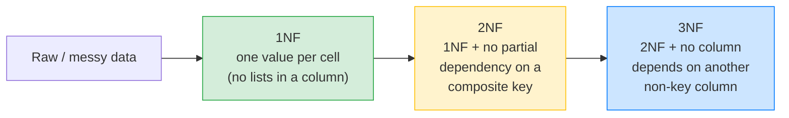
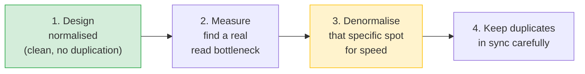

# 🏗️ Database Design Basics — Normalisation & Denormalisation — Complete Study Notes

> Notes for becoming a strong software engineer. Easy language, real code, and interview-ready explanations.
> Topic: how to *design* good tables — avoiding duplicated data, and when to break that rule on purpose.

---

## 📌 1. What is Normalisation? (without the academic jargon)

**Normalisation is just: don't store the same data in two places.**

Why? Because **duplicated data leads to bugs.** If a customer's email lives in 50 different rows, and they change it, you must update all 50. Miss one → your data is now **inconsistent** (some rows say the old email, some the new). 😱

> Analogy 📇: imagine writing your friend's phone number on 20 different sticky notes around your house. When they change their number, you have to find and fix all 20. Miss one and you'll call the wrong number later. Better to keep it in **one** contacts list and just *refer* to it. That single contacts list is normalisation; the sticky notes everywhere are duplication.

The practical rule:

> **If you're storing the same fact in two places, you probably need another table — use a foreign key instead of copying the data.**

> 🎯 Interview line: *"Normalisation means structuring tables so each fact is stored exactly once. It prevents update anomalies — where you change one copy and forget the others, leaving the data inconsistent."*

---

## 📐 2. The 3 Normal Forms (in plain English)

There are higher forms, but **1NF → 2NF → 3NF** cover ~99% of real work. Each builds on the previous.



---

### 1️⃣ 1NF — First Normal Form: one value per cell

**No "repeating groups."** Each column holds a **single** value, not a list.

```sql
-- ❌ WRONG: a list crammed into one column
users
┌────┬─────────┬───────────────────────────────┐
│ id │ name    │ phone_numbers                 │
├────┼─────────┼───────────────────────────────┤
│ 1  │ Nayan   │ "9876543210, 9876543211"      │  ← list in one cell 😱
└────┴─────────┴───────────────────────────────┘
```

Problems: you can't easily query "find the user with phone 9876543211", can't index it, can't enforce a format.

```sql
-- ✅ RIGHT: a separate table, one row per phone
CREATE TABLE user_phones (
    id      SERIAL PRIMARY KEY,
    user_id INTEGER NOT NULL REFERENCES users(id),
    phone   VARCHAR(15) NOT NULL
);
-- user 1 now has two clean rows: (1, '9876543210') and (1, '9876543211')
```

> 🎯 1NF in one line: *"No comma-separated lists or arrays-as-strings in a column — break them into their own rows."*

---

### 2️⃣ 2NF — Second Normal Form: no partial dependency

**1NF + every non-key column depends on the *whole* primary key, not just part of it.** This **only matters when you have a composite (multi-column) primary key.**

Example — an `order_items` table with composite key `(order_id, product_id)`:

```sql
-- ❌ WRONG: product_name depends only on product_id, not the whole key
order_items
┌──────────┬────────────┬──────────────┬──────────┐
│ order_id │ product_id │ product_name │ quantity │
├──────────┼────────────┼──────────────┼──────────┤
│   10     │    501     │ "iPhone"     │    2     │  ← product_name repeats
│   11     │    501     │ "iPhone"     │    1     │     for every order
└──────────┴────────────┴──────────────┴──────────┘
```

`product_name` depends on `product_id` **alone** (part of the key), not on the full `(order_id, product_id)`. So it gets duplicated. Fix: move it to a `products` table.

```sql
-- ✅ RIGHT
order_items (order_id, product_id, quantity)   -- quantity depends on BOTH
products    (id, name, price)                  -- name lives once, here
```

> 🎯 2NF in one line: *"With a composite key, no column should depend on just part of that key — move it to its own table."*

---

### 3️⃣ 3NF — Third Normal Form: no column depends on another non-key column

**2NF + non-key columns must depend on the key, the whole key, and nothing but the key** — not on *other* non-key columns.

The classic example — an `orders` table holding customer details:

```sql
-- ❌ WRONG: customer_name & customer_email depend on customer_id, not the order
orders
┌────┬─────────────┬───────────────┬─────────────────────┬────────┐
│ id │ customer_id │ customer_name │ customer_email      │ total  │
├────┼─────────────┼───────────────┼─────────────────────┼────────┤
│ 1  │     7       │ Nayan         │ nayan@x.com         │ 500.00 │
│ 2  │     7       │ Nayan         │ nayan@x.com         │ 250.00 │  ← repeated!
└────┴─────────────┴───────────────┴─────────────────────┴────────┘
```

`customer_name` and `customer_email` depend on `customer_id` (another non-key column), **not on the order itself**. So if Nayan changes his email, you'd have to update *every* order he ever made. 😱

```sql
-- ✅ RIGHT: keep only customer_id in orders; look up details from customers
CREATE TABLE customers (
    id    SERIAL PRIMARY KEY,
    name  VARCHAR(100),
    email VARCHAR(255)
);
CREATE TABLE orders (
    id          SERIAL PRIMARY KEY,
    customer_id INTEGER NOT NULL REFERENCES customers(id),  -- just the reference
    total       DECIMAL(10,2)
);
-- Need the email on an order? JOIN to customers. One source of truth. ✅
```

> 🎯 3NF in one line: *"Non-key columns shouldn't depend on other non-key columns — if `customer_email` depends on `customer_id`, it belongs in the customers table."*

> 💡 Easy memory hook for 3NF: *"Each non-key column must depend on **the key, the whole key, and nothing but the key.**"* (This famous line actually summarises 1NF→3NF together.)

---

## ⚡ 3. Denormalisation — When to Break the Rules (on purpose)

Sometimes you **intentionally duplicate data for performance.** This is **denormalisation**.

**Example:** storing `post.comment_count` as a column.
- The "true" count comes from `COUNT(*)` on the comments table.
- But counting comments **every time** a post is read is expensive at scale.
- So you keep an `INT` column `comment_count` and update it whenever a comment is added/deleted.

```sql
ALTER TABLE posts ADD COLUMN comment_count INTEGER NOT NULL DEFAULT 0;

-- When a comment is added:
UPDATE posts SET comment_count = comment_count + 1 WHERE id = :post_id;
-- When a comment is deleted:
UPDATE posts SET comment_count = comment_count - 1 WHERE id = :post_id;
```

### The trade-off

| | **Normalised** (count on read) | **Denormalised** (`comment_count` column) |
|---|---|---|
| Reads | Slower (must `COUNT` every time) | ⚡ Fast (just read an INT) |
| Writes | Simple | More complex (must keep the count in sync) |
| Risk | None | Count can **drift** if an update is missed |
| Best for | Write-heavy, accuracy-critical | **Read-heavy** (most apps — reads ≫ writes) |

> 🎯 Interview line: *"Denormalisation is intentional duplication for read performance — like a cached comment_count on a post. Reads get much faster; the cost is more complex writes that must keep the duplicate in sync. Almost every high-scale system denormalises somewhere."*

### The golden workflow

> **Start normalised. Denormalise *specifically* when you have a measured performance reason — not by default.**

Premature denormalisation creates sync bugs for no benefit. Normalise first; optimise with evidence later.



> 💡 Common denormalisation patterns: cached counts (`like_count`, `comment_count`), storing a copy of slow-changing data (the product *name* on an order line so an old invoice still shows the price/name *at purchase time* — actually a valid reason!), and materialised views.

---

## 🎤 4. How to Explain in an Interview

**Step 1 — What normalisation is:**
> "Normalisation structures tables so each fact is stored once, avoiding duplication and the update anomalies that come with it."

**Step 2 — The forms in plain English:**
> "1NF: one value per cell, no lists. 2NF: with a composite key, no column depends on only part of it. 3NF: no non-key column depends on another non-key column — like customer_email living in an orders table."

**Step 3 — The practical rule:**
> "My working rule is simple — if I'm storing the same data in two places, I probably need another table and a foreign key."

**Step 4 — Denormalisation:**
> "Sometimes I denormalise on purpose for read performance — like a cached comment_count. Reads speed up, but writes get more complex because I must keep the duplicate in sync."

**Step 5 — The workflow:**
> "I start normalised and only denormalise where there's a measured bottleneck, since premature denormalisation just creates sync bugs."

> 🟢 Trap question: *"Isn't storing the product name on an order line a 3NF violation?"* → *"Normally yes — but for an invoice it's a valid denormalisation: you want the name and price **as they were at purchase time**, frozen, even if the product later changes. So it's a deliberate snapshot, not accidental duplication."* (This nuance really impresses.)

---

## 💎 5. Impressive Words & Phrases

| Instead of saying... | Say this 💪 |
|---|---|
| "Don't repeat data" | "**Normalise** to eliminate **redundancy**" |
| "Bugs from copies" | "**Update / insertion / deletion anomalies**" |
| "One true copy" | "A **single source of truth**" |
| "List in a column" | "A **repeating group** (violates 1NF)" |
| "Column depends on part of key" | "A **partial dependency** (violates 2NF)" |
| "Column depends on another column" | "A **transitive dependency** (violates 3NF)" |
| "Copy data for speed" | "**Denormalise** for read performance" |
| "The count got out of sync" | "The denormalised value **drifted**" |
| "Optimise too early" | "**Premature** denormalisation" |
| "Saved snapshot of data" | "A **point-in-time snapshot**" |

**Power vocabulary:** *normalisation, redundancy, update anomaly, single source of truth, repeating group, partial dependency, transitive dependency, functional dependency, denormalisation, data drift, materialised view, point-in-time snapshot, read-heavy vs write-heavy.*

> 🌶️ Bonus flex — **"normalise for correctness, denormalise for performance":** this one phrase captures the entire topic and sounds like you've made the trade-off for real. Pair it with *"reads vs writes ratio"* — *"because most apps are read-heavy, caching a count trades cheap extra write work for big read savings."*

---

## ⏱️ 6. Quick Revision (read 5 min before interview)

> **Normalisation = store each fact once.** Duplication → **update anomalies** (change one copy, forget others → inconsistent data).
>
> **3 forms (plain English):**
> - **1NF** → one value per cell, no lists/repeating groups. (Phone numbers → own table.)
> - **2NF** → (composite keys only) no column depends on just *part* of the key. (Partial dependency.)
> - **3NF** → no non-key column depends on another non-key column. (`customer_email` in `orders` → move to `customers`.) (Transitive dependency.)
>
> **Practical rule:** same data in two places? → add a table + foreign key.
>
> **Denormalisation** → deliberate duplication for **read speed** (e.g. cached `comment_count`). Faster reads, more complex writes, risk of **drift**. Most high-scale systems do it somewhere.
>
> **Workflow:** start **normalised** → measure → denormalise *only* where there's a real read bottleneck.
>
> **Golden line:** *"Normalise for correctness, denormalise for performance — and only after you've measured a real read bottleneck."*

---

### ✅ Practice checklist
- [ ] Take a `users` table with a comma-separated `phone_numbers` and split it into a `user_phones` table (1NF)
- [ ] Spot a 3NF violation: an `orders` table holding `customer_name` / `customer_email`
- [ ] Refactor it — keep only `customer_id`, move details to `customers`, JOIN when needed
- [ ] Add a denormalised `comment_count` to `posts` with increment/decrement on insert/delete
- [ ] Write the `UPDATE ... SET comment_count = comment_count + 1` sync logic
- [ ] Explain out loud: why start normalised, then denormalise?
- [ ] Practise the line: *"normalise for correctness, denormalise for performance"*

Good schema design is the difference between an app that stays clean as it grows and one that drowns in inconsistent data. Master this and you design databases like a senior engineer. 🚀
