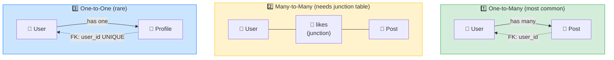

# 🔗 Database Relationships — Complete Study Notes

> Notes for becoming a strong software engineer. Easy language, real code, and interview-ready explanations.
> This is where SQL gets powerful — connecting tables to model real-world relationships.

---

## 📌 1. Why Relationships Matter

Real data is **connected**. A user *has many* posts. A post *has many* comments. A user *can like* many posts. We don't shove everything into one giant table — we keep data in separate tables and **link them with foreign keys**.

> Analogy 🏢: think of a company. Employees, departments, and projects are kept in **separate files**, not one giant document. A small reference — "Employee 12 → Department D-5" — connects them. That reference is the **foreign key**, and it's what makes the data *relational*.

**Why not just one big table?** Because duplicating data causes **update anomalies** — if a user's name lived inside every one of their posts, changing the name would mean updating hundreds of rows, and one missed row = inconsistent data. Relationships keep each fact in **one place** (single source of truth) — this is **normalisation**.

> 🎯 Interview line: *"Relationships model real-world connections using foreign keys, so each fact is stored once and referenced rather than duplicated. That keeps data consistent and avoids update anomalies."*

---

## 🧭 2. The Three Relationship Types (overview)



| Type | Example | Where the FK goes |
|---|---|---|
| **One-to-Many** | One user → many posts | On the **"many"** side (`posts.user_id`) |
| **Many-to-Many** | Users ↔ liked posts | In a separate **junction table** |
| **One-to-One** | One user → one profile | On either side, with a **`UNIQUE`** constraint |

---

## 1️⃣ 3. One-to-Many (the most common)

One user has many posts; each post belongs to exactly one user. **The "many" side stores the foreign key.**

```sql
CREATE TABLE posts (
    id         SERIAL PRIMARY KEY,
    user_id    INTEGER NOT NULL REFERENCES users(id),  -- 🔗 the foreign key
    title      VARCHAR(200) NOT NULL,
    content    TEXT,
    created_at TIMESTAMPTZ DEFAULT NOW()
);
```

`user_id REFERENCES users(id)` is the foreign key. It enforces **referential integrity** — you **cannot** insert a post with `user_id = 999` if user 999 doesn't exist.

```sql
INSERT INTO posts (user_id, title) VALUES (1, 'My first post');   -- ✅ user 1 exists
INSERT INTO posts (user_id, title) VALUES (999, 'Ghost post');    -- ❌ rejected!
```

> 💡 Memory hook: *"The many side carries the key."* A post can only have one owner, so storing one `user_id` per post is natural. (You'd never store a list of post-ids inside the user row — that breaks normalisation.)

> 🎯 Interview line: *"In a one-to-many, the foreign key lives on the many side. A post stores its single `user_id`; the database rejects any post referencing a non-existent user."*

---

## 2️⃣ 4. Many-to-Many (needs a junction table)

A user can like many posts; a post can be liked by many users. Neither side can store the other in a single column — so we use a **third table** that sits in the middle, called a **junction table** (also: join / link / bridge / pivot table).

```sql
CREATE TABLE likes (
    user_id    INTEGER REFERENCES users(id),
    post_id    INTEGER REFERENCES posts(id),
    created_at TIMESTAMPTZ DEFAULT NOW(),
    PRIMARY KEY (user_id, post_id)   -- composite key: prevents duplicate likes
);
```

Each row in `likes` represents **one connection**: "this user liked that post."

```
users          likes (junction)           posts
┌────┐         ┌─────────┬─────────┐       ┌────┐
│ 1  │◀────────│ user_id │ post_id │──────▶│ 10 │
│ 2  │◀───┐    │   1     │   10    │   ┌──▶│ 11 │
└────┘    │    │   1     │   11    │───┘   └────┘
          └────│   2     │   10    │
               └─────────┴─────────┘
```

### The composite primary key

`PRIMARY KEY (user_id, post_id)` makes the **pair** unique. This is clever:
- A user **can't like the same post twice** (the pair would repeat → rejected).
- A user **can** like many different posts; a post **can** be liked by many users. ✅

> 🎯 Interview line: *"Many-to-many needs a junction table holding the two foreign keys. I make the pair a composite primary key so each relationship is unique — that's what stops a user liking the same post twice."*

> 💡 Junction tables can carry extra data too — e.g. a `role` column in a `user_projects` table, or a `quantity` in an `order_items` table. They're not always just two keys.

---

## 3️⃣ 5. One-to-One (rare)

One user has exactly one profile. Modelled by putting the foreign key on either side **with a `UNIQUE` constraint**.

```sql
CREATE TABLE profiles (
    id         SERIAL PRIMARY KEY,
    user_id    INTEGER NOT NULL UNIQUE REFERENCES users(id),  -- UNIQUE = 1-to-1
    bio        TEXT,
    avatar_url VARCHAR(500)
);
```

The **`UNIQUE` on `user_id`** is the whole trick. Without it, one user could have many profile rows (a one-to-many). Adding `UNIQUE` says *"each user appears at most once here"* → making it one-to-one.

> 💡 Why split into a separate table at all? Usually to keep a big/optional/rarely-used chunk of data out of the main table — e.g. heavy profile fields, or sensitive data kept separate. Otherwise you'd just add the columns directly to `users`.

> 🎯 Interview line: *"One-to-one is just a foreign key plus a UNIQUE constraint. The UNIQUE is what turns a potential one-to-many into a one-to-one."*

---

## 💥 6. ON DELETE Behaviour (what happens to children?)

If you delete a user, what should happen to their posts? **You decide** when defining the foreign key. This is a favourite interview topic.

```sql
-- Delete the posts too (cascade the deletion down)
user_id INTEGER REFERENCES users(id) ON DELETE CASCADE

-- Keep the posts but unlink them (set the FK to NULL)
user_id INTEGER REFERENCES users(id) ON DELETE SET NULL

-- Block the user deletion entirely while posts exist
user_id INTEGER REFERENCES users(id) ON DELETE RESTRICT
```

| Option | What happens | Use for | Real example |
|---|---|---|---|
| **`CASCADE`** | Children deleted with the parent | **Owned** data | Delete user → delete their posts, likes, profile |
| **`SET NULL`** | Children kept, FK becomes NULL (must be nullable) | **Associated** data | Delete a salesperson → orders stay, just unassigned |
| **`RESTRICT`** | Deletion blocked if children exist | **Protect** against data loss | Can't delete a category that still has products |

> ⚠️ **Be careful with CASCADE** — it can delete more than you expect, chaining through multiple tables. Powerful but easy to cause surprise data loss. Many teams prefer **soft deletes** (a `deleted_at` flag, from the CRUD notes) over hard `CASCADE` for exactly this reason.

> 🎯 Interview line: *"ON DELETE decides the fate of child rows. CASCADE for owned data like a user's posts, SET NULL for loosely associated data like an order's salesperson, and RESTRICT to prevent accidental deletion when dependents exist."*

---

## 💻 7. Practical Example — Full Schema

A mini social-media schema tying all three relationships together.

```sql
-- Parent table
CREATE TABLE users (
    id    SERIAL PRIMARY KEY,
    email VARCHAR(255) NOT NULL UNIQUE,
    name  VARCHAR(100) NOT NULL
);

-- 1-to-1: each user has one profile
CREATE TABLE profiles (
    id         SERIAL PRIMARY KEY,
    user_id    INTEGER NOT NULL UNIQUE REFERENCES users(id) ON DELETE CASCADE,
    bio        TEXT,
    avatar_url VARCHAR(500)
);

-- 1-to-many: a user has many posts
CREATE TABLE posts (
    id         SERIAL PRIMARY KEY,
    user_id    INTEGER NOT NULL REFERENCES users(id) ON DELETE CASCADE,
    title      VARCHAR(200) NOT NULL,
    content    TEXT,
    created_at TIMESTAMPTZ DEFAULT NOW()
);

-- many-to-many: users like posts (junction table)
CREATE TABLE likes (
    user_id    INTEGER REFERENCES users(id) ON DELETE CASCADE,
    post_id    INTEGER REFERENCES posts(id) ON DELETE CASCADE,
    created_at TIMESTAMPTZ DEFAULT NOW(),
    PRIMARY KEY (user_id, post_id)
);

-- Try it out:
INSERT INTO users (email, name) VALUES ('nayan@x.com', 'Nayan');     -- id 1
INSERT INTO profiles (user_id, bio) VALUES (1, 'Frontend engineer');
INSERT INTO posts (user_id, title) VALUES (1, 'Learning SQL relationships');
INSERT INTO likes (user_id, post_id) VALUES (1, 1);

-- This duplicate like is REJECTED by the composite primary key:
INSERT INTO likes (user_id, post_id) VALUES (1, 1);   -- ❌ duplicate key error

-- Deleting user 1 cascades: their profile, posts, and likes all go too.
DELETE FROM users WHERE id = 1;
```

---

## 🎤 8. How to Explain in an Interview

**Step 1 — Why relationships:**
> "Real data is connected. We model connections with foreign keys so each fact lives once and stays consistent, instead of duplicating data across tables."

**Step 2 — One-to-many:**
> "The most common type. The foreign key goes on the many side — a post stores its single user_id."

**Step 3 — Many-to-many:**
> "Needs a junction table holding both foreign keys. I make the pair a composite primary key so each link is unique and duplicates are impossible."

**Step 4 — One-to-one:**
> "A foreign key with a UNIQUE constraint — the UNIQUE is what makes it one-to-one instead of one-to-many."

**Step 5 — ON DELETE:**
> "I choose ON DELETE deliberately: CASCADE for owned data, SET NULL for associated data, RESTRICT to prevent accidental loss."

> 🟢 Trap question: *"How do you stop a user from liking a post twice?"* → *"A composite primary key on (user_id, post_id) in the junction table — the database rejects any duplicate pair, so uniqueness is enforced at the data layer, not just in app code."*

> 🟢 Trap question: *"Where does the foreign key go in a one-to-many?"* → *"On the many side — the child references the parent. A user doesn't store a list of post ids; each post stores its one user_id."*

---

## 💎 9. Impressive Words & Phrases

| Instead of saying... | Say this 💪 |
|---|---|
| "Tables are linked" | "Tables are **related via foreign keys**" |
| "The middle table" | "A **junction / join / bridge table**" |
| "Key made of two columns" | "A **composite primary key**" |
| "Stops bad references" | "Enforces **referential integrity**" |
| "Delete the linked rows" | "**Cascade** the delete (`ON DELETE CASCADE`)" |
| "Don't repeat data" | "**Normalise** to avoid **update anomalies**" |
| "The one and the many" | "The **parent** and **child** tables" |
| "Make it one-to-one" | "Enforce uniqueness with a **`UNIQUE` constraint**" |
| "Connection between rows" | "An **association / relationship**" |
| "Stop deletion if used" | "**Restrict** deletion to protect dependents" |

**Power vocabulary:** *foreign key, referential integrity, one-to-many, many-to-many, one-to-one, junction/bridge table, composite primary key, cardinality, parent/child, cascade, normalisation, update anomaly, single source of truth.*

> 🌶️ Bonus flex — **cardinality:** *"Cardinality describes how many rows on one side relate to the other — one-to-one, one-to-many, or many-to-many. Choosing the right cardinality is the core of good schema design."* This word instantly signals data-modelling maturity.

---

## ⏱️ 10. Quick Revision (read 5 min before interview)

> **Why:** model real connections with **foreign keys** → each fact stored once → consistent data (**normalisation**).
>
> **Three types:**
> - **One-to-Many** (most common) → FK on the **many** side (`posts.user_id`). *Many carries the key.*
> - **Many-to-Many** → a **junction table** with both FKs + a **composite primary key** `(user_id, post_id)` to stop duplicates.
> - **One-to-One** (rare) → FK + **`UNIQUE`** constraint (the UNIQUE makes it 1-to-1).
>
> **ON DELETE:**
> - **CASCADE** → delete children too (owned data, e.g. user's posts).
> - **SET NULL** → keep children, unlink (associated data, e.g. order's salesperson).
> - **RESTRICT** → block deletion while children exist (prevent data loss).
>
> **Golden line:** *"The many side carries the foreign key; many-to-many needs a junction table with a composite key; one-to-one is just a foreign key plus UNIQUE."*

---

### ✅ Practice checklist
- [ ] Create a one-to-many: `posts.user_id REFERENCES users(id)`
- [ ] Try inserting a post with a non-existent `user_id` → see it rejected
- [ ] Build a many-to-many `likes` junction table with a composite PK
- [ ] Try liking the same post twice → see the duplicate rejected
- [ ] Build a one-to-one `profiles` table using `UNIQUE` on `user_id`
- [ ] Add `ON DELETE CASCADE` and watch a user delete remove their posts
- [ ] Compare with `ON DELETE RESTRICT` (deletion blocked) and `SET NULL`

Nail relationships and you can design clean, consistent schemas for any real-world app — the foundation for JOINs, which come next. 🚀
