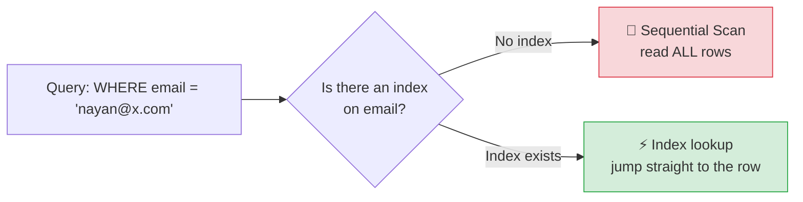

# ⚡ Indexes (Basics) — Complete Study Notes

> Notes for becoming a strong software engineer. Easy language, real code, and interview-ready explanations.
> This is the **foundation-level** mental model. The advanced deep-dive (B-tree/GIN/BRIN, composite, partial, covering indexes) is a separate, later note.

---

## 📌 1. What is an Index? (the one mental model that matters)

An **index** is a **separate data structure** that lets the database find rows **fast** — without reading every single row.

> 📖 The classic analogy: a textbook.
> - **No index** → you want the topic "photosynthesis", so you read **every page** from page 1 until you find it. Slow. 🐢
> - **With an index** → flip to the back, look up "P → photosynthesis → page 247", jump straight there. Fast. ⚡

A database without an index does the same thing — it **reads every row** to find what you want (a **sequential scan**, or "Seq Scan"). On a table with a million rows, that's a million rows read just to find one. An index lets it **jump straight to the answer**.

> 🎯 Interview line: *"An index is a separate sorted structure that lets the database locate rows quickly instead of scanning the whole table — exactly like the index at the back of a book versus reading every page."*



---

## 🛠️ 2. How to Create an Index

```sql
CREATE INDEX idx_posts_user_id ON posts(user_id);
CREATE INDEX idx_users_email   ON users(email);
```

The naming pattern `idx_<table>_<column>` is a common convention — it keeps index names readable and predictable.

> 💡 The **primary key** column is **automatically indexed** — Postgres does this for you. So you never need to add an index on `id`; it's already there.

---

## ✅ 3. When to Add an Index

Add an index on:

1. **Columns you frequently filter on** — anything in a `WHERE column = X`.
2. **Columns you join on** — especially **foreign key columns** (these are joined constantly but, unlike primary keys, are **not** auto-indexed!).

```sql
-- You often run: SELECT * FROM posts WHERE user_id = 5;
CREATE INDEX idx_posts_user_id ON posts(user_id);   -- ✅ speeds up the filter + joins

-- You often run: SELECT * FROM users WHERE email = '...';
CREATE INDEX idx_users_email ON users(email);        -- ✅ speeds up login lookups
```

> ⭐ **Most important beginner rule:** *index every foreign key column.* Postgres auto-indexes primary keys but **NOT** foreign keys — yet foreign keys are exactly what you join on. Forgetting this is one of the most common causes of slow queries. (Connects to the JOINs and relationships notes.)

> 🎯 Interview line: *"I add indexes on columns I filter or join by — and importantly on every foreign key, because Postgres indexes primary keys automatically but not foreign keys, and those are what most joins use."*

---

## ⚠️ 4. When Indexes Hurt (the trade-off)

Indexes are not free. **They speed up reads but slow down writes.**

Every time you `INSERT`, `UPDATE`, or `DELETE`, the database must also **update every index** on that table to keep them current. More indexes = more work per write. Indexes also take up **extra disk space**.

```
Read  (SELECT ... WHERE indexed_col):   ⚡ much faster
Write (INSERT / UPDATE / DELETE):       🐢 slightly slower (must update indexes)
Disk:                                   📦 extra space used
```

So the rule is **balance, not "index everything."**

> ⚠️ **Don't index every column.** An index on a column you never query is pure cost — it slows writes and wastes space for zero benefit. Index the columns you **actually query by**.

> 🎯 Interview line: *"Indexes trade write speed and disk for read speed. So I don't index everything — I index the columns I actually filter or join on, and skip the rest."*

---

## 🧭 5. The Basic Rule (for now)

> **Add an index on every foreign key column, and every column you frequently filter by. Nothing more, for now.**

That single rule will fix the vast majority of beginner performance problems. The deeper details — *composite* indexes (multiple columns), *partial* indexes (only some rows), *covering* indexes, and *why an index sometimes isn't used* — are a separate advanced topic.

---

## 💻 6. Practical Example

```sql
-- Tables (foreign key on posts.user_id)
CREATE TABLE users (
    id    SERIAL PRIMARY KEY,           -- auto-indexed
    email VARCHAR(255) NOT NULL UNIQUE  -- UNIQUE also creates an index!
);

CREATE TABLE posts (
    id      SERIAL PRIMARY KEY,         -- auto-indexed
    user_id INTEGER NOT NULL REFERENCES users(id),  -- FK → NOT auto-indexed!
    title   VARCHAR(200) NOT NULL
);

-- Add the index the FK is missing:
CREATE INDEX idx_posts_user_id ON posts(user_id);

-- See the difference yourself with EXPLAIN ANALYZE:
EXPLAIN ANALYZE SELECT * FROM posts WHERE user_id = 5;
-- Before the index → "Seq Scan"  (reads all rows)
-- After the index  → "Index Scan" (jumps straight to matching rows)
```

> 💡 Two freebies worth knowing: a **`UNIQUE` constraint** automatically creates an index (so `email` above is already fast to look up), and so does the **`PRIMARY KEY`**. You only manually add indexes for the *other* columns you query.

> 🔎 `EXPLAIN ANALYZE` shows how the database actually runs a query. Look for **`Seq Scan`** (reading everything — slow on big tables) vs **`Index Scan`** (using an index — fast). It's the tool that tells you whether your index is actually helping.

---

## 🎤 7. How to Explain in an Interview

**Step 1 — What it is:**
> "An index is a separate structure that lets the database find rows fast, like a book's index versus reading every page. Without one, it does a sequential scan over the whole table."

**Step 2 — When to add:**
> "I index columns I filter on in WHERE clauses and columns I join on — especially foreign keys, since Postgres auto-indexes primary keys but not foreign keys."

**Step 3 — The trade-off:**
> "Indexes speed up reads but slow writes, because every insert and update must also update the indexes, and they use extra disk. So I don't index everything — only the columns I actually query."

**Step 4 — How to verify:**
> "I confirm an index is being used with EXPLAIN ANALYZE — looking for an Index Scan instead of a Seq Scan."

> 🟢 Trap question: *"Should you index every column to be safe?"* → *"No — each index slows down writes and uses disk. An index on a column you never query is pure cost. I index based on real query patterns, not 'just in case'."*

---

## 💎 8. Impressive Words & Phrases

| Instead of saying... | Say this 💪 |
|---|---|
| "Reads every row" | "Performs a **sequential scan** (Seq Scan)" |
| "Uses the index" | "Performs an **index scan**" |
| "Find rows fast" | "**Look up** rows via the index" |
| "Index on a foreign key" | "Index the **foreign key column** (not auto-indexed)" |
| "Slows down inserts" | "Adds **write overhead** to keep indexes current" |
| "Don't over-index" | "Avoid **redundant indexes** that only cost writes" |
| "Check how it runs" | "Inspect the **query plan** with **EXPLAIN ANALYZE**" |
| "Reads vs writes balance" | "The **read/write trade-off**" |

**Power vocabulary:** *index, sequential scan, index scan, query plan, EXPLAIN ANALYZE, write overhead, read/write trade-off, foreign key indexing, auto-indexed primary key.*

> 🌶️ Bonus flex — **"index for your read patterns":** *"I design indexes around the queries the app actually runs, then verify with EXPLAIN ANALYZE — rather than guessing or indexing everything."* This shows you tune with evidence, not by habit.

---

## ⏱️ 9. Quick Revision (read 5 min before interview)

> **Index = a book's index for your table** → find rows fast instead of scanning every row (a **Seq Scan**).
>
> **Create:** `CREATE INDEX idx_table_column ON table(column);`
>
> **When to add:** columns in `WHERE`, columns you **JOIN** on — **especially every foreign key** (PKs are auto-indexed, FKs are NOT). `UNIQUE` and `PRIMARY KEY` already create indexes for free.
>
> **Cost:** indexes speed **reads** but slow **writes** (every insert/update updates the index) + use disk. **Don't index every column.**
>
> **Verify:** `EXPLAIN ANALYZE` → look for **Index Scan** (good) vs **Seq Scan** (slow on big tables).
>
> **Basic rule for now:** *index every foreign key + every frequently-filtered column.*
>
> **Golden line:** *"An index is a sorted shortcut into the table — add one on foreign keys and frequently-filtered columns, but not everything, because every index taxes your writes."*

---

### ✅ Practice checklist
- [ ] Create `users` and `posts` with a foreign key `posts.user_id`
- [ ] Run `EXPLAIN ANALYZE SELECT * FROM posts WHERE user_id = 5` → note **Seq Scan**
- [ ] Add `CREATE INDEX idx_posts_user_id ON posts(user_id)`
- [ ] Rerun the query → confirm it's now an **Index Scan**
- [ ] Notice the primary key needed no index (auto-indexed)
- [ ] Notice a `UNIQUE` column (like email) is already indexed
- [ ] Explain out loud why you shouldn't index every column

---

### 👉 Next level
Once this mental model is solid, the **advanced indexes** topic goes deeper: the index *types* (B-tree, Hash, GIN, BRIN), **composite indexes** and the leftmost-prefix rule, **partial** and **covering** indexes, and **why an index sometimes isn't used**. This basic rule — *index foreign keys and frequently-filtered columns* — is enough to carry you until then. 🚀
