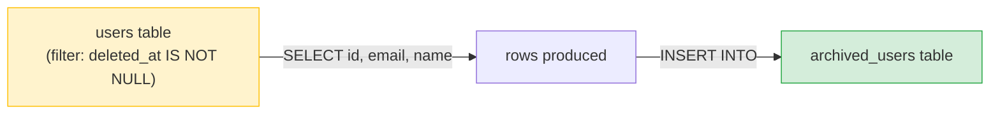

# 🔁 INSERT...SELECT and UPDATE...FROM — Complete Study Notes

> Notes for becoming a strong software engineer. Easy language, real code, and interview-ready explanations.
> Two practical production patterns: moving data between tables, and updating one table using another.

---

## 📌 1. The Big Idea

So far, `INSERT` took hard-coded `VALUES` and `UPDATE` set fixed values. But in real production work, you often need to:
1. **Copy rows from one table into another** → `INSERT ... SELECT`
2. **Update a table using data from another table** → `UPDATE ... FROM` (or an update with a subquery)

These run **entirely inside the database** — no fetching rows into your app, looping, and writing them back. That makes them **far faster** for bulk work.

> Analogy 📦: imagine moving books between two shelves. The slow way is carrying them one-by-one to your desk, checking each, then walking each to the new shelf (fetch into app → loop → write back). The fast way is sliding a whole row of books straight across in one motion (`INSERT...SELECT` does it all inside the DB). One trip, not a thousand.

> 🎯 Interview line: *"INSERT...SELECT and UPDATE...FROM let the database do bulk copies and cross-table updates in a single statement, instead of pulling rows into application code and looping — which is much faster and avoids N+1-style round trips."*

---

## 📥 2. INSERT...SELECT — Copy Data Between Tables

Instead of `INSERT ... VALUES (...)`, you feed the `INSERT` with the **result of a SELECT**. Every row the SELECT returns gets inserted.

```sql
-- Copy soft-deleted users into an archive table
INSERT INTO archived_users (id, email, name)
SELECT id, email, name
FROM users
WHERE deleted_at IS NOT NULL;
```

**How it reads:** *"Take every soft-deleted user's id/email/name, and insert those into `archived_users`."*



> ⚠️ **Column order matters.** The SELECT's columns must line up with the INSERT's column list, **in the same order** — `(id, email, name)` maps to `SELECT id, email, name`. Mismatched order = wrong data in wrong columns (and often a type error).

### Common real-world uses
- **Archiving** old/deleted rows to a separate table before cleanup.
- **Seeding** a new table from existing data (e.g. building a summary table).
- **Backfilling** a new table during a migration.
- **Bulk copy** with transformation:
  ```sql
  INSERT INTO user_summary (user_id, email_domain)
  SELECT id, SPLIT_PART(email, '@', 2)   -- transform while copying
  FROM users;
  ```

> 🎯 Interview line: *"INSERT...SELECT is my go-to for archiving, seeding, and backfilling tables — I can even transform the data in the SELECT as it's copied, all in one statement."*

---

## ✏️ 3. UPDATE...FROM — Update Using Another Table

Update a table's columns based on data computed from **another table**. Two common forms:

### Form A — UPDATE with a correlated subquery (portable, standard SQL)

```sql
-- Set each user's post_count to their actual number of posts
UPDATE users
SET post_count = (
    SELECT COUNT(*) FROM posts WHERE posts.user_id = users.id
);
```

For each user row, the subquery counts that user's posts and writes it in. (This is the **denormalisation sync** pattern from the design notes — keeping a cached count accurate.)

### Form B — UPDATE...FROM (Postgres-specific, often cleaner & faster)

```sql
-- Same result, using a join-style update
UPDATE users u
SET post_count = pc.cnt
FROM (
    SELECT user_id, COUNT(*) AS cnt
    FROM posts
    GROUP BY user_id
) pc
WHERE u.id = pc.user_id;
```

`UPDATE...FROM` lets you **join** the target table to another (or a derived table) and pull values across. Postgres runs this efficiently as a set-based join.


> ⚠️ **The WHERE in UPDATE...FROM is critical.** The `WHERE u.id = pc.user_id` is the **join condition**. Forget it, and every user row gets matched to every count row (a cartesian product) → garbage data across the whole table. Always include the matching condition.

> 💡 Subtle gap between the two forms: with the **subquery** form (A), a user with **zero** posts gets `COUNT(*) = 0`. With the **UPDATE...FROM** form (B), a user with no posts has **no matching row** in `pc`, so they're **skipped** (left unchanged). If you need zeros, the subquery form or a LEFT JOIN handles it better.

> 🎯 Interview line: *"To update one table from another I use UPDATE...FROM in Postgres — it joins to a derived table and updates in one set-based pass. The key is the join condition in WHERE; without it you get a cartesian product."*

---

## 🛡️ 4. Safety First (these touch many rows!)

Both patterns can modify **huge numbers of rows** at once. The same discipline from the CRUD notes applies, doubled:

1. **SELECT first.** Before an `INSERT...SELECT`, run the SELECT alone to see exactly what you're copying. Before an `UPDATE`, preview the rows and counts.
2. **Wrap in a transaction.** So you can `ROLLBACK` if the affected count looks wrong.
   ```sql
   BEGIN;
   UPDATE users SET post_count = (SELECT COUNT(*) FROM posts WHERE posts.user_id = users.id);
   -- check: does the row count / sample look right?
   COMMIT;   -- or ROLLBACK; if something's off
   ```
3. **Mind duplicates on re-run.** Running an `INSERT...SELECT` twice can create **duplicate rows**. Guard with `ON CONFLICT DO NOTHING` (Postgres) or a `WHERE NOT EXISTS` to make it safe to re-run (**idempotent**).
   ```sql
   INSERT INTO archived_users (id, email, name)
   SELECT id, email, name FROM users WHERE deleted_at IS NOT NULL
   ON CONFLICT (id) DO NOTHING;   -- skip rows already archived
   ```

> 🎯 Interview line: *"Because these touch many rows, I preview with a SELECT, wrap in a transaction so I can roll back, and make inserts idempotent with ON CONFLICT so re-running doesn't create duplicates."*

---

## 💻 5. Practical Examples (put together)

```sql
-- 1. Archive deleted users, safely re-runnable
INSERT INTO archived_users (id, email, name)
SELECT id, email, name FROM users WHERE deleted_at IS NOT NULL
ON CONFLICT (id) DO NOTHING;

-- 2. Backfill a denormalised counter (sync post_count)
UPDATE users u
SET post_count = COALESCE(pc.cnt, 0)        -- COALESCE → zero for users with no posts
FROM (SELECT user_id, COUNT(*) AS cnt FROM posts GROUP BY user_id) pc
WHERE u.id = pc.user_id;

-- 3. Build a summary table from scratch
INSERT INTO daily_signups (signup_date, total)
SELECT DATE(created_at) AS signup_date, COUNT(*) AS total
FROM users
GROUP BY DATE(created_at);

-- 4. Mark inactive users based on another table (no recent posts)
UPDATE users
SET is_active = false
WHERE id NOT IN (
    SELECT DISTINCT user_id FROM posts
    WHERE created_at > NOW() - INTERVAL '90 days'
    AND user_id IS NOT NULL          -- guard NOT IN against NULLs!
);
```

> 💡 Notice these reuse everything from earlier notes: `WHERE`, `GROUP BY`, `COUNT`, `COALESCE`, the `NOT IN`+NULL guard, transactions. These two patterns are really just **combining the pieces you already know** to move and sync data efficiently.

---

## 🎤 6. How to Explain in an Interview

**Step 1 — What they're for:**
> "INSERT...SELECT copies rows from one table to another; UPDATE...FROM updates a table using data from another. Both run set-based inside the database, so they're much faster than looping in app code."

**Step 2 — INSERT...SELECT:**
> "I feed an INSERT with a SELECT's result — great for archiving, seeding, or backfilling, and I can transform the data in the SELECT as it copies. Column order must match."

**Step 3 — UPDATE...FROM:**
> "I update by joining the target to a derived table. The join condition in WHERE is essential — without it you get a cartesian product."

**Step 4 — Safety:**
> "Since these hit many rows, I preview with a SELECT, wrap in a transaction to allow rollback, and use ON CONFLICT to keep inserts idempotent."

> 🟢 Trap question: *"Why do this in SQL instead of fetching rows and looping in Node?"* → *"Looping means thousands of round trips between app and DB — slow and N+1-prone. A single set-based statement lets the database do it all at once, ordered and optimised, in one transaction."*

> 🟢 Trap question: *"Your UPDATE...FROM left some rows unchanged — why?"* → *"Probably users with no matching row in the source — UPDATE...FROM only touches matched rows. For users with zero posts I'd use COALESCE or a LEFT JOIN to set them to 0."*

---

## 💎 7. Impressive Words & Phrases

| Instead of saying... | Say this 💪 |
|---|---|
| "Copy rows over" | "**Bulk copy** with `INSERT...SELECT`" |
| "Update from another table" | "A **cross-table / join-based update**" |
| "Do it in one query" | "A **set-based** operation (not row-by-row)" |
| "Loop in code is slow" | "Avoid **row-by-row (RBAR)** processing and round trips" |
| "Safe to run twice" | "**Idempotent** (via `ON CONFLICT DO NOTHING`)" |
| "Move old data away" | "**Archive** / **backfill** the table" |
| "Subquery inside FROM" | "A **derived table** joined in the update" |
| "Forgot the match → mess" | "A missing join condition → **cartesian product**" |
| "Fill in defaults for nulls" | "**`COALESCE`** to a default" |

**Power vocabulary:** *set-based operation, bulk copy, backfill, archive, derived table, cross-table update, idempotent, ON CONFLICT (upsert), cartesian product, row-by-row (RBAR), COALESCE.*

> 🌶️ Bonus flex — **set-based thinking:** *"SQL is at its best when you think in sets, not loops. A single INSERT...SELECT or UPDATE...FROM replaces an entire app-side loop — the database processes the whole set at once, which is dramatically faster."* This phrase signals you think in SQL's native style, not procedurally.

---

## ⏱️ 8. Quick Revision (read 5 min before interview)

> **Two production patterns, both run inside the DB (set-based, fast):**
>
> **INSERT...SELECT** → copy rows table-to-table. Column order must match. Uses: **archive, seed, backfill**, copy-with-transform. Make it re-runnable with `ON CONFLICT DO NOTHING`.
> ```sql
> INSERT INTO archive (id, email) SELECT id, email FROM users WHERE deleted_at IS NOT NULL;
> ```
>
> **UPDATE...FROM** (or UPDATE + subquery) → update a table using another. The **join condition in WHERE is critical** (miss it → cartesian product). Unmatched rows are skipped → use `COALESCE`/LEFT JOIN for zeros.
> ```sql
> UPDATE users u SET post_count = pc.cnt
> FROM (SELECT user_id, COUNT(*) cnt FROM posts GROUP BY user_id) pc
> WHERE u.id = pc.user_id;
> ```
>
> **Safety:** SELECT first → wrap in a **transaction** (`BEGIN`/`COMMIT`/`ROLLBACK`) → make inserts **idempotent**.
>
> **Golden line:** *"Think in sets, not loops — one INSERT...SELECT or UPDATE...FROM does inside the database what would otherwise be a slow app-side loop, and I wrap it in a transaction for safety."*

---

### ✅ Practice checklist
- [ ] Copy filtered rows with `INSERT...SELECT` into an archive table
- [ ] Run the SELECT alone first to preview what you'll copy
- [ ] Add `ON CONFLICT DO NOTHING` and run it twice → confirm no duplicates
- [ ] Sync a `post_count` with `UPDATE...FROM` joining a grouped subquery
- [ ] Use `COALESCE` so users with zero posts get 0, not skipped
- [ ] Wrap an UPDATE in `BEGIN ... COMMIT` and practise `ROLLBACK`
- [ ] Explain out loud why set-based beats looping in app code

These two patterns turn slow app-side loops into single fast statements — a real mark of someone who writes production-grade SQL. 🚀
