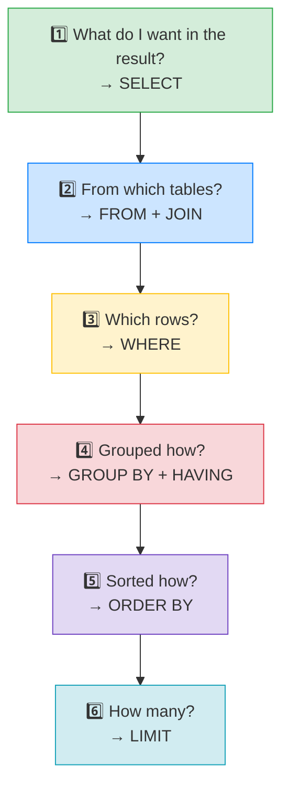

# 🛠️ Practical SQL Skills — Building Complex Queries — Complete Study Notes

> Notes for becoming a strong software engineer. Easy language, real code, and interview-ready explanations.
> The capstone: a repeatable *method* for combining everything you've learned into any query.

---

## 📌 1. The Big Idea

By now you have all the pieces — `SELECT`, `JOIN`, `WHERE`, `GROUP BY`, `HAVING`, `ORDER BY`, `LIMIT`. A complex query isn't a new skill; it's just **combining the pieces in the right order**.

The secret is: **don't write a query top-to-bottom in one go.** Build it **outside-in** — decide *what you want* first, then work out how to get it. This turns a scary 7-line query into six small, easy decisions.

> Analogy 🍳: building a query is like ordering at a restaurant. First you decide *what dish you want* (the result), then *which kitchen makes it* (the tables), then *any special requests* (filters), then *how it's plated* (sorting), and *how many portions* (limit). You don't start by randomly picking ingredients — you start from the dish you want.

> 🎯 Interview line: *"I build queries outside-in — I decide what I want in the result first, then which tables provide it, then filter, group, sort, and limit. Breaking it into those steps makes even a complex query straightforward."*

---

## 🪜 2. The 6-Step Method (build from outside in)



| Step | Question | SQL clause |
|---|---|---|
| 1 | What do I want in the result? | `SELECT` |
| 2 | From which tables? | `FROM` + `JOIN` |
| 3 | Which rows? | `WHERE` |
| 4 | Grouped how? | `GROUP BY` + `HAVING` |
| 5 | Sorted how? | `ORDER BY` |
| 6 | How many? | `LIMIT` |

> 💡 Notice this is *almost* the **execution order** from the aggregations notes (`FROM → WHERE → GROUP BY → HAVING → SELECT → ORDER BY → LIMIT`). Thinking in this order keeps you out of the classic alias and aggregate-filtering traps.

---

## 🧩 3. Worked Example #1 — Top 5 Most-Active Users This Month

**The request:** *"Show me the top 5 most-active users this month, including their post count."*

Walk the 6 steps out loud:

| Step | Decision |
|---|---|
| 1️⃣ What I want | user name + count of recent posts |
| 2️⃣ Tables | `users`, `posts` (joined on user_id) |
| 3️⃣ Which rows | posts from the last 30 days |
| 4️⃣ Grouped | per user |
| 5️⃣ Sorted | most posts first |
| 6️⃣ How many | top 5 |

Now each decision becomes one clause:

```sql
SELECT u.name, COUNT(p.id) AS post_count          -- 1️⃣ what I want
FROM users u                                       -- 2️⃣ tables...
INNER JOIN posts p ON u.id = p.user_id             --    ...joined
WHERE p.created_at > NOW() - INTERVAL '30 days'    -- 3️⃣ which rows
GROUP BY u.id, u.name                              -- 4️⃣ grouped per user
ORDER BY post_count DESC                           -- 5️⃣ sorted, most first
LIMIT 5;                                           -- 6️⃣ how many
```

See how each of the six decisions maps to exactly one clause? That's the whole method.

> 💡 `NOW() - INTERVAL '30 days'` is the Postgres way to say "30 days ago." Filtering `created_at > that` gives only recent rows.

---

## 🧩 4. Worked Example #2 — Posts with Lots of Engagement

**The request:** *"Find posts with more than 10 comments, showing the post title, author, and comment count — most-commented first, top 20."*

| Step | Decision |
|---|---|
| 1️⃣ What I want | post title, author name, comment count |
| 2️⃣ Tables | `posts`, `users` (author), `comments` |
| 3️⃣ Which rows | (no row filter needed here) |
| 4️⃣ Grouped | per post, **HAVING** count > 10 |
| 5️⃣ Sorted | most comments first |
| 6️⃣ How many | top 20 |

```sql
SELECT p.title, u.name AS author, COUNT(c.id) AS comment_count
FROM posts p
INNER JOIN users u    ON p.user_id = u.id          -- author (always exists)
LEFT JOIN  comments c ON p.id = c.post_id           -- comments (may be many)
GROUP BY p.id, p.title, u.name
HAVING COUNT(c.id) > 10                             -- filter GROUPS (not rows!)
ORDER BY comment_count DESC
LIMIT 20;
```

**Key reasoning shown here:** the "more than 10 comments" filter is on a **count**, so it goes in `HAVING` (filters groups *after* aggregating), not `WHERE` (filters rows *before*). This is exactly the WHERE-vs-HAVING distinction from the aggregations notes — the 6-step method naturally guides you to the right one.

---

## 🧩 5. Worked Example #3 — Mixing a Filter and a Group Filter

**The request:** *"Among users who joined this year, show those who've written more than 3 posts."*

This needs **both** a row filter (joined this year) **and** a group filter (more than 3 posts):

```sql
SELECT u.name, COUNT(p.id) AS post_count
FROM users u
INNER JOIN posts p ON u.id = p.user_id
WHERE u.created_at >= '2026-01-01'      -- 3️⃣ WHERE: filter ROWS first (recent users)
GROUP BY u.id, u.name                   -- 4️⃣ group per user...
HAVING COUNT(p.id) > 3                   --    ...then filter GROUPS (prolific ones)
ORDER BY post_count DESC;
```

> 🎯 The mental split: **WHERE** decides *which rows go into the groups*; **HAVING** decides *which finished groups to keep*. Using both together is extremely common.

---

## 🎯 6. The Practice Mindset

This is **muscle memory** — it comes from doing, not reading. When you face any query:

1. **Read the request slowly** and underline the nouns (what data) and the conditions (filters, sorting, limits).
2. **Say the 6 steps out loud** before typing.
3. **Write it one clause at a time**, top of the method to bottom.
4. **Build incrementally** — run `SELECT ... FROM ... JOIN` first, check it works, *then* add `WHERE`, *then* `GROUP BY`, and so on. Don't write all 7 lines then debug a wall of red errors.

> 💡 Incremental building is a pro habit: get a small correct query working, then layer on complexity, re-running at each step. Far easier than debugging the whole thing at once.

---

## 🎤 7. How to Explain in an Interview

> ⭐ This topic is special — interviewers often **watch you build a query live**. Narrating your method is as valuable as the final SQL.

**Step 1 — State the method:**
> "I build queries outside-in: first what I want in the result, then the tables and joins, then the row filter, then grouping, sorting, and limit."

**Step 2 — Narrate while you write:**
> "So here I want the user name and a post count — that's my SELECT. The data's in users and posts, joined on user_id. I only want this month's posts, so a WHERE on created_at. I'm counting per user, so GROUP BY user. Most active first, so ORDER BY the count descending. And top 5, so LIMIT 5."

**Step 3 — Show the WHERE/HAVING judgement:**
> "If the filter is on a raw column I use WHERE; if it's on an aggregate like a count, it goes in HAVING because the count doesn't exist until after grouping."

**Step 4 — Mention incremental building:**
> "In practice I build it incrementally — get the join working first, then add each clause and re-run — rather than writing it all at once and debugging blind."

> 🟢 Trap question: *"This query is slow — what would you check?"* → *"First, EXPLAIN ANALYZE to see the plan. I'd look for Seq Scans on big tables and make sure the join and filter columns are indexed — especially the foreign keys. Then check whether I'm fetching more columns or rows than needed."* (Ties back to the indexes notes.)

---

## 💎 8. Impressive Words & Phrases

| Instead of saying... | Say this 💪 |
|---|---|
| "Build the query" | "**Compose** the query **outside-in**" |
| "Combine the tables" | "**Join** the relevant tables on their keys" |
| "Filter the rows" | "Apply the **WHERE predicate**" |
| "Filter the groups" | "Apply a **HAVING** filter on the aggregate" |
| "Build it bit by bit" | "**Incrementally compose** and verify each clause" |
| "Make it faster" | "Inspect the **query plan** and ensure **indexed join/filter columns**" |
| "The order it runs" | "The **logical execution order**" |
| "A reusable sub-result" | "A **CTE** (`WITH`) for readability" |
| "Count per group" | "**Aggregate** per group with GROUP BY" |
| "Recent rows only" | "A **time-window / date-range predicate**" |

**Power vocabulary:** *compose outside-in, query plan, logical execution order, predicate, aggregate filter (HAVING), incremental composition, CTE, time-window filter, indexed join columns, readability vs performance.*

> 🌶️ Bonus flex — **CTEs for readability:** *"For a genuinely complex query, I break it into CTEs with `WITH` — each named step does one thing, so the query reads top-to-bottom like a story instead of one giant nested statement."* Mentioning CTEs signals you write maintainable SQL, not just clever SQL.

```sql
-- Same logic as Example 1, but as a readable CTE:
WITH recent_posts AS (
    SELECT user_id, COUNT(*) AS post_count
    FROM posts
    WHERE created_at > NOW() - INTERVAL '30 days'
    GROUP BY user_id
)
SELECT u.name, rp.post_count
FROM recent_posts rp
JOIN users u ON u.id = rp.user_id
ORDER BY rp.post_count DESC
LIMIT 5;
```

---

## ⏱️ 9. Quick Revision (read 5 min before interview)

> **Build queries outside-in — 6 steps:**
> 1. What do I want? → **SELECT**
> 2. From which tables? → **FROM + JOIN**
> 3. Which rows? → **WHERE**
> 4. Grouped how? → **GROUP BY + HAVING**
> 5. Sorted how? → **ORDER BY**
> 6. How many? → **LIMIT**
>
> **WHERE vs HAVING:** raw-column filter → WHERE (before grouping); aggregate filter (like `COUNT > 10`) → HAVING (after grouping).
>
> **Build incrementally:** get `SELECT...FROM...JOIN` working, then add one clause at a time and re-run — don't write all 7 lines then debug.
>
> **Slow query?** → `EXPLAIN ANALYZE`, look for Seq Scans, index the join/filter columns (especially foreign keys).
>
> **Readability:** for complex logic, use **CTEs (`WITH`)** so it reads like steps.
>
> **Golden line:** *"I compose queries outside-in — result, tables, filter, group, sort, limit — and build them one clause at a time so each step is verified before I add the next."*

---

### ✅ Practice checklist
- [ ] Take a plain-English request and write the 6 steps before any SQL
- [ ] Build "top 5 active users this month" clause by clause
- [ ] Write a query needing **both** WHERE and HAVING
- [ ] Practise building incrementally — run after each clause
- [ ] Rewrite one complex query as a **CTE** with `WITH`
- [ ] On a slow query, run `EXPLAIN ANALYZE` and spot the Seq Scan
- [ ] Narrate your method **out loud** (interview rehearsal)

> 💪 This is muscle memory — the more real requests you translate into the 6 steps, the more automatic it becomes. Do a dozen and complex queries stop feeling complex. 🚀
