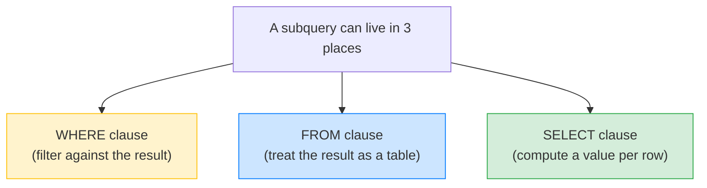

# 🪆 Subqueries (Basics) — Complete Study Notes

> Notes for becoming a strong software engineer. Easy language, real code, and interview-ready explanations.
> Foundation level: just know what subqueries are and where they go. CTEs (the cleaner version) come later.

---

## 📌 1. What is a Subquery? (in simple words)

A **subquery** is a **`SELECT` inside another query**. It's a query nested within a query — the inner one runs first, and its result is handed to the outer one.

> Analogy 🪆: think of Russian nesting dolls (matryoshka). The outer query is the big doll; the subquery is the smaller doll inside it. You open the outer to find the inner. Or simpler — it's like solving the **inner brackets first** in maths: `(3 + 2) × 4` → solve `(3 + 2)` first, then use that result. A subquery is the SQL version of "solve this part first, then use the answer."

> 🎯 Interview line: *"A subquery is a SELECT nested inside another query. The inner query runs first and produces a value or a set of rows, which the outer query then uses — like solving the inner brackets of an expression first."*

---

## 📍 2. Where Subqueries Can Go (three places)

A subquery can sit in three parts of a query. This is the main thing to remember at the foundation level.



### A) In `WHERE` — filter against the subquery's result

```sql
-- Users who have written at least one post
SELECT name FROM users
WHERE id IN (SELECT user_id FROM posts);
```
The inner query returns a list of `user_id`s that have posts; the outer keeps only users whose `id` is **in** that list.

### B) In `FROM` — treat the subquery's result as a temporary table

```sql
-- Average posts per user, computed from a per-user count
SELECT AVG(post_count) AS avg_posts
FROM (
    SELECT user_id, COUNT(*) AS post_count
    FROM posts
    GROUP BY user_id
) AS counts;     -- ⬅️ this inner result is used like a table (a "derived table")
```
A subquery in `FROM` is called a **derived table** — it must be given an alias (`AS counts` here).

### C) In `SELECT` — compute a value for each row

```sql
-- Each user with their total post count as a computed column
SELECT
    name,
    (SELECT COUNT(*) FROM posts WHERE posts.user_id = users.id) AS post_count
FROM users;
```
This is a **scalar subquery** — it returns a single value, used as a column.

> 🎯 Foundation rule: *subqueries can go in WHERE, FROM, or SELECT.* That's the key takeaway for now.

---

## 🔗 3. Two Flavours: Independent vs Correlated

A small but interview-worthy distinction:

| Type | Meaning | Example |
|---|---|---|
| **Non-correlated** (independent) | Inner query runs **once**, on its own, regardless of the outer | `WHERE id IN (SELECT user_id FROM posts)` |
| **Correlated** | Inner query **references the outer** and re-runs **per outer row** | `(SELECT COUNT(*) FROM posts WHERE posts.user_id = users.id)` |

- **Non-correlated** → independent; can be run by itself and gives the same result every time.
- **Correlated** → depends on the current outer row (notice `posts.user_id = users.id`). It conceptually re-evaluates for each outer row, which can be **slower** on large tables.

> 🎯 Interview line: *"A non-correlated subquery runs once and is independent. A correlated subquery references the outer query and effectively re-runs per outer row, so it can be slower — often a JOIN or CTE is a better choice."*

---

## 🧩 4. The Hard-to-Read Example (and why it matters)

Here's a real example — *"users whose post count is above the average post count."* It works, but look how tangled it gets:

```sql
SELECT name FROM users WHERE id IN (
    SELECT user_id FROM posts
    GROUP BY user_id
    HAVING COUNT(*) > (
        SELECT AVG(post_count) FROM (
            SELECT COUNT(*) AS post_count FROM posts GROUP BY user_id
        ) AS counts
    )
);
```

This has **subqueries nested three levels deep**. It's correct, but very hard to read and maintain — you have to mentally unwrap each layer. This is the honest downside of subqueries: deep nesting becomes a puzzle.

> 💡 This is exactly why **CTEs** (Common Table Expressions, the `WITH` syntax — a later topic) exist. A CTE lets you give each step a **name** and read the query **top-to-bottom** like a story, instead of inside-out. The same logic as a CTE:
> ```sql
> WITH user_counts AS (              -- step 1: posts per user
>     SELECT user_id, COUNT(*) AS post_count FROM posts GROUP BY user_id
> ),
> average AS (                       -- step 2: the average count
>     SELECT AVG(post_count) AS avg_count FROM user_counts
> )
> SELECT u.name                      -- step 3: above-average users
> FROM users u
> JOIN user_counts uc ON u.id = uc.user_id
> WHERE uc.post_count > (SELECT avg_count FROM average);
> ```
> Same result, but each step is named and readable. **For now, just know subqueries are the stepping stone to learning CTEs later.**

> 🎯 Interview line: *"Subqueries work but deep nesting hurts readability. For anything beyond one level, I'd refactor into CTEs so each step is named and the query reads top-to-bottom."*

---

## 💻 5. Practical, Readable Examples

Single-level subqueries are perfectly fine and clear — that's where they shine:

```sql
-- WHERE: users who have NOT posted (anti-pattern via NOT IN)
SELECT name FROM users
WHERE id NOT IN (SELECT user_id FROM posts WHERE user_id IS NOT NULL);
-- ⚠️ guard against NULLs in NOT IN (from the WHERE-clauses notes) — or use NOT EXISTS

-- WHERE with EXISTS: users who have at least one post (often faster than IN)
SELECT name FROM users u
WHERE EXISTS (SELECT 1 FROM posts p WHERE p.user_id = u.id);

-- FROM (derived table): average posts per user
SELECT AVG(post_count) AS avg_posts
FROM (SELECT user_id, COUNT(*) AS post_count FROM posts GROUP BY user_id) AS counts;

-- SELECT (scalar): each post with its author's name
SELECT
    title,
    (SELECT name FROM users WHERE users.id = posts.user_id) AS author
FROM posts;
```

> 💡 `EXISTS` vs `IN`: `EXISTS` stops as soon as it finds one match and handles NULLs cleanly, so it's often the safer, faster choice for "does a related row exist?" questions.

---

## 🎤 6. How to Explain in an Interview

**Step 1 — What it is:**
> "A subquery is a SELECT nested inside another query — the inner runs first and its result feeds the outer, like solving inner brackets first."

**Step 2 — Where they go:**
> "They can sit in WHERE to filter against a result, in FROM as a derived table, or in SELECT as a scalar computed column."

**Step 3 — Correlated vs not:**
> "A non-correlated subquery runs once independently. A correlated one references the outer query and re-runs per row, which can be slower."

**Step 4 — The readability honesty:**
> "Single-level subqueries are clean, but deep nesting gets hard to read. For complex cases I'd refactor into CTEs so each step is named and readable — subqueries are really the stepping stone to that."

> 🟢 Trap question: *"Subquery, JOIN, or CTE — when do you use which?"* → *"A JOIN when I need columns from both tables together. A simple subquery for a quick filter or a single computed value. A CTE when the logic has multiple steps and readability matters. They often overlap, and the planner can optimise them similarly — so I pick by clarity."*

> 🟢 Trap question: *"Why prefer EXISTS over IN sometimes?"* → *"EXISTS short-circuits on the first match and avoids the NULL pitfalls of NOT IN, so for 'does a related row exist' checks it's often safer and faster."*

---

## 💎 7. Impressive Words & Phrases

| Instead of saying... | Say this 💪 |
|---|---|
| "A query inside a query" | "A **subquery / nested query**" |
| "Subquery in FROM" | "A **derived table** (needs an alias)" |
| "Returns one value" | "A **scalar subquery**" |
| "References the outer query" | "A **correlated subquery**" |
| "Runs on its own" | "A **non-correlated / independent** subquery" |
| "Check if a row exists" | "An **`EXISTS`** check (short-circuits)" |
| "Hard to read when nested" | "Deeply nested subqueries hurt **readability**" |
| "Cleaner multi-step version" | "Refactor into a **CTE** (`WITH`)" |
| "Each step has a name" | "Named, **composable** query steps" |

**Power vocabulary:** *subquery, nested query, derived table, scalar subquery, correlated vs non-correlated, EXISTS, short-circuit, readability, CTE / Common Table Expression, composable steps.*

> 🌶️ Bonus flex — **"correlated subqueries can be a hidden performance trap":** *"A correlated subquery re-evaluates per outer row, so on large tables it can quietly become O(n) lookups. I check the query plan and often rewrite it as a JOIN."* Spotting this shows real performance awareness.

---

## ⏱️ 8. Quick Revision (read 5 min before interview)

> **Subquery = a SELECT inside another query.** Inner runs first; outer uses the result (like solving inner brackets first).
>
> **Three places it can go:**
> - **WHERE** → filter against the result (`WHERE id IN (SELECT ...)`).
> - **FROM** → a **derived table** (needs an alias).
> - **SELECT** → a **scalar subquery** (one value as a column).
>
> **Correlated** (references outer, re-runs per row → can be slow) vs **non-correlated** (runs once, independent).
>
> **`EXISTS`** is often better than `IN` for "does a related row exist" — short-circuits + handles NULLs.
>
> **Readability:** deep nesting is hard to read → **CTEs (`WITH`)** name each step and read top-to-bottom. Subqueries are the **stepping stone** to CTEs.
>
> **Golden line:** *"A subquery solves the inner part first and feeds the outer; it's fine one level deep, but for multi-step logic I refactor into named CTEs for readability."*

---

### ✅ Practice checklist
- [ ] Write a `WHERE ... IN (SELECT ...)` subquery
- [ ] Write a `FROM (SELECT ...) AS alias` derived table
- [ ] Write a scalar subquery in `SELECT` (e.g. author name per post)
- [ ] Spot the difference: one correlated vs one non-correlated subquery
- [ ] Rewrite an `IN` subquery using `EXISTS`
- [ ] Take the 3-level "above average" example and (later) rewrite it as a CTE
- [ ] Explain out loud why deep nesting motivates CTEs

---

### 👉 Next level
Subqueries are the foundation; **CTEs (Common Table Expressions, the `WITH` syntax)** are the readable evolution — they let you name each step and chain them clearly. When you reach that topic, you'll mostly *replace* deeply nested subqueries with CTEs. For now: know subqueries exist, know the three places they go, and know they lead to CTEs. 🚀
