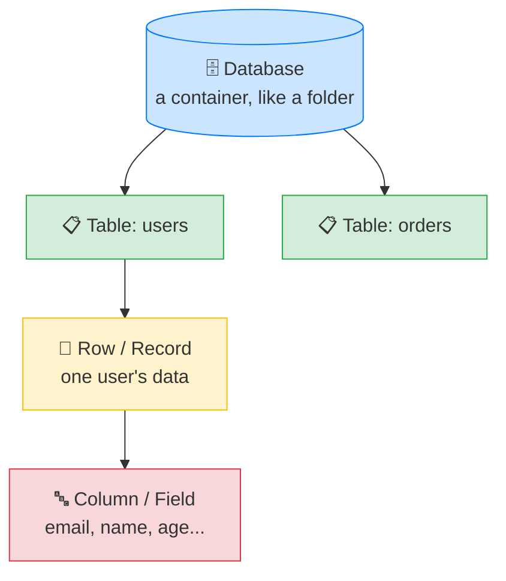

# 🗄️ What a Relational Database Actually Is — Complete Study Notes

> Notes for becoming a strong software engineer. Easy language, real code, and interview-ready explanations.
> The foundation: how data is structured before we ever talk about indexes or queries.

---

## 📌 1. The Core Idea (in simple words)

A **relational database** stores data in **tables** — just like spreadsheets with rows and columns.

- A **row** = one record (one user, one order, one product).
- A **column** = one field (name, email, price).

The magic word is **"relational"** — it means tables **connect to each other**. A user *has* orders; an order *belongs to* a product. These connections are made using **foreign keys** (more on that below).

> Analogy 🗂️: imagine an office with separate file cabinets — one for *Employees*, one for *Departments*. Each employee file has a note saying "Department: D-12". That little note linking the two cabinets is the **relationship**. You don't copy the whole department info into every employee file — you just point to it.

> 🎯 Interview line: *"A relational database organises data into tables of rows and columns, and links tables together through keys, so related data is stored once and referenced rather than duplicated."*

---

## 🧱 2. The Fundamental Units (from biggest to smallest)



| Unit | What it is | Real-world picture |
|---|---|---|
| **Database** | A container for tables | A folder holding many spreadsheets |
| **Table** | A structured set of rows with defined columns | One spreadsheet |
| **Column** | A field with a fixed **type** | One spreadsheet column (e.g. "Email") |
| **Row / Record** | A single entry | One spreadsheet row (one user) |
| **Primary key** | A column that **uniquely identifies** each row | The roll number that's unique per student |
| **Foreign key** | A column that **points to another table's** primary key | "Department: D-12" note linking cabinets |

---

## 🔑 3. Primary Keys vs Foreign Keys (the heart of "relational")

### Primary Key (PK)
A column that **uniquely identifies** each row. No two rows can share it, and it can never be empty.
- Usually an auto-incrementing `id` (1, 2, 3, ...) or a `UUID`.
- Postgres automatically **indexes** the primary key, so lookups by it are fast.

### Foreign Key (FK)
A column in one table that **references the primary key** of another table. This is what *creates the relationship*.

```
users table                 orders table
┌────┬─────────┐           ┌────┬──────────┬──────────┐
│ id │ name    │           │ id │ user_id  │ amount   │
├────┼─────────┤           ├────┼──────────┼──────────┤
│ 1  │ Nayan   │◀──────────│ 10 │    1     │  500.00  │
│ 2  │ Amit    │◀───┐      │ 11 │    1     │  250.00  │
└────┴─────────┘    └──────│ 12 │    2     │  999.00  │
        ▲                  └────┴──────────┴──────────┘
        │                              │
    PRIMARY KEY              FOREIGN KEY (user_id → users.id)
```

Here `orders.user_id` is a **foreign key** pointing to `users.id`. This says *"this order belongs to that user."*

**Why foreign keys matter:** they enforce **referential integrity** — the database refuses to create an order for a user that doesn't exist, and can stop you from deleting a user who still has orders. The data stays **consistent**.

> 🎯 Interview line: *"A primary key uniquely identifies a row; a foreign key references another table's primary key to form a relationship. Foreign keys enforce referential integrity — you can't reference a record that doesn't exist."*

---

## 🔢 4. Key SQL Data Types (and when to use them)

Every column must have a **type**. Picking the right one prevents bugs and saves space.

| Type | Use for | Notes |
|---|---|---|
| `INTEGER` / `BIGINT` | Whole numbers | `BIGINT` for very large counts (IDs at scale) |
| `DECIMAL(10,2)` / `NUMERIC` | **Money**, exact decimals | `(10,2)` = up to 10 digits, 2 after the dot |
| `VARCHAR(255)` | Strings with a length limit | Good for emails, names |
| `TEXT` | Unlimited strings | Blog posts, descriptions |
| `BOOLEAN` | true / false | e.g. `is_active` |
| `TIMESTAMP` | Date + time (no timezone) | Avoid for global apps |
| `TIMESTAMPTZ` | Date + time **with timezone** | ✅ **Prefer this** |
| `DATE` | Date only, no time | Birthdays, due dates |
| `UUID` | Universally unique ID | Alternative to integer IDs |
| `JSONB` (Postgres) | Queryable JSON | Flexible/semi-structured data |

### `VARCHAR` vs `TEXT`
`VARCHAR(n)` enforces a max length; `TEXT` has no limit. In Postgres there's almost **no performance difference** — use `VARCHAR(n)` when a limit makes sense (email, phone), `TEXT` for free-form content.

### `TIMESTAMP` vs `TIMESTAMPTZ`
Always prefer **`TIMESTAMPTZ`** — it stores the moment in time correctly regardless of server/user timezone. Plain `TIMESTAMP` causes painful bugs once your users span multiple timezones.

### `UUID` vs `SERIAL` (integer) IDs

| | `SERIAL` (1,2,3...) | `UUID` (random) |
|---|---|---|
| Readable | ✅ Easy | ❌ Long & ugly |
| Guessable | ❌ Yes (security risk — IDOR!) | ✅ No |
| Good for | Single DB, internal | Distributed systems, public IDs |

> 💡 Guessable sequential IDs link back to the **IDOR** risk from the RBAC notes — `/orders/124` → `/orders/125`. UUIDs make that guessing useless.

---

## 💰 5. The Golden Rule: NEVER Store Money as FLOAT

This is the **most-loved interview gotcha**. Memorise it.

Computers store `FLOAT` in binary, and some decimals **cannot be represented exactly**. The famous example:

```js
0.1 + 0.2 === 0.3   // → false !!
0.1 + 0.2           // → 0.30000000000000004
```

For money, these tiny errors **add up** across millions of transactions → wrong totals, failed reconciliations, angry accountants. 😱

**The fixes (use either):**
1. **`DECIMAL(10,2)` / `NUMERIC`** — exact decimal math. The standard choice.
2. **Store cents as `INTEGER`** — ₹500.00 stored as `50000`. Do math in integers, divide by 100 only when displaying. (Stripe and many fintechs do this.)

> 🎯 Interview line: *"I never use FLOAT for money because floating-point can't represent some decimals exactly — `0.1 + 0.2` isn't `0.3`. I use DECIMAL/NUMERIC for exact arithmetic, or store integer cents."*

> 🌶️ Since you work on financial/trading UIs — this is directly relevant. Always confirm the backend uses `NUMERIC`/`DECIMAL` (or integer cents) for prices and balances, never `FLOAT`/`DOUBLE`.

---

## 💻 6. Practical Exercise — Create Your First Table (by hand!)

Type this out yourself — don't copy-paste. Reading each line until you can explain it is the whole point.

```sql
CREATE TABLE users (
    id          SERIAL PRIMARY KEY,
    email       VARCHAR(255) NOT NULL UNIQUE,
    name        VARCHAR(100) NOT NULL,
    created_at  TIMESTAMPTZ NOT NULL DEFAULT NOW()
);
```

**Line-by-line — explain each to yourself:**

| Line | What it does |
|---|---|
| `CREATE TABLE users (...)` | Makes a new table called `users` |
| `id SERIAL PRIMARY KEY` | `SERIAL` = auto-incrementing integer (1,2,3...); `PRIMARY KEY` = unique + indexed + not null |
| `email VARCHAR(255) NOT NULL UNIQUE` | A string up to 255 chars; `NOT NULL` = required; `UNIQUE` = no two users share an email |
| `name VARCHAR(100) NOT NULL` | A required string up to 100 chars |
| `created_at TIMESTAMPTZ NOT NULL DEFAULT NOW()` | Time with timezone; auto-set to the current time if not provided |

### Constraints cheat-sheet (the words that enforce rules)

| Constraint | Meaning |
|---|---|
| `PRIMARY KEY` | Unique + not null + indexed identifier |
| `NOT NULL` | Value is required |
| `UNIQUE` | No duplicate values allowed |
| `DEFAULT <value>` | Auto-fills if you don't provide one |
| `CHECK (age >= 18)` | Value must satisfy a condition |
| `REFERENCES other(id)` | Makes it a foreign key |

### Now add a related table (the "relational" part in action)

```sql
CREATE TABLE orders (
    id        SERIAL PRIMARY KEY,
    user_id   INTEGER NOT NULL REFERENCES users(id),  -- foreign key 🔗
    amount    DECIMAL(10, 2) NOT NULL,                -- money, NOT float ✅
    is_paid   BOOLEAN NOT NULL DEFAULT false,
    created_at TIMESTAMPTZ NOT NULL DEFAULT NOW()
);
```

`user_id ... REFERENCES users(id)` is the foreign key that links each order to a user. Try inserting an order with a `user_id` that doesn't exist — Postgres will **reject it**. That's referential integrity protecting your data. 🛡️

```sql
-- This works (user 1 exists)
INSERT INTO users (email, name) VALUES ('nayan@mail.com', 'Nayan');
INSERT INTO orders (user_id, amount) VALUES (1, 499.99);

-- This FAILS (no user 999) → foreign key violation
INSERT INTO orders (user_id, amount) VALUES (999, 100.00);
```

---

## 🎤 7. How to Explain in an Interview

**Step 1 — What it is:**
> "A relational database stores data in tables of rows and columns, and links tables through keys so related data is referenced, not duplicated."

**Step 2 — The building blocks:**
> "A database holds tables; tables have typed columns; rows are individual records. Each row has a primary key that uniquely identifies it."

**Step 3 — Relationships:**
> "Foreign keys reference another table's primary key to form relationships and enforce referential integrity — you can't reference a record that doesn't exist."

**Step 4 — Data types:**
> "Choosing types matters — DECIMAL for money, TIMESTAMPTZ for time with timezone, UUID when IDs shouldn't be guessable, JSONB for flexible data."

**Step 5 — The money rule:**
> "And critically, never FLOAT for money — floating-point rounding errors corrupt financial calculations. I use DECIMAL or integer cents."

> 🟢 Trap question: *"Why use a foreign key instead of just storing the user's name inside the orders table?"* → *"To avoid duplication and inconsistency. If the name lived in every order and the user changed it, I'd have to update every row. Referencing the user's id keeps one source of truth — this is the idea behind normalisation."*

---

## 💎 8. Impressive Words & Phrases

| Instead of saying... | Say this 💪 |
|---|---|
| "Tables are linked" | "Tables are related via **foreign keys**" |
| "The unique id column" | "The **primary key**" |
| "Stops bad references" | "Enforces **referential integrity**" |
| "Don't repeat data" | "Avoid **redundancy** through **normalisation**" |
| "One true copy of data" | "A **single source of truth**" |
| "The shape of the table" | "The **schema**" |
| "Rules on a column" | "**Constraints** (NOT NULL, UNIQUE, CHECK)" |
| "Money type" | "**Fixed-point / exact numeric** (DECIMAL), not floating-point" |
| "Time with timezone" | "**Timezone-aware timestamp** (TIMESTAMPTZ)" |
| "Random unique id" | "**UUID** for non-enumerable identifiers" |

**Power vocabulary:** *schema, primary key, foreign key, referential integrity, constraints, normalisation, redundancy, single source of truth, cardinality, exact numeric vs floating-point, timezone-aware, non-enumerable identifiers.*

> 🌶️ Bonus flex — **normalisation:** *"Normalisation means structuring tables to minimise duplication, so each fact is stored once. It keeps data consistent and avoids update anomalies."* This one word signals real database understanding.

---

## ⏱️ 9. Quick Revision (read 5 min before interview)

> **Relational DB** = data in **tables** (rows × columns), with tables **linked by keys**.
>
> **Units:** Database (folder) → Table (spreadsheet) → Row (record) → Column (typed field).
>
> **Primary key** = unique row identifier (auto `SERIAL` id or `UUID`), auto-indexed.
> **Foreign key** = column referencing another table's PK → creates relationships + enforces **referential integrity**.
>
> **Types:** `INTEGER`/`BIGINT` (whole), `DECIMAL` (money!), `VARCHAR(n)`/`TEXT` (strings), `BOOLEAN`, `TIMESTAMPTZ` (prefer over TIMESTAMP), `DATE`, `UUID`, `JSONB`.
>
> **Money rule:** NEVER `FLOAT` (`0.1 + 0.2 ≠ 0.3`). Use **`DECIMAL`** or **integer cents**.
>
> **Constraints:** `PRIMARY KEY`, `NOT NULL`, `UNIQUE`, `DEFAULT`, `CHECK`, `REFERENCES`.
>
> **Golden line:** *"Store each fact once and reference it — foreign keys plus normalisation keep data consistent; and never use FLOAT for money."*

---

### ✅ Practice checklist
- [ ] Create the `users` table by hand (type it, don't copy)
- [ ] Explain every keyword out loud: `SERIAL`, `PRIMARY KEY`, `NOT NULL`, `UNIQUE`, `DEFAULT NOW()`
- [ ] Create a related `orders` table with a foreign key to `users`
- [ ] Insert a valid order, then try an invalid `user_id` → see the FK rejection
- [ ] Use `DECIMAL(10,2)` for the amount (never FLOAT)
- [ ] Add a `CHECK` constraint (e.g. `amount > 0`) and test it
- [ ] In `psql`, run `\d users` to inspect the table's schema

This is the bedrock — once tables, keys, types, and constraints feel natural, everything else (indexes, joins, transactions) builds cleanly on top. 🚀
