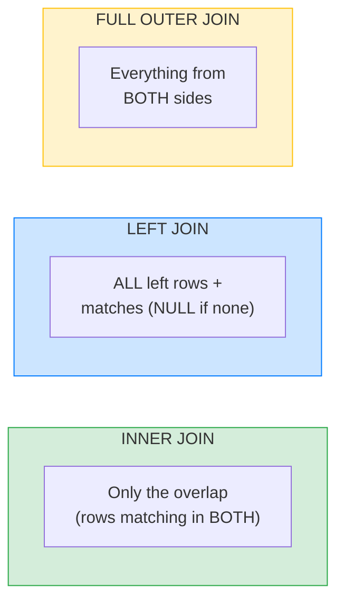

# 🔗 JOINs — Complete Study Notes (The Most Important SQL Concept)

> Notes for becoming a strong software engineer. Easy language, real code, and interview-ready explanations.
> If you master one SQL topic deeply, make it this one. JOINs are what make relational databases powerful.

---

## 📌 1. What is a JOIN? (in simple words)

A **JOIN** combines rows from **two or more tables** based on a **relationship** between them (usually a foreign key matching a primary key).

In the relationships notes, we *stored* connections using foreign keys. JOINs are how we **read across** those connections — *"give me each post **with** its author's name."*

> Analogy 🎬: imagine two lists — a list of **actors** and a list of **movies**, connected by who acted in what. A JOIN is asking *"stitch these together and show me each actor next to the movies they were in."* The `ON` condition is the rule for *how* to stitch them.

> 🎯 Interview line: *"A JOIN combines rows from multiple tables using a matching condition — typically a foreign key equals a primary key. It's how we read related data that's stored across separate tables."*

---

## 🧠 2. The Mental Model (read this twice)

For every JOIN, think:

> **"For each row in the LEFT table, find the matching rows in the RIGHT table using the ON condition."**

The **type** of join just decides *what to do when there's no match*:

- **INNER** → *"keep only rows that found a match."*
- **LEFT** → *"keep all left rows; fill the right side with NULL if no match."*

That's the whole idea. Everything else is detail.



Think of two overlapping circles (a Venn diagram): **INNER** = the overlap only; **LEFT** = the whole left circle (plus overlap); **FULL** = both circles entirely.

---

## ➡️ 3. INNER JOIN — only matching rows

Returns **only** rows that have a match in **both** tables.

```sql
SELECT users.name, posts.title
FROM users
INNER JOIN posts ON users.id = posts.user_id;
```

- A user with **no posts** → does **not** appear.
- A post with no matching user (shouldn't happen with foreign keys) → does **not** appear.

> 💡 `INNER JOIN` is the default — writing just `JOIN` means `INNER JOIN`. But spelling out `INNER` makes intent clear.

> 🎯 Use INNER when you only care about rows that **have** the relationship — e.g. "posts **with** their authors."

---

## ⬅️ 4. LEFT JOIN — all left rows, matched right rows

Returns **all** rows from the **left** table, plus matching rows from the right. Where there's **no match, the right side is NULL**.

```sql
SELECT users.name, posts.title
FROM users
LEFT JOIN posts ON users.id = posts.user_id;
```

- A user with **no posts** → **still appears**, with `title = NULL`.

This is perfect for *"show all X, including those with zero related Y"* — like all users and their post counts, even users who never posted.

> 🎯 Use LEFT when you must **keep every row from the main table** regardless of whether a match exists.

> 💡 Powerful trick — **finding rows with NO match** ("anti-join"): LEFT JOIN, then filter for NULL on the right side. This answers "users who never posted" (see practice query #4).

---

## ⬅️➡️ 5. RIGHT JOIN & FULL OUTER JOIN (know them, rarely use them)

**RIGHT JOIN** — the mirror of LEFT JOIN: all rows from the **right** table, matched from the left.
> In practice, almost nobody uses RIGHT JOIN — you can always **flip the table order** and use a LEFT JOIN, which reads more naturally. Mention this in interviews: *"I prefer LEFT JOIN over RIGHT JOIN for readability — they're equivalent after swapping table order."*

**FULL OUTER JOIN** — returns **all rows from both** tables, with NULLs wherever there's no match. Rare; used for reconciliation-type tasks ("show everything from both sides, matched where possible").

```sql
-- FULL OUTER JOIN example
SELECT u.name, p.title
FROM users u
FULL OUTER JOIN posts p ON u.id = p.user_id;
```

---

## 🪜 6. Multi-Table JOINs (chaining)

You can join many tables — each `JOIN` adds another connection. The pattern never changes.

```sql
SELECT users.name, posts.title, comments.content
FROM users
INNER JOIN posts    ON users.id = posts.user_id
INNER JOIN comments ON posts.id = comments.post_id;
```

This walks the chain: **users → their posts → comments on those posts**. You can join 3, 5, even 10 tables the same way — each `JOIN` links one more table via an `ON` condition.

---

## 🏷️ 7. Table Aliases (write cleaner queries)

Long table names make queries hard to read. Give each table a short **alias**.

```sql
SELECT u.name, p.title, c.content
FROM users u
INNER JOIN posts    p ON u.id = p.user_id
INNER JOIN comments c ON p.id = c.post_id;
```

`users u` means *"call this table `u` for the rest of the query."* Now `u.name`, `p.title`, `c.content` are short and clear. This is standard professional style — interviewers expect it.

> 💡 Aliases are **required** when you join a table to **itself** (a self-join), e.g. employees → their managers (both in the same `employees` table).

---

## 💻 8. Practical Exercise — The 5 Queries That Prove You Understand JOINs

First, the setup:

```sql
CREATE TABLE users (
    id    SERIAL PRIMARY KEY,
    name  VARCHAR(100) NOT NULL,
    email VARCHAR(255) NOT NULL UNIQUE
);

CREATE TABLE posts (
    id         SERIAL PRIMARY KEY,
    user_id    INTEGER NOT NULL REFERENCES users(id),
    title      VARCHAR(200) NOT NULL,
    created_at TIMESTAMPTZ DEFAULT NOW()
);

CREATE TABLE comments (
    id         SERIAL PRIMARY KEY,
    post_id    INTEGER NOT NULL REFERENCES posts(id),
    user_id    INTEGER NOT NULL REFERENCES users(id),
    content    TEXT NOT NULL,
    created_at TIMESTAMPTZ DEFAULT NOW()
);

CREATE TABLE likes (
    user_id INTEGER REFERENCES users(id),
    post_id INTEGER REFERENCES posts(id),
    PRIMARY KEY (user_id, post_id)
);

-- Sample data
INSERT INTO users (name, email) VALUES
    ('Nayan', 'nayan@x.com'),   -- 1
    ('Amit',  'amit@x.com'),    -- 2
    ('Riya',  'riya@x.com');    -- 3 (will never post)

INSERT INTO posts (user_id, title) VALUES
    (1, 'Learning JOINs'),      -- post 1 by Nayan
    (1, 'SQL is fun'),          -- post 2 by Nayan
    (2, 'My first post');       -- post 3 by Amit

INSERT INTO comments (post_id, user_id, content) VALUES
    (1, 2, 'Great explanation!'),
    (1, 3, 'Thanks, this helped'),
    (3, 1, 'Welcome!');
```

---

### 1️⃣ Every user with their post count (including zero) — LEFT JOIN + GROUP BY

```sql
SELECT u.name, COUNT(p.id) AS post_count
FROM users u
LEFT JOIN posts p ON u.id = p.user_id
GROUP BY u.id, u.name
ORDER BY post_count DESC;
```

**Why LEFT JOIN?** So Riya (zero posts) still appears.
**Why `COUNT(p.id)` not `COUNT(*)`?** `COUNT(*)` counts rows — Riya has one row (with NULLs) so it'd wrongly show 1. `COUNT(p.id)` counts only **non-NULL** post ids → correctly shows **0** for Riya. ⭐ *(This is a classic interview trap!)*

---

### 2️⃣ All posts by a specific user

```sql
SELECT p.title, p.created_at
FROM posts p
INNER JOIN users u ON p.user_id = u.id
WHERE u.name = 'Nayan';

-- (If you already have the user id, you don't even need a join:)
SELECT title, created_at FROM posts WHERE user_id = 1;
```

---

### 3️⃣ For each post: title, author name, and comment count

```sql
SELECT p.title, u.name AS author, COUNT(c.id) AS comment_count
FROM posts p
INNER JOIN users u    ON p.user_id = u.id     -- author (always exists)
LEFT JOIN  comments c ON p.id = c.post_id      -- comments (may be zero)
GROUP BY p.id, p.title, u.name
ORDER BY comment_count DESC;
```

**Mixing join types:** INNER for the author (every post has one), LEFT for comments (a post may have none, but we still want to show it with count 0).

---

### 4️⃣ Users who have NEVER posted (the anti-join)

```sql
SELECT u.name
FROM users u
LEFT JOIN posts p ON u.id = p.user_id
WHERE p.id IS NULL;
```

**How it works:** LEFT JOIN keeps all users; users with no posts get NULL on the post side; filtering `WHERE p.id IS NULL` keeps **only** those non-matches. This returns **Riya**. (Ties back to the NULL-handling from the WHERE notes — `IS NULL`, never `= NULL`!)

---

### 5️⃣ 10 most-recent comments with post title and commenter's name

```sql
SELECT c.content, c.created_at, p.title AS post_title, u.name AS commenter
FROM comments c
INNER JOIN posts p ON c.post_id = p.id
INNER JOIN users u ON c.user_id = u.id
ORDER BY c.created_at DESC
LIMIT 10;
```

A three-table join + sorting + limiting — combining everything from the earlier notes. 🎯

> 💪 **If you can write all 5 fluently, you understand JOINs.** If any felt hard, redo this section — it's the single most valuable SQL practice you can do.

---

## 🎤 9. How to Explain in an Interview

**Step 1 — Definition:**
> "A JOIN combines rows from multiple tables on a matching condition, usually a foreign key to a primary key."

**Step 2 — The mental model:**
> "For each left-table row, find matching right-table rows by the ON condition. INNER keeps only matches; LEFT keeps all left rows and NULLs the right when there's no match."

**Step 3 — INNER vs LEFT:**
> "INNER for 'rows that have the relationship' like posts with authors; LEFT when I must keep every main-table row, like all users including those with zero posts."

**Step 4 — RIGHT/FULL:**
> "RIGHT JOIN is rarely used — I flip the order and use LEFT for readability. FULL OUTER returns everything from both sides; I use it for reconciliation."

**Step 5 — Practical:**
> "I use aliases for readability, chain multiple joins for deeper relationships, and use a LEFT JOIN with an IS NULL filter as an anti-join to find rows with no match."

> 🟢 Trap question: *"In `COUNT users LEFT JOIN posts`, why use `COUNT(post.id)` instead of `COUNT(*)`?"* → *"`COUNT(*)` counts rows, and a user with no posts still has one row with NULLs, so it'd return 1. `COUNT(post.id)` ignores NULLs and correctly returns 0."*

> 🟢 Trap question: *"What's the difference between filtering in the ON clause vs the WHERE clause of a LEFT JOIN?"* → *"In a LEFT JOIN, a condition in ON filters which right rows match (left rows are kept regardless), while the same condition in WHERE runs after the join and can remove the unmatched (NULL) rows — effectively turning it into an INNER JOIN. It's a subtle but common bug."*

---

## 💎 10. Impressive Words & Phrases

| Instead of saying... | Say this 💪 |
|---|---|
| "Combine tables" | "**Join** tables on a **predicate**" |
| "The matching rule" | "The **join condition** (`ON` clause)" |
| "Only matching rows" | "An **inner join** (the **intersection**)" |
| "Keep all of one side" | "An **outer join** (LEFT/RIGHT/FULL)" |
| "Find rows with no match" | "An **anti-join** (LEFT JOIN + `IS NULL`)" |
| "Join a table to itself" | "A **self-join**" |
| "Short names for tables" | "Table **aliases**" |
| "Count ignoring blanks" | "`COUNT(column)` ignores **NULLs**" |
| "Combine + summarise" | "**Join then aggregate** with `GROUP BY`" |
| "Tables linked in a chain" | "A **multi-table / chained join**" |

**Power vocabulary:** *inner join, outer join (left/right/full), join condition/predicate, intersection, anti-join, self-join, table alias, cardinality, join then aggregate, NULL-padding, query planner.*

> 🌶️ Bonus flex — **cartesian product / cross join:** *"If you forget the ON condition, you get a cartesian product — every row paired with every row, which explodes in size. A proper join condition is what keeps the result meaningful."* Knowing this danger shows real depth.

---

## ⏱️ 11. Quick Revision (read 5 min before interview)

> **JOIN** = combine rows from multiple tables on a matching `ON` condition (usually FK = PK).
>
> **Mental model:** for each left row, find matching right rows. INNER = keep matches only. LEFT = keep all left rows, NULL the right if no match.
>
> - **INNER JOIN** → only rows matching in both (the intersection). Default when you write just `JOIN`.
> - **LEFT JOIN** → all left rows + matches (NULL where none). Use for "all X including those with zero Y".
> - **RIGHT JOIN** → mirror of LEFT; rarely used (flip order, use LEFT instead).
> - **FULL OUTER JOIN** → everything from both sides. Rare.
>
> **Anti-join:** `LEFT JOIN ... WHERE right.id IS NULL` → finds rows with **no match** (e.g. users who never posted).
>
> **COUNT trap:** in LEFT JOIN aggregates use `COUNT(child.id)` (ignores NULLs) not `COUNT(*)` (counts the NULL row as 1).
>
> **Aliases** (`users u`) keep multi-table joins readable; required for self-joins.
>
> **Golden line:** *"For each left row, find matching right rows — INNER drops the non-matches, LEFT keeps them with NULLs. Forget the ON condition and you get a cartesian product."*

---

### ✅ Practice checklist (the 5 must-do queries)
- [ ] Every user + post count, including zero (LEFT JOIN + GROUP BY + `COUNT(p.id)`)
- [ ] All posts by a specific user
- [ ] Each post with author name + comment count (mix INNER + LEFT)
- [ ] Users who have never posted (anti-join with `IS NULL`)
- [ ] 10 most-recent comments with post title + commenter (3-table join + ORDER BY + LIMIT)
- [ ] Bonus: rewrite a RIGHT JOIN as a LEFT JOIN by flipping table order
- [ ] Bonus: try a self-join (employees → managers)

> 💪 **The rule:** if you can write all 5 main queries fluently without looking, you genuinely understand joins. This is the most important practice in the whole SQL foundation. 🚀
