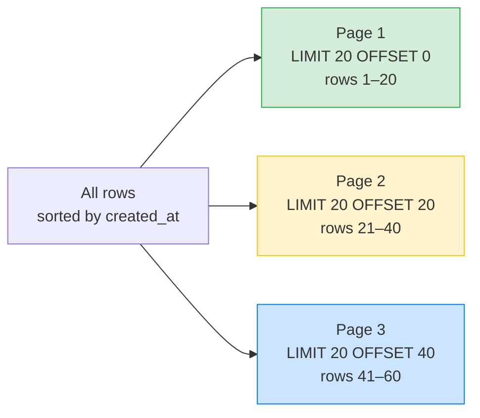

# 📊 Sorting and Limiting — Complete Study Notes

> Notes for becoming a strong software engineer. Easy language, real code, and interview-ready explanations.
> Topic: ordering results with `ORDER BY`, capping them with `LIMIT`, and the all-important pagination trade-off.

---

## 📌 1. Why Sorting and Limiting Matter

Two everyday needs in any app:
1. **Sorting** → showing data in a useful order (newest posts first, products by price, names A–Z).
2. **Limiting** → never dumping a million rows on a user. You show a *page* at a time.

Together they power almost every list you've ever scrolled — feeds, search results, leaderboards, order history.

> 🎯 Interview line: *"`ORDER BY` controls the order of results, `LIMIT` caps how many come back, and combining `LIMIT` with `OFFSET` gives basic pagination — though OFFSET has scaling limits."*

---

## 🔼 2. ORDER BY — Sorting Results

```sql
SELECT * FROM users ORDER BY created_at DESC;      -- newest first
SELECT * FROM users ORDER BY name ASC;             -- alphabetical (A→Z)
SELECT * FROM users ORDER BY city ASC, name ASC;   -- multi-column sort
```

| Keyword | Meaning |
|---|---|
| `ASC` | Ascending — small→large, A→Z, oldest→newest (**this is the default**) |
| `DESC` | Descending — large→small, Z→A, newest→oldest |

> 💡 `ASC` is the default, so `ORDER BY name` = `ORDER BY name ASC`. Write `DESC` explicitly whenever you want the reverse.

### Multi-column sorting (tie-breaking)

```sql
SELECT * FROM users ORDER BY city ASC, name ASC;
```

This sorts by `city` first. **When two rows have the same city**, it then sorts those by `name`. Think of it like sorting a class first by section, then by roll number within each section.

> Order of columns matters: `ORDER BY city, name` is different from `ORDER BY name, city`. The first column is the primary sort; later ones only break ties.

### Sorting and NULLs

NULLs have to go somewhere. In Postgres, `ASC` puts NULLs **last**, `DESC` puts them **first**. You can control it:

```sql
SELECT * FROM users ORDER BY last_login DESC NULLS LAST;
```

> 🎯 Interview tip: mentioning `NULLS FIRST` / `NULLS LAST` shows you've handled real messy data, not just clean tutorial tables.

---

## 🔢 3. LIMIT — Capping Results

```sql
SELECT * FROM users LIMIT 20;   -- return at most 20 rows
```

`LIMIT` caps the number of rows returned. Hugely important for performance and UX — you almost never want *all* rows at once.

> ⚠️ Subtle but important: `LIMIT` **without** `ORDER BY` gives **no guaranteed order**. The database may return any 20 rows, and the set can change between runs. **Always pair `LIMIT` with `ORDER BY`** so "the first 20" actually means something stable.

```sql
-- ❌ Unpredictable: which 20 rows? No guarantee.
SELECT * FROM users LIMIT 20;
-- ✅ Stable: the 20 newest users, every time.
SELECT * FROM users ORDER BY created_at DESC LIMIT 20;
```

---

## 📄 4. OFFSET Pagination — Pages of Data

```sql
SELECT * FROM users ORDER BY created_at DESC LIMIT 20;            -- page 1
SELECT * FROM users ORDER BY created_at DESC LIMIT 20 OFFSET 20;  -- page 2
SELECT * FROM users ORDER BY created_at DESC LIMIT 20 OFFSET 40;  -- page 3
```

`OFFSET n` means *"skip the first n rows, then start."* Combined with `LIMIT`, it gives classic page-by-page browsing.

**The formula:**
```
OFFSET = (page_number - 1) × page_size
```
So page 3 with 20 per page → `OFFSET = (3 - 1) × 20 = 40`.



---

## 🐢 5. The OFFSET Problem (very important for interviews)

OFFSET pagination **works**, but it **slows down dramatically as the offset grows**. Understand *why*.

To run `LIMIT 20 OFFSET 100000`, the database must:
1. Sort/scan through the first **100,000 rows**,
2. **count and throw them all away**,
3. then finally return rows 100,001–100,020.

So deep pages do a huge amount of wasted work. Page 1 is instant; page 5,000 crawls. 🐌

There's a **second, subtler problem**: if a new row is inserted while a user pages, **rows shift** and they may see a duplicate or skip a record between pages (because offsets are positional, not anchored to data).

### The fix → Keyset / Cursor Pagination

Instead of *skipping* rows by position, **remember the last value you saw** and ask for rows *after* it:

```sql
-- Page 1: just the newest 20
SELECT * FROM users ORDER BY id DESC LIMIT 20;

-- Page 2: remember the last id from page 1 (say 9981), then:
SELECT * FROM users WHERE id < 9981 ORDER BY id DESC LIMIT 20;
```

Because `id` is indexed, the database **jumps straight to that point** — no scanning-and-discarding. It stays fast even on page 50,000. This is how infinite-scroll feeds (Twitter/X, Instagram) work.

| | **OFFSET pagination** | **Keyset / cursor pagination** |
|---|---|---|
| Speed on deep pages | 🐢 Slow (scans + discards) | ⚡ Fast (index jump) |
| "Jump to page 50" | ✅ Easy | ❌ Hard (only next/prev) |
| Stable with inserts | ❌ Can skip/duplicate | ✅ Anchored to data |
| Best for | Small datasets, admin tables | Big datasets, infinite scroll, APIs |

> 🎯 Interview line: *"OFFSET pagination is simple but degrades on deep pages because the database scans and discards all the skipped rows. For large datasets or infinite scroll, I use keyset (cursor) pagination — filtering on the last seen indexed value — which stays fast and avoids row-shift bugs."*

> 💡 This connects to the indexes notes: keyset pagination is fast precisely *because* it does an **index range scan** instead of a sequential scan over skipped rows.

---

## 💻 6. Practical Examples

```sql
-- Newest 10 posts
SELECT * FROM posts ORDER BY created_at DESC LIMIT 10;

-- Most viewed posts, tie-break by newest
SELECT * FROM posts ORDER BY views DESC, created_at DESC LIMIT 10;

-- Alphabetical users, page 2 (20 per page)
SELECT * FROM users ORDER BY name ASC LIMIT 20 OFFSET 20;

-- Cheapest 5 products, NULL prices last
SELECT * FROM products ORDER BY price ASC NULLS LAST LIMIT 5;

-- Keyset pagination (next page after last seen id = 150)
SELECT * FROM posts WHERE id < 150 ORDER BY id DESC LIMIT 20;

-- "Top N per category" style: top 3 most expensive products overall
SELECT name, price FROM products ORDER BY price DESC LIMIT 3;
```

> 💡 Real-world pattern — for "newest first" feeds, sorting by an **indexed** column (`id` or `created_at`) keeps both the sort *and* keyset pagination fast.

---

## 🎤 7. How to Explain in an Interview

**Step 1 — The basics:**
> "`ORDER BY` sorts results, ascending by default or descending with DESC, and supports multi-column sorting where later columns break ties. `LIMIT` caps the row count."

**Step 2 — The pairing rule:**
> "I always pair LIMIT with ORDER BY — without an explicit order, 'the first 20 rows' isn't guaranteed to be stable."

**Step 3 — OFFSET pagination:**
> "LIMIT plus OFFSET gives page-based pagination — OFFSET = (page − 1) × pageSize."

**Step 4 — The trade-off (the senior part):**
> "But OFFSET degrades on deep pages because the database scans and discards all skipped rows, and inserts can cause row-shift between pages. For large datasets I switch to keyset/cursor pagination — filtering on the last seen indexed value — which stays fast and stable."

**Step 5 — NULL ordering:**
> "I also handle NULLs explicitly with NULLS FIRST/LAST when sorting columns that can be empty."

> 🟢 Trap question: *"Your paginated list sometimes shows the same item twice — why?"* → *"Likely OFFSET pagination with new rows being inserted: the offsets shift, so an item slides from one page onto the next. Keyset pagination anchored to an indexed column fixes it."*

---

## 💎 8. Impressive Words & Phrases

| Instead of saying... | Say this 💪 |
|---|---|
| "Sort the rows" | "Apply an **ORDER BY** / sort order" |
| "Second sort column" | "A **tie-breaker** column" |
| "Limit the rows" | "Cap with **LIMIT**" |
| "Page through data" | "**Paginate** results" |
| "Skip rows" | "**OFFSET** the result set" |
| "Page-by-page" | "**Offset-based pagination**" |
| "Remember the last item" | "**Keyset / cursor pagination**" |
| "It gets slow deep in" | "OFFSET has **linear scan cost** on deep pages" |
| "Where to put empty values" | "**NULLS FIRST / NULLS LAST** ordering" |
| "Rows move between pages" | "**Row-shift / pagination drift**" |

**Power vocabulary:** *ORDER BY, ascending/descending, tie-breaker, stable sort, LIMIT, OFFSET, offset-based pagination, keyset/cursor pagination, pagination drift, index range scan, NULLS FIRST/LAST.*

> 🌶️ Bonus flex — **stable, deterministic ordering:** *"For reliable pagination I make the sort deterministic by including a unique tie-breaker like the primary key — otherwise rows with equal sort values can appear in different orders across pages."* This shows you've debugged flaky pagination for real.

---

## ⏱️ 9. Quick Revision (read 5 min before interview)

> **ORDER BY** → sorts. `ASC` (default) or `DESC`. Multiple columns = first is primary, rest are **tie-breakers**. Control empties with `NULLS FIRST/LAST`.
>
> **LIMIT** → caps row count. ⚠️ **Always pair with ORDER BY** — `LIMIT` alone has no guaranteed order.
>
> **OFFSET pagination** → `LIMIT 20 OFFSET 40` = page 3. Formula: `OFFSET = (page − 1) × pageSize`.
>
> **OFFSET problem** → slow on deep pages (scans + discards skipped rows) and **row-shift** on inserts.
>
> **Keyset / cursor pagination** → `WHERE id < lastSeenId ORDER BY id DESC LIMIT 20`. Uses the index → fast + stable. Best for big data & infinite scroll. (Can't jump to an arbitrary page.)
>
> **Golden line:** *"OFFSET pagination is simple but scans and throws away every skipped row, so it slows down on deep pages — keyset pagination jumps straight to the last seen indexed value and stays fast."*

---

### ✅ Practice checklist
- [ ] Sort users by `created_at DESC` and by `name ASC`
- [ ] Try a multi-column sort (`city ASC, name ASC`) and see the tie-breaking
- [ ] Add `NULLS LAST` on a nullable column
- [ ] Run `LIMIT` *without* `ORDER BY` and notice the order isn't guaranteed
- [ ] Paginate with `LIMIT 20 OFFSET 40` (page 3)
- [ ] Rewrite page 2 as **keyset pagination** using the last seen id
- [ ] Explain out loud *why* deep OFFSET is slow

Get sorting + pagination right and your list endpoints stay fast and correct even as the data grows huge. 🚀
