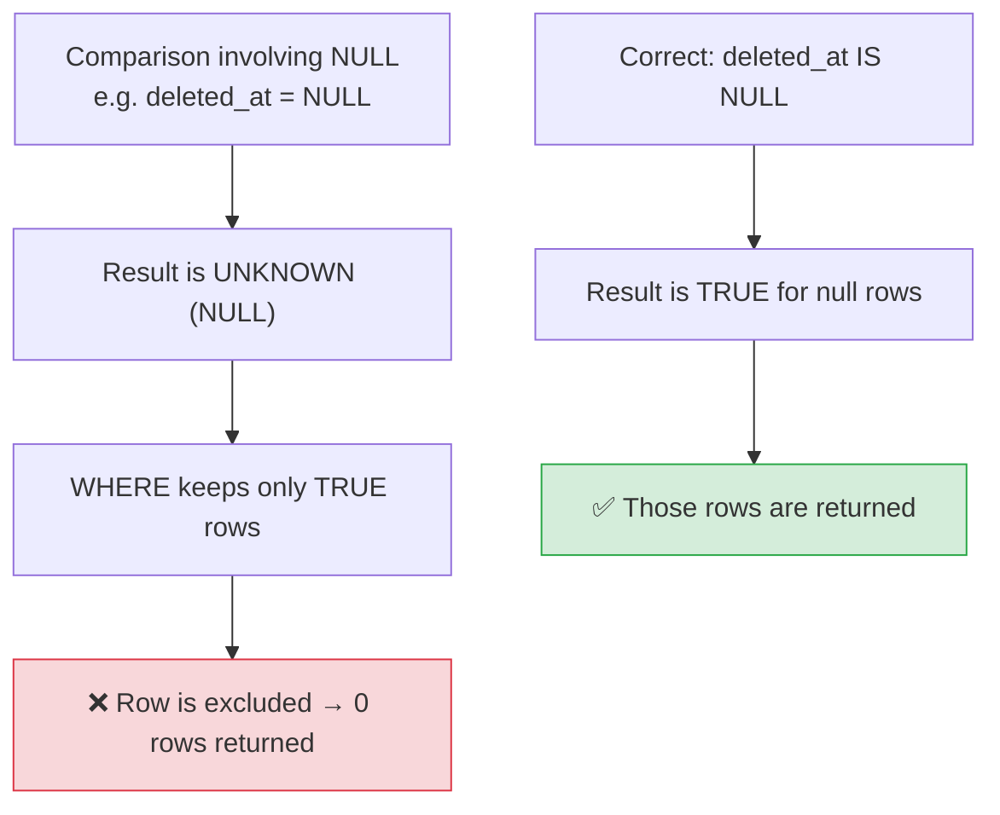

# 🔎 WHERE Clauses and Filtering — Complete Study Notes

> Notes for becoming a strong software engineer. Easy language, real code, and interview-ready explanations.
> This is where ~80% of real SQL work happens — filtering rows precisely.

---

## 📌 1. Why WHERE Matters So Much

The `WHERE` clause is the **filter** of SQL. It decides **which rows** an operation touches. Almost every real query — SELECT, UPDATE, DELETE — leans on a good `WHERE` clause.

> Analogy 🔦: a table with a million rows is a dark warehouse. `WHERE` is the **torch** you shine on exactly the boxes you want. Get the filter right and you find your data instantly; get it wrong (or forget it) and you either grab nothing or grab *everything*.

> 🎯 Interview line: *"The WHERE clause filters rows by a condition — a predicate. Most of the real work in SQL is writing precise WHERE clauses, and getting them right is also what keeps UPDATE and DELETE safe."*

---

## ⚖️ 2. Comparison Operators

These compare a column to a value.

```sql
WHERE age = 25            -- equal to
WHERE age != 25           -- not equal (also written <>)
WHERE age <> 25           -- not equal (SQL standard form)
WHERE age > 18            -- greater than
WHERE age >= 18           -- greater than or equal
WHERE age < 65            -- less than
WHERE age <= 65           -- less than or equal
WHERE age BETWEEN 18 AND 65   -- inclusive range (18 and 65 included)
```

> 💡 `BETWEEN` is **inclusive** on both ends — `BETWEEN 18 AND 65` includes both 18 and 65. It's a cleaner way to write `age >= 18 AND age <= 65`.

---

## 🔗 3. Logical Operators (AND / OR / NOT)

Combine multiple conditions.

```sql
WHERE age > 18 AND city = 'Bangalore'           -- both must be true
WHERE city = 'Bangalore' OR city = 'Mumbai'     -- either can be true
WHERE NOT city = 'Delhi'                         -- negate a condition
WHERE age > 18 AND (city = 'Bangalore' OR city = 'Mumbai')  -- grouped
```

### ⚠️ Brackets matter — operator precedence

`AND` is evaluated **before** `OR` (like `×` before `+` in maths). So **use brackets** to make your intent clear:

```sql
-- Without brackets — AND binds first, maybe NOT what you meant:
WHERE age > 18 AND city = 'Bangalore' OR city = 'Mumbai'
-- reads as: (age > 18 AND city = 'Bangalore') OR city = 'Mumbai'
-- → returns ALL Mumbai users regardless of age 😱

-- With brackets — clear and correct:
WHERE age > 18 AND (city = 'Bangalore' OR city = 'Mumbai')
-- → adults from either city ✅
```

> 🎯 Interview line: *"AND has higher precedence than OR, so I always use parentheses when mixing them — otherwise the query can silently return the wrong rows."*

---

## 📋 4. IN and NOT IN

A clean way to check against a **list** of values.

```sql
WHERE city IN ('Bangalore', 'Mumbai', 'Delhi')   -- city is any of these
WHERE city NOT IN ('Delhi')                       -- city is none of these
```

This is cleaner than chaining ORs:

```sql
-- Messy 😒
WHERE city = 'Bangalore' OR city = 'Mumbai' OR city = 'Delhi'
-- Clean ✅ (and the planner optimises it well)
WHERE city IN ('Bangalore', 'Mumbai', 'Delhi')
```

> ⚠️ **`NOT IN` + NULL trap:** if the list contains a `NULL`, `NOT IN` can return **zero rows** unexpectedly (because of NULL's three-valued logic — see section 6). When the list might contain NULLs, prefer `NOT EXISTS`. Mentioning this is a senior-level catch.

> 💡 `IN` can also take a **subquery**: `WHERE user_id IN (SELECT id FROM users WHERE is_active)`.

---

## 🔤 5. LIKE — Pattern Matching

For matching text patterns. Two wildcards:

| Wildcard | Means |
|---|---|
| `%` | Any number of characters (including zero) |
| `_` | Exactly **one** character |

```sql
WHERE name  LIKE 'N%'          -- starts with N (Nayan, Neha, N)
WHERE name  LIKE '%kumar'      -- ends with kumar
WHERE email LIKE '%@gmail.com' -- contains/ends with @gmail.com
WHERE name  LIKE 'N_yan'       -- N, then ONE char, then yan (Nayan, Niyan)
WHERE name  LIKE '%a%'         -- contains the letter a anywhere
```

### Case-insensitive matching → `ILIKE` (Postgres)

```sql
WHERE name ILIKE 'nayan'   -- matches 'Nayan', 'NAYAN', 'nayan' — all true
```

> 💡 Performance note: a **leading wildcard** like `LIKE '%kumar'` **cannot use a normal B-tree index** (the index is sorted by start of the string). `LIKE 'N%'` (wildcard at the end) **can** use an index. For heavy text search, reach for a GIN index / full-text search (links back to the indexes notes). This is a great detail to drop in interviews.

---

## 🕳️ 6. NULL Handling — the #1 SQL Bug (master this!)

This trips up almost everyone. Burn it into memory.

**NULL means "unknown" / "no value" — NOT zero, NOT empty string.** Because it's *unknown*, comparing NULL to anything gives **NULL** (which is treated as "not true"), not `true` or `false`.

```sql
WHERE deleted_at IS NULL        -- ✅ correct
WHERE deleted_at IS NOT NULL    -- ✅ correct
WHERE deleted_at = NULL         -- ❌ WRONG — silently returns ZERO rows
WHERE deleted_at != NULL        -- ❌ WRONG — also returns nothing
```

### Why `column = NULL` fails

`NULL = NULL` is **not** `true` — it's `NULL`. Think of NULL as "I don't know."
> *"Is an unknown value equal to another unknown value?"* → The honest answer is *"I don't know."* → not true → row excluded.

This is called **three-valued logic**: every condition is `TRUE`, `FALSE`, or `UNKNOWN (NULL)`. Only rows where the condition is **TRUE** come back.



> 🎯 Interview line: *"NULL means unknown, so any comparison with NULL returns UNKNOWN, not true — that's three-valued logic. So `column = NULL` silently returns nothing. You must use `IS NULL` and `IS NOT NULL`. It's one of the most common production SQL bugs."*

> 💡 Handy helper — `COALESCE` gives a fallback for NULLs:
> ```sql
> SELECT COALESCE(nickname, name, 'Anonymous') FROM users;
> -- returns the first non-null value
> ```

---

## 💻 7. Practical Exercise — Filter Real Data

Create a `users` table where `email_verified_at` is sometimes NULL, then practise.

```sql
CREATE TABLE users (
    id                SERIAL PRIMARY KEY,
    name              VARCHAR(100) NOT NULL,
    email             VARCHAR(255) NOT NULL UNIQUE,
    city              VARCHAR(100),
    age               INTEGER,
    email_verified_at TIMESTAMPTZ        -- NULL = not verified
);

INSERT INTO users (name, email, city, age, email_verified_at) VALUES
    ('Nayan', 'nayan@example.com', 'Bangalore', 28, NOW()),
    ('Neha',  'neha@example.com',  'Bangalore', 24, NULL),       -- unverified
    ('Amit',  'amit@example.com',  'Mumbai',    31, NOW()),
    ('Riya',  'riya@example.com',  'Delhi',     19, NULL),       -- unverified
    ('Nikhil','nikhil@example.com','Bangalore', 35, NOW());

-- 1️⃣ Verified users (email_verified_at is set)
SELECT * FROM users WHERE email_verified_at IS NOT NULL;

-- 2️⃣ Unverified users (NULL) — must use IS NULL, not = NULL
SELECT * FROM users WHERE email_verified_at IS NULL;

-- 3️⃣ Verified users from Bangalore (combine conditions)
SELECT * FROM users
WHERE city = 'Bangalore' AND email_verified_at IS NOT NULL;

-- 4️⃣ Users whose name starts with N
SELECT * FROM users WHERE name LIKE 'N%';

-- Bonus mixers:
-- Adults (18+) from Bangalore OR Mumbai
SELECT * FROM users
WHERE age >= 18 AND (city = 'Bangalore' OR city = 'Mumbai');

-- Cities in a list
SELECT * FROM users WHERE city IN ('Bangalore', 'Mumbai');

-- Case-insensitive name search
SELECT * FROM users WHERE name ILIKE 'nayan';

-- Age range
SELECT * FROM users WHERE age BETWEEN 25 AND 35;
```

> 💡 Run query #2 first as `WHERE email_verified_at = NULL` and watch it return **0 rows** — then fix it to `IS NULL`. Seeing the silent failure yourself makes the lesson permanent.

---

## 🎤 8. How to Explain in an Interview

**Step 1 — The role of WHERE:**
> "WHERE filters rows using a predicate. It's central to SELECT, and it's what keeps UPDATE and DELETE from hitting every row."

**Step 2 — Operators:**
> "I use comparison operators, BETWEEN for inclusive ranges, IN for value lists instead of long OR chains, and LIKE/ILIKE for pattern matching."

**Step 3 — Precedence:**
> "AND binds tighter than OR, so I parenthesise mixed conditions to avoid silently wrong results."

**Step 4 — The NULL rule (the key one):**
> "NULL means unknown, so comparing with `=` returns UNKNOWN, not true — that's three-valued logic. `column = NULL` silently returns nothing; I always use IS NULL / IS NOT NULL. It's a very common production bug."

**Step 5 — Performance awareness:**
> "I also keep indexes in mind — a trailing wildcard like 'N%' can use a B-tree index, but a leading wildcard '%kumar' can't, so that needs full-text search."

> 🟢 Trap question: *"Why does `WHERE email != 'x@y.com'` sometimes skip rows you expect?"* → *"Because rows where that column is NULL evaluate to UNKNOWN, not true, so they're excluded. I'd write `WHERE email IS DISTINCT FROM 'x@y.com'` or add `OR email IS NULL` to include them."*

---

## 💎 9. Impressive Words & Phrases

| Instead of saying... | Say this 💪 |
|---|---|
| "The condition" | "The **predicate**" |
| "NULL handling rules" | "**Three-valued logic** (TRUE / FALSE / UNKNOWN)" |
| "= NULL doesn't work" | "NULL comparisons yield **UNKNOWN**, so I use **IS NULL**" |
| "A list check" | "An **IN predicate / set membership** test" |
| "Pattern match" | "**Wildcard / pattern matching** with LIKE" |
| "Ignore case" | "**Case-insensitive** match (`ILIKE`)" |
| "Order of AND/OR" | "**Operator precedence**" |
| "Fallback for null" | "**`COALESCE`** to a default value" |
| "Wildcard at the start is slow" | "A **leading wildcard** is **non-sargable** (can't use the index)" |
| "Filter that uses an index" | "A **sargable** predicate" |

**Power vocabulary:** *predicate, three-valued logic, UNKNOWN, set membership (IN), pattern matching, case-insensitive, operator precedence, COALESCE, sargable vs non-sargable, IS DISTINCT FROM.*

> 🌶️ Bonus flex — **sargable** (Search ARGument ABLE): *"A predicate is sargable if it can use an index — like `name LIKE 'N%'`. Wrapping a column in a function, or a leading wildcard, makes it non-sargable and forces a scan."* This single word makes you sound like you've tuned real queries.

---

## ⏱️ 10. Quick Revision (read 5 min before interview)

> **WHERE = the filter** (a predicate). 80% of SQL work lives here.
>
> **Comparisons:** `=  !=/<>  >  >=  <  <=  BETWEEN a AND b` (inclusive).
>
> **Logic:** `AND`, `OR`, `NOT`. ⚠️ **AND binds before OR** → use **brackets** when mixing.
>
> **Lists:** `IN (...)` is cleaner than many ORs. Watch `NOT IN` + NULL → use `NOT EXISTS`.
>
> **Patterns:** `LIKE` with `%` (many chars) and `_` (one char). `ILIKE` = case-insensitive. Leading `%` can't use an index (non-sargable).
>
> **NULL (the big one):** NULL = "unknown". `= NULL` / `!= NULL` silently return **0 rows**. **Always use `IS NULL` / `IS NOT NULL`.** This is **three-valued logic** (TRUE/FALSE/UNKNOWN).
>
> **Golden line:** *"NULL isn't a value, it's the absence of one — so you never compare to it with =, you test it with IS NULL. Forgetting this silently returns zero rows."*

---

### ✅ Practice checklist
- [ ] Create a `users` table where `email_verified_at` is sometimes NULL
- [ ] Find verified users (`IS NOT NULL`) and unverified (`IS NULL`)
- [ ] Run `= NULL` once and watch it return 0 rows — then fix it
- [ ] Combine: verified users from Bangalore (`AND`)
- [ ] Names starting with N (`LIKE 'N%'`)
- [ ] Try `IN`, `BETWEEN`, `ILIKE`, and a bracketed `AND/OR` mix
- [ ] Bonus: use `COALESCE` to show a fallback value for NULLs

Master WHERE — especially NULL handling — and you'll write correct, fast filters and dodge the most common SQL bug in production. 🚀
