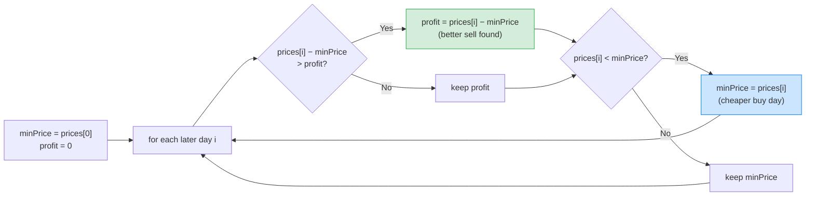

# 📈 Best Time to Buy and Sell Stock (LeetCode #121) — Complete Study Notes

> Notes for becoming a strong software engineer. Easy language, the problem explained simply, brute force → optimal, and an interview *script*.
> Your solution is clean and optimal. ✅

---

## 🤔 1. What Is This Question Actually Asking? (read this first)

You're given an array `prices`, where `prices[i]` is the price of **one stock on day `i`**. You want to:
- **Buy** the stock on one day, and
- **Sell** it on a **later** day,
- to make the **most profit** (sell price − buy price).

**The catch:** you must **buy before you sell** (you can't sell on day 2 and buy on day 4 — time only moves forward). You do exactly **one** buy and **one** sell. If prices only go down so no profit is possible, the answer is **0** (you just don't trade).

> 🛒 Plain words: *"Here are the daily prices of a stock. Pick the best day to buy and a later day to sell. What's the maximum money I can make?"* You want to **buy low, sell high** — but the low day must come **before** the high day.

**Concrete example:** `prices = [7, 1, 5, 3, 6, 4]`
```
price
 7  ●
 6  │              ●
 5  │       ●
 4  │              │   ●
 3  │       │  ●   │
 2  │       │      │
 1  │  ●────────── │          ← buy here (day 1, price 1)
    └──────────────────── day
    0   1   2   3   4   5
        ▲          ▲
       BUY        SELL
   max profit = 6 − 1 = 5   (buy at 1 on day 1, sell at 6 on day 4)
```
> The answer is **5**: buy at price 1 (day 1), sell at price 6 (day 4). You can't sell at 6 and buy at the 4 on day 5, because the buy must come first.

> ⚠️ **Common confusion:** it is **NOT** just "biggest price − smallest price." If the smallest price comes **after** the biggest, you can't use them — because you'd be selling before buying. The buy must always be on an **earlier** day than the sell. That time-order rule is the whole challenge.

---

## 🐢 2. Brute Force First (what interviewers want to hear first)

The naive idea: try **every possible (buy day, sell day) pair** where the sell day is later, compute the profit, and keep the biggest.
```javascript
var maxProfit = function(prices) {
    let maxProfit = 0;
    for (let i = 0; i < prices.length; i++) {        // buy day
        for (let j = i + 1; j < prices.length; j++) { // sell day (later)
            const profit = prices[j] - prices[i];
            if (profit > maxProfit) maxProfit = profit;
        }
    }
    return maxProfit;
};
```
> ⚠️ Two nested loops checking all pairs → **O(n²) time**, O(1) space. Correct, but slow for big inputs. That's the thing you improve on.

> 🎯 Say out loud: *"The brute force is to check every buy/sell pair — O(n²). But I can do it in one pass, O(n)."*

---

## ✅ 3. Your Optimal Solution (one pass, O(n))

```javascript
var maxProfit = function(prices) {
    let minPrice = prices[0]; // cheapest price seen SO FAR (best day to have bought)
    let profit = 0;           // best profit found so far

    for (let i = 1; i < prices.length; i++) {
        // If I SELL today, profit = today's price − cheapest earlier price.
        if (prices[i] - minPrice > profit) {
            profit = prices[i] - minPrice;
        }
        // Update the cheapest price seen so far (for future sell days).
        if (prices[i] < minPrice) {
            minPrice = prices[i];
        }
    }
    return profit;
};
```

This is the **textbook optimal** answer. The key idea:

> 💡 **For each day, if I sell today, the best I could have done is buy at the cheapest price on any earlier day.** So I just track the **minimum price so far** and, at each day, check the profit of selling today. One pass, no need to check all pairs.

> ⚡ **Complexity:** **O(n) time** (single loop), **O(1) space** (two variables). Optimal.

> 💡 Your solution correctly handles the tricky inputs: **all-decreasing prices** (e.g. `[7,6,4,3,1]`) → profit stays 0 (no profitable trade), and a **single day** → returns 0 (can't sell). Checking the profit *before* updating `minPrice` respects the buy-before-sell rule.

---

## 🔍 4. How It Works — Step by Step

Walk through, tracking the cheapest price so far and the best profit. Trace `prices = [7, 1, 5, 3, 6, 4]`:

```
start: minPrice=7, profit=0
        price   sell today? (price−minPrice)        cheaper?         state
i=1:     1      1−7=−6, not > 0 → no                1<7 → minPrice=1  profit=0, min=1
i=2:     5      5−1=4,  > 0 → profit=4              5<1? no           profit=4, min=1
i=3:     3      3−1=2,  > 4? no                     3<1? no           profit=4, min=1
i=4:     6      6−1=5,  > 4 → profit=5              6<1? no           profit=5, min=1
i=5:     4      4−1=3,  > 5? no                     4<1? no           profit=5, min=1
end: return profit = 5  ✅
```



> 💡 The magic: as I move forward, `minPrice` always holds the **lowest price before today**, so `prices[i] − minPrice` is the **best possible profit if I sell on day i**. Taking the max of that over all days gives the answer — in one sweep.

---

## 🔧 5. Built-In Function?

Unlike reversing an array (`s.reverse()`), there's **no JavaScript built-in** that solves this problem in one line — it needs the min-tracking logic. (`Math.max` / `Math.min` are only small helpers, not a full solution.) So the one-pass approach above *is* the clean answer; there's no library shortcut to mention.

---

## 🎤 6. The Interview Script — How to Talk Through It

Narrate in this order — and **restate the problem clearly first**, since it's easy to misread:

**① Restate (show you understood the buy-before-sell rule):**
> "I'm given daily stock prices. I want to buy on one day and sell on a later day for maximum profit — the buy must come before the sell. If no profit is possible, I return 0."

**② Brute force first:**
> "The naive approach is to check every buy/sell pair where the sell is later and track the max profit — that's O(n²)."

**③ The key insight → optimal:**
> "I can do better. For any day I sell, the best buy price is just the cheapest price I've seen *before* that day. So I'll track the minimum price so far and the best profit, in one pass."

**④ Complexity:**
> "That's O(n) time, one loop, and O(1) space — just two variables."

**⑤ Code it, narrating:**
> "I start minPrice at the first price and profit at 0. For each later day, I check if selling today beats my best profit, then I update minPrice if today is cheaper."

**⑥ Verify with a trace:**
> "Trace [7,1,5,3,6,4]: min becomes 1 on day 1, then day 2 gives profit 4, day 4 gives profit 5. Answer 5 — buy at 1, sell at 6. Correct."

**⑦ Mention the trap (shows depth):**
> "Note it's not simply max minus min — if the lowest price came after the highest, I couldn't use them, since the buy has to be earlier. Tracking the running minimum handles that ordering correctly."

> 🎯 **Why this flow wins:** clear restatement → brute force → key insight → complexity → code → verify → the trap. Naming the "not just max − min" trap proves you truly understand the problem, not just the code.

---

## 🟢 7. Likely Follow-up Questions (and answers)

> **Q: "Why not just return max price − min price?"**
> A: "Because the minimum might occur *after* the maximum, and I can't sell before I buy. I need the lowest price that comes *before* each sell day — which is exactly what tracking the running minimum gives me."

> **Q: "Why is your one-pass correct vs the O(n²) pairs?"**
> A: "For each sell day, the only buy price that matters is the cheapest one before it. So instead of trying all earlier buy days, I keep the minimum so far — collapsing the inner loop into O(1)."

> **Q: "What if you could buy and sell multiple times?"**
> A: "That's a different problem (#122). Then I'd sum up every upward step — add the profit whenever tomorrow's price is higher than today's. But for this one-transaction version, the running-minimum approach is right."

---

## 💎 8. Impressive Words & Phrases

| Instead of saying... | Say this 💪 |
|---|---|
| "Lowest price till now" | "The **running minimum**" |
| "Best profit till now" | "The **running maximum profit**" |
| "Go through once" | "A **single pass**, O(n)" |
| "Check all buy/sell pairs" | "The **O(n²) brute force**" |
| "Buy must be first" | "The **temporal/ordering constraint**" |
| "Two variables only" | "**O(1) auxiliary space**" |
| "Track as I go" | "**Greedy** single-pass tracking" |

**Power vocabulary:** *running minimum, running maximum, single-pass, greedy, O(1) auxiliary space, temporal ordering constraint, buy-before-sell invariant, local vs global optimum.*

> 🌶️ Bonus flex — **"it's max − min with an ordering constraint":** *"The clean way to frame this: I want the maximum of (price[i] − min of all prices before i). It's a max-minus-min, but constrained so the min must come earlier in time. That single reframing turns an O(n²) pair search into an O(n) running-minimum scan."* Stating the problem as a constrained max−min shows you understand the structure, not just the steps.

---

## ⏱️ 9. Quick Revision (read 5 min before interview)

> **Problem:** daily stock `prices`; buy one day, sell a **later** day, **maximise profit**. Buy before sell. No profit → return 0.
>
> **NOT** just max − min — the min must come **before** the max (can't sell before buying).
>
> **Brute force:** try all (buy, sell) pairs with sell later → **O(n²)**.
>
> **Optimal (one pass):** track **minPrice so far** + **best profit**. For each day: `profit = max(profit, price − minPrice)`, then `minPrice = min(minPrice, price)`. **O(n) time, O(1) space.**
>
> **Key insight:** for each sell day, the best buy price is the **cheapest price seen before it** → just keep the running minimum.
>
> **Built-in:** none applies — needs the logic.
>
> **Follow-up (#122, multiple trades):** add every upward step (sum of `price[i+1] − price[i]` when positive).
>
> **Golden line:** *"For each day I treat it as the sell day and buy at the cheapest price seen before it, tracking the running minimum and best profit in one pass — O(n) time, O(1) space. It's a max-minus-min where the minimum must come earlier in time."*

---

### ✅ Practice checklist
- [ ] Re-read the problem until "buy before sell" is crystal clear
- [ ] Write the O(n²) brute force and explain why it's slow
- [ ] Explain why "max − min" is wrong (ordering)
- [ ] Trace [7,1,5,3,6,4] on paper, tracking minPrice + profit
- [ ] Re-solve your one-pass version from scratch
- [ ] Practise the interview script **out loud** (restate → brute → optimal → trap)
- [ ] Try the follow-up #122 (Buy and Sell Stock II, multiple transactions)

Your solution is already optimal — now nail the clear problem restatement and the "not just max − min" insight, and this becomes an easy interview win. 🚀
