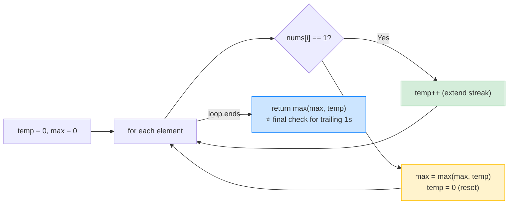

# 1️⃣ Max Consecutive Ones (LeetCode #485) — Complete Study Notes

> Notes for becoming a strong software engineer. Easy language, the problem explained simply, brute force → optimal, and an interview *script*.
> Your solution is **correct and optimal** — and you nailed the tricky "ends with 1s" case. ✅

---

## 🤔 1. What Is This Question Asking? (quick)

You're given a **binary array** `nums` (only `0`s and `1`s). Find the **longest run of consecutive `1`s** — the biggest unbroken streak of 1s in a row.

**Example:**
```
Input:  nums = [1, 1, 0, 1, 1, 1]
Output: 3
        (runs of 1s are [1,1] (length 2) and [1,1,1] (length 3) → longest is 3)
```

> 🔢 Plain words: *"Walk along the array. Count how many 1s appear back-to-back. Return the length of the longest such streak."* A `0` breaks the streak.

---

## 🐢 2. Brute Force First (count from each position)

The naive idea: from **every** index, count how many consecutive 1s start there, and track the biggest.
```javascript
var findMaxConsecutiveOnes = function(nums) {
    let max = 0;
    for (let i = 0; i < nums.length; i++) {
        let count = 0;
        for (let j = i; j < nums.length && nums[j] === 1; j++) {
            count++;        // count the run starting at i
        }
        max = Math.max(max, count);
    }
    return max;
};
```
> ⚠️ Two nested loops → **O(n²)** worst case (an all-1s array re-counts the run from every position). Correct, but wasteful. That's what you improve on.

> 🎯 Say out loud: *"Naively I'd count the run starting at each index — O(n²). But I can track the running streak in a single pass — O(n)."*

---

## ✅ 3. Your Optimal Solution (one pass, running count)

```javascript
var findMaxConsecutiveOnes = function(nums) {
    let maxConsecutive = 0;   // longest streak found so far
    let tempConsecutive = 0;  // current streak of 1s

    for (let i = 0; i < nums.length; i++) {
        if (nums[i] === 1) {
            tempConsecutive++;          // extend the current streak
        } else {
            if (tempConsecutive > maxConsecutive) { // a 0 breaks the streak →
                maxConsecutive = tempConsecutive;    // save it if it's the best
            }
            tempConsecutive = 0;        // reset the streak
        }
    }

    // FINAL CHECK: if the array ends with 1s, that last streak was never compared.
    return tempConsecutive > maxConsecutive ? tempConsecutive : maxConsecutive;
};
```

**This is the textbook optimal answer** — a **single-pass running count** (the same "track a running value + a max" idea as the stock problem #121). You keep a current streak `tempConsecutive`, and whenever a `0` breaks it, you compare it to the best so far and reset.

> ⚡ **Complexity:** **O(n) time** (one pass), **O(1) space** (two variables). Optimal.

> ⭐ **The detail you got right (and most people miss):** the **final check** after the loop. If the array ends with 1s (like `[1,1,1]`), the streak never hits a `0`, so it's never compared inside the loop. Your final `return` handles exactly that. ✅

> 💡 Tiny equivalent: you could instead update `maxConsecutive = Math.max(maxConsecutive, tempConsecutive)` **on every 1** — then you wouldn't need the final check. Both are correct; yours is just as valid and slightly fewer comparisons.

---

## 🔍 4. How It Works — Step by Step

Trace `nums = [1, 1, 0, 1, 1, 1]`:

```
start: temp=0, max=0
        nums[i]   action                              temp   max
i=0:      1       extend streak                         1      0
i=1:      1       extend streak                         2      0
i=2:      0       0 breaks → 2>0 so max=2, reset        0      2
i=3:      1       extend streak                         1      2
i=4:      1       extend streak                         2      2
i=5:      1       extend streak                         3      2
end of loop → FINAL CHECK: temp(3) > max(2) → return 3  ✅
```



> 💡 Notice the `[1,1,1]` streak at the end reaches length 3 but **never meets a `0`** — so it's *only* captured by the final check after the loop. That's why the final check is essential.

---

## 🔧 5. Built-In One-Liner (fun, but use the loop in interviews)

JavaScript built-ins can do this in one line: turn the array into a string, **split on every `0`** (so each piece is a run of 1s), and take the longest piece's length.
```javascript
var findMaxConsecutiveOnes = function(nums) {
    return Math.max(...nums.join('').split('0').map(s => s.length));
};
// [1,1,0,1,1,1] → "110111" → split('0') → ["11","111"] → lengths [2,3] → 3
```
> ⚠️ Clever and short, but it builds strings and arrays → **O(n) extra space**, and interviewers usually want the **loop logic** to see your thinking. Mention this exists, but write the single-pass version. *"There's a one-liner with join/split, but I'll show the O(1)-space loop since that's what's really being tested."*

---

## 🎤 6. The Interview Script — How to Talk Through It

Narrate in this order — brute force first, then the running-count optimal:

**① Restate:**
> "I'm given a binary array and need the length of the longest run of consecutive 1s."

**② Brute force first:**
> "The naive way is to count the run of 1s starting at each index and track the max — O(n²)."

**③ Propose the optimal:**
> "I can do it in one pass. I keep a running count of the current streak of 1s, and the best streak so far. Each 1 extends the current streak; each 0 ends it, so I compare to the best and reset."

**④ Complexity:**
> "One pass — O(n) time, O(1) space, just two counters."

**⑤ Mention the key detail (shows care):**
> "One important detail: if the array ends with 1s, that final streak never hits a 0, so I do a final comparison after the loop to make sure it's counted."

**⑥ Code it, narrating; then verify:**
> "Trace [1,1,0,1,1,1]: streak goes 1,2, then the 0 sets max to 2 and resets, then 1,2,3 — and the final check returns 3 since the array ends in 1s. Correct."

> 🎯 **Why this flow wins:** brute force → complexity → the trailing-1s edge case → code → verify. Proactively calling out the "array ends with 1s" case shows you think about edge cases without being prompted — a strong senior signal.

---

## 🟢 7. Likely Follow-up Questions (and answers)

> **Q: "What if the array ends with a 1 — does your code still work?"**
> A: "Yes — that's the trickiest case. The trailing streak never meets a 0, so I compare it once more after the loop. Without that final check, I'd miss a run that ends the array."

> **Q: "Can you avoid the final check?"**
> A: "Yes — if I update the max on every 1 instead of only when a 0 breaks the streak, the running max is always current, so no final check is needed. Same O(n) time."

> **Q: "What if I'm allowed to flip up to `k` zeros to 1s?"** (the famous escalation, #1004)
> A: "That becomes a **sliding window** problem — I grow a window and shrink it whenever it contains more than `k` zeros, tracking the largest valid window. Different technique, but a natural next step from this one."

> **Q: "Why is the single pass better than counting from each index?"**
> A: "Counting from every index re-counts overlapping runs — O(n²). A running count visits each element once and never re-counts — O(n)."

---

## 💎 8. Impressive Words & Phrases

| Instead of saying... | Say this 💪 |
|---|---|
| "Count in a row" | "A **running count** of the current **streak / run**" |
| "Biggest so far" | "The **running maximum**" |
| "Go through once" | "A **single pass**, O(n)" |
| "Start over at a 0" | "**Reset** the run on a break" |
| "Two variables only" | "**O(1) auxiliary space**" |
| "Last bit after the loop" | "A **final check** for the trailing run" |
| "Flip some zeros version" | "A **sliding-window** generalisation (#1004)" |

**Power vocabulary:** *running count, streak/run, running maximum, single-pass, O(1) auxiliary space, reset on break, trailing-run edge case, sliding window (generalisation), greedy linear scan.*

> 🌶️ Bonus flex — **"track-and-reset is a reusable pattern":** *"This 'running count, reset on a breaker, track the max' shape applies to lots of streak problems — longest run, current vs best. The one subtlety is the final comparison after the loop, because the last run isn't followed by a breaker. Recognising that single edge case is what makes the difference between a correct and a buggy solution."* Naming the reusable pattern *and* its one gotcha shows real understanding.

---

## ⏱️ 9. Quick Revision (read 5 min before interview)

> **Problem:** binary array → length of the **longest run of consecutive 1s.**
>
> **Brute force:** count the run from each index → **O(n²)**.
>
> **Optimal (running count):** keep `temp` (current streak) + `max` (best). `1` → `temp++`; `0` → `max = max(max, temp)`, `temp = 0`. **O(n) time, O(1) space.**
>
> **⭐ Final check:** after the loop, `return max(max, temp)` — because a streak that **ends the array** never meets a `0`.
>
> **Avoid the final check:** update `max` on every `1` instead.
>
> **Built-in:** `Math.max(...nums.join('').split('0').map(s=>s.length))` — works but O(n) space; use the loop in interviews.
>
> **Follow-up (#1004):** "flip up to k zeros" → **sliding window**.
>
> **Golden line:** *"I keep a running count of the current streak of 1s and the best streak so far — extend on a 1, reset on a 0 — plus a final comparison after the loop for a run that ends the array. One pass, O(n) time, O(1) space."*

---

### ✅ Practice checklist
- [ ] Re-solve your single-pass version from scratch
- [ ] Write the O(n²) brute force and explain why it's slower
- [ ] Trace [1,1,0,1,1,1] AND [1,1,1] (test the trailing-1s case)
- [ ] Explain why the final check matters (run that ends the array)
- [ ] (Stretch) try #1004 "Max Consecutive Ones III" with sliding window
- [ ] Practise the interview script **out loud** (brute → running count → edge case)

Your solution is already optimal and you handled the key edge case — now nail the brute-force-first narration and mention the sliding-window follow-up to show range. 🚀
